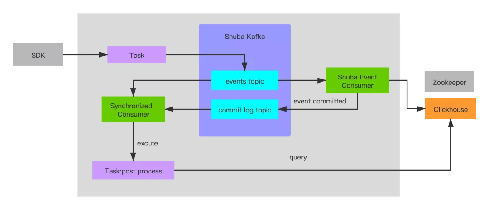
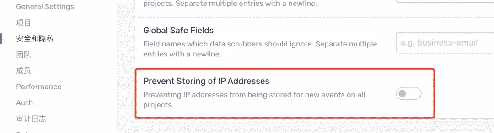

Sentry为一套开源的应用监控和错误追踪的解决方案。这套解决方案由对应各种语言的SDK和一套庞大的数据后台服务组成。应用需要通过与之绑定的token接入Sentry SDK完成数据上报配置。通过Sentry SDK的配置，还可以上报错误关联的版本信息、发布环境、同时Sentry SDK会自动捕获异常发生前的相关操作，便于后续异常追踪。异常数据上报到数据服务后，会通过过滤、关键信息提取、归纳展示在数据后台的Web界面中

转转使用Sentry监控前端错误已经有好几年了。我们在SDK端封装的统一的@zz-common/sentry库。从而实现了vue、react、小程序、node、ssr的同意接入和错误分级管理。可以参考文章：[转转商业前端错误监控系统(sentry)策略升级](https://mp.weixin.qq.com/s?__biz=MzU0OTExNzYwNg==&mid=2247484793&idx=1&sn=a8949c19eaa1d42e155b3c318f95b23d&chksm=fbb58eb0ccc207a6249404465ebdb6bd7e5ca127098f057eea543bdc7cf87b0a8121954884b4&mpshare=1&scene=21&srcid=&sharer_sharetime=1577419408674&sharer_shareid=2ffb899af29757cd77958f17431b5436#wechat_redirect).之前我们使用的Sentry是源码安装的老版本。后来客户端需要接入Sentry并上传mapping文件。但是老版本的Sentry总是上传失败。所以我们就准备升级一下Sentry。本文就是用来记录Sentry升级部署和遇到的问题

## 部署Sentry服务
快速的部署Sentry服务，官方提供了基于Docker的Compose。Docker用来构建和容器化应用的开源容器化技术。Compose是用于配置和运行多docker应用的工具，可以通过一个配置文件配置应用的所有服务，并一键创建和运行这些服务。

部署配置要求：
- Docker 19.03.6+
- Compose 1.24.1+
- 4 CPU Cores
- 8 GB RAM
- 20 GB Free Disk Space

### 安装docker
```
yum install docker -y

# 查看版本信息
docker info 
或者
docker -v
```

### docker镜像加速
```
vim /etc/docker/daemon.json

{
  "registry-mirrors": [
    "https://registry.docker-cn.com",    //国内官方镜像
 "https://mirrors.tuna.tsinghua.edu.cn",   //清华镜像
 "http://hub-mirror.c.163.com",    //网易163镜像
 "https://docker.mirrors.ustc.edu.cn",   //中科大镜像
  ]
}

# 重启docker
sudo systemctl daemon-reload
sudo systemctl restart docker
```

## 安装docker-compose
```
wget -O /usr/local/bin/docker-compose https://github.com/docker/compose/releases/download/1.27.3/docker-compose-Linux-x86_64

chmod 777 /usr/local/bin/docker-compose

# 查看docker-compose 版本

docker-compose version

```

### 克隆源代码到安装目录
```
git clone https://github.com/getsentry/onpremise.git

# 切换需要安装的分支

git checkout 21.4.1

```
### 运行部署脚本
```
cd onpremise

./install.sh
```

### 启动服务
```
docker-compose up -d
```
### Sentry服务作用
通过docker ps 命令，我们可以看到Sentry启动的很多服务
- redis
- kafka
- clickhouse
- zookeeper
- postgres
- memcached
- stmp
- sentry-cron
- sentry-worker
- sentry-web
- nginx
Sentry的整体运行流程如下图


### 配置文件
onpremise部署之后的主要配置文件
- config.yml配置文件
- sentry.conf.py：为python代码，覆盖或合并至sentry服务中，从而影响sentry运行
- .env：镜像版本、数据保留天数、端口等配置

## 升级Sentry服务
新的服务已经安装完成，现在需要把旧的数据迁移到新的服务上面来。之前的服务是使用的单独的postgres集群

### 修改数据库配置
通过修改sentry.conf.py文件，把数据库配置到独立的集群
```
DATABASES = {
    'default': {
        'ENGINE': 'sentry.db.postgres',
        'NAME': 'sentry',
        'USER': 'postgres',
        'PASSWORD': 'postgres',
        'HOST': 'HOST',
        'PORT': '7001',
        'AUTOCOMMIT': True,
        'ATOMIC_REQUESTS': False,
    }
}
```
### 运行升级命令
sentry提供了升级命令，一键升级数据库到对应的新版本，但是需要注意之前的版本需要是9.1.2之上。如果小于9.1.2是不兼容的。只能通过命令把用户和项目数据导出。放弃之前的错误信息
```
docker-compose run -rm web upgrade
```

## 升级遇到的问题
### 磁盘占用过大的问题
随着数据上报，服务器本地的磁盘占用会越来越大，Sentry默认的配置保留90天来说，全量接入磁盘会占用维持在一个比较大的值，同时这么大的数据量的查询也是一个负担。为了减轻负担，需要从服务端和业务应用端同时入手。总和考虑我将数据保留时常改为7天。修改.env文件即可。
```
SENTRY_EVENT_RETENTION_DAYS=7
```
同时需要修改docker数据存储位置。docker volume默认挂在在/var目录下，我们的/var目录容量只有100G，随着服务的运行会很快占满，需要对docker volume挂在目录进行修改

```
# 在容量最大的目录下创建文件夹
mkdir -p /opt/var/lib

# 停止docker 服务
systemctl stop docker

# 迁移数据
/bin/cp -a /var/lib/docker /opt/var/lib/docker && rm -rf /var/lib/docker &&  ln -s /opt/var/lib/docker /var/lib/docker

# 重启 docker 服务

systemctl start docker
```
### 用户数量丢失
升级之后用户数量获取失败，也就是Sentry服务获取不到真实的IP。

在Sentry的管理后台中默认会关闭获取IP，需要手动的打开。




## 资料
[前端异常监控 Sentry 的部署和升级](https://mp.weixin.qq.com/s/iQEShvNqY_aSw2gX5Cu6hA)

[sentry使用实践](https://blog.csdn.net/marco__/article/details/103056805)

[前端工程接入sentry](https://juejin.cn/post/7009565622883319844)

[Sentry原理--收集错误、上报](https://juejin.cn/post/6957475955858210823#heading-15)

[搭建私有的前端监控服务](https://juejin.cn/post/6844903620958224398)

[一定要看...](https://juejin.cn/post/6974424800563298341)

[sentry和vue结合](https://juejin.cn/post/6844903831256432648)

[Sentry的应用接入与部署运维](http://events.jianshu.io/p/64a3b3283f0a)

[Sentry实时应用错误跟踪系统在Kubernetes中私有化部署](https://blog.csdn.net/hack1015/article/details/105624707)
