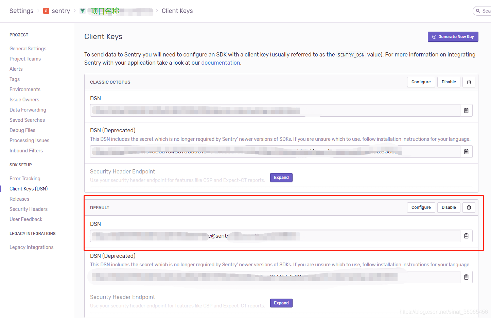
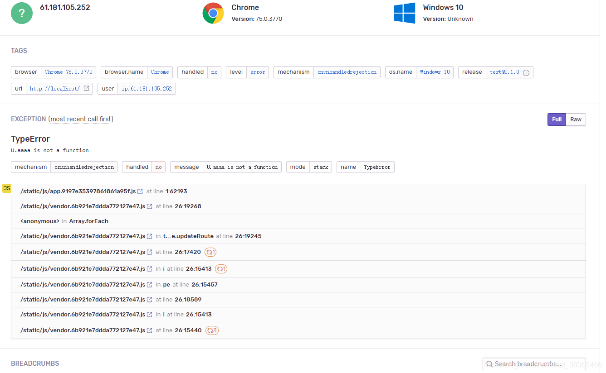
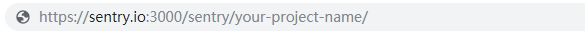
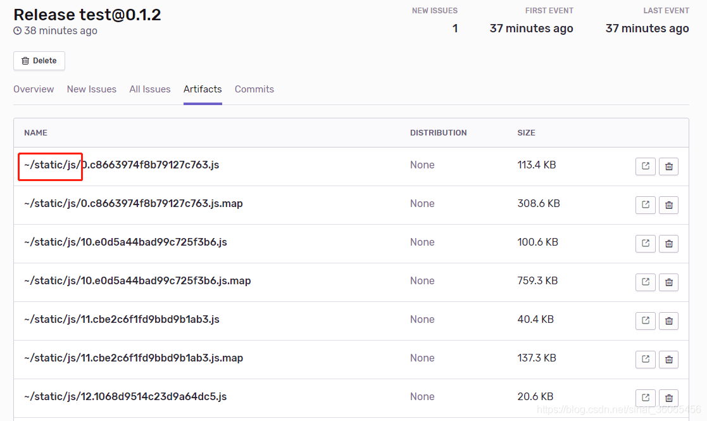
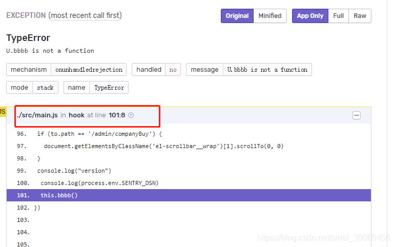

## 起因
项目采用vue全家桶开发，现在打算嵌入sentry，实现对于线上网站进行错误日志记录。其实上传日志很简单，基本配置就可以了，但是上传配套的sourcemap则颇为费劲，这里记录一下使用心得

## 使用步骤
### 上传日志
sentry使用文档，官方介绍很简单

在main.js中引入如下代码
```
npm install @sentry/integrations
# or
yarn add @sentry/integrations
import Vue from 'vue'
import * as Sentry from '@sentry/browser';
import * as Integrations from '@sentry/integrations';

Sentry.init({
  dsn: 'your dsn',
  integrations: [
    new Integrations.Vue({
      Vue,
      attachProps: true,
    }),
  ],
});
```
其中DSN在项目的下图位置找到

这样之后我们重新打包项目，错误就可以自动上传到sentry的项目issues里面了


如果我们想要看到具体的报错信息，那我们就需要上传sourcemap文件了
### 上传sourcemap文件
sourcemap文件的上传方式有两种
1. sentry-cli手动上传
2. 第三方包自动上传，这里采用官方推荐的@sentry/webpack-plugin

#### 采用sentry-cli的方式尝试步骤如下
1. 全局安装@sentry/cli
  ```
  npm i -g @sentry/cli
  ```
2. 登录
  ```
  sentry-cli --url 域名地址 login
  ```
  这里的域名地址，是你的host地址，包括域名+端口。因为这一步采用网页形式登录，所以需要你提前申请auto Token，申请方式如下

  点击 账号 -> API keys， 点击 Create New Token

  记得 project:releases 和 project:write 要勾选上

3. 设置版本号
  ```
  sentry-cli releases -o 组织名 -p 项目名 new 版本号
  ```
  其中，进入你的项目下，查看浏览器地址，组织名【sentry】和项目名【your-project-name】。
  
4. 打包你的项目，生成sroucemap
5. 上传roucemap文件到sentry
  ```
  sentry-cli releases -o 组织名 -p 项目名 files 版本号 upload-sourcemaps 打包后的js目录 --url-prefix 线上js访问地址
  ```
  其中最需要注意的是线上js访问地址，多半上传sourcemap成功，但是不能解析的都源于此。成功后的sourcemap文件可以在你的项目下的release下对应版本查看，正确的应该如下
  
  正常解析后的结果是可以定位代码行的错误提示的如下
  

  其他：删除sourcemap命令
  ```
  sentry-cli releases files 发布版本号 delete --all
  ```
#### 利用@sentry/webpack-plugin自动上传sourcemap
惯例，还是先介绍官网资料
```
const SentryCliPlugin = require('@sentry/webpack-plugin');
 
const config = {
  plugins: [
    new SentryCliPlugin({
      include: '.',
      ignoreFile: '.sentrycliignore',
      ignore: ['node_modules', 'webpack.config.js'],
      configFile: 'sentry.properties',
    }),
  ],
};
```
这里我们还依赖一个配置文件，根目录下的sentry配置文件.sentryclirc,文件内容如下
```
[defaults]
url=your url
org=your organization
project=your project

[auth]
token=your auth
```
通常情况下，我们在plugun的配置中，还需要额外配置两个参数： release 和 urlPrefix, release同前面一样，urlPrefix也一样（很重要）。

其实两种方式都掌握最好，因为我们通常会趋向于利用第三方工具自动上传，但是遇到问题的时候，我们可以选择手动上传的方式进行调试。

## 结果
完成上述步骤，我们就可以对于线上遇到的问题进行监控了

由于我们项目需要同事监控**线上版**和**预发布**版本，所以project name和release 以及dsn都需要根据环境变量做适配

## 资料
[sentry + vue实现错误日志监控](https://blog.csdn.net/sinat_36065456/article/details/93045793)

[sentry 前端 使用](https://zhuanlan.zhihu.com/p/352681247)