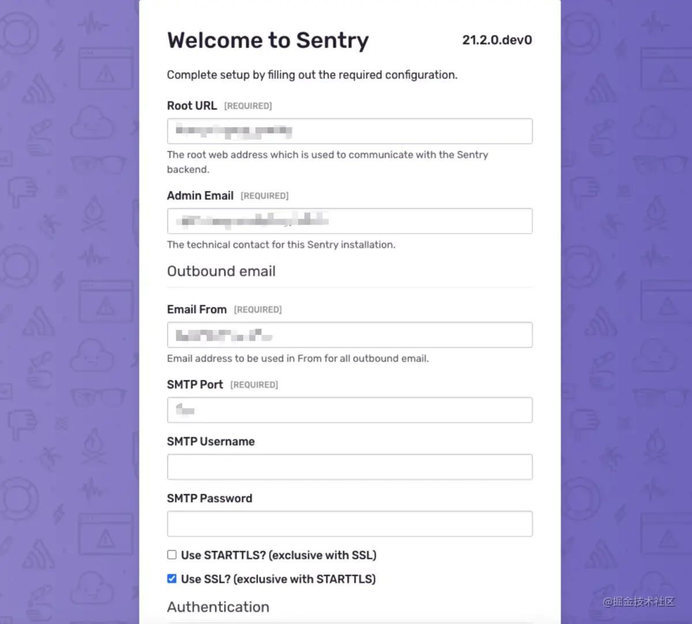

## 介绍
Sentry 为一套开源的应用监控和错误追踪的解决方案。这套解决方案由对应的各种语言的SDK和一套庞大的数据后台服务组成。应用需要通过与之绑定的token接入Sentry SDK完成数据上报配置。通过Sentry SDK的配置，还可以上报错误关联的版本信息、发布环境、同时Sentry SDK会自动捕获异常发生前的相关操作，便于后续异常追踪。异常数据上报到数据服务后，会通过过滤、关键信息提取、归纳展示在数据后台的Web页面中

官方地址：https://github.com/getsentry/onpremise

## 部署
部署配置参考官网
- Docker 19.03.6+
- Compose 1.28.0+
- 4 CPU Cores
- 8 GB RAM
- 20 GB Free Disk Space

### 步骤
1. git clone https://github.com/getsentry/onpremise.git
2. cd onpremise
3. 执行./install.sh
4. docker-compose up -d

> 提示: 目前sentry已经是docker容器化部署;如果我们想要整体走一下容器化部署的话，需要上面的步骤在一个linux的容器中操作，然后把linux的容器打包成一个新的镜像;然后在sre中新建一个应用，然后推送过去。之前和鸿钧、王博沟通，1.linux容器打包成镜像比较大，2。新建应用相对复杂一些；目前部署在线上10.102.119.42机器中，二级域名https://sentry-zl.***.cn/指向

### 部署中的问题
1. docker-compose版本过低

    ```
    curl -L https://github.com/docker/compose/releases/download/1.28.3/docker-compose-`uname -s`-`uname -m` -o /usr/local/bin/docker-compose

    chmod +x /usr/local/bin/docker-compose

    docker-compose --version
    ```

2. docker下载太慢

    ```
    vim /etc/docker/daemon.json

    {
        "registry-mirrors": [
            "https://registry.docker-cn.com",    //国内官方镜像
            "https://mirrors.tuna.tsinghua.edu.cn",   //清华镜像
            "http://hub-mirror.c.163.com",    //网易163镜像
            "https://docker.mirrors.ustc.edu.cn",   //中科大镜像
        ]
    }
    // 新增文件 cron/sources.list
    deb http://mirror.bjtu.edu.cn/debian bullseye main
    deb http://mirror.bjtu.edu.cn/debian bullseye-updates main

    // cron/Dockerfile 
    ARG BASE_IMAGE
    FROM ${BASE_IMAGE}
    COPY sources.list /etc/apt/sources.list
    RUN apt-get update && apt-get install -y --no-install-recommends cron && \
        rm -r /var/lib/apt/lists/*
    COPY entrypoint.sh /entrypoint.sh
    ENTRYPOINT ["/entrypoint.sh"]

    // .env


    // 重启docker

    sudo systemctl daemon-reload

    sudo systemctl restart docker
    ```

3. docker端口修改

    ```
    // 原来默认是9000端口指向容器内的80端口，现在10.102.119.42的80端口直接指向容器内80端口
    // .env
    OMPOSE_PROJECT_NAME=sentry_onpremise
    SENTRY_EVENT_RETENTION_DAYS=90
    # You can either use a port number or an IP:PORT combo for SENTRY_BIND
    # See https://docs.docker.com/compose/compose-file/#ports for more
    SENTRY_BIND=80
    # Set SENTRY_MAIL_HOST to a valid FQDN (host/domain name) to be able to send emails!
    # SENTRY_MAIL_HOST=example.com
    SENTRY_IMAGE=getsentry/sentry:nightly
    SNUBA_IMAGE=getsentry/snuba:nightly
    RELAY_IMAGE=getsentry/relay:nightly
    SYMBOLICATOR_IMAGE=getsentry/symbolicator:nightly
    WAL2JSON_VERSION=latest
    SENTRY_EVENT_RETENTION_DAYS=30
    ```

## 使用
### 接入邮箱📮报警
1. 配置完成后，即可进入页面[https://sentry-zl.***.cn/](https://sentry-zl.***.cn/) 打开页面填入信息后即可进入sentry系统
    
2. config.yml配置
    ```
    mail.backend: 'smtp'
    mail.host: 'smtp.***.cn'
    mail.port: 25
    mail.username: 'xuzhe1@***.cn'
    mail.password: '*********'
    mail.use-tls: false
    # mail.use-ssl: true
    # The email address to send on behalf of
    mail.from: 'xuzhe1@***.cn'
    ```

- mail.backend：邮件发送方式；
- mail.host: 邮件发送域名 ，使用的哪个邮箱可以去该邮箱文档中找到 smtp 发送域名；
- mail.port: 邮件发送的端口号；
- mail.username：用于 smtp 邮箱的账号；
- mail.password：用于 smtp 邮箱的密码；
- mail.use-tls：是否使用 tls 安全协议，这里填写 true 或 false，和 use-ssl 配置互斥；
- mail.use-ssl：是否使用 ssl 安全协议，这里填写 true 或 false，和 use-tls 配置互斥；
- mail.from：收到邮件时的发送人名称；

之后可以进入页面测试邮件发送[https://sentry-zl.***.cn/manage/status/mail/](https://sentry-zl.***.cn/manage/status/mail/)

### sentry通过https访问
首先要修改 onpremise/sentry/config.yml system.url-prefix 配置，将其设置为我们访问的 Sentry 域名。 url-prefix 组成了项目的 DSN 地址，一定要保证格式正确。
```
system.internal-url-prefix: 'https://sentry-zl.***.cn'
```
然后是 /sentry/sentry.conf.py 文件下的 SSL/TLS 配置，将原来注释的部分全部打开。
```
###########
# SSL/TLS #
###########

# If you're using a reverse SSL proxy, you should enable the X-Forwarded-Proto
# header and enable the settings below

SECURE_PROXY_SSL_HEADER = ('HTTP_X_FORWARDED_PROTO', 'https')
SESSION_COOKIE_SECURE = True
CSRF_COOKIE_SECURE = True
SOCIAL_AUTH_REDIRECT_IS_HTTPS = True

# End of SSL/TLS settings
```

### 项目接入
Sentry 配置应在应用程序的生命周期中尽早进行。完成此操作后，Sentry 的 JavaScript SDK 会捕获所有未处理的异常和事务

[关闭浏览器捕获的控制台调用--地址](https://www.51cto.com/article/680787.html)

[https://www.cnblogs.com/hacker-linner/p/14265447.html](https://www.cnblogs.com/hacker-linner/p/14265447.html)

https://www.cnblogs.com/hacker-linner/p/14307722.html

```shell
npm install --save @sentry/vue @sentry/tracing

Sentry.init({
  // Sentry 项目的 dsn，可从项目设置中获取
  dsn: 'https://23d1e539ef6c4cb6b14937fead1bf2ff@sentry-zl.***.cn/2',
  // 初始参数配置内容
  integrations: [
    new Integrations.BrowserTracing(
      routingInstrumentation: Sentry.vueRouterInstrumentation(router),
      tracingOrigins: ["localhost", "my-site-url.com", /^\//],
    ),
    new Sentry.Integrations.Breadcrumbs({ console: false }) // 关闭浏览器捕获的控制台调用：
  ],
  // 触发异常后发送给 Sentry 的概率
  tracesSampleRate: 1.0,
  // 控制应捕获的面包屑(行为栈)的总量
  maxBreadcrumbs: 20,
  // 规定上下文数据结构的深度，默认为 3
  normalizeDepth: 100,
  // 版本信息
  release: "common@1.0.0",
  // 环境信息
  environment: process.env.NODE_ENV,
  // 钩子函数，在每次发送 event 前触发
  beforeSend(event) {
    // 网页应用刷新后设置的变量会消失，所以我选择在 beforeSend 触发时插入用户信息
    event.user = {
      userNick: "xz",
    };
    return event;
  },
});
```
### sentry-srouce map
```
//.npmrc
sentrycli_cdnurl=https://npm.taobao.org/mirrors/sentry-cli

// vue.config.js
const SentryCliPlugin = require('@sentry/webpack-plugin');

new SentryCliPlugin({
    include: './dist',
    ignoreFile: '.gitignore',
    release: 'production@1.2.0',
    ignore: ['node_modules', 'webpack.config.js'],
    configFile: '.sentryclirc',
    urlPrefix: '~/'
})

// .sentryclirc
[auth]
token=c32f47d178064adeb3736742af42c34ebedf21aed43649bbb3d253a419e5c092


[defaults]
url=https://sentry-zl.***.cn
org=name
project=name-zl-pc

// package.json
"build": "vue-cli-service build && rm -fr ./dist/js/*.map",
```

### 上传日志信息--手动上报
有时我们不仅仅要收集异常信息，还需要在页面中打 log 来收集页面运行数据，这时可以用 Sentry.captureMessage(err[, obj]) api，进行传输日志。使用方法与 captureException 一致，建议将 level 设置为 Info，便于与异常区分开来，避免触发我们设置的异常警报。
```
Sentry.captureMessage("Something went fundamentally wrong", {
  contexts: {
    text: {
      hahah: 22,
    },
  },
  level: Sentry.Severity.Info,
});
```
### 设置变量
捕捉异常还需要采集用户信息，在用户登录后需要通过 setUser 设置一下用户信息全局变量，如下所示
```
Sentry.setUser({
    tenant: {
        code: 12345,
        name: '测试公司',
        _id: 12345
    },
    orgAccount: {
        _id: 54321,
        orgName: '是机构啦'
    },
    user: {
        _id: '8910JQ',
        loginName: '测试人员小Q'
    } 
})
```
**通过 beforeSnd 插入用户信息**
```
Sentry.init({
    ...,
 	  // 钩子函数，在每次发送 event 前触发
    beforeSend(event) {
        // 在这里可根据业务情况发送用户信息
        event.user = {
            userNick: 'xiaohu'
        };
        return event;
    }
});
```
**设置全局变量**
```
// 以下是 Sentry 定义的全局变量，可以直接使用 Sentry api 设置
Sentry.setUser(object);
Sentry.tags(object);
Sentry.extra(object);
Sentry.level(object);
Sentry.fingerprint(object);

// 通过 setContext，设置 key 值，可自定义随事件传递的变量名
Sentry.setContext(key, context);
```

### 创建警报规则
您可以为每个项目创建各种警报规则，并让 Sentry 知道您希望在应用程序中发生错误时通知的时间(when)、方式(how)和对象(whom)。
[https://juejin.cn/post/7007607369962094599#heading-4](https://juejin.cn/post/7007607369962094599#heading-4)

### release
其中一种方式在source map上传的时候创建, 另一种脚手架可以创建 sentry-cli？
```
new SentryCliPlugin({
    include: './dist',
    ignoreFile: '.gitignore',
    release: process.env.RELEASE_VERSION,
    ignore: ['node_modules', 'vue.config.js'],
    configFile: '.sentryclirc',
    urlPrefix: '~/'
})
```

## 原理
前端捕获异常分为全局捕获和单点捕获
- 全局捕获代码集中，易于管理
- 单点捕获作为补充，对某些特殊情况进行捕获，但分散，不利于管理

1. 全局捕获
    - 通过全局的接口，将捕获代码集中写在一个地方，可以利用的接口又
        - window.addEventListener('error')
        - window.addEventListener('unhandledrejection')
        - document.addEventListener('click')
        - 等
    - 框架级别的全局监听
        - 例如axios中使用interceptor进行拦击
        - vue、react都有自己的错误采集接口
    - 通过对全局函数进行封装包裹，实现在在调用该函数时自动捕获异常
    - 对实例方法重写(Patch), 在原有功能基础上包裹一层
        - 例如对setTimeout进行重写，在使用方法不变的情况下也可以捕获异常
2. 单点捕获
    - 在业务代码中对单个代码快进行包裹，活在逻辑流程中大点，实现有针对性的异常捕获
    - trye-catch
    - 专门写一个函数来收集异常信息，在异常发生时，调用该函数
    - 专门写一个函数来包裹其他函数，得到一个新函数，该新函数运行结果和原函数一模一样，只是在发生异常时可以捕获异常


## 资料
[Sentry Web 前端监控 - 官方最佳实践教程](https://juejin.cn/post/7007607369962094599#heading-4)

[基于Sentry搭建前端异常监控系统](https://juejin.cn/post/6974424800563298341)