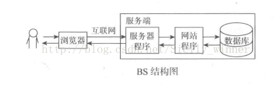

## 引言
刚开始的时候用户去取数据，直接就去主机拿，从这里就分出了客户端和服务端

- 客户端: 用户安装的软件；
- 服务端：统一管理数据库的主机中的软件就叫做服务端，在后来服务端不只是管理数据，外加处理业务逻辑

:::tip
C/S结构，即Client/Server(客户机/服务器)结构，是大家熟知的软件系统体系结构，通过将任务合理分配到Client端和Server端，降低系统的通讯开销，可以充分利用两端硬件环境的优势。早期的软件系统多一次作为首选的设计标准

B/S架构，即Browser/Server(浏览器/服务器)结构，是随着Internet技术的兴起，对C/S结构的一种变化或者改进结构。在这种结构下，用户界面完全通过www浏览器实现，一部分事务逻辑在服务器实现，形成所谓的3-tier结构

B/S结构，主要是利用了不断成熟WWW浏览器技术，结合浏览器的多种script语言（VBscript、Javascript...）和ActiveX技术，用通用浏览器就实现了原来需要复杂专用软件才能实现的强大功能，并节约了开发成本，是一种全新的软件系统架构技术。随着98/Windows 2000将浏览器技术植入内部，这种结构将更成为当今软件的首选体系结构
:::

## BS结构与CS架构的特点

- BS:(Browser/Server,浏览器/服务器模式),web应用 可以实现跨平台，客户端零维护，但是个性化能力低，响应速度较慢。
- CS:(Client/Server,客户端/服务器模式),桌面级应用 响应速度快，安全性强，个性化能力强，响应数据较快

## C/S系统结构

### 面试题目：数据放在客户端和服务端的利与弊
服务端统一处理有更好的安全性和稳定性而且升级比较容易，不过服务器负担就增加了

客户端将负担分配到每个用户，从而可以节约服务器成本，安全性和稳定可能会有一定的问题，升级也比较麻烦，每个安装的客户端程序都需要升级，另外为了节省网络资源，通过网络传输的数据应该尽量减少

## B/S系统架构

## CS和BS的比较
对象| 硬件环境|客户端要求|软件安装|升级和维护|安全性
---|---|---|---|---|---
CS | 用户固定，并且处于相同的区域，要求拥有相同的操作系统 | 客户端的计算机电脑配置要求较高 | 每个客户都必须安装和配置软件 | C/S每个客户端都要升级程序。可以采用自动升级 | 一般面向相对固定的用户群，程序更加注重流程，它可以对权限进行多层次校验，提供了更安全的存取模式，对信息安全的控制能力很强。一般高度机密的信息系统采用C/S结构适宜。
BS | 要求操作系统和浏览器，与操作系统平台无关 | 客户端的计算机电脑配置要求较低 | 可以在任何地方进行操作而不用安装专门软件 | 不必安装和维护 | ---

## CS和BS的区别
- 硬件环境不同:

  C/S 一般建立在专用的网络上, 小范围里的网络环境, 局域网之间再通过专门服务器提供连接和数据交换服务.
  B/S 建立在广域网之上的, 不必是专门的网络硬件环境，例如电话上网，租用设备， 信息管理. 有比C/S更强的适应范围，一般只要有操作系统和浏览器就行

- 对安全要求不同

  C/S 一般面向相对固定的用户群，对信息安全的控制能力很强，一般高度机密的信息系统采用C/S 结构适宜，可以通过B/S发布部分可公开信息.

  B/S 建立在广域网之上， 对安全的控制能力相对弱，面向是不可知的用户群.

- 对程序架构不同
  
  C/S 程序可以更加注重流程, 可以对权限多层次校验, 对系统运行速度可以较少考虑.

  B/S 对安全以及访问速度的多重的考虑, 建立在需要更加优化的基础之上. 比C/S有更高的要求。B/S结构的程序架构是发展的趋势，从MS的.Net系列的BizTalk 2000 Exchange 2000等，全面支持网络的构件搭建的系统. SUN 和推的JavaBean 构件技术等,使 B/S更加成熟.

- 软件重用不同

  C/S 程序可以不可避免的整体性考虑，构件的重用性不如在B/S要求下的构件的重用性好.

  B/S 对的多重结构,要求构件相对独立的功能. 能够相对较好的重用.

- 系统维护不同

  系统维护在是软件生存周期中，开销大。-------重要

  C/S 程序由于整体性, 必须整体考察, 处理出现的问题以及系统升级. 升级难. 可能是再做一个全新的系统

  B/S 构件组成,方面构件个别的更换,实现系统的无缝升级. 系统维护开销减到最小.用户从网上自己下载安装就可以实现升级.

- 处理问题不同

  C/S 程序可以处理用户面固定, 并且在相同区域, 安全要求高需求, 与操作系统相关. 应该都是相同的系统

  B/S 建立在广域网上, 面向不同的用户群, 分散地域, 这是C/S无法作到的. 与操作系统平台关系最小.

- 用户接口不同

  C/S 多是建立的Window平台上,表现方法有限,对程序员普遍要求较高

  B/S 建立在浏览器上, 有更加丰富和生动的表现方式与用户交流. 并且大部分难度减低,减低开发成本.

- 信息流不同

  C/S 程序一般是典型的中央集权的机械式处理, 交互性相对低

  B/S 信息流向可变化, B-B B-C B-G等信息、流向的变化, 更象交易中心

## 现状与趋势
1. 用来编制CS管理软件的编程语言，早已江河日下首先我们来了解一下各种语言的发展趋势和排行榜，可以看到排行名前十的语言中，没有一种是用来开发CS管理软件的，其中8种语言(Java,C#,Python,PHP,Visual Basic .NET,Javascript， Perl,Ruby)主要就是面向BS架构软件的语言，剩下的两种语言(C, C++)也不是应用于CS管理软件，而主要面向游戏，计算机计算，网络通信软件、操作系统、设备驱动、嵌入式系统等。

2. 市面上CS的管理软件正越来越少
3. CS管理软件应用不如BS方便
4. CS管理软件不如BS更能应对未来挑战

## 原文
[BS架构与CS架构的区别](https://blog.csdn.net/qq_34462436/article/details/102155492)
