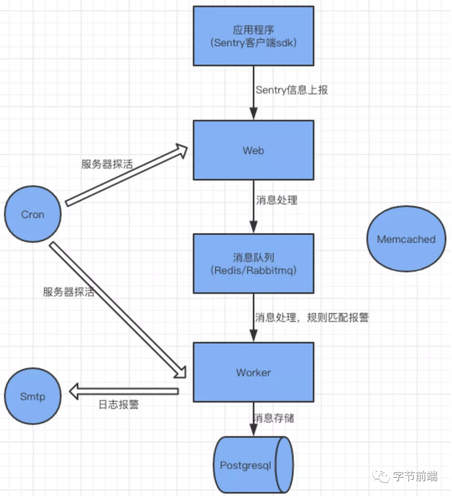
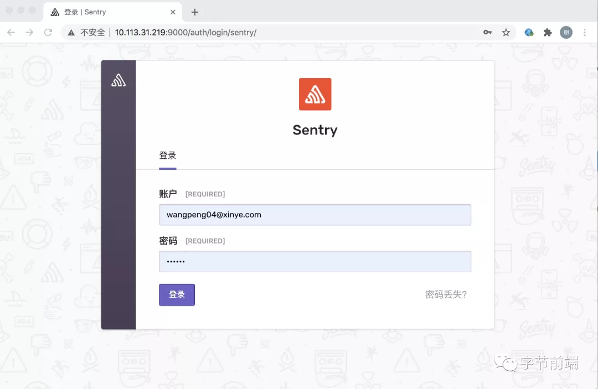
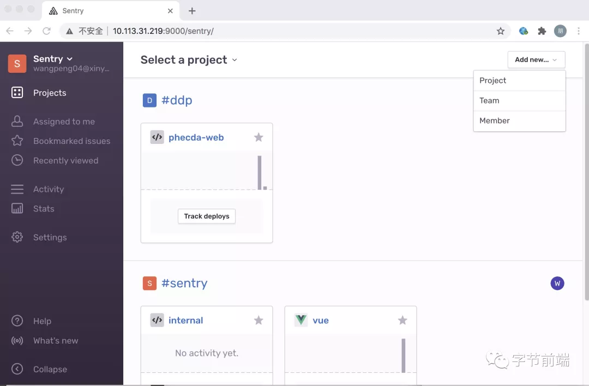
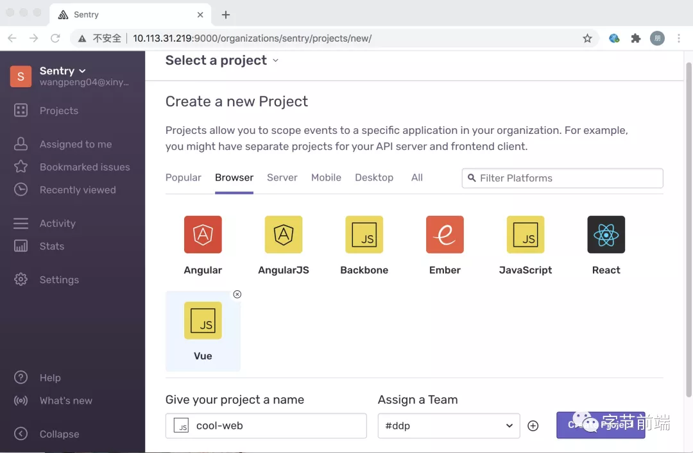
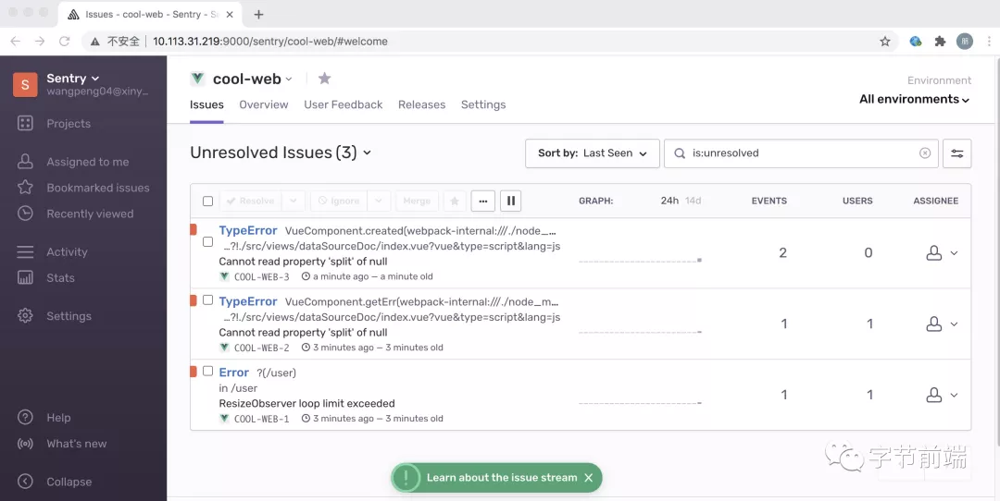
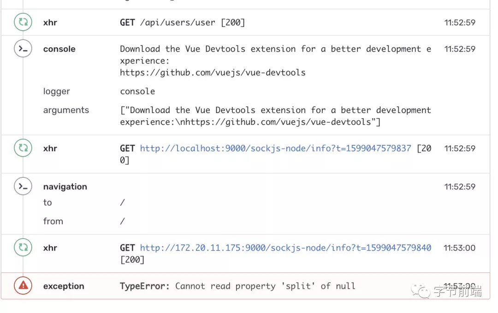
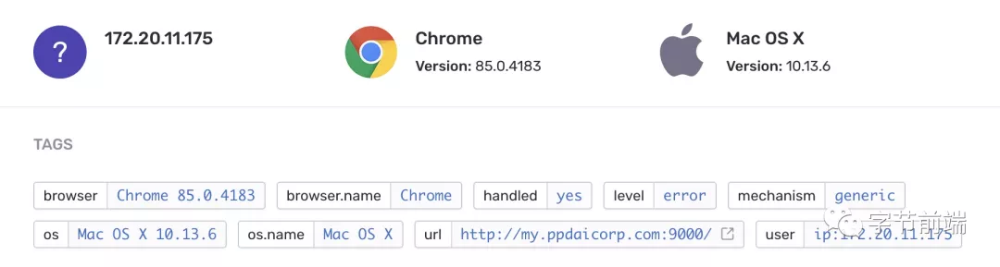

## 为什么要做前端监控
相信每个前端开发人员都会遇见下面这种情况!
:::danger
客户: 为什么我这个页面看不到数据？
我：(急忙打开网站)，我这边数据显示正常！
客户：没有啊，我这边看不到
我：（语无伦次），可我..这正常呀
客户:...
:::
自己开发机器明明正常，到客户那边却一大堆问题，这就导致了定位问题非常困难，总不能在用户端打开F12查看控制台有什么错误吧？

## Sentry简介
Sentry是一个开源的实时错误监控的项目,它支持很多端的配置，包括web前端、服务器端、移动端以及游戏端。支持各种语言，例如python、oc、java、node、javascript等。也可以应用到各种不同的框架上面,如前端框架中的vue、angular、react等最流行的前端框架。

Sentry可以帮助我们完成一下工作：例如线上有个bug，代码的某处逻辑的NullPointerException造成了这个问题，Sentry会立即发现错误，并通过邮件或其他基于通知规则的集成通知到相关责任人员，这个通知可以把我们引入到一个指示板，这个指示板为我们提供了快速分类问题所需要的上下文，如：频率、用户影响、代码那一部分收到影响以及那个团队肯呢过是问题的所有者

## Sentry原理
Sentry到底是如何实现实时日志监控报警的呢？首先,Sentry是一个C/S架构，我们需要在自己应用中集成Sentry的SDK才能在应用发生错误时将错误信息发送给Sentry服务端。根据语言和框架不同，我们可以选择自动或自定义设置特殊的错误类型报告给Sentry服务端



而Sentry的服务端分为web、cron、worker这几个部分，应用(客户端)发生错误后将错误信息上报给web，web处理后放入消息队列或Redis内存队列，workder从队列中消费数据进行处理。

## Sentry服务部署
官方推荐使用Docker进行部署

环境依赖
```
Docker 17.05.0+
Componse 1.23.0+
至少需要2400MB RAM
```

http://ip:9000


## 安装sdk上报数据
### 创建项目
登录后我们会进入监控项目的界面如：



点击右上角的add new project，我们可以创建一个新的项目


选择vue，在做简单的设置，project创建成功后悔跳转到SDK安装方法

### SKD引用与配置
```
npm i @sentry/browser @sentry/integrations


import Vue from 'vue'
import * as Sentry from '@sentry/browser';
import * as Integrations from '@sentry/integrations';

Sentry.init({
  dsn: 'http://4b6b35391e894eaba2cb346130810831@10.113.31.219:9000/3',
  integrations: [
    new Integrations.Vue({ 
        Vue, 
        attachProps: true 
    }
  )]
})
```

### 写段业务代码看看效果
写一段vue异常代码
```
created() {
    let a = null;
    a.split('')
}
```
我们在进入sentry看看监控效果


进去有错误明细与用户操作的时间轨迹(这一点非常方面)


客户端详细的信息



## 总结
基于Sentry的前端监控搭建部署完成后，我们就可以试试收集前端JS运行中的错误以及具体详情，分析后排查结果，对于生成中偶遇的bug很有用

## 资料
[sentry初探](https://zhuanlan.zhihu.com/p/210765546)

[如何搭建一套高可用的前端异常监控系统？](https://mp.weixin.qq.com/s/DMae1LKGy9TqhIDL4hziJw)
