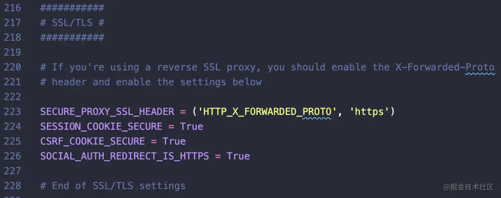

## sentry邮箱设置
```
mail.backend: 'smtp'
mail.host: 'smtp.wp.cn'
mail.port: 25
mail.username: 'xuzhe1@wp.cn'
mail.password: 'Xzxxxxxx'
mail.use-tls: false
# mail.use-ssl: true
# The email address to send on behalf of
mail.from: 'xuzhe1@wp.cn'

# If you'd like to configure email replies, enable this.
# mail.enable-replies: true

# When email-replies are enabled, this value is used in the Reply-To header
# mail.reply-hostname: ''

# If you're using mailgun for inbound mail, set your API key and configure a
# route to forward to /api/hooks/mailgun/inbound/
# Also don't forget to set `mail.enable-replies: true` above.
# mail.mailgun-api-key: ''
```

## Sentry设置通过HTTPS访问
要给sentry设置ssl让我们能通过https使用

首先要修改onpremise/sentry/config.yml里system.url-prefix配置，将其设置为我们访问的Sentry域名。url-prefix组成了项目的DSN地址，一定要保证格式正确
```
system.url-prefix: 'https://sentry.xxxx.com:60000'
```
然后是onpremise/sentry/sentry.conf.py文件下的SSL/TLS配置，将原来注释的部门全部打开


修改完后同样要将docker-compose关掉重建
```
docker-compose down
docker-compse build
docker-compse up -d
```
上面的配置只是让 Sentry 允许通过 SSL 代理，下面我们需要在服务器内搭建一个 nginx 用来转发 https 协议内容，搭建的过程不多说，百度或者请教运维大大。下面是我的 nginx 配置，配好 nginx 并重启后就算大功告成。我们的 Sentry 终于可以通过 https 访问了！
```
server {
    # 配置监听端口
    listen       60000 ssl http2 default_server;
    listen       [::]:60000 ssl http2 default_server;

    # 域名
    server_name  sentry.xxxxx.cn;

    # nginx 默认根目录
    root         /usr/share/nginx/html;

    # 加载其他配置文件，这里是 nginx 默认配置，可以不需要
    include /etc/nginx/default.d/*.conf;

    # ssl 设置
    ssl on;
    # ssl 证书地址
    ssl_certificate     /etc/nginx/sslcert/server.crt;
    # ssl 密钥地址
    ssl_certificate_key /etc/nginx/sslcert/server.key;
    ssl_session_cache shared:SSL:1m;
    ssl_session_timeout  10m;

    ssl_protocols TLSv1 TLSv1.1 TLSv1.2;
    ssl_ciphers EECDH+AES128:RSA+AES128:EECDH+AES256:RSA+AES256:EECDH+3DES:RSA+3DES:!MD5;
    ssl_prefer_server_ciphers on;


    client_max_body_size 200M;
    client_body_buffer_size 1024k;

    # 这一段是最重要的，将域名代理到本机 http://localhost:9000 服务上，对应的就是 docker 内的 sentry 服务
    location / {
        proxy_pass http://localhost:9000;
    }

    gzip  on;
    gzip_http_version 1.1;
    gzip_vary on;
    gzip_comp_level 9;
    gzip_proxied any;
    gzip_types text/plain  text/css application/json  application/x-javascript text/xml application/xml application/xml+rss text/javascript application/x-shockwave-flash image/png image/x-icon image/gif image/jpeg;
    gzip_buffers 16 8k;

    error_page 404 /404.html;
        location = /404.html {
    }

    error_page 500 502 503 504 /50x.html;
        location = /50x.html {
    }
}
```

## 设置@sentry/cli代理
@sentry/webpack-plugin会用到@sentry/cli这个库，经常会下载不下来，可以设置下淘宝代理
sentrycli_cdnurl=https://npm.taobao.org/mirror...
```
npm install @sentry/webpack-plugin --save-dev --sentrycli_cdnurl=https://npm.taobao.org/mirrors/sentry-cli
```

## Sentry 获取API Token
[Sentry 获取API Token](https://blog.csdn.net/wz_coming/article/details/116269989)

## sentry-source map
```
const SentryCliPlugin = require('@sentry/webpack-plugin');

new SentryCliPlugin({
    // include: path.join(__dirname, '../dist/static/js/'),
    include: './dist',  // 指定上传目录
    ignoreFile: '.gitignore', // 指定忽略文件配置
    release: 'production@1.2.0', // 指定发布版本
    ignore: ['node_modules', 'webpack.config.js'],
    configFile: '.sentryclirc', // 指定sentry上传配置
    urlPrefix: '~/' // 保持与publicpath相符
})

// .sentryclirc
[auth]
token=b32834d9945d4ad6b3a1b73830c5b1615beeee5f175f4e25af22244f22dccbe1


[defaults]
url=http://10.13.5.71:9000
org=sentry
project=vue-au

// package.json
"build": "vue-cli-service build && rm -fr ./dist/js/*.map",
```
[sentry sourceMap](https://blog.csdn.net/wang15180138572/article/details/120788108)

[SentryCliPlugin插件](https://github.com/getsentry/sentry-webpack-plugin#options)

[SentryCliPlugin插件相关问题](https://github.com/getsentry/sentry-webpack-plugin/issues/62)

## 超级管理员重置
[管理员创建](https://learnku.com/articles/57331?order_by=created_at&)

## release问题
需要保证 plugins 和 Sentry.init 两个配置中的 release 版本号相同，这样的话 sentry 才能将 source-map 文件一一对应上。 修改完之后我们重新build一下项目

## 资料
[Sentry 部署应用实践](https://segmentfault.com/a/1190000021602782)

[https://www.cnblogs.com/hacker-linner/p/15315706.html](https://www.cnblogs.com/hacker-linner/p/15315706.html)


[抓 Bug 神器的工作原理——聊聊 Sentry 的架构](https://www.jianshu.com/p/cc73c4ec5d09)

[Sentry前端部署拓展篇（sourcemap关联、issue关联、release控制）](https://blog.csdn.net/m18510011124/article/details/80935343)

[vue项目sentry接入](https://blog.csdn.net/weixin_33724046/article/details/91440155)

[顶级开源项目 Sentry 20.x JS-SDK 设计艺术（概述篇）](https://cloud.tencent.com/developer/article/1829104)