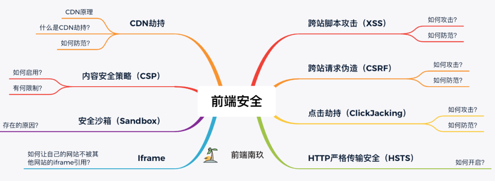

## 前端安全问题

## 跨站脚本攻击(XSS)
:::danger
Cross-Site Scripting(跨站脚本攻击)简称xss,是一种代码注入攻击。攻击者通过在目标网站上注入恶意脚本，使之在用户的浏览器上运行。利用这些恶意脚本，攻击者可以获取用户的敏感信息如cookie、SessionID等，进而危害数据安全

为了和CSS区分，我们吧攻击的第一个字母改成X 于是叫做XSS
:::
一般可以通过三种方式注入恶意脚本：
### 反射性XSS攻击
顾名思义，恶意Javascript脚本属于用户发送给网站请求中的一部分，随后网站又将这部分返回给用户，恶意脚本在页面中被执行。一般发生在前后端一体的应用中，服务端逻辑会改变最终的网页代码

<span style="color: orange">反射性XSS的攻击步骤</span>
1. 攻击者构造出特殊的URL,其中包含恶意代码
2. 用户打开带有恶意代码的URL时，网站服务端将恶意代码从URL中取出，拼接在HTML中返回给浏览器
3. 用户浏览器接收到响应后解析执行，混在其中的恶意代码也被执行
4. 恶意代码窃取用户数据并发送到攻击者的网站，或者冒充用户行为，调用目标网站接口执行攻击者执行的操作

### 基于DOM的XSS攻击
目前更流行前后端分离的项目，反射性XSS无用武之地。但这种攻击不需要经过服务器，我们知道，网页本身的<span style="color:blue">Javascript</span>也可以改变<span style="color:blue">HTML</span>的，黑客正是利用这一点来实现插入恶意脚本的

<span style="color: orange">基于DOM的XSS攻击步骤</span>
1. 攻击者构造出特殊的URL，其中包含恶意代码
2. 用户打开带有恶意代码的URL
3. 用户浏览器接收到响应后解析执行，前端Javascript取出URL中的恶意代码并执行。
4. 恶意代码窃取用户数据并发送到攻击者网站，或者冒充用户行为，调用目标网站接口执行攻击者指定的操作

### 存储型XSS攻击
又叫持久性XSS，顾名思义，黑客将恶意<span style="color: blue">JavaScript</span>脚本长期保存在服务端数据库中，用户一旦访问相关页面数据，恶意脚本就会被执行。常见于搜索、微博、社区贴吧评论等。

<span style="color: orange">存储型XSS的攻击步骤</span>
1. 攻击者将恶意代码提交到目标网站的数据库中
2. 用户打开目标网站时，网站服务端将恶意代码从数据库取出，拼接在HTML中返回给浏览器
3. 用户浏览器收到响应后解析执行，混在其中的恶意代码也被执行
4. 恶意代码窃取用户数据并发送到到攻击者网站，或者冒充用户的行为，调用目标网站接口执行攻击者指定的操作

### 这几种XSS攻击类型的区别
- <span style="color: blue">反射性XSS</span>的恶意脚本存在URL里,<span style="color: blue">存储型XSS</span>的恶意代码存在数据库里
- <span style="color: blue">反射性XSS</span>攻击常见于通过URL传递参数的功能，如网站搜索、跳转等
- <span style="color: blue">存储型XSS</span>攻击常见于带有用户保存数据的网站功能，如论坛发帖、商品评论、用户私信等
- 而基于<span style="color: blue">DOM的XSS</span>攻击中,取出和执行恶意代码由浏览器端完成，属于前端<span style="color: blue">Javascript</span>自身的安全漏洞，其他两种XSS都属于服务端的安全漏洞

### XSS防范措施
由上面对XSS攻击的介绍我们知道,XSS攻击主要有两大步骤：
- 攻击者提交恶意代码
- 浏览器执行恶意代码
所以我们可以针对这两点来指定防范措施

#### 输入过滤
在用户提交时,由前端过滤输入，然后提交到后端，这种方法不可行，因为攻击者可以绕过前端过滤直接构造请求，提交恶意代码。一般在写入数据库前，后端对输入数据进行过滤。虽然输入侧过滤能够在某些情况下解决特定的XSS的问题，但会引入很大的不确定性和乱码问题。在防范XSS攻击时应避免此类方法

#### 预防存储型和反射性XSS攻击
- 改成纯前端渲染，把代码和数据分开
- 对HTML做充分转义

#### 预防DOM型XSS攻击
DOM型XSS攻击，实际上就是网站前端Javascript代码本身不够严谨,把不可信的数据当做代码执行了。

在使用<span style="color: blue">.innerHTML、.outerHTML、document.write()</span>时要特别小心，不要把不可信的数据作为HTML插到页面上，而应尽量使用<span style="color: blue">.textContext、.setAttribute()</span>

如果用Vue/React技术栈，并且不使用<span style="color: blue">v-html/dangerouslySetInnerHTML</span>功能，就在前端render阶段避免<span style="color: blue">innerHTML、outerHTML</span>的XSS隐患。

DOM中的内联事件监听器，如<span style="color: blue">location、onclick、onerror、onload、onmouseover</span>等，&lt;a&gt;标签的href属性，Javascript的<span style="color: blue">eval()、setTimeout()、setInterval()</span>等，都能把字符串作为代码运行。如果不可信的数据拼接到字符中传递给这些API，很容易产生安全隐患，请务必避免
```html
<!-- 内联事件监听器中包含恶意代码 -->


<!-- 链接内包含恶意代码 -->
<a href="UNTRUSTED">1</a>

<script>
// setTimeout()/setInterval() 中调用恶意代码
setTimeout("UNTRUSTED")
setInterval("UNTRUSTED")

// location 调用恶意代码
location.href = 'UNTRUSTED'

// eval() 中调用恶意代码
eval("UNTRUSTED")
</script>
```
#### Content Security Policy
严格的CSP在XSS的防范中可以起到以下的作用：
- 禁止加载外域代码,防止复杂的攻击逻辑
- 禁止外域提交，网站被攻击后，用户的数据不会泄露到外域
- 禁止内联脚本执行(规则较严格，目前发现GitHub使用)
- 禁止未授权的脚本执行(新特性，Google Map移动版在使用)
- 合理使用上报可以即使发现XSS，利于尽快修复问题

**<span style="color:blue">「使用 W3C 提出的 CSP (Content Security Policy，内容安全策略)，定义域名白名单」</span>**

#### 其他措施
- 设置<span style="color: blue">Cookie 的HttpOnly</span>属性，禁止Javascript读取cookie
- 验证码: 防止脚本冒充用户提交危险操作 

## 跨站请求伪造(CSRF)

## 点击劫持(ClickJacking)
## HTTP严格传输安全(HTTPS)
:::danger
HTTP严格传输安全(HTTPS)是一种安全功能，web服务器通过它来告诉浏览器仅用HTTPS来与之通讯，而不是使用HTTP
:::
HTTPS代表HTTP严格传输安全，
## CDN劫持
## 内容安全策略(CSP)
## 安全沙盒(Sandbox)
## Iframe
## 资料
[前端常见的安全问题及防范措施](https://mp.weixin.qq.com/s/v5f9_YXbNSXYZL0adb_0Rw)

[DOM型xss深度剖析](https://blog.csdn.net/Bul1et/article/details/85091020)

[安全漏洞中的倚天剑——XSS跨站脚本攻击](https://blog.csdn.net/qq_41734243/article/details/106120757)