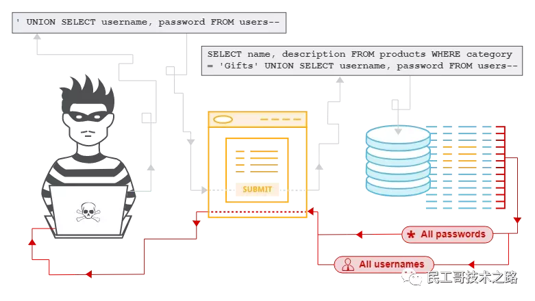
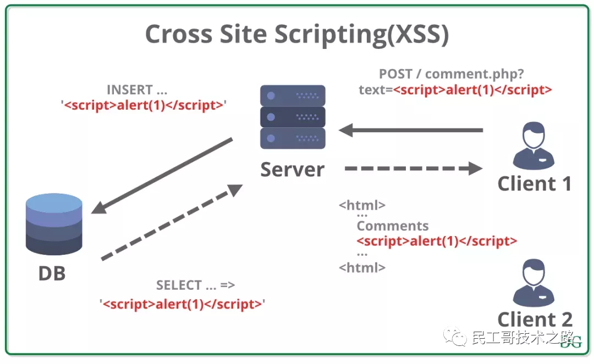
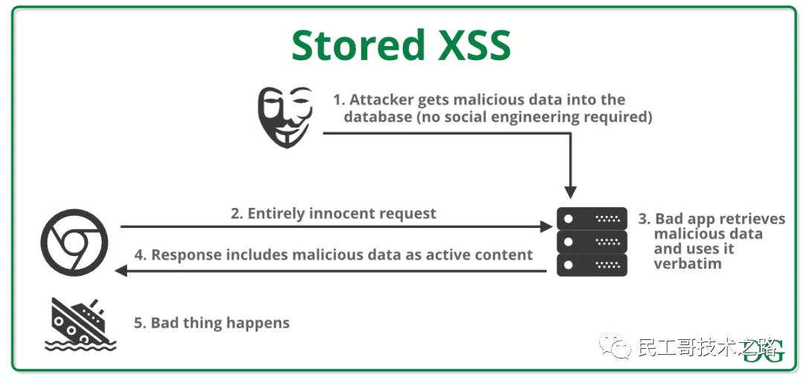
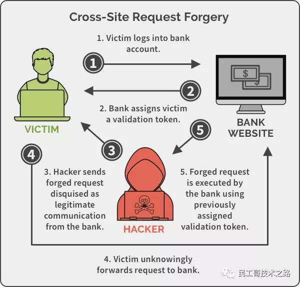
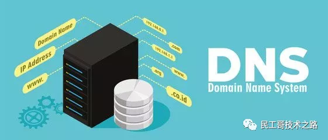
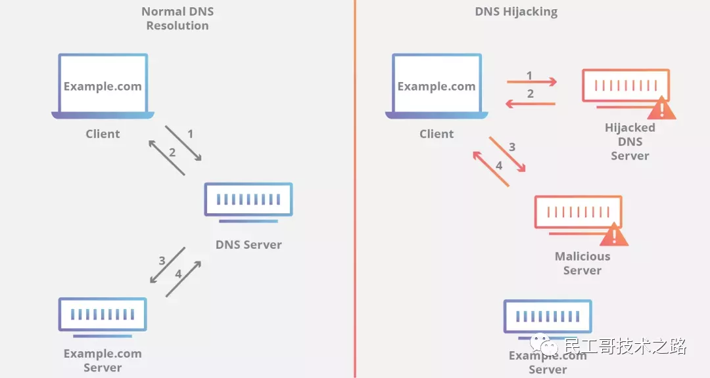
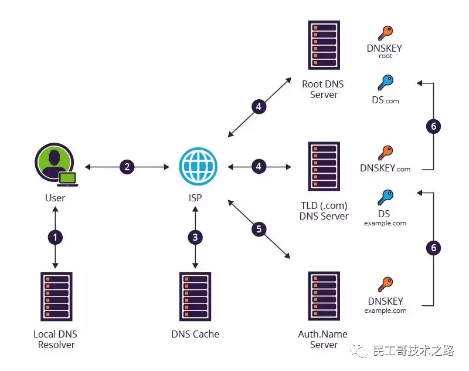

## SQL注入
SQL注入攻击的核心在于让Web服务器执行攻击者期望的SQL语句，以便得到数据库中的感兴趣的数据或对数据进行读取、修改、删除、插入等操作，达到其邪恶的目的

而如何让Web服务器执行攻击者的SQL语句呢，SQL注入的常规套路在于将SQL语句放置于Form表单或请求参数之中提交到后端服务器，后端服务器如果未做输入安全校验，直接将变量取出进行数据库查询，则极易中招


举例如下：

对于一个根据用户ID获取用户信息的接口，后端SQL语句一般是这样：
```
select name,[...] from t_user whereid=$id
```
其中,$id就是前端提交的用户id，而如果前端的请求是这样
```
GET xx/userinfo?id=1%20or%201=1
```
其中请求参数id转义后就是1or1 = 1,如果后端不做安全过滤直接提交数据库查询，SQL语句就变成了
```
select name,[...] from t_user whereid1or1=1
```

其结果是把用户表中的所有数据全部查出，达到了黑客泄露数据的目的

以上只是一个极简单的示例，在真实的SQL注入攻击中参数构造和SQL语句远比这复杂得多，不过原理是一致的。



## XSS攻击
XSS全程跨站脚本攻击(Cross site Scripting),为了与重叠样式表css区分，换了另一个缩写XSS



XSS攻击的核心是将可执行的前端脚本代码(一般为javascript)植入到网页中，听起来比较拗口，用大白话来就是攻击者想让你的浏览器执行他写的Js代码，那如果办到?

XSS分为两种

**反射型**


1. 攻击者将JS代码作为请求参数防止URL中，诱导用户点击
    ```
    http://localhost:8080/test?name=<script>alert('you are under attack')</script>
    ```
2. 用户点击后，该js作为请求参数传给Web服务器后端
3. 后端服务器没有检查过滤，简单处理后放入网页正文中返回给浏览器
4. 浏览器解析该网页，中招

**存储型**



上述方式攻击脚本直接经服务器转手手返回浏览器触发执行，存储型与之的区别在于能够将攻击脚本入库存储，在后面进行查询时，再将攻击脚本渲染进网页，返回给浏览器触发执行，常见的套路如下
1. 攻击者网页回帖，帖子中包含JS脚本
2. 回帖提交服务器后，存储至数据库
3. 其他网友查看帖子，后台查询该帖子的回帖内容，构建网站网页，返回浏览器
4. 该网友浏览器返回的网页，中招

## CSRF攻击



CSRF,跨站请求伪造，其核心思想在于，在打开A网站的情况下，另开Tab页打开恶意网站B，此时在B页面的"唆使"下，浏览器发起一个对网站A的HTTP请求。这个过程的危害在于2点：
1. 这个HTTP请求不是用户主动意图，而是B唆使的，如果一个危害交大的请求操作(发邮件、删数据等等)那就麻烦了
2. 因为之前A网站已经打开了，浏览器存有A下发的Cookie或其他用于身份认证的信息，这一次被唆使的请求，将会自动带上这些信息，A网站后端分不清楚这是否是用户的真实意图

## DDos攻击
DDOS全程Distributed Denial of Service:分布式拒绝服务攻击(在这个文章里有介绍)。是拒绝服务攻击的升级版。拒绝攻击服务顾名思义，让服务不可用。常用于攻击对外提供服务的服务器，常见于
- Web服务
- 邮件服务
- DNS服务
- 即时通讯服务
- ...


攻击者不断的提出服务请求，让合法用户的请求无法即使处理，这就是DOS攻击

攻击者使用多台计算机或者计算机集群进行dos攻击，这就是DDOS攻击。

在早起的互联网技术还没有那么发达的时候，发起DOS攻击是一件很容易的事情：一台性能强劲的计算机，写个程序多线程不断向服务器进行请求，服务器应接不暇，最终无法处理正常的请求，对别的正常用户来说，看上去网站貌似无法访问，拒绝服务就是这个意思。

后来随着技术的发展，现在的服务器早已不是一台服务器那么简单，你访问一个www.baidu.com的域名，背后是数不清的CDN节点，数不清的Web服务器

这种情况下，还想靠着单台计算机去试图让一个网路服务满载，无异于鸡蛋碰石头，对方没有趴下，自己下趴下

技术从来都是一柄双刃剑，分布式技术既可以用来提高可用的服务，也能够呗攻击方用来进行大规模杀伤性攻击。攻击者不在局限于单台计算机的功能能力，转而通过规模寄存发起拒绝服务攻击

## DNS劫持
当今互联网流量中，以HTTP/HTTPS为主的Web服务产生的流量占据了绝大部分。Web服务器发展吐火如荼，这背后离不开一个默默问问的大功臣就是域名解析系统



如果没有DNS，我们上网需要记忆每个网站的IP地址而不是他们的域名，这简直是灾难，好在DNS默默在背后做了这一点，我们只需要记住一个域名，剩下的交给DNS来完成吧

也正是因为其重要性，别有用心的人自然是不会放过它，DNS劫持技术被发明了出来。

DNS提供服务用来将域名转换成IP地址，然而在早期协议的设计中并没有太多考虑其安全性，对于查询方来说：
- 我去请求的真的是一个DNS服务器吗？是不是别人冒充的
- 查询的结果有没有被人篡改过？这个ip真的是这个网站吗？



DNS协议中没有机制去保证能回答这些问题，因此DNS劫持现象非常泛滥，从用户在地址栏属于一个域名的那一刻起，一路上的凶险防不胜防
- 本地计算机的木马修改hosts文件
- 本地计算机的木马修改DNS数据包中的应答
- 网络中的节点（如路由器）修改DNS数据包中的应答
- 网络中的节点（如运营商）修改DNS数据包中的应答
......



后来，为了在客户端对收到DNS应答进行校验，出现了DNSSEC技术，一定程度上可以解决上面的部分问题。但限于一些方面的原因，这项技术并没有大规模用起来，尤其在国内，少有部署应用的

在后来，以阿里、腾讯等头部互联网厂商开始推出httpDNS服务，来了一招釜底抽薪，虽然这项技术的名字中还有DNS三个字母，但是是线上和原来DNS已经天差地别，通过这项技术让DNS编程了在HTTP协议之上的一个应用服务

## JSON劫持

JSON是一种轻量级的数据交换格式，而劫持就是对数据进行窃取(或应该成为打劫、拦截比较合适)。恶意攻击者通过某些特定的手段，将本应该返回给用户的JSON数据拦截，转而将数据发送回给恶心攻击者，这就是JSON劫持的大概含义。一般来说进行劫持的JSON数据都是包含敏感信息或者有价值的数据

## 暴力破解
这个一般针对密码而言，弱密码很容易被被人踩到或者被暴力工具破解

解决方案 密码复杂度要足够大，也要足够隐蔽 限制尝试次数

## HTTP报头追踪漏洞

HTTP1.1(RFC2626)规范了HTTP TRACE方法，主要是用于客户端通过向Web服务器提交TRACE请求进行测试或获得诊断信息

当Web服务器启用TRACE时，提交的请求头会在服务器响应的内容(body)中完整的返回，其中HTTP头很可能包括Sesson Token、Cookies或其他认真信息，攻击者可以利用此漏洞来欺骗合法用户并得到他们的私人信息

解决方案

禁用HTTP TRACE方法

## 信息泄露

由于 Web 服务器或应用程序没有正确处理一些特殊请求，泄露 Web 服务器的一些敏感信息，如用户名、密码、源代码、服务器信息、配置信息等。

所以一般需注意：

应用程序报错时，不对外产生调试信息 过滤用户提交的数据与特殊字符 保证源代码、服务器配置的安全

## 目录遍历漏洞
攻击者向 Web 服务器发送请求，通过在 URL 中或在有特殊意义的目录中附加 ../、或者附加 ../ 的一些变形（如 .. 或 ..// 甚至其编码），导致攻击者能够访问未授权的目录，以及在 Web 服务器的根目录以外执行命令。

## 命令执行漏洞
命令执行漏洞是通过 URL 发起请求，在 Web 服务器端执行未授权的命令，获取系统信息、篡改系统配置、控制整个系统、使系统瘫痪等。

## 文件上传漏洞
如果对文件上传路径变量过滤不严，并且对用户上传的文件后缀以及文件类型限制不严，攻击者可通过 Web 访问的目录上传任意文件，包括网站后门文件（webshell），进而远程控制网站服务器。

所以一般需注意：

在开发网站及应用程序过程中，需严格限制和校验上传的文件，禁止上传恶意代码的文件 限制相关目录的执行权限，防范 webshell 攻击

## 其他漏洞
- SSLStrip 攻击
- OpenSSL Heartbleed 安全漏洞
- CCS 注入漏洞
- 证书有效性验证漏洞
## 业务漏洞

一般业务漏洞是跟具体的应用程序相关，比如参数篡改（连续编号 ID / 订单、1 元支付）、重放攻击（伪装支付）、权限控制（越权操作）等。

## 框架或应用漏洞
WordPress 4.7 / 4.7.1：REST API 内容注入漏洞
Drupal Module RESTWS 7.x：Remote PHP Code Execution
SugarCRM 6.5.23：REST PHP Object Injection Exploit
Apache Struts：REST Plugin With Dynamic Method Invocation Remote Code Execution
Oracle GlassFish Server：REST CSRF
QQ Browser 9.6：API 权限控制问题导致泄露隐私模式
Hacking Docker：Registry API 未授权访问

## 资料
[原文](https://mp.weixin.qq.com/s/awf6cC3HvWDre-yZWg6Oeg)

>作者：senntyou segmentfault.com/a/1190000018004657