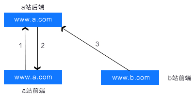

## 基础知识

### XSS(Cross Site Scripting)跨站脚本攻击

1. 原理: 页面渲染的数据包含可执行的脚本
2. 攻击的基本能类型：反射型(url直接注入)和存储型(存储到DB后读取时注入)
3. 注入点:HTML节点内的内容(text)；HTML中DOM元素属性；Javascript代码；富文本

```
// HTML节点内容注入
<div><script>alert(1);</script></div>

// DOM属性注入


// script代码
<script>
    var a = 1; 
    alert(1)
</script>

// 富文本是html标签，文字，以及样式的集合，很容易实现HTML节点内容注入和DOM属性注入，有被攻击的风险
```

### CSRF(Cross Site Request Forgy) 跨站请求伪造

原理:第三方网站向本网站发起请求



1. 用户在a站前端发起登录(身份人证)请求
2. a站后端确认身份，登录成功，cookie中存在用户的身份认证信息
3. b站前端页面向a站后端发起请求，带着a站的cookie信息(身份认真信息)，请求成功

综上，可以清楚的知道，**只要用户访问了b站的前端页面，b站可以在用户完全不知道的情况下，带着a站的用户登录态(cookie)向a站发起请求**

### 点击劫持

原理:第三方网站通过iframe内嵌某一个网站,并且将iframe设置透明不可见，将其覆盖在其他经过伪装的DOM上，伪装可点击DOM(按钮等)与实际内嵌网站的可点击DOM位置相同，当用户点击伪装的DOM时，实际上点击的是iframe中内嵌的网页的DOM从而触发请求操作

特点:用户自己做了点击操作，用户毫不知情

## 如何防御

### XSS攻击防御
1. 浏览器自带的防御机制，主要应对放射性攻击(HTML内容或属性):http响应头中自动添加 x-xss-protection,值为0(关闭)，1(打开)，默认打开
2. 对特定字符做转义：内容注入替换尖括号(```< => &lt; > => &gt;```) 属性注入替换单引号或双引号(```" => &quot; ' => &#39;```)
3. CSP(Content Security Policy)内容安全策略：用于指定哪些内容可执行

```
// 我们可以在http响应头中设置Content-Security-Policy
// 图片可以从任何地方加载(注意"*"通配符)
// 多媒体文件仅允许从medial.com和media2.com加载(不允许从这些站点的子域名)
// 可运行脚本仅允许来自于userscripts.example.com
Content-Security-Policy: default-src 'self'; img-src *; media-src media1.com media2.com; script-src userscripts.example.com

//同时meta中也支持设置Content-Security-Policy
<meta http-equiv="Content-Security-Policy" content="default-src 'self'; img-src https://*; child-src 'none';">
```

### CSRF攻击防御

CSRF的发生有几个特点，**b站发送的请求带着a站的cookie信息；b站发送请求不经过a站的前端;http请求头中的referer为b站**。我们可以从这些特点入手，思考防御的办法

1. 禁止第三方网站携带本网站的cookie信息：设置same-site属性，same-site属性有两个值，Strict(所有的第三方请求都不能携带本网站的cookie)和Lax(连接可以，但from表单提交ajax请求不行)
2. 本网站前端添加验证信息：使用验证码或者添加token验证
    - 验证码：当发起请求时，前端需要输入本网站页面的验证码信息，后端对验证码进行验证，验证码正确才会进行操作(存取数据等)
    - token验证：a站前端将tokenn存在当前页面中(比如表单中的input隐藏域，meta标签或任何一个dom属性)和cookie中，当请求a站后端的时候，参数中带上这个token字段，a站后端将参数中的token和cookie中的token做对比，相同择验证通过，不同则请求不合法

    不管是验证码还是token验证，原理都是一样的，在a站前端页面加入验证，当第三方网站请求a站后端时，即使能携带a站cookie，但是没有经过a站的前端页面从而拿不到验证信息，也会导致请求失败。

    两种防御的方法也有区别，验证码需要用户去填写，从而增加了用户使用网站的复杂度，而token验证在用户无感知的情况下实现，不影响用户体验。我个人理解，验证码一般使用在需要提高用户认知的场景，比如 登录多次失败，修改个人信息；而一些获取商品的列表信息，搜索等接口，使用token比较合适，

3. referer验证：禁止第三方请求
4. 使用post请求：有一种说法是post请求比get请求更安全，那这种说话对不对呢？实际上这种说法并不准确，对于CSRF攻击来说，不管是post还是get都能实现攻击，区别只是post请求攻击方需要构造一个form表单才可以发起请求，比get请求(img的src， a标签的href等)的攻击方式复杂了一些，但是并不能有效组织攻击

### 点击劫持攻击防御

1. javascript禁止内嵌：当网页没有使用iframe内嵌时，top和window是相等，当网页被内嵌时候，top和window不想等，可以在本网站的页面中添加如下判断

```
<script>
if (top.location !== window.location) {
    // 如果不想等，说明使用了iframe，可进行相关操作
}
</script>
```
但是这种方式并不是万能的，因为iframe标签中的属性sandbox属性是可以禁止内嵌网页的脚本的
```
<iframe sandbox="allow-forms" src="..."></frame>
```

2. 设置http响应头X-Frame-Options: 有三个字DENY(禁止内嵌)SAMEORIGINN(只允许同域名页面内嵌) ALLOW-FROM(指定可以内嵌的地址)
    能在所有的web服务器端预设好X-Frame-Options字段值是最理想的状态

3. 一些辅助手段，比如添加验证码，提高用户防范意识


## 其他
### xss反射型具体是？

[原文](https://www.cnblogs.com/zhiying/p/11018331.html)
[](https://blog.csdn.net/weixin_41487522/article/details/105960666)

[SSRF详解](https://blog.csdn.net/kuiguowei/article/details/79070999)