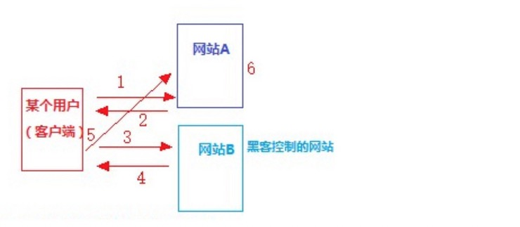

## CSRF是什么
CSRF(Cross-site request forgery),跨站请求伪造。攻击者盗用你的身份，以你的名字发送恶意请求。CSRF能够做的事情包括：以你的名字发送邮件，发消息、盗取你的账号，甚至于购买商品，虚拟货币转账…造成的问题包括：个人隐私泄露以及财产安全。

## CSRF攻击原理


1. 客户端通过账户密码登录访问网站A
2. 网站A验证客户端的账号密码，成功则生成一个SessionId,并返回给客户端储在浏览器中
3. 该客户端tab一个新的页面访问了网站B
4. 网站B自动触发要求该客户端访问网站A。(即在网站B中有连接指向网站A，例如:form表单action)
5. 客户端通过网站B中的链接访问网站A。(此时携带有合法的sessionID进行访问网站A的)
6. 此时网站A只需检测sessionID是否合法，合法则执行相应的操作

## 几种常见的攻击类型
1. GET类型的CSRF

  针对get请求，黑客一般会给你发送一张图片，在图片的src里执行请求
  ```
  <!-- GET类型csrf攻击 -->
  
  ```

2. POST类型的CSRF

  针对post请求，黑客一般会伪造一个表单，在提交的时候发送请求
  ```
  <!-- POST类型csrf攻击 -->
  <form action="http://127.0.0.1:10086/payfor" method="POST" target="_self">
  <input type="hidden" name="money" value="10000" />
        <input type="hidden" name="to" value="hacker" />
    </form>
    <script> document.forms[0].submit(); </script>
  ```

3. 链接类型的CSRF

  链接类型的CSRF并不常见，比起其他两种用户打开页面就中招的情况，这种需要用户点击链接才会触发。这种类型通常是在论坛中发布的图片中嵌入恶意链接，或者以广告的形式诱导用户中招，攻击者通常会以比较夸张的词语诱骗用户点击，例如：
  ```
  <a href="http://test.com/csrf/withdraw.php?amount=1000&for=hacker" taget="_blank">
    重磅消息！！
  <a/>
  ```

## CSRF的特点

- 攻击一般发起在第三方网站，而不是被攻击网站，被攻击的网站无法防止攻击发生(但是可以防御csrf)
- 攻击利用受害者在被攻击网站的登录凭证，冒充受害者提交操作，而不是直接窃取数据。整个过程攻击者并不能获取到受害者的登录凭证，仅仅是冒用(攻击者只能利用cookie而不能获取cookie)
- 跨站请求可以用各种方式：图片URL、超链接、CORS、Form提交等等。部分请求方式可以直接嵌入在第三方论坛、文章中，难以进行追踪。

## 防御CSRF的策略
CSRF通常从第三方网站发起，被攻击的网站无法防止攻击发生，只能通过增强自己网站针对CSRF的防护能力来提升安全性

上文讲了CSRF的两个特点
1. CSRF(通常)发生在第三方域名
2. CSRF攻击者不能获取到Cookie等信息，只能使用

针对这两点，我们可以专门制定防护策略，如下：
- 组织不明外域的访问
  - 同源检测
  - samesite cookie
- 提交时要求附加本域才能获取到的信息
  - CSRF token
  - 双重Cookie验证

### 同源检测
既然CSRF大多来自第三方网站，那么我们就直接禁止外域（或者不受信任的域名）对我们发起请求。

那么问题来了，我们如何判断请求是否来自外域呢？

在HTTP协议中，每一个异步请求都会携带两个Header，用于标记来源域名：
- Origin Header
- Referer Header
这两个Header在浏览器发起请求时，大多数情况会自动带上，并且不能由前端自定义内容。 服务器可以通过解析这两个Header中的域名，确定请求的来源域。

1. 使用Origin Header确定来源域名

  在部分与CSRF有关的请求中，请求的Header中会携带Origin字段。字段内包含请求的域名(不包含path及query)

  如果Origin存在，那么直接使用Origin中的字段确认来源域名就可以

  但是Origin在以下两种请求不存在

  - IE11同源策源
  - 302重定向：在302重定向之后Origin不包含在重定向的请求中，因为Origin可能会被认为是其他来源的敏感信息。对于302重定向的情况来说都是定向到新的服务器上的URL，因此浏览器不想将Origin泄漏到新的服务器上。

2. 使用Referer Header确定来源域名

  根据HTTP协议，在HTTP头中有一个字段叫Referer，记录了该HTTP请求的来源地址。对于Ajax请求，图片和script等资源请求，Referer为发起请求的页面地址。对于页面跳转，Referer为打开页面历史记录。因此我们使用Referer中链接的Origin部分可以的值请求的来源域名

  这种方法并非万无一失，Referer的值是由浏览器提供的，虽然HTTP协议上有明确的要求，但是每个浏览器对于Referer的具体实现可能有差别，并不能保证浏览器自身没有安全漏洞。使用验证 Referer 值的方法，就是把安全性都依赖于第三方（即浏览器）来保障，从理论上来讲，这样并不是很安全。在部分情况下，攻击者可以隐藏，甚至修改自己请求的Referer。

  另外，前面说过，CSRF大多数情况下来自第三方域名，但并不能排除本域发起。如果攻击者有权限在本域发布评论（含链接、图片等，统称UGC），那么它可以直接在本域发起攻击，这种情况下同源策略无法达到防护的作用。

  综上所述：同源验证是一个相对简单的防范方法，能够防范绝大多数的CSRF攻击。但这并不是万无一失的，对于安全性要求较高，或者有较多用户输入内容的网站，我们就要对关键的接口做额外的防护措施。
  
## CSRF Token
## 双重Cokie验证


## 资料
[原文](https://blog.csdn.net/yexudengzhidao/article/details/93527586)