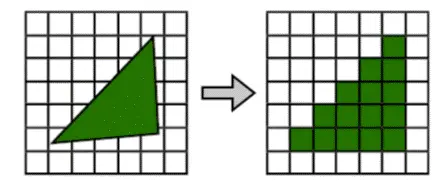
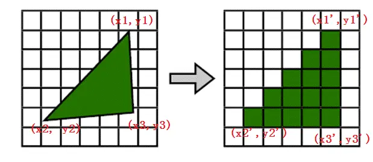
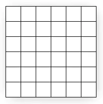
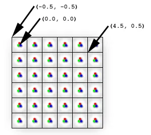
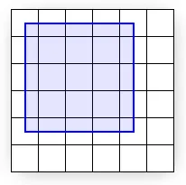
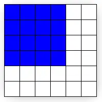
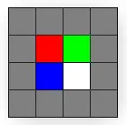
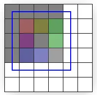
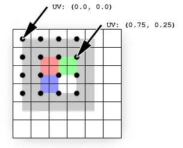
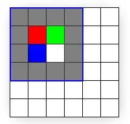

## 先了解下什么是光栅化及光栅化的简单过程
光栅化是将几何数据经过一系列变换后最终转换为像素，从而呈现在现实设备上的过程。如下图



光栅化的本质是坐标变换、几何离散化，如下图



## 以下内容展示纹理到像素时的一些细节
当使用已经执行过顶点变换的顶点作为2D输出平面的时候，我们必须确保每个纹素正确的映射到每个像素区域，否则纹理将产生扭曲，通过理解Direct3D在光栅化和纹理采样遵循的基本过程，你可以确保你的Direct3D程序正确的输出一个2D图像


>图1

图片1展示了用一个方块来描述像素的。实际上，像素是点，不是方块，每个图片1中的方块表明了被一个像素点亮的区域，然而像素始终是方块中间的一个点，这个区别，看起来，但是很重要。图片二展示了一种更好的描述方式


>图2

这张图正确的通过一个点来描述每个单元中央的物理像素。屏幕空间的坐标原点(0,0)是位于左上角的像素，因此就在最左上角的方块的中央。最左上角的方块的最左上角因此是(-0.5,-0.5)，因为它距最左上角的像素是(-0.5,-0.5)个单位。Direct3D将会在(0,0)到(4,4)的范围内渲染一个矩形，如图3所示


>图3

图片3展示了数学上应该显示的矩形。但是并不是Direct3D光栅化之后的样子。实际上，像图3这样光栅化是根本不可能，因为每个像素点点亮区域只能是一种颜色，不可能一半没有颜色一半有颜色。如果可以像上面这样显示，那么矩形边缘的像素区域必须显示两种不同的颜色：蓝色的部分表示在矩形内，白色部分表示在矩形外。

<mark>因此，图形硬件将会执行判断哪个像素应该被点亮以接近真正的矩形的任务，这个过程被称为光栅化。对于我们这个特殊的例子，光栅化后的结果如图4所示</mark>


>图4

注意我们传给Direct3D（图三）的两个角的坐标为（0，0）和（4，4）（相对于物理像素坐标）。但是光栅化后的输出结果（图4）的两个角的坐标为（-0.5，-0.5）和（3.5，3.5）。比较图3和图4，的不同之处。你可以看到图4的结果才是正确的矩形大小。但是在x,y方向上移动了-0.5个像素矩形单位。然而，抛开multi-sampling技术，这是接近真实大小矩形的最好的光栅化方法。注意如果光栅化过程中填充所有被覆盖的物理像素的像素区域，那么矩形区域将会是5x5，而不是4x4.

如果你结合屏幕坐标系的原点在最左上角像素区域的最左上角，而不是最左上角的物理像素，这个方块显示出来和我们想要的一样。然而当我们给定一个纹理的时候，区别就显得异常突出了，图5 展示了一个用于映射到我们的矩形的4x4的纹理。


>图5

因为纹理有4x4个纹素，并且矩形是4x4个像素，你可能想让纹理映射后的矩形就像纹理图一样。然而，事实上并非如此，一个位置点的轻微变化也会影响贴上纹理后的样子，图6阐释了一个（0，0）（4，4）的矩形被光栅化和纹理映射后的样子。


>图6

图6中展示了贴上纹理后的矩形(使用线性差值模式和CLAMP寻址模式)

文中剩下的部分将会解释为什么它看上去是这样而不像我们的纹理涂。

先提供一个解决这个问题的方法：输入的矩形的边界线需要位于两个像素区域之间。通过简单的将x和y值移动-0.5个像素区域单位，纹素将会完美的覆盖到矩形区域并且在屏幕上重现(图8阐释了这个完美覆盖的正确的坐标)（译者：这里你创建的窗口的坐标必须为整数，因此位于像素区域的中央，你的客户区屏幕最左像素区域的边界线在没有进行移位-0.5之前也必位于某个像素区域的中央)

<span style="color: red">关于为什么光栅化和纹理映射出来的图片只有一点像我们的原始纹理涂的原因和Direct3D纹理选址模式和过滤模式有关</span>

回到我们调查为什么会出现奇怪像素的过程，为了追踪输出的颜色，我们看看像素着色器:像素作色器在光栅后的图形中的每个像素都会被调用一次。图3中蓝色的线框围绕的矩形区域都会使用一个简单的作色器

```js
float4 SolidBluePS():COLOR {
    return float4(0, 0, 1,1)
}
For the textured quad, the pixel shader has to be changed slightly:

texture MyTexture;

sampler MySampler =
sampler_state
{
        Texture = <MyTexture>;
        MinFilter = Linear;
        MagFilter = Linear;
        AddressU = Clamp;
        AddressV = Clamp;
};

float4 TextureLookupPS( float2 vTexCoord : TEXCOORD0 ) : COLOR
{
        return tex2D( MySampler, vTexCoord );
}
```
代码假设图5中的4x4的纹理存储在MyTexture中。MySampler被设置成双线性过滤。光栅化每个像素的时候调用一次这个Shader.每次返回的颜色值都是对sampled texture使用vTexCoord取样的结果，vTexCoord是物理像素值处的纹理坐标。这意味着在每个像素的位置都会查询纹理以得到这点的颜色值。详情如图7所示 



纹理（重叠上的区域）是在物理像素的位置采样的（黑点）。纹理坐标不会受光栅化的影响（它们被保留在投影到屏幕空间的原始坐标中）黑点是光栅化的物理像素点的位置。每个像素点的纹理坐标值可以通过简单的线性插值得到:顶点（0，0）就是物理像素（0,0）UV是(0.0,0.0)。像素（3，1）纹理坐标是UV(0.75,0.25)因为像素值是在3/4 纹理宽度和1/4纹理高度的位置上。这些插过值的纹理坐标被传递给了像素着色器。 

<span style="color: blue">每个纹素并不和每个像素重叠，每个像素都在4个纹素的中间。因为过滤模式是双线性。过滤器将会取像素周围4个颜色的平均值。这解释了为什么我们想要的红色实际上确是3/4的灰色加上1/4的红色。应该是绿色的像素点是1/2的灰色加上1/4的红色加上1/4的绿色等等。 </span>

<span style="color: red">为了修正这个问题，你需要做的就是正确的将矩形映射到像素，然后正确地映射纹素到像素。图8显示了将(-0.5, -0.5) and (3.5, 3.5)的矩形进行纹理映射后的结果。</span>



## 总结
总的来说,像素和纹素实际上是点，不是实体的块。屏幕空间原点是左上角的物理像素,但是纹理坐标原点是纹素矩形的最左上角。最重要的是，记住当你要将纹理中的纹素正确的映射到屏幕空间中的像素时，你要减去0.5个单位


[什么是光栅化](https://www.bilibili.com/read/cv15002314)
