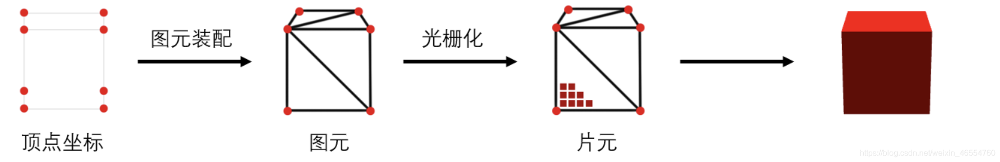
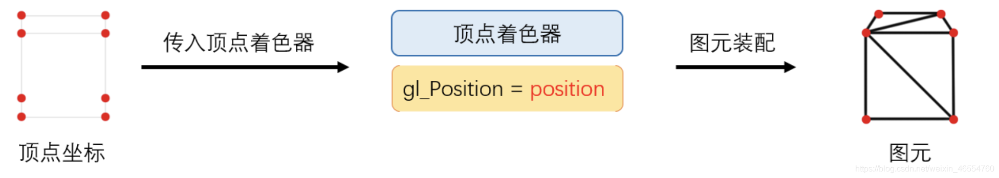
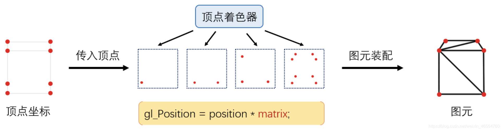
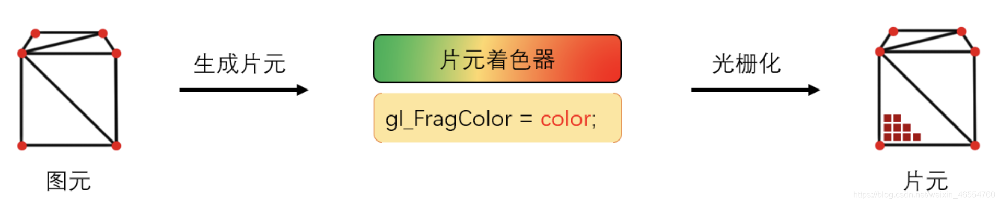
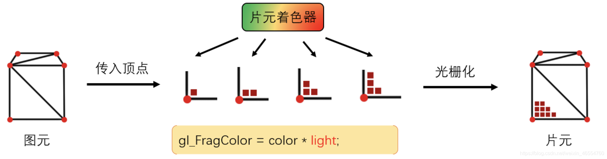
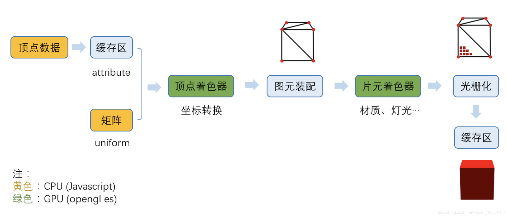
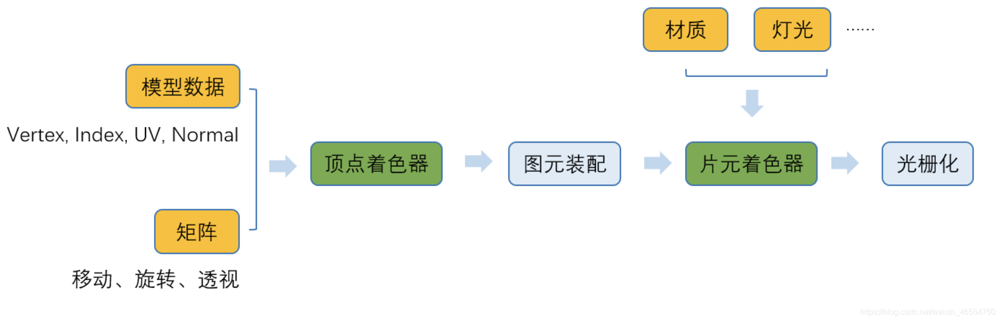
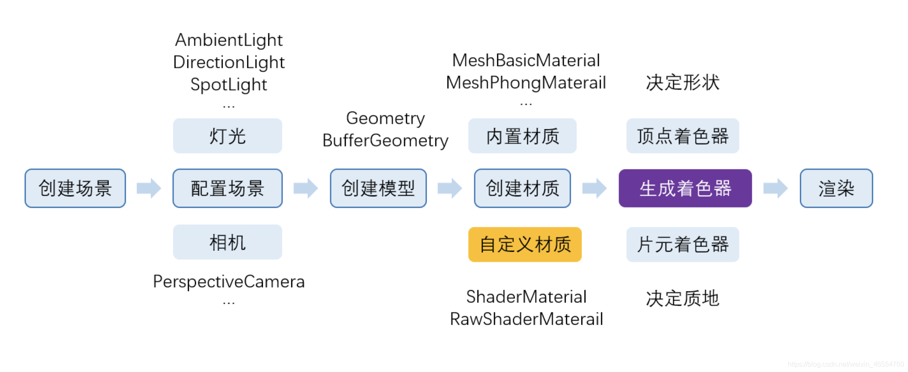

## WebGl的工作原理

WebGl绘制过程包括以下三步:
1. 获取顶点坐标
2. 图元装配(即画出一个个三角形)
3. 光栅化(生成片元，即一个个像素点)

- 第一步:获取顶点之后存入缓存区，方便GPU(opengl es) 更快读取

- 第二步:图元装配

    

    顶点坐标传入顶点着色起器，如果是绘制3d图形，即传入的顶点坐标是一个三维坐标，顶点着色器需要把三维坐标转换成屏幕坐标。

    顶点着色器处理流程

    

    顶点着色器会先将坐标转换完毕，然后由GPU进行图元装配，有多少顶点，这段顶点着色器就运行了多少次。运用[投影矩阵](https://so.csdn.net/so/search?q=%E6%8A%95%E5%BD%B1%E7%9F%A9%E9%98%B5&spm=1001.2101.3001.7020)(matrix)进行转换坐标。坐标转换不限于投影矩阵

- 第三步:光栅化

    在图元生成完毕之后，我们需要给模型"上色"，而完成这部分工作的，则是运行在GPU的"片元着色器"来完成。它同样是一段opengl es程序，模型看起来是什么质地(颜色、漫反射贴图等)、灯光等由片元着色器来计算

    

    片元着色器的处理流程

    

    生成多少片元(像素)，片元着色器运行多少次

整体

## three.js
three.js是WebGL的框架。封装和简化了WebGL的方法

黄色和绿色部分，都是three.js参与的部分，其中黄色是javascript部分，绿色是opengl es部分

我们发现，能做的，three.js基本上都帮我做了

1. 辅助我们导出了模型数据
2. 自动生成了各种矩形
3. 生成了顶点着色器
4. 辅助我们生成材质，配置灯光
5. 更加我们设置的材质生成片元着色器

three.js完整运行流程：

## 资料
[WebGL和Three.js工作原理](https://blog.csdn.net/weixin_46554760/article/details/113885722)

[万技师博客](https://www.cnblogs.com/wanbo/)