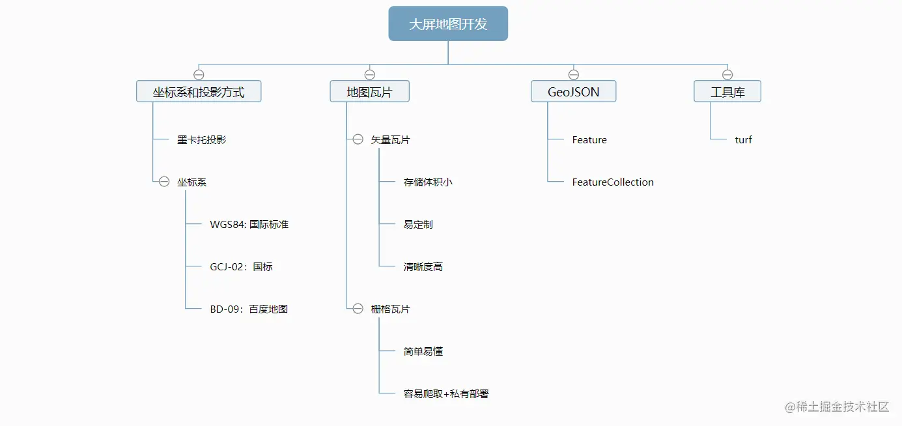
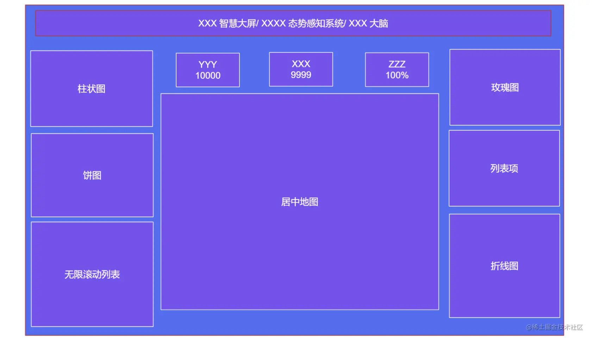
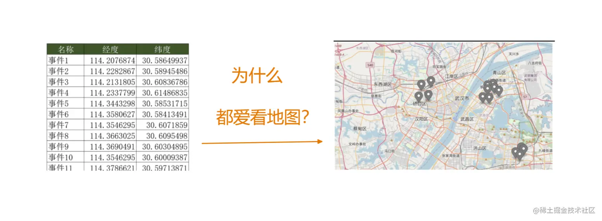
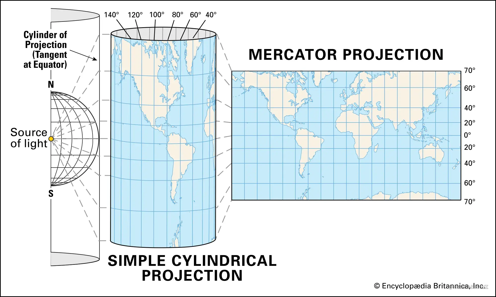
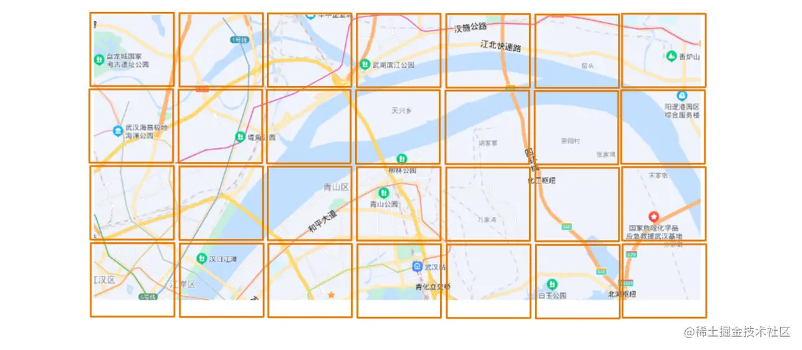
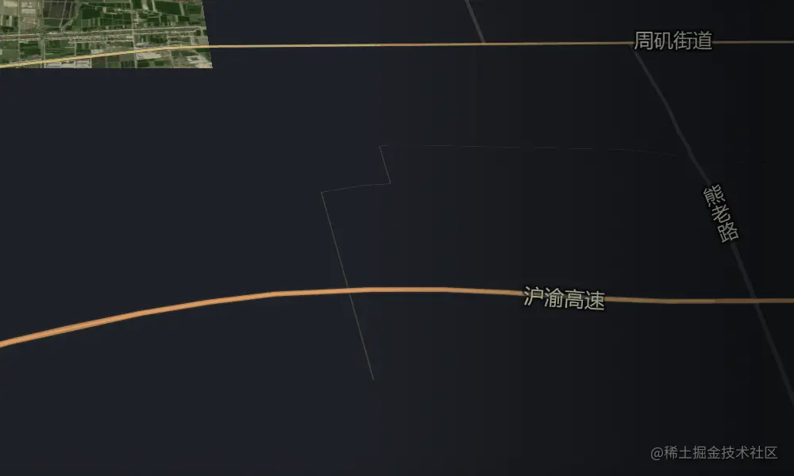
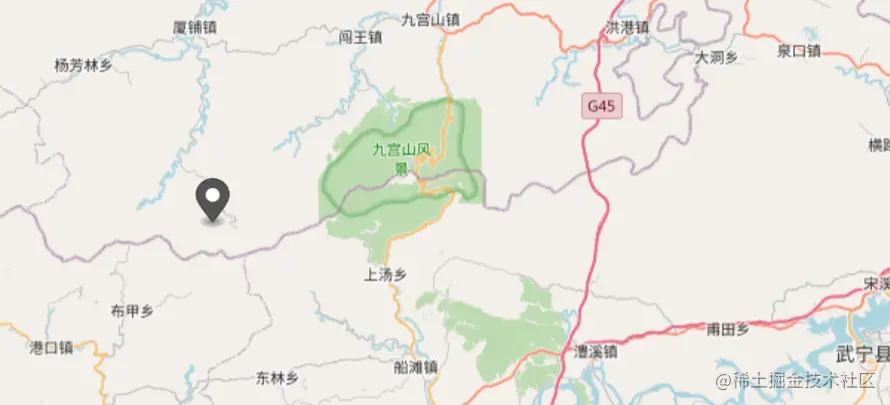

- 投影 & 坐标系
- 地图瓦片
- GeoJSON
- turf.js

## 文章大纲


## 一、为什么大多数的大屏都有地图
> 智慧城市、态势感知、智慧调度中心、作战平台、驾驶舱、管控中心、城市大脑...

无论这些大屏都给自己取了多么炫酷的名称，都难以掩盖他们相似、相同的本质:讲故事。这一点在本专栏的第一篇中已有细述，暂不累述。但他们另一个相似点你一定也发现了

> 他们似乎大多数都在中间放着一张地图


对，就想上面这样，但是为什么呢？

围绕着讲故事的主旨，我们不难发现，描述一件事最最合适的方式应该是这样

> 谁在上面时间、在哪里、做了一件什么事情

> 对于一个系统而言，也就是能知道哪个用户、哪个终端，在什么时间、什么物理位置上，触发了什么时间

这里有几个要素：
- 对象主体(人、设备、道路等)
- 事件时间
- 事件位置
- 事件信息

其中"主体"、"时间“、”事件“都属于易于描述的内容

> 张三、12月22日，触发了烟雾报警

但唯独在实践位置难以描述，要么一串地理文本冗长不直观、要么关键信息缺失，都比不上一张地图，明明白白的将他触发报警的位置房子啊一个项目的icon来的直观



这也正是为什么在各种故事中，数字孪生这个概念被不断提及的原因之一

故事要动人，那它首先就的直观易懂

这就是大屏上地图的核心意义

## 二、前端人员开发地图是专业的嘛？
> 先说结论：太不专业了。
因为地图开发（也被称为 GIS 开发），本来就是一门自成体系的学科。

GIS 开发 独立于 “前端开发”、“后端开发” 之外，一个独立的开发体系了，相关招聘和技术栈也和单纯的前端开发有了较大的出入。

相关的工具体系，比如 arcGis、arcMap 等等，咱普通小前端也通常不太熟。

至于 .shp、.shx 等这些格式的地理数据，前端更是一头雾水。

但目前很多项目上，对于前端的要求偏偏是：

> 不仅能开发管理后台、h5、小程序，还得会大屏开发，而且还得会：地图开发

业余人士和专业人士拼专业程度是不可能的。

但，躺平 不可取，躺赢 不可能。

该了解的基本知识还是得了解的。
## 三、投影方式和坐标系
当我们视图在页面上加载地图时， 我们通常不是从0开始的，而是选择一款地图引擎
- 百度、高度、谷歌等
- leaflet、OpenLayers等
- mapbox、cesium等

但他们在展示地图时，有两个核心概念，分别是投影方式和坐标系

### 投影方式(Projection)
**目前web Gis最常用的投影方式是 墨卡托投影，常规的地图厂商和地图引擎，都默认使用的这类投影方式**


<span style="color: blue">墨卡托投影的核心思路是，先把球形地图展开成柱状图，然后平铺成平面</span>

>但是众所周知，球形是不可能铺成圆柱形的，因此，摩卡托投影是存在地形扭曲的，尤其是越靠近南北极的地理面积就越是比真实面积显示要大。

对于这块知识，了解即可，一般情况下不会需要去进行投影方式变换。

## 坐标系
目前国际上最通用的经纬度坐标系，来自于 “美国国家地理空间情报局” 出台的 WGS84。
:::tip
世界大地测量系统（英语：World Geodetic System, WGS），WGS包含一套地球的标准经纬坐标系、一个用于计算原始海拔数据的参考椭球体，和一套用以定义海平面高度的引力等势面数据。
:::
但是，国内通用的地图厂商，通常不被允许直接使用 WGS84 进行地理信息服务。
> 你问为什么？当然是国家安全，数据安全啊。
国测局规定:
> 国内出版的各种地图系统，必须至少采用GCJ-02对地理位置进行首次加密的坐标系

- <span style="color: red">⾼德和Google在国内都是使⽤ GCJ－02 坐标系</span>
- <span style="color: red">百度使⽤的是在 GCJ-02 基础上再⼀次加密的 BD-09 坐标系。</span>

目前，社区里也是有很多关于 GCJ-02 坐标系的坐标和 WGS84 坐标互相转换的算法，最广受认可的是这个：[coordtransform](https://github.com/wandergis/coordtransform)

## 地图瓦片
地图上要展现出丰富的信息，显示街道、显示桥梁、显示房屋、显示湖泊……要支持缩小、支持放大，就必须有一个信息载体，这个载体，也被称为：
> 地图瓦片
我们肉眼看上去一整片的地图，程序在处理时，实际上是把 它 切成了 它们



若干块可描述的矩形拼凑起来，就成了我们能看到的一整张效果图。

因此，我们在显示地图时，经常发现地表信息是一块一块显示出来的。



那么，这种一块一块的地图瓦片，是用的什么技术呢？

目前主流的思路分两种：

- 矢量瓦片 （Vector Tile）
- 栅格瓦片 （Raster Tile）

传统栅格瓦片，它的思想是通过栅格化的图片(png/jpg等)来进行地址数据的显示

> 它无法直接表达一条高速公路。但若干张简单的 png 拼凑却能让你快速看到整个北京的地理信息。

矢量瓦片，它的思想，就是将各种地理信息矢量化，最终通过 字体、线段、图表、风格、矢量数据 等信息，将地理信息保存下来，最终完成到地图上的渲染。

>比如我想记录一条高速公路，那我就把这条高速公路的宽度、矢量信息等保存下来，后续可以支持它在地图上进行渲染。

矢量瓦片 的体积更小、定制化能力更强，是目前主流地图厂商使用的瓦片提供方式。

但 栅格瓦片 的优势在于它对终端的性能要求低，且简单易懂，易于上手。

那么我们应该如何选择地图所使用的瓦片呢？

我给出一套简单的选择瓦片的思路：
- 如果你需要数据绝对免费，且可能考虑私有部署，那选栅格瓦片

- 如果你的甲方考虑购买商用服务，且没有私有化部署的场景，大胆选择 矢量瓦片。
没有完美的方案，只有完美的场景适配，毕竟最后是以甲方满意和项目交付作为目标的。

## 五 GeoJSON:web端的地理信息通用货
只有瓦片，可能还无法满足甲方的全部需求
> 甲方:把这个湖泊高亮一个下午，水面要发光，要五彩斑斓。
> 甲方：我的三个项目，你把它们框起来，用特别的颜色标识出来。
> 甲方：把工人都给我显示在地图上。

业务场景对地图的要求绝对不是仅仅把地图渲染出来，核心的逻辑还是在地图上 做一些事情，显示一些业务。

因此，除了能把地图显示出来，我们还需要 把业务显示出来。

那么，如何描述业务地理信息呢？

答案是：GeoJSON!

### 什么是GeoJSON
<span style="color: red">GeoJSON是一种数据格式。它被用来描述地址数据。</span>

其典型格式如下
```js
{
  "type": "Feature",
  "geometry": {
    "type": "Point",
    "coordinates": [125.6, 10.1]
  },
  "properties": {
    "name": "Dinagat Islands"
  }
}
```
目前最新的 GeoJSON 格式支持以下类别的地理信息（Feature）描述：

- 点: Point
- 点组（多个点）: MultiPoint
- 线: LineString
- 线组（多条线）: MultiLineString
- 多边形: Polygon
- 多边形组（多个多边形）: MultiPolygon

以及：

- 包含一组上述Feature的集合：FeatureCollection

GeoJSON 格式官方网站：www.rfc-editor.org/rfc/rfc7946

### 理解Feature的格式
如果我想在地图上点一个点：

就需要用到 Feature 类别的 GeoJSON 数据，通常长这样：
```js
{
  "type": "Feature",
  "properties": {
    "id": 1,
    "name": "摸鱼的春哥"
  },
  "geometry": {
    "coordinates": [
      114.48328003261895,
      29.35629560547187
    ],
    "type": "Point"
  }
}
```
注意，以上格式，分为三部分：

- type：类别，支持的值只有： Feature 和 FeatureCollection。
- properties：属性，用来记录业务属性，如 id，name 等。
- geometry：几何信息。用来表示图形信息，是点还是线还是多边形，它们的经纬度是多少。

而 FeatureCollection 则可以表达多个 Feature 的集合：
```js
{
  "type": "FeatureCollection",
  "features": [
    {
      "type": "Feature",
      "properties": {},
      "geometry": {
        "coordinates": [
          114.48328003261895,
          29.35629560547187
        ],
        "type": "Point"
      }
    },
    {
      "type": "Feature",
      "properties": {},
      "geometry": {
        "coordinates": [
          [
            [
              114.58791284766971,
              29.391982262865895
            ],
            [
              114.58791284766971,
              29.2928121036324
            ],
            [
              114.72107020435487,
              29.2928121036324
            ],
            [
              114.72107020435487,
              29.391982262865895
            ],
            [
              114.58791284766971,
              29.391982262865895
            ]
          ]
        ],
        "type": "Polygon"
      }
    }
  ]
}
```
完成了对 一个点 + 一个多边形 地理信息的描述。
## 六、turf.js：前端必备的地理工具
> 浏览器和 Node.js 端的地理信息分析工具。 —— turf.js 官网。
官网地址：turfjs.org/

为什么我们会需要这样一个工具？

因为：

关于地理信息的几何计算，它是专业的。
### 场景:求几个重心(放文本或者定位)
假设场景：你有一个多边形 GeoJSON 数据，现在你想知道它的 几何重心 在哪里？

除了自己慢慢写数学公式造轮子，turf.js 可能是更好的选择：
```js
const polygon = {
  "type": "Feature",
  "properties": {},
  "geometry": {
    "coordinates": [
      [
        [-81, 41],
        [-88, 36],
        [-84, 31],
        [-80, 33],
        [-77, 39],
        [-81, 41]
      ]
    ],
    "type": "Polygon"
  }
}
var centroid = turf.centroid(polygon);
```
### 6.2 场景：求面积
```js
const polygon = {
  "type": "Feature",
  "properties": {},
  "geometry": {
    "coordinates": [
      [
        [-81, 41],
        [-88, 36],
        [-84, 31],
        [-80, 33],
        [-77, 39],
        [-81, 41]
      ]
    ],
    "type": "Polygon"
  }
}
var area = turf.area(polygon);// 一键计算出面积
```
### 更多场景
它还能支持哪些场景的能力？
那可太多了：

- alone: 延长某条线 xx 距离，得到一个点。
- bbox: 将一个（组） GeoJSON 数据的矩形范围计算出来。（通常用在地图缩放上）
- bearing: 计算出一条线和正北方向的夹角（顺时针）。
- distance: 两点之间的直线距离
- 等等等等……

具体的功能清单，还需要自行去官网感受理解。你会感受到它的强大和魅力的。


## 资料
[原文](https://juejin.cn/post/7170866833015177247#heading-0)