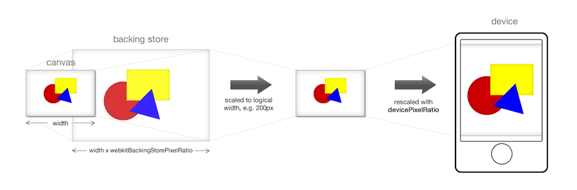

## 问题剖析
:::tip
[移动端适配方案](front-end/engineering/flexible.html#一些概念)中对物理像素(physical pixel)、CSS像素和devicePixelRatio等概念进行了介绍
:::
在高清屏中，Canvas绘制时会出现模糊问题，在文章[High DPI Canvas](https://www.html5rocks.com/en/tutorials/canvas/hidpi/)中对比进行了分析介绍。其中涉及两个概念:<span style="color: blue">webkitBackingStorePixelRatio和devicePixelRatio</span>

浏览器绘制Canvas渲染到屏幕中分两个过程
- <span style="color: blue">绘制过程:webkitBackingStorePixelRatio</span>

    webkitBackingStorePixelRatio表示浏览器在绘制Canvas到缓存区时的绘制比例，若图片宽高为200px，webkitbackingStorePixelRatio为2，那么Canvas绘制这个图片到缓存区时，宽高为400px;

- <span style="color: blue">渲染过程：devicePixelRatio</span>

    Canvas显示到屏幕中还需要渲染过程，渲染过程根据devicePixelRatio参数将缓存区中的canvas进行缩放渲染到屏幕中



分析图片在高清屏中Canvas绘制会模糊的原因:
1. devicePixelRatio = device pixel / CSS pixel

    如果devicePixelRatio = 2 那么对于200px * 200px的图片要绘制到屏幕中，那么对应的屏幕像素(物理像素)就是400px * 400px

2. 在大部分高清屏中，例如Macbook Pro中

    ```js
    webkitBackingStorePixelRatio = 1;
    devicePixelRatio = 2;
    ```
将一个200px * 200px 的图片Canvas绘制到该屏幕中的流程
- webkitBackingStorePixelRatio = 1;

    绘制到缓存区的大小也为：200px * 200px;

- devicePixelRatio = 2;

    200px * 200px 的图片对应到屏幕像素为400px * 400px ,devicePixelRatio = 2浏览器就把缓存区的200px * 200px 宽高分别放到两倍渲染到到屏幕中，所以导致模糊

## 解决方案
- 将Canvas宽高进行方法，放大比例为：devicePixelRatio / webkitBackingStorePixelRatio

    ```js
    var devicePixelRatio = window.devicePixelRatio || 1
    var backingStoreRatio = context.webkitBackingStorePixelRatio || 
                        context.mozBackingStorePixelRatio ||
                        context.msBackingStorePixelRatio ||
                        context.oBackingStorePixelRatio ||
                        context.backingStorePixelRatio || 1
    var ratio = devicePixelRatio / backingStoreRatio
    ```
- 通过css设置将Canva缩小为原大小

    ```js
    var oldWidth = canvas.width;
    var oldHeight = canvas.height;

    canvas.width = oldWidth.ratio;
    cvans.height = oldWidth.ratio;

    canvas.style.width = oldWidth + 'px'
    canvas.style.height = oldHeight + 'px'
    ```
举例分析一下Canvas绘制图片，文字的适配方案：
1. 对于图片绘制drawImage方法

    由于Canvas放大后，相应的绘制图片时也要放大，有两种方式
    - drawImage目标宽高分别乘以ratio
    ```js
    context.drawImage(image, , srcx, srcy, srcw, srch, desx, desy, desw * ratio, desh * ratio)
    ```
    - context.scale缩放
    ```js
    context.scale(ratio, ratio)
    // 绘制图片
    context.drawImage(...)
    context.scale(1/ratio, 1/ratio)
    ```
    此种方式在绘制图片之前，调用 scale 设置 Canvas 缩放变换；绘制完成后，需要重置 Canvas 的缩放变换。推荐使用这种方式 👍
- 对于文字绘制fillText方法

    由于Canvas方法了，绘制文字时，字体也要放大，绘制完毕后，字体要缩小会原大小
    ```js
    context.font = context.font.replace(/(\d+)(px|em|rem|pt)/, (w, m, u) => {
        return (m * ratio) + u;
    })
    // 绘制文字
    context.fillText(...)
    context.font = context.font.replace(
    /(\d+)(px|em|rem|pt)/g,
    function(w, m, u) {
        return (m / ratio) + u;
    }
    );
    ```

关于 Canvas 在高清屏绘制的兼容，github 有一个 [polyfill jondavidjohn/hidpi-canvas-polyfill](https://github.com/jondavidjohn/hidpi-canvas-polyfill) 但是这仓库并没有考虑 drawImage，如果直接使用这个 polyfill，在绘制图片时，宽高都会变小；我 fork 了这个仓库，并增加了 drawImage 处理：YingshanDeng/hidpi-canvas-polyfill。更多 Canvas 绘制方法的兼容参考这个仓库的源码。

## 其他
1️⃣  webkitBackingStorePixelRatio 在 Chrome 中已经废弃，详细参考：https://bugs.chromium.org/p/chromium/issues/detail?id=277205

2️⃣  现在高清屏中 Canvas 绘制图片 drawImage，不需要经过如上处理也不会出现模糊的情况了（只在 Mackbook Pro, iPhone 6S 上分别测试过），这点在网上并没有找到更多的信息

但是 Canvas 的其他绘制方法例如绘制文字 fillText 不经过处理高清屏中绘制仍然会模糊，所以还是需要这个polyfill：YingshanDeng/hidpi-canvas-polyfill

## 资料
[高清屏中 Canvas 的绘制](http://objcer.com/2017/10/10/High-DPI-Canvas-Render/)