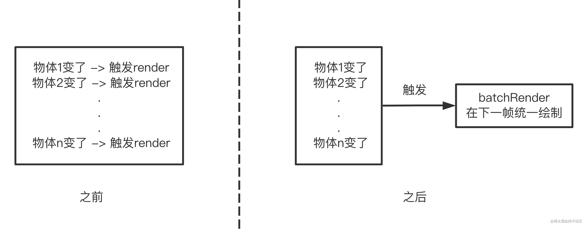

:::tip
- 离屏渲染
- 局部渲染
:::
## 前言
这个章节我们主要将的是canvas中一些具体的性能优化思路。虽然平时在写页面的时候不需要太过关注，但是在canvas中是hin容易写出卡顿、甚至崩溃的代码。所以讲一下大体思路是很有必要的。淡然天下乌鸦一般黑，道理都是一样的

我们知道<span style="color: blue">canvas渲染是一个不断擦除和重绘的过程，一般会配合requestAnimationFrame使用，要想让人觉得流畅，就要把每一帧的时间控制在16ms以内，当然越少越好，而每一帧主要又包含两个部分:计算和渲染</span>.于是乎要想提高canvas性能，无非就是从这两方面下手：

- 计算
    - 减少数据量
    - 加快处理
- 绘制
    - 尽可能少的绘制
    - 尽可能快的绘制

其实它们又好像是一个意思，就是能偷懒就偷懒，能少做一点绝不多做，能不重新绘制的时候就不重新绘制，必须绘制的时候就少绘制一些东西。接下来咱们就基于这些基本原则进行详细说明

[浏览器每一帧需要完成哪些操作](/front-end/JavaScript/browser-requestAnimation.html#页面流畅与fps)

## 进可能少的绘制
这是最重要的原则,也是效果最为显著的手段，因为所有的绘制都是有成本的
- 执行各种逻辑、各种计算
- js调用canvas api进行绘制
- 浏览器把渲染后的结果呈现在屏幕上(通常是另一个渲染线程)
- ...

刚才我们说每一帧的时间是16ms，但实际是更少的。所以尽可能少的绘制是必须的，下面就来看看基于这个原则的一些使用方法
### 可视区外的不绘制
这个是最简单也是最直白的想法了,就是超出画布可视区我们就不进行绘制，那具体是怎么操作呢？？就是我们在重绘画布的时候,肯定是需要遍历每个物体然后才能把每个元素画上去的，当遍历到某个物体时，我们可以先判断该物体是否在画布可视区内，亦即物体的AABB包围盒是否在画布这个矩形呢，不在话就直接跳过，一般canvas库都会提供物体的坐标点信息，所以还是很好判断的

### 分层
<span style="color: blue">分层顾名思义就是生成多个canvas，然后将它们一次堆叠即可</span>.很多文章都会提到说把动态物体和静态物体进行分层,这确实是一种很经典的做法，比如可以将不常动的背景单独放在一个canvas里。不过其实不一定要放在canvas中，放在一个普通div里也是ok的。那处了动静封层，还有什么其他分层原则吗？比如：

- 按功能分层
    - 这个思想在fabric.js(一个canvas库)中应该算是很明显了，该库实现用了两层canvas，上层主要负责响应各种交互事件，下层则专注于单纯的渲染画布，使当的分层有利于代码清晰、理顺逻辑和bug调试
- 临时分层
    - 当我们在一个复杂的画布中拖动一个物体时为了避免重绘该图层，可以将拖动的物体单独移动到另外一个canvas中渲染，当拖拽结束时再将物体移动会原来的图层

当然层数也不建议创建太多，毕竟要占内存的，通常可以5个以内。另外要注意的就是分层会导致层与层之间的顺序是固定的，对于物体之间总是相互交错的时候并不是一个很好的选择

[Fabric.js学习资料（中文教程）](https://gitee.com/k21vin/fabricjs-demo)

### 批量绘制
假如画布中有很多个物体在运动，每个物体都会触发重新渲染，那画布就会一直重绘，这其实没有必要，所以我们可以优化一下，使之只重绘一次，好比现在前端的框架，如果我们在短时间内改变同一个值，页面是不会反复渲染的，而是等到下一个周期再统一执行。虽说叫批量绘制，其实就是统一到下一帧执行，给人的感觉更像是防抖，就像下面这张图：



说起来好像挺简单，写起来其实也还好，这里简单贴下代码加深下印象
```js
batchRender() {
    if(!this.pending) {
        this.pending = true;
        requestAnimationFrame(() => {
            this.render();
            this.pending = false;
        })
    }
    return this;
}
```
### 局部绘制

## 尽可能快的绘制
### 减少指令代码

### 缓存
### 滤镜

## 减少计算
### 减少数据量
### 加快数据处理速度

## 小结

## 资料
[canvas性能渲染--离屏渲染](https://blog.csdn.net/qq_26733915/article/details/81675124)

[前端局部自动刷新_AntV Canvas 局部渲染总结](https://blog.csdn.net/weixin_26808205/article/details/112497489)

[canvas 性能优化原理](https://juejin.cn/post/7135229172409958431#heading-1)

[你不知道的CANVAS 性能优化几种方式](https://zhuanlan.zhihu.com/p/452871005)