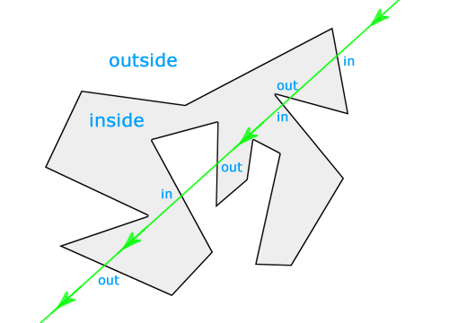

<span style="color: red">**首先想到的一个解法是从这个点做一条射线,计算它跟多边形边界的交点个数，如果交点个数为奇数，那么这个点就在多边形内部，否在在点在多边形外**</span>


这个结论很简单，那它是怎么来的？其实，对于平面内任意闭合曲线，我们都可以直观的认为，曲线把平面分割成了内、外两部分，其中"内"就是我们所谓的多边形区域


基于这一认识，对于平面内任意一条直线，我们可以得出下面这些结论
- 直线穿越多边形边界时,有切只有两种情况：进入多边形或穿出多边形
- 在不考虑非欧空间的情况下，直线不可能从内部再次进入多边形，或从外部再次穿出多边形，即连续两次穿越边界的情况必然成对
- 直接可以无限延伸，而闭合曲线包围的区域是有限的，因此最后一次穿越多边形边界，一定是穿出多边形，到达外部



现在回到我们最初的题目。假如我们从一个给定的点做射线，还可以得出下面两条结论：
1. 如果点在多边形内部，射线第一次穿越边界一定是穿出多边形
2. 如果点在多边形外部，射线第一次穿越边界一定是进入多边形


把上面这些结论综合起来，我们可以归纳出
1. <span style="color: red">当射线穿越多边形边界的次数为偶数时，所有第偶数次(包括最后一次)穿越都是穿出，因此所有第奇数次(包括第一次)穿越为传入，由此可推断点在多边形外部</span>


2. <span style="color: red">当射线穿越多边形边界的次数为奇数时，所有第奇数词(包括第一次和最后一次)穿越都是穿出，由此可推断点在多边形内部</span>


到这里，我们已经了解这个解法的思路了，下面接着看算法实现的一些具体问题和边界条件的处理

1. 点在多边形的边上

    上面我们讲到，这个解法的主要思路就是计算射线穿越多边形边界的次数，那么对于点在多边形的边上这种特殊情况，射线触发的这一次，是否算做穿越呢？
    
    看了上面的图就会发现，不管算不算穿越，都会陷入两难的境地——同样落在多边形边上的点，可能会得到相反的结果。这显然是不正确的，因此对这种特殊情况需要特殊处理。

2. 点和多边形的顶点重合

    这其实是第一种情况的一个特例。

    

3. 射线经过多边形顶点

    射线刚好经过多边形顶点的时候，应该算一次还是两次穿越？这种情况比前两种复杂，也是实现中的难点。

    

4. 射线刚好经过多边形的一条边

    这是上一种情况的特例，也就是说，射线连续经过了多边形的两个相邻顶点。

    

### 解决方案
1. <span style="color: red">判断点是否在线上的方法有很多，比较简单直接的就是计算点与两个多边形顶点的连线斜率是否相等，中学数学都学过。</span>

2. <span style="color: red">点和多边形顶点重合的情况更简单，直接比较点的坐标就行了。</span>

3. <span style="color: red">顶点穿越看似棘手，其实我们换一个角度，思路会大不相同。先来回答一个问题，射线穿越一条线段需要什么前提条件？没错，就是线段两个端点分别在射线两侧。只要想通这一点，顶点穿越就迎刃而解了。这样一来，我们只需要规定被射线穿越的点都算作其中一侧。</span>

    
    如上图，假如我们规定射线经过的点都属于射线以上的一侧，显然点 D 和发生顶点穿越的点 C 都位于射线 Y 的同一侧，所以射线 Y 其实并没有穿越 CD 这条边。而点 C 和点 B 则分别位于射线 Y 的两侧，所以射线 Y 和 BC 发生了穿越，由此我们可以断定点 Y 在多边形内。同理，射线 X 分别与 AD 和 CD 都发生了穿越，因此点 X 在多边形外，而射线 Z 没有和多边形发生穿越，点 Z 位于多边形外。
4. 解决了第三点，这一点就毫无难度了。根据上面的假设，射线连续经过的两个顶点显然都位于射线以上的一侧，因此这种情况看作没有发生穿越就可以了。由于第三点的解决方案实际上已经覆盖到这种特例，因此不需要再做特别的处理。

这种简单直观的算法通常叫做射线法或奇偶法，下面给出 JavaScript 的算法实现。
```js
/**
 * @description 射线法判断点是否在多边形内部
 * @param {Object} p 待判断的点，格式{x: X坐标,y: Y坐标}
 * @param {Array} poly多边形顶点，数组成员的格式同p
 * @return {String} 点p和多边形poly的几何关系
*/
function rayCasting(p, poly) {
    var px = p.x;
    var py = p.y;
    var flag = false;
    for(var i = 0, l = poly.length, j = l - 1; i < l; j = i, i++) {
        var sx = poly[i].x,
            sy = poly[i].y,
            tx = poly[j].x,
            ty = poly[j].y;
        // 点与多边形顶点重合
        if((sx === px && sy === py) || (tx === px && ty === py)) {
            return 'on'
        }
        // 判断线段两断点是否在射线两侧
        if((sy < py && ty >= py) || (sy >= py && ty < py)) {
            // 线段上与射线 Y 坐标相同的点的 X 坐标
            var x = sx + (py - sy) * (tx - sx) / (ty - sy)

            // 点在多边形的边上
            if(x === px) {
                return 'on'
            }

            // 射线穿过多边形的边界
            if(x > px) {
                flag = !flag
            }
        }
    }
    // 射线穿过多边形边界的次数为奇数时点在多边形内
    return flag ? 'in' : 'out'
}
```

## 回转数法


## 资料
[判断平面内的点是否在多边形内（射线法/回转数法）](https://xoyozo.net/Blog/Details/is-the-point-inside-the-polygon)

[21](https://www.html-js.com/card/468)

[js 判断点是否在多边形内](https://codeantenna.com/a/uDDYQs4qXL)