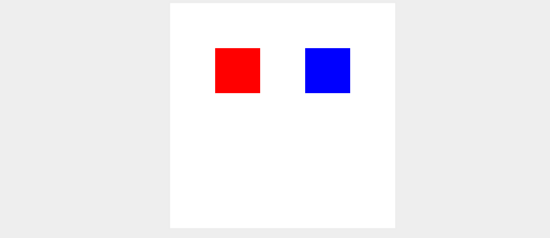
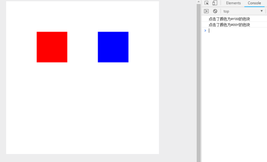
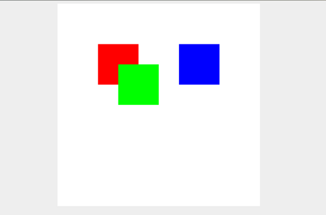
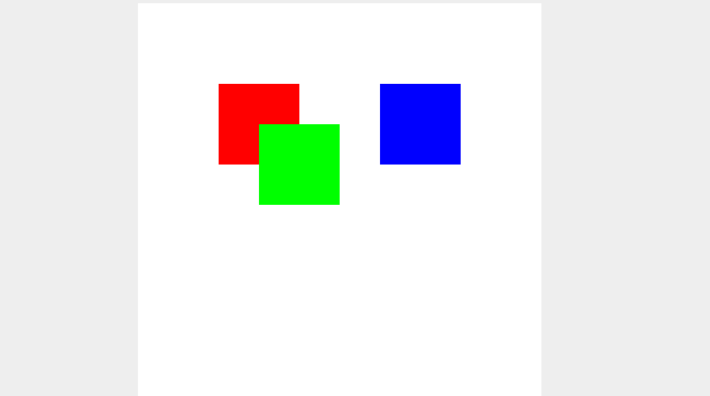
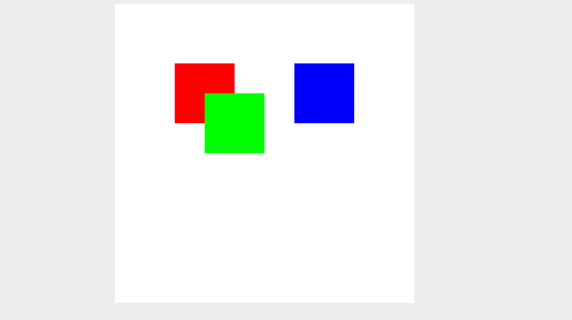

[原文](https://www.jb51.net/html5/621488.html)

## 前言
众所周知canvas是位图,在位图里我们可以在里面画各种东西，可以是图片/线条等。<span style="color: red">那我们想给canvas里的某一张图片添加一个点击事件该怎么做呢？**而JS只能监听到canvas的事件**,很明显这个图片是不存在与dom里面的，图片只是画在了canvas里而已。</span>

下面来简单的实现一个canvas内部各个图片的事件绑定

<span style="color: blue">实现原理: **其实就是canvas绑定相关事件，在通过记录图片所在的canvas的坐标,判断事件作用于哪个图片中**</span>。这样讲是不是感觉和事件代理有点相似，不过实现起来还是少许复杂的。

## 实现
### 1.建立图片和canvas之间的联系(这里我用色块来代替图片)
这里要色块和canvas建立一定的联系,而不是单纯的渲染。还要记录色块所在的坐标、宽高
```html
<!-- // 首先写一基本的html页面创建一个canvas -->
<!DOCTYPE html>
<html lang="en">
<head>
    <meta charset="UTF-8">
    <meta name="viewport" content="width=device-width, initial-scale=1.0">
    <meta http-equiv="X-UA-Compatible" content="ie=edge">
    <title>canvas事件</title>
    <style>
        html, body {
            height: 100%;
            background: #eee;
        }
        canvas {
            background: #fff;
            display: block;
            margin: 0 auto;
        }
    </style>
</head>
<body>
    <canvas width="500" height="500" id="canvas"></canvas>
</body>
</html>
```
下一步，我们要定一个Canvas的类，这个类要实现什么功能呢？
- 要有对应的canvas
- 装色块数据的容器
- 添加色块的方法
- 渲染色块的方法
- 渲染所有色块的方法

因为色块也有自己的一些参数，为了方便拓展，我们也为色块定义类，这个类需要的功能有： 宽、高、颜色、坐标(x, y),还有Canvas实例，初步就定这几个
```js
// Canvas类
class Canvas {
    blockList: Block[],
    ctx: any,
    canvas: any
    constructor(ele) { // 初始化函数(输入的是canvas)
        // 设置canvas
        this.canvas = ele;
        this.ctx = this.canvas.getContext('2d');
        // 色块容器
        this.blockList = []
    }
    createBlock(option) {
        options.Canvas = this;
        this.blockList.push(new Block(option));
        this.painting();
    }
    rendering(block) { // 渲染色块函数
        this.ctx.fillStyle = block.color;
        this.ctx.fillRect(block.x, block.y, block.w, block.h);
    }
    painting() { // 将容器里的色块全部渲染到canvas
        // 清楚画布(渲染之前应该将老的清空)
        this.ctx.fillStyle = '#ff';
        this.ctx.fillRect(0, 0, this.canvas.width, this.canvas.height);
        this.blockList.forEach(ele => {
            this.rendering(ele)
        })
    }
}
class Block {
    w: number
    h: number
    x: number
    y: number
    color: string
    Canvas: Canvas
    hierarchy: number
    constructor({w, h, x, y, color, Canvas}) { // 初始化设置色块相关属性
        this.w = w;
        this.h = h;
        this.x = x;
        this.y = y;
        this.color = color;
        this.Canvas = canvas;
    }
}
```
试运行一下
```js
// 创建Canvas实例，并添加蓝色个宽高100px,位置(100,100)、(300,100)红色和蓝色的色块
var canvas = new Canvas(document.getElementById('canvas'))
canvas.createBlock({                    // 红色
    x: 100,
    y: 100,
    w: 100,
    h: 100,
    color: '#f00'
})
canvas.createBlock({                    // 蓝色
    x: 100,
    y: 100,
    w: 300,
    h: 100,
    color: '#00f'
})
```


### 2.给色块添加点击事件
这里并不能直接给色块添加点击事件，所以要通过坐标的方式判断当前点击的是哪个色块。

- 先给canvas添加点击事件
- 判断色块区域
- 执行响应事件
```js
class Block {
    // ....省略代码
    checkBoundary(x, y) { // 判断边界方法
        return x > this.x && x < (this.x + this.w) && y > this.y && y < (this.y + this.h) 
    }
    mousedownEvent() { // 点击时间
        console.log(`点击了颜色为${this.color}的色块`)
    }
}
class Canvas {
    // ...
    constructor(ele) {
        this.canvas = ele;
        this.ctx = this.canvas.getContext('2d');
        this.blockList = [];
        // 事件绑定(这里有一个要注意的，我这里用了bind方法， 是为了将「mousedownEvent」方法内的this指向切换到Canvas)
        this.canvas.addEventListener('click', this.mousedownEvent.bind(this))
    }
    mousedownEvent(e) { // 点击事件
        const x = e.offsetX;
        const y = e.offsetY;
        // 这里将点击的坐标传给所有色块，根据边界判断是否在点击在内部，是的话执行色块的事件方法
        this.blockList.forEach(ele => {
            if(ele.checkBoundary(x, y)) ele.mousedownEvent();
        })
    }
}
```


**到这里为止已经实现了对不同canvas内不同色块绑定对应的点击事件。不过这个点击事件是不完美的，<span style="color: red">因为目前为止我们还没有引入层级的概念，就是说两个色块重叠部分点击的话，全部都会触发。所以我们还要给色块加入层级的属性。实现一个点击某一个色块改色块的层级就会提升到最高</span>。**
```js
class Block {
    // ...省略部分代码
    constructor({w, h, x, y, color, Canvas, hierarchy}) {
        this.w = w
        this.h = h
        this.x = x
        this.y = y
        this.color = color
        this.Canvas = Canvas
        this.hierarchy = 0
    }
}
class Canvas {
    //...
    constructor(ele) {
        this.canvas = ele;
        this.ctx = this.canvas.getContext('2d');
        this.blockList = [];
        // 事件绑定(这里有一个要注意的，我这里用了bind方法，是为了将“mousedownEvent”方法内的this指向切换到Canvas)
        this.canvas.addEventListener('click', this.mousedownEvent.bind(this))   // 点击事件
        this.nowBlock = null                // 当前选中的色块
    }
    createBlock(options) { // 创建色块函数
        option.Canvas = this;
        // 创建最新的色块的层级应该是最高的
        option.hierarchy = this.blockList.length;
        this.blockList.push(new Block(option))
        this.rendering();
    }
    mousedownEvent(e) { // 点击事件
        const x = e.offsetX;
        const y = e.offsetY;
        // 获取点中里层级最高的色块
        this.nowBlock = (this.blockList.filter(ele => ele.checkBoundary(x, y))).pop();
        // 如果没有捕获的色块直接退出
        if(!this.nowBlock) return;
        // 将点击到的色块层级提到最高
        this.nowBlock.hierarchy = this.blockList.length;
        // 重新排序(从小到大)
        this.blockList.sort((a, b) => a.hierarchy - b.hierarchy);
        // 在重新从0开始分配层级
        this.blockList.forEach((ele, idx) => ele.hierarchy === idx);
        // 重新倒序排序后在重新渲染
        this.painting();
        this.nowBlock.mousedownEvent(e); // 只触发选中的色块时间
    }
}
// 这里我们还得加入第三块色块与红色色块重叠的色块
canvas.createBlock({
  x: 150,
  y: 150,
  w: 100,
  h: 100,
  color: '#0f0'
})
```


Canvas中『mousedownEvent』方法内的代码是有点复杂的，主要是有点绕

- 首先是this.nowBlock =  (this.blockList.filter(ele => ele.checkBoundary(x, y))).pop()这段代码是怎么获取到点击到的色块中层级最高的色块。这里因为我们每次添加色块都是设置了最高层级的，所以“blockList”内的色块都是按层级从小到大排序的。所以我们取最后一个就可以了。
- 第二步就是将拿到的色块的层级提升到最高
- 第三部就是从小到大重新排列色块
- 因为第二步的时候我们修改了选中色块的层级，导致所有色块的层级不是连续的，为了避免层级不可控，我们还得重新定义层级。
- 重新渲染色块到canvas中，因为“blockList”内的色块是排好序的，所以按顺序渲染即可。



### 3.实现对不同色块进行拖拽
在上面我们已经实现了获取不同的色块，并修改它的层级。下面我们要实现色块的拖拽，主要就是获取鼠标移动过程中和一开始点击下去时位置坐标的变化。这个原理和普通的dom拖拽实现原理一样。

获取点击色块的点，距离色块左边和上边的距离(disX, disY)。

<span style="color: blue">鼠标移动时，用鼠标当前距离canvas左边和上边的距离减去(disX, disY)这里就是色块的x，y坐标了。</span>

```js
class Block {
    // ...
    mousedownEvent(e: MouseEvent) {
        // 这里disX和disY的计算方式：e.offsetX获取到大嗯是鼠标点击距离canvas左边的距离，this.x是色块距离canvas坐标的距离；e.offsetX - this.x就是色块左边的距离
        const disX = e.offsetX - this.x; // 点击距离色块左边的距离
        const disY = e.offsetY - this.y; // 点击距离色块上面的距离
        // 绑定鼠标滑动事件;这里mouseEvent.offsetX同样是鼠标距离canvas左侧的距离，mouseEvent.offsetX - disX就是色块的x坐标了。同理y也是这样算的。
        document.onmousemove = moseEvent => {
            this.x = mouseEvent.offsetX - disX;
            this.y = mouseEvent.offsetY - disY;
            this.Canvas.painting()
        }
        // 鼠标松开清空所有事件
        document.onmouseup = () => {
            document.onmousemove = document.onmousedown = null
        }
        // console.log(`点击了颜色为${this.color}的色块22`)
    }
}
```


下面贴上完整的代码(html和调用的方法就不放了)这个例子只是简单实现给canvas内的内容绑定事件，大家可以实现复杂一点的，例如把色块换成图片，除了拖拽还以给图片缩放，旋转，删除等等。
```js
class Canvas {
  blockList: Block[]
  ctx: any
  canvas: any
  nowBlock: Block
  createBlock (option) {
    option.hierarchy = this.blockList.length
    option.Canvas = this
    this.blockList.push(new Block(option))
    this.painting()
  }
  rendering (block) {
    this.ctx.fillStyle = block.color
    this.ctx.fillRect(block.x, block.y, block.w, block.h)
  }
  painting () {
    // 清空画布
    this.ctx.fillStyle = '#fff'
    this.ctx.fillRect(0, 0, this.canvas.width, this.canvas.height)
    this.blockList.forEach(ele => {
      this.rendering(ele)
    })
  }
  mousedownEvent (e: MouseEvent) {                  // 点击事件
    const x = e.offsetX
    const y = e.offsetY
    // 获取点中里层级最高的色块
    this.nowBlock = (this.blockList.filter(ele => ele.checkBoundary(x, y))).pop()
    // 如果没有捕获的色块直接退出
        if (!this.nowBlock) return
    // 将点击到的色块层级提高到最高
    this.nowBlock.hierarchy = this.blockList.length
    // 重新排序(从小到大)
    this.blockList.sort((a, b) => a.hierarchy - b.hierarchy)
    // 在重新从0开始分配层级
    this.blockList.forEach((ele, idx) => ele.hierarchy = idx)
    // 重新倒序排序后再重新渲染。
    this.painting()
    this.nowBlock.mousedownEvent(e)
    // this.blockList.forEach(ele => {
    //   if (ele.checkBoundary(x, y)) ele.clickEvent(e)
    // })
  }
  constructor (ele) {
    this.canvas = ele
    this.ctx = this.canvas.getContext('2d')
    this.blockList = []
    // 事件绑定
    this.canvas.addEventListener('mousedown', this.mousedownEvent.bind(this))
  }
}
class Block {
  w: number
  h: number
  x: number
  y: number
  color: string
  Canvas: Canvas
  hierarchy: number
  constructor ({ w, h, x, y, color, Canvas, hierarchy }) {
    this.w = w
    this.h = h
    this.x = x
    this.y = y
    this.color = color
    this.Canvas = Canvas
    this.hierarchy = hierarchy
  }
  checkBoundary (x, y) {
    return x > this.x && x < (this.x + this.w) && y > this.y && y < (this.y + this.h)
  }
  mousedownEvent (e: MouseEvent) {
    const disX = e.offsetX - this.x
    const disY = e.offsetY - this.y
    document.onmousemove = (mouseEvent) => {
      this.x = mouseEvent.offsetX - disX
      this.y = mouseEvent.offsetY - disY
      this.Canvas.painting()
    }
    document.onmouseup = () => {
      document.onmousemove = document.onmousedown = null
    }
    // console.log(`点击了颜色为${this.color}的色块22`)
  }
}
```