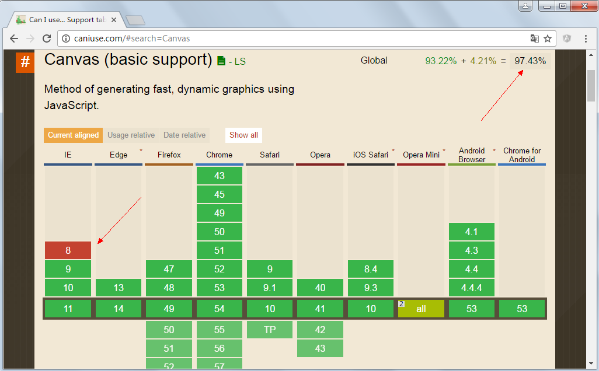
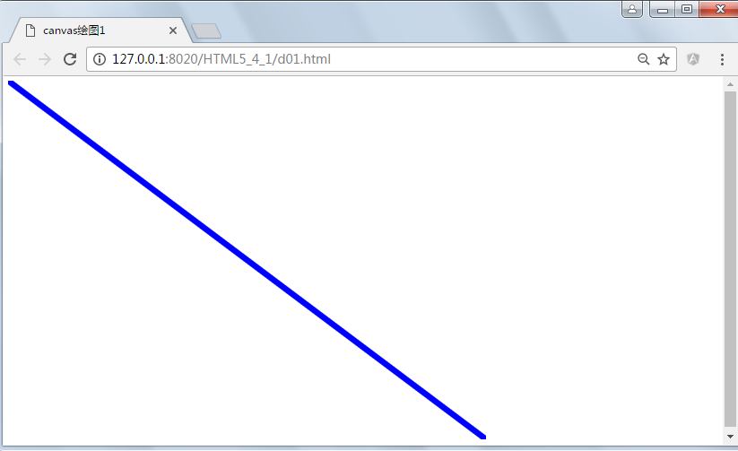
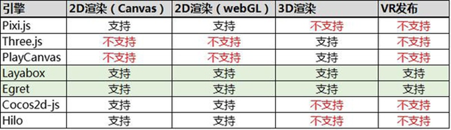

## canvas
canvas是HTML5中新增的一个HTML5标签与操作canvas的javascript API，它可以实现在网页中完成动态2D和3D图像技术。<span style="color: red">**canvas标记和SVG以及VML之间一个重要的不同是，canvas有一个基于Jvascript绘制的API，而SVG和VML使用XML文档来描述绘图**</span>。SVG绘图很容易编辑与生产，但是功能明显弱一些。

canvas可以完成动画、游戏、图表、图像处理等原来需要flash完成的一些功能

浏览器支持情况如下:


### 1.1创建canvas元素
&lt;canvas id="can" width="800" height="600"&gt;不支持Canvas&lt;/canvas&gt;

以上代码创建了一个宽度为800像素，高度为600像素的canvas。不建议使用css样式指定宽度和高度。

canvas标签中间的内容为替代显示内容，当浏览器不支持canvas标签时会显示出来

创建canvas元素后，要在canvas元素上面绘制图像，首先必须获取canvas环境上下文：

<span style="color: blue">canvas.getContext(画布上绘制的类型)</span>
- <span style="color: blue">2d 表示2维</span>
- <span style="color: blue">experimental-webgl:表示实验版3维</span>
- <span style="color: blue">webgl:表示3维</span>

hello world示例
```html
<html>
    <head>
        <meta charset="UTF-8">
        <title>canvas绘图1</title>
    </head>
    <body>
        <canvas id="canvas1" width="800" height="600"></canvas>
        <script type="text/javascript">
            // 获得画布元素
            var canvas1 = document.getElementById("canvas1");
            // 获得2维绘图的上下文
            var ctx = canvas1.getContext('webgl');
            // 设置线宽
            ctx.lineWidth = 10;
            // 设置线的颜色
            ctx.strokeStyle = 'blue';

            // 将画笔移动到00点
            ctx.moveTo(0, 0);
            // 画线到800， 600的坐标
            ctx.lineTo(800, 600);
            // 执行画线
            ctx.stroke();
        </script>
    </body>
</html>
```


在页面上就显示了一条直线，另存为就是一张背景透明的png图片

<span style="color: red">练习:画一个100x100的正方形在画布正中央</span>

### 1.2 画线
- context.moveTo(x, y); --- 把画笔移动到x,y坐标，建立新的子路径

- context.lineTo(x, y); ---- 建立上一个点到x,y 坐标的直线，如果没有上一个点，则等同于moveTo(x, y),把(x, y)添加到子路径

- context.stroke()---描绘子路径


## WebGl
WebGl(全称Web Graphices Library)是一种3d绘图标准，这种绘图技术标准允许把Javascript和Opengl ES2.0结合在一起，通过增加OpenGL ES2.0的一个Javascript绑定。<span style="color: red">**WebGL可以为HTML5 Canvas提供硬件3d加速渲染，这样web开发人员就可以借助系统显卡来在浏览器里更流畅展示3D场景和模型了，还能创建复杂的导航和数据视觉化**</span>。显然，WebGL技术标准免去了开发网页专用渲染插件的麻烦，可被用于渲染具有复杂3D结构的网站页面，甚至可以用来设计3D网页游戏等等

WebGL完美解决了现有Web技术交互式三维动画的两个问题

1. 它通过HTML脚本本身实现Web交互式三维动画的制作，无需任何浏览器插件支持
2. 它利用底层图形硬件加速进行的图形渲染，是通过统一的、标准的、跨平台的OpenGL接口实现的，

通俗说WebGl中canvas绘制中的3D版本。因为原生Webgl很复杂，我们经常会使用一些三方的库，如three.js等，这些库多数用于HTML5游戏开发


## SVG

SVG可缩放矢量图形(Scalabel Vector Graphice)是基于可扩展标记语言(XML),用于描述二维矢量图形的一种图形格式。SVS是W3C(国际互联网标准组织)在2000年8月指定的一种新的二维矢量图形格式，也是规范中的网络矢量图形标准。SVG严格遵循XML语法，并用文本格式的描述性语言来描述图形内容，因此是一种和图像分辨率无关的矢量图形格式。SVG于2003年1月14号成为W3C推荐标准

特点：
1. 任意收缩
    用户可以任意缩放图像显示，而不会破坏图像的清晰度、细节等
2. 文本独立
    SVG图像中的文字独立于图像，文字保留可编辑和可搜寻的状态。也不会再有字体的限制，用户系统即使没有安装某一字体，也会看到和他们制作时完全相同的画面
3. 较小文件
    总体来讲，SVG文件比那些GIF和JPEG的文件要小的很多，因而下载也很快
4. 超强的显示效果
    SVG图像在屏幕上总是边缘清晰，它的清晰度适合任何屏幕分辨率和打印分辨率
5. 超强颜色控制
    SVG图像提供了一个1600万种颜色调色板，支持ICC颜色描述文件标准、RGB、线X填充、渐变和蒙版
6. 交互X和智能化
    SVG面临的主要问题一个是如何和已经占有重要市场份额的矢量图形格式Flash竞争问题，另一个问题是SVG的本地运行环境下的厂家支持成都

浏览器支持：

Internet Explorer9，火狐，谷歌Chrome，Opera和Safari都支持SVG。

IE8和早期版本都需要一个插件 - 如Adobe SVG浏览器，这是免费提供的。

## 资料
[canvas绘图、Webgl、SVG](https://www.cnblogs.com/best/p/6107565.html#top)

[三种图表技术SVG、Canvas、WebGL 3D比较](https://www.cnblogs.com/liutianzeng/p/11322009.html)