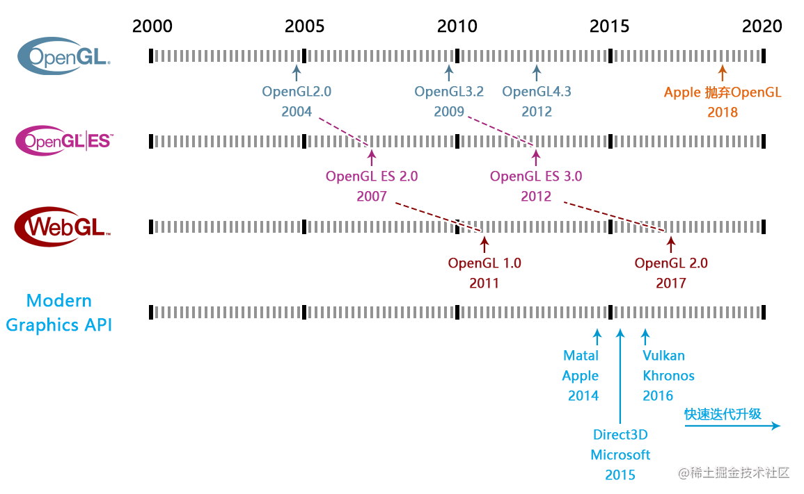
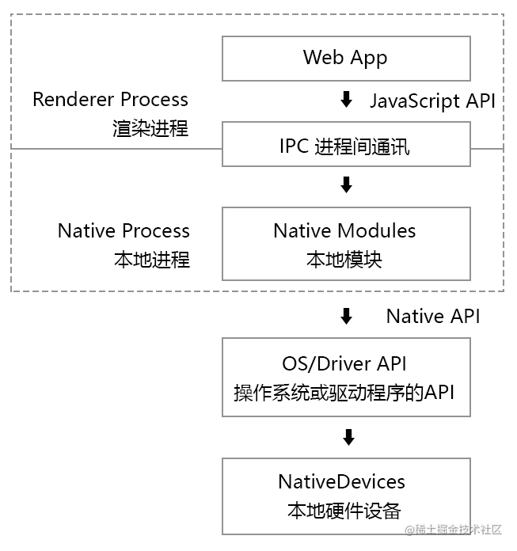
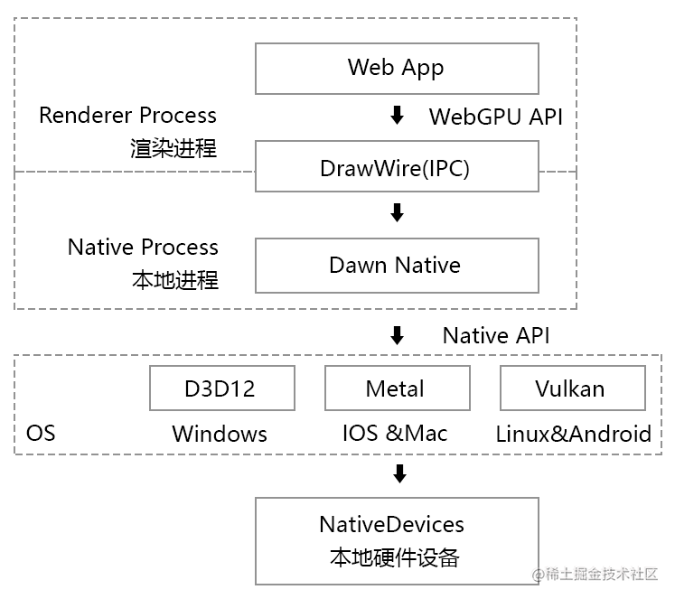
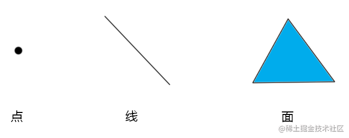
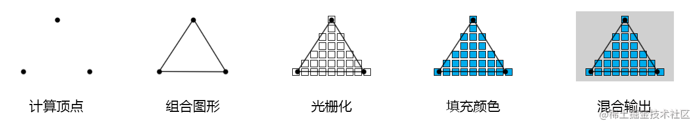
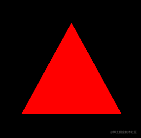

## 为什么是WebGPU而不是webGL 3.0
你若往Web图形技术的底层去探究，一定能追溯到上个世纪90年代提出的openGL技术，也一定能看到，<span style="color: red">WebGL就是基于OpenGL ES做出来的这些信息</span>。OpenGL 在那个显卡羸弱的年代发挥了它应有的价值。

### 显卡驱动
我们都知道现在的显卡都要安装显卡驱动程序，<span style="color: red">通过显卡驱动程序暴露的API，我们就可以操作GPU完成图形处理器的操作</span>

问题是，显卡区域和普通编程界的汇编一样，底层，不好写，于是各大厂就做了封装--码界的基操

### 图形API的简单年表
<span style="color: red">OpenGL 就是干这个的，负责上层接口封装并与下层显卡驱动打交道，但是，众所周知，它的设计风格已经跟不上现代 GPU 的特性了。</span>

Microsoft 为此做出来最新的图形API 是 Direct3D 12，Apple 为此做出来最新的图形API 是 Metal，有一个著名的组织则做出来 Vulkan，这个组织名叫 Khronos。D3D12 现在在发光发热的地方是 Windows 和 PlayStation，Metal 则是 Mac 和 iPhone，Vulkan 你可能在安卓手机评测上见得多。这三个图形 API 被称作三大现代图形API，与现代显卡（无论是PC还是移动设备）的联系很密切。

### WebGl 能运行在各个浏览器的原因
噢，忘了一提，OpenGL 在 2006 年把丢给了 Khronos 管，现在各个操作系统基本都没怎么装这个很老的图形驱动了。

那问题来了，基于 OpenGL ES 的 WebGL 为什么能跑在各个操作系统的浏览器？

因为 WebGL 再往下已经可以不是 OpenGL ES 了，在 Windows 上现在是通过 D3D 转译到显卡驱动的，在 macOS 则是 Metal，只不过时间越接近现在，这种非亲儿子式的实现就越发困难。

苹果的 Safari 浏览器最近几年才珊珊支持 WebGL 2.0，而且已经放弃了 OpenGL ES 中 GPGPU 的特性了，或许看不到 WebGL 2.0 的 GPGPU 在 Safari 上实现了，果子哥现在正忙着 Metal 和更伟大的 M 系列自研芯片呢。

## WebGPU 的名称由来
所以，综上所述，下一代的 Web 图形接口不叫 WebGL 3.0 的原因，你清楚了吗？已经不是 GL 一脉的了，为了使现代巨头在名称上不打架，所以采用了更贴近硬件名称的 WebGPU，WebGPU 从根源上和 WebGL 就不是一个时代的，无论是编码风格还是性能表现上。

题外话，OpenGL 并不是没有学习的价值，反而它还会存在一段时间，WebGL 也一样。

## WebGPU简介
### WebGPU是什么


<span style="color: red">WebGPU就是在web上用Javascript控制CPU计算和绘制的标准</span>

WebGPU是w3c组织定义的新一代图形API，其定位就是全平台支持。

WebGPU可以对接不同设备上的现代图形学API,如Direct3D、Vulkan、Matal

相较于上一代图形API-WebGl,WebGPU更强、更快、更灵活、更现代

### WebGL发展史


我们所熟知的WebGL1.0是在2011年定制的,是OpenGl ES2.0在web上实现，而OpenGL ES 2.0 又是OpenGL 2.0 在移动端的具体实现。所以，WebGL1.0 对标的是OpenGL 在2004 年的标准。

同样的原理，虽然经过几年的发展，WebGL2.0 出现了，但它对标的实际是OpenGL 在2010 年的标准。

由此可见，WebGL 是在使用一个十几年前的框架体系。而OpenGL 这个标准本身就非常古老了，已经有将近30年的历史。

<span style="color: red">这也就导致了WebGL 即无法满足现代GPU 设备的框架体系，也无法满足现代高性能计算和渲染需求。</span>

因此，在2015年左右，Apple、Microsoft、Khronos分别退出了基于全新GPU框架的Matelasse、Direct3D和Vulkan,这3个API被大家统称为现代图形学API。

现在，Matelasse、Direct3D和Vulkan这3个API 被大家统称为现代图形学API。

<span style="color: blue">WebGPU 在设计新的Web 端图形学标准的时候，便是参考了这3个现代图形学API，抛弃了OpenGL。</span>

### WebGPU 在主流浏览器上的支持状况
截止到现在2022年5月：
- Chrome，建立了Dawn 开源项目， 使用C++ 让Chrome 从v94开始，对WebGPU 进行适配，仅支持桌面端。
- FireFox，建立gfx-rs 开源项目，对WebGPU 进行适配，在Nightly Build 版本里支持桌面端和Android 客户端。
- Safari，在Safari的内核WebKit 中对WebGPU 进行适配，在Technology Preview 版本里支持IOS和Mac端。
- Edge和国产浏览器，因为使用了谷歌的Chromium 内核，没有独立开发WebGPU的打算，大概率会选择在WebGPU 正式版本公布后，直接用Dawn 适配WebGPU。

### JavaScript是如何操作本地设备的



现代浏览器中的web页面会被独立分配到一个独立的渲染进程中，处于一个相对独立的沙盒环境。

**Web 页面本身是没有能力和权利去调动硬件底层的API的。**

<span style="color: red">我们只能通过一系列被规范定义的JavaScript API跟浏览器进行沟通，让浏览器会通过进程间的通讯，也就是Inter-Process Communication(IPC)将js的命令传递给一个独立进程的Native Module</span>

<span style="color: red">Native Module会通过真正的Native API操作系统或者设备的API，比如读取GPS、蓝牙、网络、文件等，操作的加过会通过IPC返回给Javascript进程</span>

<span style="color: red">像这种Web端向Native端发起请求并获取结果的IO操作一般都是异步的，大量的异步操作便是WebGPU的特点之一。</span>

<span style="color: red">在这里我们要知道，真正的图形操作都是在Native 进程中进行的，而Web端只负责向Native 端发起命令，接收结果。</span>

因此，js 进程就没有必要同步的等待Native进程的结束，它可以发送完请求后，先去做点别的，等接收到了结果，再考虑下一步怎么走。

一般浏览器的内核对这种异步操作都会做大量优化，我们可以充分的利用各个线程间的CPU 资源，比如主线程和渲染线程。

### WebGPU 在Chrome中的工作原理



我们之前说过，Chrome对WebGPU 的适配工作，是由Chrome负责的。

<span style="color: red">当我们要在Javascript中使用WebGPPU API时，就要在Dawn进程中调用Dawn模块，然后通过Dawn调用操作系统底层的GPU API，比如Windows 的D3D12，IOS和Mac 的Metal，Linux和Android的Vulkan。</span>

<span style="color: red">WebGPU的API大部分是支持异步的，这类似于js对于本地硬件的IO 操作。</span>

<span style="color: red">WebGPU在绘制和渲染图形的时候，有些API是有返回结果的，比如对GPU的请求；也有些是没有返回结果的，比如渲染命令</span>

<span style="color: red">高性能的GPU在绘图的时候，都有上万个渲染管道并行的，其每一帧的渲染结果若是都返回给js,会很耗内存，所以我们直接将其渲染到画布上，而不做存储。</span>

<span style="color: red">WebGPU在设计的时候，更多的是参考了Metal的API，**采用了一个叫commandEncode的设计概念，它允许用户在js中提前写好绘制命令，然后通过Dawn提交到GPU中运行**</span>

### WebGPU 工作流程
1. 初始化WebGPU
    - 获取GPU实例
    - -配置WebGPU 的上下文对象
2. 创建GPU渲染管线
    - 编写shader程序,然后放入渲染管线中
    - 对渲染管线进行初始配置
3. 编写绘制命令，并提交给GPU
    - 建立指令编码器
    - 通过指令编码器简历渲染通道
    - 将渲染管线放入渲染通道
    - 将指令编码器中的绘图指令提交给GPU

### WebGPU 中的图形结构
WebGPU中的图形结构和着色原理跟WebGL是差不多的，或者说现代图形学API中的图形结构和着色器都是差不多的

WebGPU中的图形结构有点、线、三角面三种，根据绘图逻辑不同，线和面还可以细分，这个我们会在后面的课程里详解



### WebGPU 的着色原理
<span style="color: red">WebGPU 的着色原理和WebGL一样，它依旧还是一个光栅引擎，通过顶点着色器定型，然后使用片元着色器逐片着色。</span>

其基本着色流程如下



接下来我们在代码中演示一下这个流程

## WebGPU项目搭建
### WebGPU开发准备
- 浏览器: [Google Chrome Canary](https://www.google.com/intl/zh-CN/chrome/canary/)

- 编辑器: VSCode

- 代码构建工具：Vite

- 开发语言
    - Javascript
    - HTML/css
    - TypeScript
    - WGSL

- 系统环境
    - node.js
    - npm
    - git

### WebGPU 开发模板
1. 我们可以直接从git中下载WebGPU开发模板

    ```js
    # Clone the repo
    git clone https://github.com/buglas/webgpu-lesson.git
    ```
2. 进入项目模板，安装依赖，运行项目

    ```js
    # Go inside the folder
    cd webgpu-lesson

    # Start installing dependencies
    npm install #or yarn

    # Run project at localhost:3000
    npm run dev #or yarn run dev
    ```
3. 在readme.md文件中可以了解项目结构

    ```md
    ├─ 📂 node_modules/ # Dependencies
    │ ├─ 📁 @webgpu # WebGPU types for TS
    │ └─ 📁 ... # Other dependencies (TypeScript, Vite, etc.)
    ├─ 📂 src/ # Source files
    │ ├─ 📁 shaders # Folder for shader files
    │ └─ 📄 *.ts # TS files for each demo
    ├─ 📂 samples/ # Sample html
    │ └─ 📄 *.html # HTML entry for each demo
    ├─ 📄 .gitignore # Ignore certain files in git repo
    ├─ 📄 index.html # Entry page
    ├─ 📄 LICENSE # MIT
    ├─ 📄 logo.png # Orillusion logo image
    ├─ 📄 package.json # Node package file
    ├─ 📄 tsconfig.json # TS configuration file
    ├─ 📄 vite.config.js # vite configuration file
    └─ 📄 readme.md # Read Me!
    ```
    简单说一下这个项目中比较重要的几个文件
    - src中包含了ts源码和wgsl着色文件
    - samples包含了所有的HTML文件，这些HTML文件会作为入口引用文件，其中会引入ts
    - package.json中表明项目的基础信息和依赖文件
    ```js
    {
        "name": "webgpu-lesson",
        "version": "0.1.0",
        "description": "webgpu-lesson",
        "scripts": {
            "dev": "vite",
            "build": "tsc && vite build",
            "preview": "vite preview"
        },
        "devDependencies": {
            "@webgpu/types": "^0.1.15",
            "typescript": "^4.5.4",
            "vite": "^2.8.0"
        },
        "dependencies": {
            "gl-matrix": "^3.4.3"
        }
    }
    ```
    在devDependencies中@webgpu/types便是WebGPU在TypeScript中的官方定义包

    - tsconfig.json是ts配置文件，在types中需要引入vite和WebGPU的定义包
    ```js
    {
        "compilerOptions": {
            "target": "ESNext",
            "useDefineForClassFields": true,
            "module": "ESNext",
            "lib": ["ESNext", "DOM"],
            "moduleResolution": "Node",
            "strict": true,
            "sourceMap": true,
            "resolveJsonModule": true,
            "esModuleInterop": true,
            "noEmit": true,
            "noUnusedLocals": true,
            "noUnusedParameters": true,
            "noImplicitReturns": true,
            "types": ["vite/client", "@webgpu/types"]
        },
        "include": ["src"]
    }
    ```
### 绘制三角形


1. 建顶点着色器程序

    ```js
    // src/shaders/triangle.vert.wgsl
    @vertex
    fn main(@builtin(vertex_index) VertexIndex : u32) -> @builtin(position) vec4<f32> {
        var pos = array<vec2<f32>, 3>(
            vec2<f32>(0.0, 0.5),
            vec2<f32>(-0.5, -0.5),
            vec2<f32>(0.5, -0.5)
        );
        return vec4<f32>(pos[VertexIndex], 0.0, 1.0);
    }
    ```
    对于着色程序，我们后面会详说，这里我们先知道，顶点着色器中建立了3个顶点，由这3个顶点可以连成一个三角形
2. 建立片元着色程序

    ```js
    // src/shaders/red.frag.wgsl
    @fragment
    fn main() -> @location(0) vec4<f32> {
        return vec4<f32>(1.0, 0.0, 0.0, 1.0);
    }
    ```
    上面定义了一个红色的片元颜色，稍后便会将此颜色填充到由顶点着色器定义好的图形中

3. 建立一个ts文件，引入上面的着色程序

    ```js
    // src/triangle.ts
    import triangle from "./shaders/triangle.vert.wgsl?raw"
    import redFrag from "./shaders/red.frag.wgsl?raw"
    ```
4. 建立HTML入口文件，引入上am的ts文件

    ```html
    <!-- examples/triangle.html -->
    <!DOCTYPE html>
    <html lang="en">
    <head>
        <meta charset="UTF-8" />
        <meta name="viewport" content="width=device-width, initial-scale=1.0" />
        <title>Orillusion | Basic Triangle</title>
        <style>
            html,
            body {
                margin: 0;
                width: 100%;
                height: 100%;
                background: #000;
                color: #fff;
                display: flex;
                text-align: center;
                flex-direction: column;
                justify-content: center;
            }
            p{
                font-size: 14px;
                margin:0
            }
            canvas {
            width: 100%;
            height: 100%; 
            }
        </style>
    </head>
    <body>
        <canvas></canvas>
        <script type="module" src="/src/triangle.ts"></script>
    </body>
    </html>
    ```
    接下来在triangle.ts中庸WebGPU绘图
5. 初始化webgpu

    ```js
    async function initWebGPU(canvas: HTMLCanvasElement) {
        // 判断当前设备是否支持WebGPU
        if(!navigator.gpu) throw new Error('Not Support WebGPU');
        // 请求Adapter对象，GPU在浏览器中的抽象代码
        const adapter = await navigator.gpu.requestAdapter({
            /* 电源偏好
                high-performance 高性能电源管理
                low-power 节能电源管理模式 
            */
            powerPreference: "high-performance",
        })
        if(!adapter) throw new Error('No adapter found')
        // 请求GPU设备
        const device = await adapter.requestDevice();
        //获取WebGPU上下文对象
        const context = canvas.getContext("webgpu") as GPUCanvasContext
        //获取浏览器默认的颜色格式
        const format = navigator.gpu.getPreferredCanvasFormat()
        //设备分辨率
        const devicePixelRatio = window.devicePixelRatio || 1
        //canvas尺寸
        const size = {
            width: canvas.clientWidth * devicePixelRatio,
            height: canvas.clientHeight * devicePixelRatio,
        }
        canvas.width = size.width
        canvas.height =size.height
        //配置WebGPU
        context.configure({
            device,
            format,
            // Alpha合成模式，opaque为不透明
            alphaMode: "opaque",
        })

        return { device, context, format, size }
    }
    ```
6. 创建渲染管线

    ```js
    async function initPipeline(
        device: GPUDevice,
        format: GPUTextureFormat,
    ): Promise<GPURenderPipeline> {
        const descriptor: GPURenderPipelineDescriptor = {
            // 顶点着色器
            vertex: {
                // 着色程序
                module: device.createShaderModule({
                    code: triangle,
                }),
                // 主函数
                entryPoint: "main",
            },
            // 片元着色器
            fragment: {
                // 着色程序
                module: device.createShaderModule({
                    code: redFrag,
                }),
                // 主函数
                entryPoint: "main",
                // 渲染目标
                targets: [
                    {
                        // 颜色格式
                        format: format,
                    },
                ],
            },
            // 初始配置
            primitive: {
                //绘制独立三角形
                topology: "triangle-list",
            },
            // 渲染管线的布局
            layout: "auto",
        }
        // 返回异步管线
        return await device.createRenderPipelineAsync(descriptor)
    }
    ```
7. 编写绘图指令，并提交给GPU

    ```js
    function draw(
        device: GPUDevice,
        context: GPUCanvasContext,
        pipeline: GPURenderPipeline
    ) {
        // 创建指令编码器
        const commandEncoder = device.createCommandEncoder()
        // GPU纹理视图
        const view = context.getCurrentTexture().createView()
        // 渲染通道配置数据
        const renderPassDescriptor: GPURenderPassDescriptor = {
            // 颜色附件
            colorAttachments: [
                {
                    view: view,
                    // 绘图前是否清空view，建议清空clear
                    loadOp: "clear", // clear/load
                    // 清理画布的颜色
                    clearValue: { r: 0, g: 0, b: 0, a: 1.0 },
                    //绘制完成后，是否保留颜色信息
                    storeOp: "store", // store/discard
                },
            ],
        }
        // 建立渲染通道，类似图层
        const passEncoder = commandEncoder.beginRenderPass(renderPassDescriptor)
        // 传入渲染管线
        passEncoder.setPipeline(pipeline)
        // 绘图，3 个顶点
        passEncoder.draw(3)
        // 结束编码
        passEncoder.end()
        // 结束指令编写,并返回GPU指令缓冲区
        const gpuCommandBuffer = commandEncoder.finish()
        // 向GPU提交绘图指令，所有指令将在提交后执行
        device.queue.submit([gpuCommandBuffer])
    }
    ```
8. 使用WebGPU绘图

    ```js
    async function run() {
        const canvas = document.querySelector('canvas');
        if(!canvas) throw new Error('No Canvas');
        // 初始化WebGPU
        const { device, context, format } = await initWebGPU(canvas);
        // 渲染管道
        const pipeline = await initPipeline(device, format);
        // 绘图
        draw(device, context, pipeline)

        // 自适应窗口尺寸
        window.addEventListener('resize', () => {
            canvas.width = canvas.clientWidth * devicePixelRatio;
            canvas.height = canvas.clientHeight * devicePixelRatio;;
            context.configure({
                device, 
                format,
                alphaMode: 'opaque',
            })
            draw(device, context, pipeline)
        })
    }
    ```

## 资料
[WebGPU零基础入门](https://juejin.cn/post/7099476019010076686#heading-6)


[WebGPU 会取代 WebGL 吗？](https://www.imgeek.org/article/825360280)

[WebGL 与 WebGPU 比对[1] 前奏 ](https://www.cnblogs.com/onsummer/p/webgl-vs-webgpu-history.html)

[WebGPU 导入[1] - 入门常见问题与个人分享 ](https://www.cnblogs.com/onsummer/p/16541872.html)