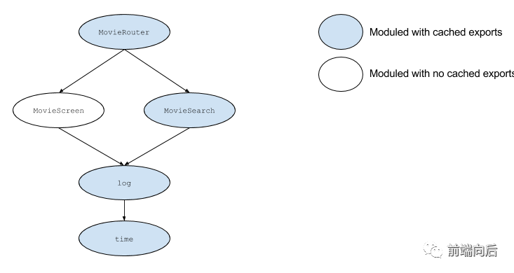

## 自动刷新

监听到文件更新后的下一步就是刷新浏览器，webpack模块负责监听文件，webpack-dev-server模块则负责刷新浏览器。在使用webpack-dev-server模块去负责启动webpack模块时，webpack模块的监听默认会开启，webpack模块会在文件发生变化时通知webpack-dev-server模块

### 自动刷新原理
1. 借助浏览器扩展去通过浏览器提供的接口刷新，WebStorm IDE的LiveEdit功能就是这样实现了
2. 向要开发的网页中注入代理客户端代码，通过代理客户端去刷新整个页面。
3. 将要开发的网页装进一个iframe钟，通过刷新iframe去看到最新效果

DevServer支持第二种、第三种方法，第二种是DevServer默认采用的刷新方法

## HMR
**原理是在一个源码发生变化时，只需要重新编译发生变化的模块，再用新输出的模块替换掉浏览器中对应的老模块**

Hot Module Replacement(HMR)特性最早由webpack提供，能够对运行时的Javascript模块进行热更新(无需刷新，即可替换，新增、删除模块)

与整个重刷相比，模块热更新的最大意义在于能够保留应用程序的当前运行时状态，让更加高效的Hot Reloading开发模式成为了可能

P.S.后来其它构建工具也实现了类似的机制，例如Browserify、甚至React Native Packager

可是，编辑源码产生的文件变化在编译时，替换模块实现在运行时，二者是怎样联系起来的呢？

### 基本原理


监听到文件变化后，通知构建工具(HMR plugin),将发生变化的文件(模块)发送给泡在应用程序里的运行时框架(HMR Runtime),由运行时框架把这些模块塞进模块系统(新增、删除或替换现有模块)

其中HMR Runtime是构建工具在编译时注入的，通过统一的模块ID将编译时的文件与运行时的模块对应起来，并暴露一系列API供应用层框架(如React、Vue)对接等

## HMR API
最常用的是accept
- module.hot.accept(dependencies, callback):监听指定依赖模块的更新
例如
```javascript
import printMe from './print.js';

if (module.hot) {
  module.hot.accept('./print.js', function() {
    console.log(`Accepting the updated printMe module!`);
    prontMe();
  })
}
```
触发accept(回调)时，表示新模块已经塞进模块系统了，在此之后访问到的都是新模块实例

然而，实际场景中模块间一般存在多级依赖，替换一个模块会影响(直接或间接)依赖到它它的所有模块


那岂不是要在所有模块中都添加一段类似的更新处理逻辑？

通常不需要，因为模块更新事件有冒泡机制，未经accept处理的更新事件会沿依赖链反向传递，只需要在一些重要的节点(比如Router组件)上集中处理即可

除accept外，还提供了
- module.hot.decline(dependencies):将依赖项标记为不可更新(期望整个重刷)
- module.hot.despose/addDisposeHandler(data => {}): 当前模块被替换时触发，用来清理资源或(通过data参数)传递状态给新模块
- module.hot.invalidate():让当前模块失效，用来强制更新当前模块
- module.hot.removeDisposeHandler(callback):取消监听模块替换事件

P.S.关于 webpack HMR API 的具体信息，见Hot Module Replacement API

## HMR Runtime
从应用程序的角度来看，模块替换过程如下
1. 应用程序要求HMR Runtime检查更新
2. HMR Runtime异步下载更新并通知应用程序
3. 应用程序要求HMR Runtime应用这些更新
4. HMR Runtime同步应用更新

接到(构建工具发来的)模块更新通知后，HMR Runtime向Webpack Dev Server查询更新清单(manifest)，接下来下载每一个更新模块，然后新模块下载完成后，准备就绪，进入应用阶段

将更新清单中的所有模块都标记为失效，对于每一个被标记为失效的模块，如果在当前模块没有发现accept事件处理，就向上冒泡，将其父模块也标记失效，一直冒到应用入口模块

之后所有失效模块被释放（dispose），并从模块系统中卸载掉，最后更新模块 hash 并调用所有相关accept事件处理函数

## 资料
[译文搞定webpack HMR原理](https://blog.csdn.net/ayqy_jiajie/article/details/106654777)

[wbepack的HMR原理分析](https://www.jianshu.com/p/ff6450532e61)