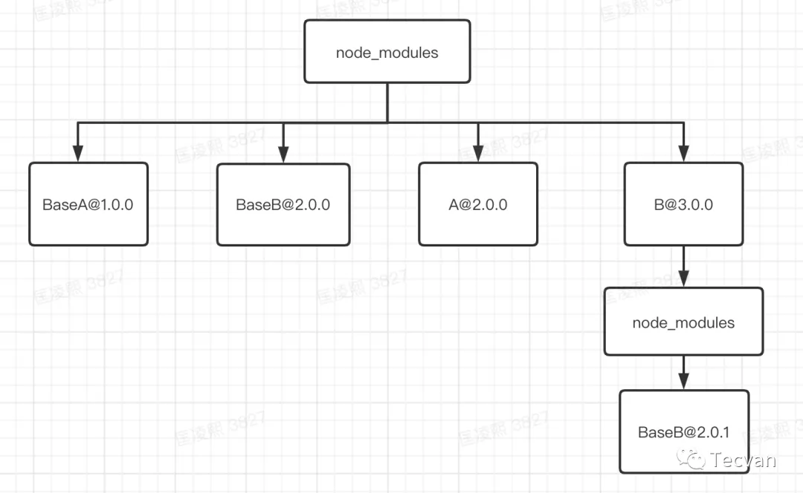
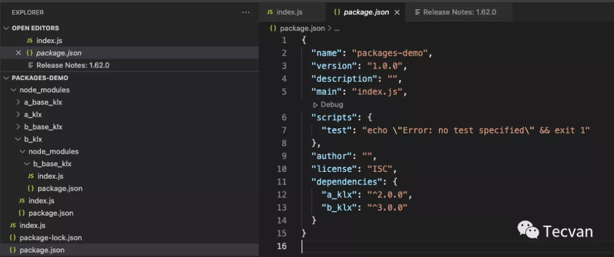
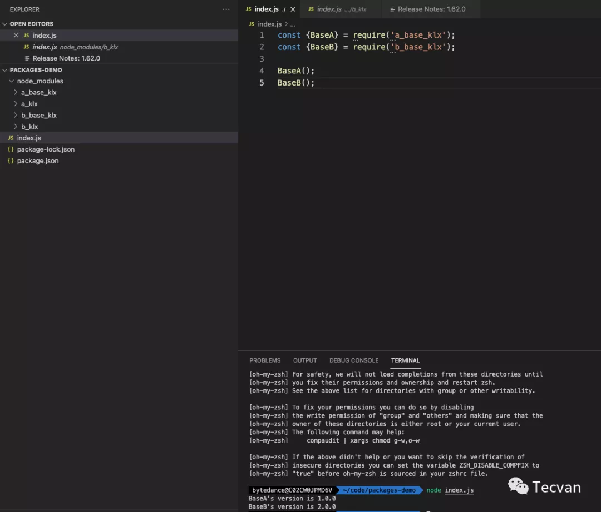

我们在项目开发的过程中会引用到各种不同的库，各种库又依赖了其他不同的库，这些依赖应该如何进行管理，今天这篇文章主要聊这个事情

## npm2的依赖管理
npm2安装依赖的时候比较简单直接，直接按照包依赖的树形结构下载填充本地目录结构。

比如在项目中A和C都依赖B，无论被依赖的B是否是同一个版本，都会直接无脑的生成对应的树结构，比如现在我们有下面的依赖
- A@2.0.0：BaseA@1.0.0 BaseB@2.0.0
- B@3.0.0：BaseA@1.0.0 BaseB@2.0.1
那么npm i之后node_modules里面生成的内容将是下面这样的

这样的结构非常直观，但是有一个问题就是，如果项目的依赖过多的话，可能导致下面这些问题

1. 生成的依赖嵌套非常深
2. 相同版本的依赖大量冗余

## npm3 / yarn的依赖管理
npm3对于npm的情况进行了优化，那么如何进行优化呢？其实我们最直观的思路就是将树打平，将依赖扁平化，不就能解决嵌套过深和依赖冗余的问题。所以在上面的例子中，如果我们用npm3来进行install，最后生成的node_modules是这样的结构

这样看起来是不是好多了，但是此时会有什么问题呢？我们是曹一下试试看。在项目中安装A和B

可以看到我们项目本身的依赖文件里面只有a_klx和b_klx,但是执行完npm i命令后发现多了几个我们没有引入的包a_base_klx和b_base_klx。

其实这是由a_klx和b_klx本身自己的引入的npm包，但是却出现了我们的node_modules下。那么如果我们直接使用这两个会有什么反应呢？

可以看到，我们是可以正常使用这两个我们并未声明在依赖中的npm包的，因为这两个包存在于我们项目的

## 资料
[剖析 npm、yarn 与 pnpm 依赖管理逻辑](https://mp.weixin.qq.com/s/KyNYaKhqCxz8ZCFTmz57KA)

[为什么现在我更推荐 pnpm 而不是 npm/yarn?](https://jishuin.proginn.com/p/763bfbd3bcff)