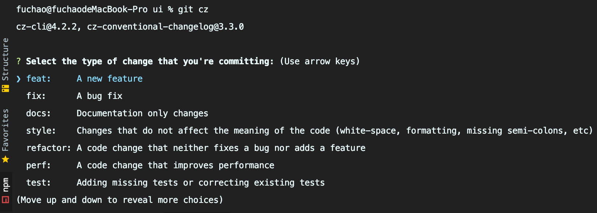

:::tip
ESLint + Prettier + CommitLint + husky + lint-staged
:::

## 终极目标
团队中的所有开发人员用一套代码格式规范，并且无需在话费其他精力趣味了格式而格式。让工具自动帮助我们检测代码是否规范，并按照我们指定的规范去执行格式化。

## 方案背景
由于此次统一化的规范检查配置是中期加入进项目，如果执行全局代码检查，肯定会暴露很多规范问题，处理成本也会变大，所以奔着代码检查最小影响的原则，我们理想处理方案是，对每次开发人员提交的改动文件进行lint检查

## 准备工作
目前相关的lint配置文件都已集中化管理维护，公共配置文件包放在工具箱项目quick下，我们在安装配置前需要完成一下操作

### 配置工具箱@quick源
```shell
# yarn 安装
> yarn config set @quick:registry https://registry.npm.***.cn/

# npm 命令安装
> npm config set @quick:registry https://registry.npm.***.cn/
```

### 添加工具箱@quick包别名
此处以vue-cli搭建的项目配置为例
```js
// 修改根目录下配置文件 vue.config.js

// 此处无关代码省略

module.exports = {
    chainWepack:config => {
        config
            .resolve
            .alias
            .set('@/quick', path.join(__dirname, 'node_module/@quick')) // 添加@quick别名
    }
}
```

## 安装配置
### 依赖包安装
```shell
# 安装ESLint, Prettier, CommitLint公共配置文件包
yarn add @quick/eslint-config @quick/prettier-config @quick/commitlint-config -D

# 安装ESLint, Prettier相关依赖包
yarn add eslint-config-airbnb-base eslint-plugin-import prettier -D

# 安装Prettier相关依赖包
# eslint-config-prettier：关闭所有不必要的可能与Prettier冲突的规则
# eslint-plugin-prettier: 将Prettier作为ESLint规则运行，并将差异报告为单个ESLint问题
yarn add eslint-config-prettier eslint-plugin-prettier -D

# 安装 CommitLint相关依赖包
# cz-conventional-changelog:提交日志规范模板
# @commitlint/cli: 提交日志的校验工具，校验是否符合提交约束
# @commitlint/config-conventional: 校验工具配置
yarn add cz-conventional-changelog @commitlint/cli @commitlint/config-conventional -D

# 全局安装commitizen
# commitizen:Git 日志提交约束工具
yarn global add commitizen
```

### 创建配置文件
新建eslint配置文件.eslintrc.js
```js
// 根目录新建ESLint配置文件 .eslintrc.js
// 注意：如果之前项目中已配置过eslint，建议删除
const eslintConfig = require('@quick/eslint-config')

// 复写eslintConfig 使用vue官方parser去解析项目中的vue文件代码，其余js代码用babel-eslint
eslintConfig.parser = 'vue-eslint-parser'
eslintConfig.parserOptions.parser = 'babel-eslint'

eslintConfig.extends = [...eslintConfig.extends, "plugin:prettier/recommended"]
eslintConfig.rules = {...eslintConfig.rules, "prettier/prettier": "error"}

module.exports = eslintConfig
```

新建prettier配置文件.prettierrc.js
```
// 根目录新建Prettier配置 .prettierrc.js
const prettierConfig = require('@quick/prettier-config')
module.exports = prettierConfig
```

新建comitlint配置文件.commitlintrc.js
```
// 根目录新建CommitLint配置文件 .commitlintrc.js
const commitLintConfig = require('@quick/commitlint-config')
module.exports = commitLintConfig
```

### 安装配置检查辅助工具
#### 安装lint-staged
```
# lint-staged 是git暂存文件上运行linters的工具
> yarn add lint-staged -D
```

#### 修改package.json文件

添加如下代码
```
{
  ...此处无关代码省略

  "script": {

    ...此处无关代码省略,

    "precommit": "lint-staged"
  },

  ...此处无关代码省略

  "lint-staged": {
    "src/**/*.{js,vue,test.{j,t}s?(x)}": [
      "eslint --fix",
      "prettier --write"
    ]
  },

  ...此处无关代码省略

  "config": {
    "commitizen": {
      "path": "node_modules/cz-conventional-changelog"
    }
  }
}
```
以上代码主要作用是：
- 新增一条script命令
- 新增一个检查任务(对匹配路径下的后缀文件进行检查)
- 配置commit提交日志规范模板
> 提示：检查任务内容可根据自身项目需要添加或删除配置

#### 安装husky
```
# husky 是一个GitHook工具
# husky 安装需要注意，老版本安装后不会触发pre-commit hook钩子函数，一下为官方推荐安装方式
# 具体可查看官方文档 https://typicode.github.io/husky/#/?id=install
> npx husky-init && npm install       # npm 安装
> npx husky-init && yarn              # Yarn 1 安装
> yarn dlx husky-init --yarn2 && yarn # Yarn 2 安装
```
安装完项目根目录下回自动新增一个.husky的文件夹，.husky已经帮你在里面创建了一个简单的pre-commit hook脚本，默认内容是提交代码时运行npm test命令。package.json里也会自动新增了一条scirpt命令"prepare":"husky install"命令，这都是husky初始化操作自动生成的，知道就行不用过多理会

**修改.husky/pre-commit文件**
```
#!/bin/sh
. "$(dirname "$0")/_/husky.sh"

# 去除默认命令npm run test, 修改为我们在package.json里定义好的检查命令
Yarn precommit
```

**新建.husky/commit-msg文件**

复制 .husky/pre-commit 文件，同路径下粘贴重命名文件为 commit-msg ，此操作是为了新建 commit hook 函数。
```
#!/bin/sh
. "$(dirname "$0")/_/husky.sh"

# 加入commitlint 检查命令, 对代码commit时提交规范进行检查
yarn commitlint --edit $1
```

若 window 系统下遇到 stdin is not a tty 报错，可在 .husky 下增加 common.sh，内容如下：
```
command_exists () {
  command -v "$1" >/dev/null 2>&1
}

# Workaround for Windows 10, Git Bash and Yarn
if command_exists winpty && test -t 1; then
  exec < /dev/tty
fi
```
并且修改 pre-commit, commit-msg 这两个文件的头部：

```
#!/bin/sh
. "$(dirname "$0")/_/husky.sh"
. "$(dirname "$0")/common.sh"
```

此时 .husky 文件夹下已有两个 hook 函数，分别对提交代码进行规范检查和对提交message 格式进行检查。

## 补充说明
由于每次触发 git commit 会进行 commitlint 检查，所以这里简单说明下必要的提交规范，详细 commit 规范可参考[Commit message 和 Change log 编写指南 - 阮一峰的网络日志](http://www.ruanyifeng.com/blog/2016/01/commit_message_change_log.html)
```
# 日常代码提交格式（注意冒号后面有空格）
git commit -m <type>[optional scope]: <description>
```
type ：用于表明我们这次提交的改动类型，是新增了功能？还是修改了测试代码？又或者是更新了文档？

optional scope ：一个可选的修改范围。用于标识此次提交主要涉及到代码中哪个模块。

description：一句话描述此次提交的主要内容，做到言简意赅。

举个例子
```
git commit -m 'feat: 增加 xxx 功能'
git commit -m 'fix: 修复 xxx 功能'
```
当然，你还可以通过 commit 模板进行提交（强烈推荐使用），用 git cz 命令来代替 git commit 命令，调用出提交模板。（若 window 系统下 git bash 调 git cz 命令可能有问题，可以试试 winpty git cz）
 
以下是执行结果截图：



### validate-commit-msg

正常提交git commit -m 'feat: 增加xxx功能' 增加校验 validate-commit-msg插件

[validate-commit-msg](https://www.npmjs.com/package/validate-commit-msg)


## 问题
有时候husk不好使，需要解决脚本权限问题
```shell
chmod +x .husky/pre-commit
```


## 资料
[husky使用总结](https://zhuanlan.zhihu.com/p/366786798)


[concepts-commit-conventions rules](https://commitlint.js.org/#/concepts-commit-conventions)

[commitlint 从0到1 (git commit 校验工具)---看看](https://juejin.cn/post/6979054290526535717)


https://www.cnblogs.com/bitbw/p/15931436.html