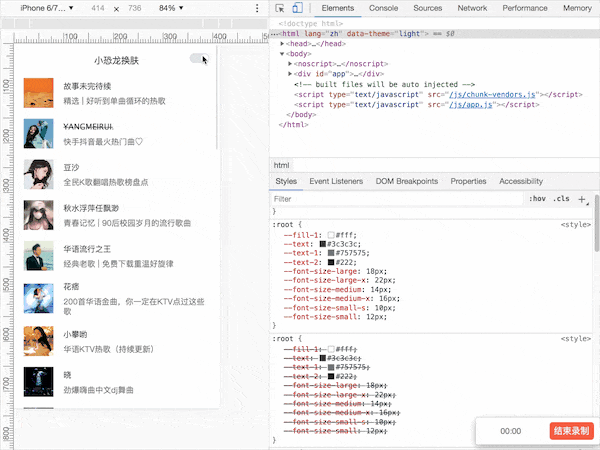
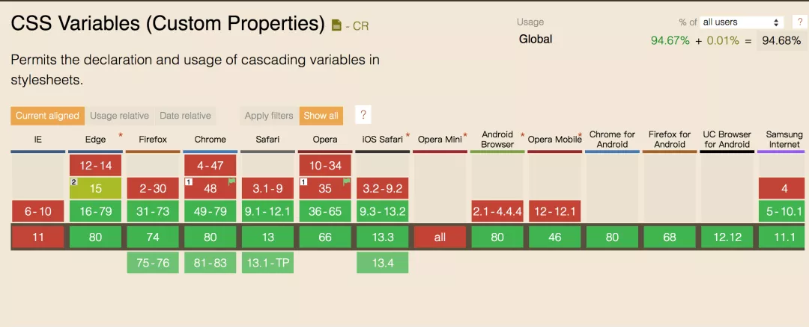
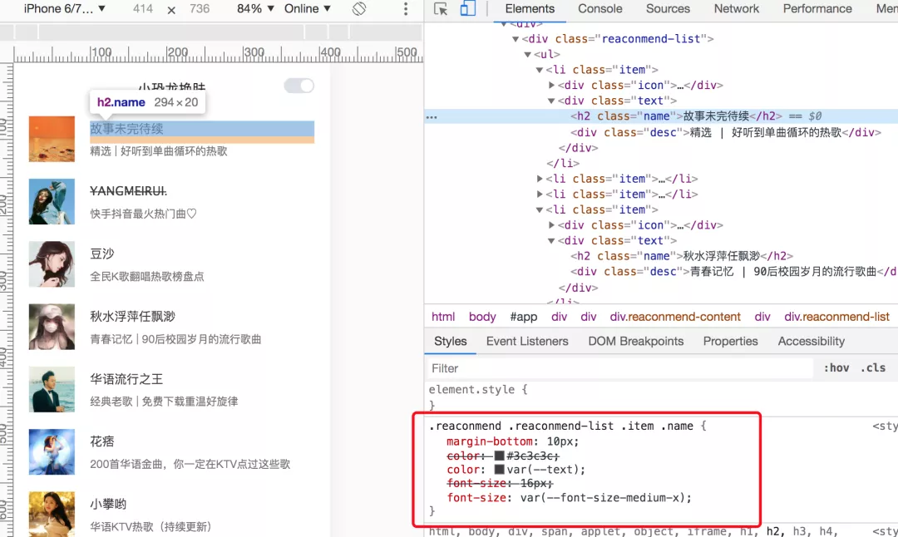
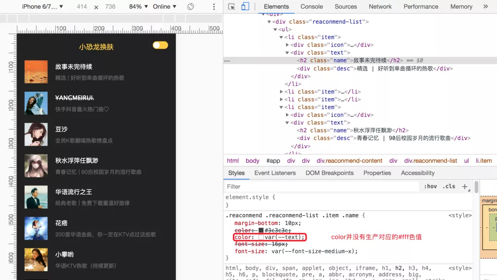
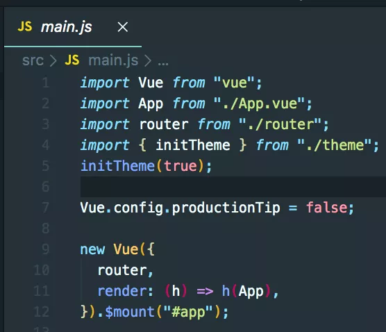
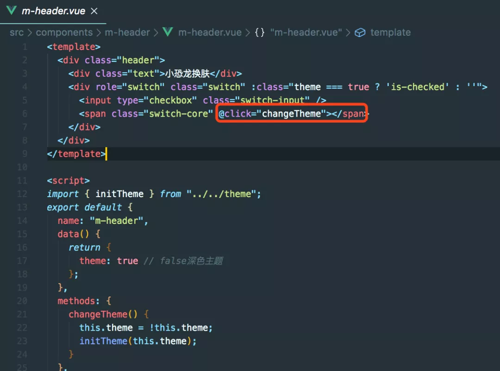
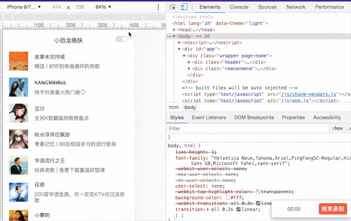
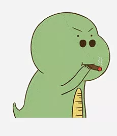

:::tip
最近在做网站换肤的需求，也就是主体切换。那么如何切换主体的颜色呢？以下是网站换肤的实现以及基于换肤拓展的一些方案分享给大家，希望大家在做类似需求的时候能有有参考
:::

## 覆盖样式实现
```less
// light
// light
$color-brand1: #ffcd32;
$fill-1: #fff !default;
$color-text: #3c3c3c;
$color-text-1: #757575;
$color-text-2: #222;

// dark
$dark-fill-1: #222 !default; // 品牌色
$dark-color-text: #fff;
$dark-color-text-1: rgba(255, 255, 255, 0.3);
$dark-color-text-2: $color-brand1;
```
```html
// 页面使用
<style lang="scss">
@import "./assets/scss/index.scss";

[data-theme="dark"] {
  body {
    background: $dark-fill-1;
  }
  .reaconmend .reaconmend-list .item .name {
    color: $dark-color-text;
  }
  .reaconmend .reaconmend-list .item .desc {
    color: $dark-color-text-1;
  }
  .header .text {
    color: $dark-color-text-2;
  }
}
</style>
```
利用css优先级的原理覆盖掉原有样式的实现，每定义一套皮肤就要定义对应的sass变量，以及定义一套覆盖原有样式的皮肤样式。如果多套皮肤的话，覆盖的代码量就会N套。

缺点：样式不易管理，查找样式复杂，开发效率低，拓展性差，维护成本高，多人协作沟通麻烦。
## sass变量实现
```css
// variable.scss  

// 浅色
$colors-light: (
  fill-1: #fff,
  text: #3c3c3c,
  text-1: #757575,
  text-2: #222,
);

// 深色
$colors-dark: (
  fill-1: #222,
  text: #fff,
  text-1: rgba(255, 255, 255, 0.3),
  text-2: #ffcd32,
);

```
```css
// mixin.scss
// 背景色
@mixin bg-color($key) {
  background-color: map-get($colors-light, $key);
  [data-theme="dark"] & {
    background-color: map-get($colors-dark, $key);
  }
}
// text色
@mixin text-color($key) {
  color: map-get($colors-light, $key);
  [data-theme="dark"] & {
    color: map-get($colors-dark, $key);
  }
}
```
```html
// 页面使用

<style lang="scss" rel="stylesheet/scss">
@import "../../../assets/scss/variable.scss";
@import "../../../assets/scss/mixin.scss";
.reaconmend-list {
    .list-title {
      height: 40px;
      line-height: 40 px;
      text-align: center;
        @include text-color(text-1);
    }
}
</style>

```
如上所示用到的知识点包含Sass变量(veriable)，嵌套(nestend)，混合(mixins)，Sass Maps的函数-map-get(map,key)
:::tip
Maps的含义：Maps可视为键值对的集合，键被用于定位值 在css种没有对应的概念。和Lists不同Maps必须被圆括号包围，键值对被都好分割 。Maps中的keys和values可以是sassscript的任何对象。（包括任意的sassscript表达式 arbitrary SassScript expressions） 和Lists一样Maps主要为sassscript函数服务，如 map-get函数用于查找键值，map-merge函数用于map和新加的键值融合，@each命令可添加样式到一个map中的每个键值对。Maps可用于任何Lists可用的地方，在List函数中 Map会被自动转换为List ， 如 (key1: value1, key2: value2)会被List函数转换为 key1 value1, key2 value2 ，反之则不能。(网友Soledad提供)
:::
使用scss变量换肤相比覆盖样式
- 拓展性更强
- 将换肤的逻辑进行了收敛

## 生成多套皮肤css
使用覆盖样式实现与scss变量实现会把很多套皮肤的样式都编译到一个css文件里面，如果有多套皮肤样式，这个文件会非常大。为了解决这个问题,就自然地提出了拆分scss的实现。

实现方案，通过编译工具与构建工具编译处多套皮肤css，通过js动态的link对应的皮肤样式
```js
// js动态处理
var theme = /\bt=((\w+))/.exec(location.search);
theme = theme ? theme[1] : 'light';

changeTheme(theme);

function changeTheme(theme) {
  var head = document.getElementByTagName('head')[0];
  var link = document.createElement('link');
  link.dataset.type = 'theme';
  link.href = 'assets/css/theme-'+ theme+'/page/home/home.css';
  link.rel = 'stylesheet';
  link.type= 'text/css';
  head.appendChild('link')
}
```
## css变量实现
```css
// variable.scss
// 默认变量
:root {
  --fill-1: #fff;
  --text: #3c3c3c;
  -text-1: #757575;
  --text-2: #222;

  --font-size-large: 18px;
  --font-size-large-x: 22px;
  --font-size-medium: 14px;
  --font-size-medium-x: 16px;
  --font-size-small-s: 10px;
  --font-size-small: 12px;
}
// 深色变量
[data-cheme="dark"]{
  --fill-1: #222;
  --text: #fff;
  --text-1: rgba(255, 255, 255, 0.3);
  --text-2: #ffcd32;
}
```
在页面对css变量做引入使用
```css
//页面使用
@import '../../assets/scss/variable.scss';

.header {
  position: relative;
  height: 70px;
  text-align:center;
  font-size: 0;
  .text {
    display: inline-block;
    vertical-algn: top;
    inline-height: 70px;
    font-size: var(--font-size-large);
    color: var(--text-2)
  }
}
```
具体实现效果


:::danger
问题点:css变量会存在兼容性问题
:::
css变量兼容下如下



虽然现在大部分主流浏览器都可以兼容，但是还要考考更多的兼容性这块的请往下看

### css变量兼容性实现-1
:::tip
在css的变量的基础上新增了postcss-custom-properties这个插件，安装依赖:
npm install postcss-custom-properties --save-dev 
npm install postcss-loader --save-dev
:::
在根目录新建postcss.config.js增加，配置如下
```js
const postcssCustompProperties = require("postcss-custom-properties");

module.exports = {
  plugins: [
    postcssCustompProperties({
      importFrom: "src/assets/scss/variable.scss"
    })
  ]
}
```
postcss会将css自定义变量直接编译为确定值，而不是保留。这时就需要postcss插件来为我们保留这些自定义变量，使用postcss-custom-properties效果如下



- 优点:会生成一套与css变量对应的css
- 缺点：在构建时根据css变量生成对应的css，换肤是运行时并不能生成对应的css。
换肤后样式


### css变量兼容性实现-2
首先需要建一个存放公共css变量的js文件，将需要定义的css变量存放到该js文件，例如（variable.js）
```css
// variable.js 
// 字体变量
const baseSize = {
  "--font-size-large-x": "22px",
  "--font-size-large": "18px",
  "--font-size-medium": "14px",
  "--font-size-medium-x": "16px",
  "--font-size-small-s": "10px",
  "--font-size-small": "12px",
};

//浅色
export const lightTheme = {
  "--fill-1": "#fff",
  "--text": "#3c3c3c",
  "--text-1": "#757575",
  "--text-2": "#222",
  ...baseSize,
};

// 深色
export const darkTheme = {
  "--fill-1": "#222",
  "--text": "#fff",
  "--text-1": "rgba(255, 255, 255, 0.3)",
  "--text-2": "#ffcd32",
  ...baseSize,
};
```
页面使用css变量如：
```html
<style lang="scss">
 .text {
    display: inline-block;
    vertical-align: top;
    line-height: 70px;
    font-size: var(--font-size-large);
    color: var(--text-2);
  }
</style>
```
安装css-vars-ponyfill插件
:::danger 
css-vars-ponyfill官方概念：在传统浏览器和现代浏览器中为CSS自定义属性(又名“CSS变量”)提供客户端支持的ponyfill。（具体用法与概念请查阅官方网站：css-vars-ponyfill）
:::
封装切换主体的js，在main做初始化调用
```js
// theme.js
import { lightTheme, darkTheme } from "../src/assets/js/variable";
import cssVars from "css-vars-ponyfill";
export const initTheme = (theme) => {
  document.documentElement.setAttribute("data-theme", theme ? "light" : "dark");
  cssVars({
    watch: true, // 当添加，删除或修改其<link>或<style>元素的禁用或href属性时，ponyfill将自行调用
    variables: theme ? lightTheme : darkTheme, // variables 自定义属性名/值对的集合
    onlyLegacy: false, // false  默认将css变量编译为浏览器识别的css样式  true 当浏览器不支持css变量的时候将css变量编译为识别的css
  });
};
```

在切换主体的按钮组件中调用


总结:css自定义属性+css-vars-ponyfill(解决兼容性)预览效果


## ElementUI实现
官方的实现解释
- 先把默认主题文件中涉及颜色的CSS值替换成个关键词
- 根据用户选择的主题色生成系列对应的颜色值
- 把关键词在换回刚刚生成的响应的颜色值
- 直接在页面上加style标签，把生成的样式填进去
已实现的链接参考：[https://juejin.im/post/5ca41617f265da3092006155#heading-1](https://juejin.im/post/5ca41617f265da3092006155#heading-1)

## Less在线编译实现
根据less可以直接 编译less变量实现的步骤如下：
```css
// variable.less 定义less变量
// 公共字体
@font-size-large-x: 22px;
@font-size-large: 18px;
@font-size-medium: 14px;
@font-size-medium-x: 16px;
@font-size-small-s: 10px;
@font-size-small: 12px;

// 浅色
@fill-1: #fff;
@text: #3c3c3c;
@text-1: #757575;
@text-2: #222;

// 页面使用 例如：
// 下面.text的css 如下，这里的 @font-size-large 和  @text-2就是 less 变量：
.text {
    display: inline-block;
    vertical-align: top;
    line-height: 70px;
    font-size: @font-size-large;
    color: @text-2;
  }

```
当点击换肤按钮的时候，直接去加载 less.js，具体代码如下:
```html
<template>
  <div class="header">
    <div class="text">小恐龙换肤</div>
    <div role="switch" class="switch" :class="theme === true ? 'is-checked' : ''">
      <input type="checkbox" class="switch-input" />
      <span class="switch-core" @click="changeTheme"></span>
    </div>
  </div>
</template>

<script>
import { lightTheme, darkTheme } from "../../assets/js/variable";
export default {
  name: "m-header",
  data() {
    return {
      theme: true
    };
  },
  methods: {
    changeTheme() {
      this.theme = !this.theme;
      // 调用 `less.modifyVars` 方法来改变变量值
      window.less.modifyVars(this.theme ? lightTheme : darkTheme);
    }
  },
  mounted() {}
};
</script>

```
以下...

## 拓展-图片切换
以上的方案---只是对background-color和color进行的换肤，如果要对图片进行换肤该怎么办呐？      


### 图片切换
项目中还存在很多占位图或者其他图片会随着主题的变化而变化。通过引入所有图片，并用文件名来区分不同主题所对应的图片。在点击切换主题时，切换到主题所对应的文件，就能实现图片切换了。
```html
// 页面实现
<template>
  <div class="header">
    <div class="text">小恐龙换肤</div>
    <div role="switch" class="switch" :class="theme === true ? 'is-checked' : ''">
      <input type="checkbox" class="switch-input" />
      <span class="switch-core" @click="changeTheme"></span>
    </div>
  </div>
</template>
<script>
import { initTheme } from "../../theme";
import bus from "../../bus";
export default {
  name: "m-header",
  data() {
    return {
      theme: true, // false深色主题
      avatar: ""
    };
  },
  methods: {
    changeTheme() {
      this.theme = !this.theme;
      initTheme(this.theme);
      this.setThemeValue(this.theme);
      bus.$emit("changeTheme", this.theme);
    },
    setThemeValue(theme) {
      theme = theme ? "light" : "dark";
      this.avatar = require(`@/assets/images/logo-${theme}.jpeg`);
    }
  },
  created() {
    this.setThemeValue(this.theme);
  }
};
</script>
```
在点击切换主题时，会发射一个 changeTheme 事件，各组件接收到 changeTheme 事件，就会为图片重新赋值，也就达到了切换图片的效果。


## 资料
[前端换肤的N种方案](https://mp.weixin.qq.com/s/4W24J-B6wkBaCzbWpK3ppg)