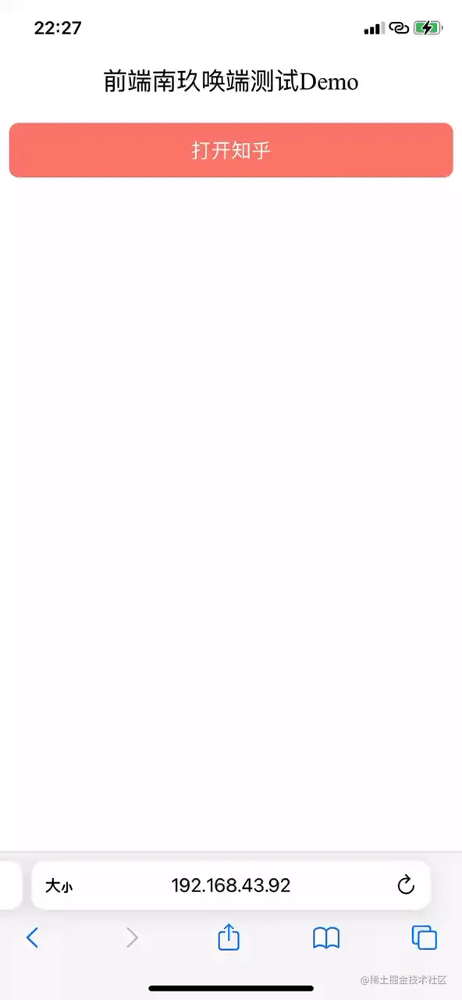
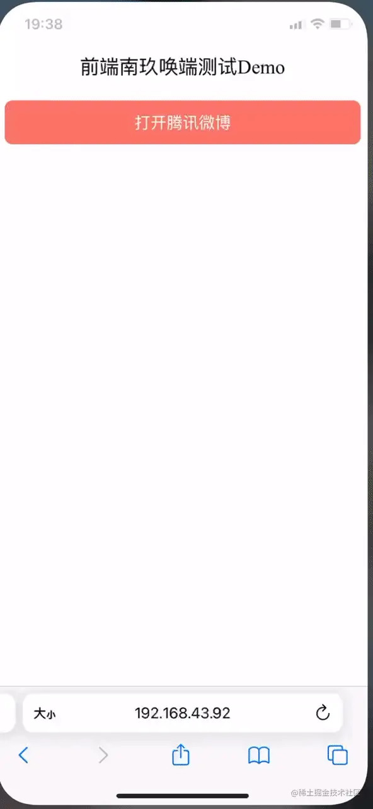
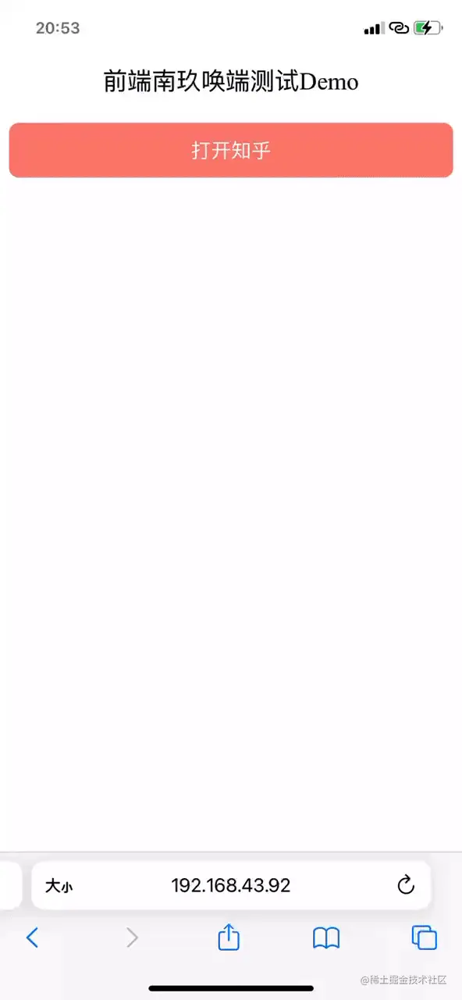

## 前言
写过hybrid的同学，想必都会遇到这样的需求，如果用户安装了自己的APP，就会打开APP或跳转到App内的某个页面，如果没安装则引导用户到对应页面或应用商店下载。这里就涉及到了H5与Native之间的交互，为什么H5能够唤起APP并且跳转到对应页面？

就算你没写过想必也体验过，最常见的就是抖音里面的一些广告，如果你点击了广告，他判断你手机装了对应APP，那他就会去打开那个APP，如果没安装，他会帮你跳转到应用商店去下载，这个还算人性化一点的，有些直接后台给你去下载，你完全无感知。
哈哈，是不是觉得这种技术很神奇，今天我们就一起来看看它是如何实现的～

## 唤端体验
实现之前我们先简单体验一下什么是唤端



从上图中，我们可以看到在浏览器中我们点击打开知乎，系统会提示我们是否在知乎中打开，当我们点击打开时，知乎就被打开了，这就是一个简单的唤端体验。

**有了这项技术我们就可以实现H5唤起APP应用了，现阶段的引流方式大都得益于这种技术，比如广告投放、用户拉新、引流等。**


## 唤端技术
体验过后，我们来聊一聊它的视线技术是怎么样的，唤端技术我们也称之为 deep link技术。当然,不同平台的实现方式有些不同，一般常见的有几种，分别是：

- URL Scheme(通用)
- Universal Link(IOS)
- App Link、Chrome Intents(android)

### URL Scheme(通用)
URL Scheme 是一种通用的技术，各平台的兼容性也很好，它一般由协议名、路径、参数组成。这个一般是由Native开发的同学提供，我们前端同学在拿到这个scheme之后，就可以用来打开APP或APP内的某个页面了

#### URL Scheme组成
> [scheme:][//authority][path][?query][#fragment]

#### 常用APP的URL Scheme
APP | 微信 | 支付宝| 淘宝 | QQ | 知乎
---|---|---|---|---|---
URL Scheme | weixin:// | alipay:// | taobao:// | mqq:// | zhihu://

#### 打开方式
常用的有以下几种方式

- 直接通过window.location.href 跳转

    ```js
    window.location.href = 'zhihu://'
    ```
- 通过iframe跳转

    ```js
    const iframe = document.createElement('iframe');
    iframe.style.display = 'none';
    iframe.src = 'zhihu://';
    document.body.appendChild(iframe);
    ```
- 直接使用a标签进行跳转
- 通过js bridge来打开

    ```js
    window.miduBridge.call('openAppByRouter', {url: 'zhihu://'})
    ```
#### 判断是否成功唤起
当用户唤起Ap失败时，我们希望可以引导用户去进行下载。那么我们怎么才能知道当前APP是否成功唤起呢？

我们可以监听当前页面的 visibilitychange 事件，如果页面隐藏，则表示唤端成功，否则唤端失败，跳转到应用商店。

ok，我们来尝试实现一下

首先我手机上并没有安装腾讯微博，所以也就无法唤起，我们让他跳到应用商店的应用下载页，这里就用淘宝的下载页代替一下

```html
<template>
    <div class="open_app">
        <div class="open_app_title">前端唤端测试demo</div>
        <div class="open_btn" @click="open">打开腾讯微博</div>
    </div>
</template>

<script>
    let timer;
    export default {
        name: 'oopenApp',
        methods: {
            watchVisibility() {
                window.addEventListener('visibilitychange', () => {
                    // 监听页面visibility
                    if(document.hidden) {
                        // 如果页面隐藏了，则表示唤起成功，这时候需要清除下下载定时器
                        clearTimeout(timer);
                    }
                })
            },
            open() {
                timer = setTimeout(() => {
                    // 没找到腾讯微博的下载页，这里暂时以淘宝下载页代替
                    window.location.href = 'http://apps.apple.com/cn/app/id387682726'
                }， 3000)
                window.location.href = 'TencentWeibo://'
            }
        }
    }
</script>
<style lang="less">
.open_app_title {
    font-size: (20/@rem);
}
.open_btn{
    margin-top:(20/@rem);
    padding:(10/@rem) 0;
    border-radius: (8/@rem);
    background: salmon;
    color: #fff;
    font-size: (16/@rem);
}
</style>
```


#### 适用性
URL Scheme 这种方式兼容性好，无论安卓或者IOS都能支持，是目前最常用的方式。从上图中我们能够看出它的一些比较明显的缺点：

1. **无法准确判断是否唤起成功，因为本质上这种方式就是打开一个链接，并且还不是普通的http链接，所以如果用户没有安装对应的app，那么尝试跳转后在浏览器中没有任何反应，通过定时器来引导用户跳转到商店，但这个定时器的时间有没有准确值，不同的手机的唤端时间也不同，我们只能大概得估计一下它的时间来实现，一般社会3000ms左右比较合适**

2. **从上图中我们可以看到会有一个弹窗提示你是否在对应APP中打开，这就可能导致用户流式**
3. 有 RUL Scheme 劫持风险，比如有一个app也向系统注册了 zhihu:// 这个scheme，唤起流量可能会被劫持到这个app里
4. 容易被屏蔽，app很轻松就可以拦截掉通过URL Scheme 发起的跳转，比如微信内经常看到一些被屏幕的现象

### Universal Link (IOS)
Universal Link 是在IOS 9中新增的功能，使用它可以直接通过https协议的链接来打开APP。它相比以前URL Scheme的有点在于它是使用https协议，所以如果没有唤端成功，那么就会直接打开这个网页，不需要在判断是否唤起成功了，并且使用了Universal Link，不会在弹出是否打开了弹出，对用户来说，唤端的效率更高了

#### 原理
- 在App中注册自己要支持的域名
- 在自己域名的根目录下配置一个 apple-app-site-association 文件即可(具体的配置前端同学不用关注，只需要与ios同学确认好支持的域名就可)

#### 打开方式
```js
openByUniversal () {
  // 打开知乎问题页
  window.location.href = 'https://oia.zhihu.com/questions/64966868'
  // oia.zhihu.com
},
```
<!--  -->

#### 适用性
- 相对 URL Scheme,universal links 有一个较大优点就是他唤端时没有弹窗提示是否打开提升用户体验，可以见到一部分用户的流失

- 无需关心用户是否安装对应的APP，对于没有安装的用户，点击链接就会直接打开对应的页面，因为它也是http协议的路径，这样也能一定程度解决 URL Scheme 无法准确判断唤端失败的问题；

- 只能够在iOS上使用

- 只能由用户主动触发

### App Link、Chrome Intents(Android)
#### App Link
在2015年的google I/O大会上，Android M宣布了一个新特性：App Link让用户在点击一个普通的web链接的时候可以打开指定App的指定页面，前提是这个App已经安装并且经过了验证，否则会显示一个打开确定选项的弹窗，只支持Android M以上系统

App Links的最大作用，就是可以避免从页面唤醒App时出现的选择浏览器选择框

前提是必须注册相应的Scheme，就可以实现直接打开关联的App

- App Links在国内支持还不够，部分安卓浏览器并不支持跳转至App，而是直接在浏览器上打开对应页面
- 系统询问是否打开对应App时，假如用户选择“取消”并且选中了“记住此操作”，那么用户以后就无法再跳转App。

#### Chrome Intents
- Chrome Intent 是Android设备上 Chrome浏览器中RUI方案的深层链接替代品
- 如果App已安装，则通过配置 URI SCHEME 打开APP
- 如果app未安装，配置了 fallback url 的跳转 fallback URI，没有配置的则跳转到应用市场。

**这两种方案在国内的应用都比较少**

### 方案对比
'' | URL Scheme | Universal Link | App Link
---|---|---|---
< ios9 | 支持  | 不支持 | 不支持
>= ios9 | 支持 | 支持 | 不支持
<android 6 | 支持 | 不支持 | 不支持
>= android 6 | 支持 | 不支持 | 支持
是否需要HTTPS | 不需要 | 需要 | 需要
是否需要客户端 | 需要 | 需要 | 需要
无对应App时的现象| 报错/无反应 | 跳到对应页面 | 跳到对应的页面

#### URI Scheme
- URI Scheme的兼容性最高，但使用体验相对较差
- 当要被唤起的APP没有安装时，这个链接就会出错，页面无反应
- 当注册多个scheme相同时候，没有办法区分
- 不支持从其他app中的UIWebView中跳转到目标app,所以IOS和Android都出现了自己独有的解决方案

#### Universal Link
- 已经安装APP，直接唤起APP；App没有安装，就会跳去对应的 web link。
- universal Link 是从服务器上查询是哪个需要被打开，所以不会存在冲突问题
- universal Link 支持从其他app中的 UIWebView 中跳转到目标app
- 缺点在于会记住用户的选择：在用户点击了Universal link之后，IOS会去检查用户最近一次是选择了直接打开app还是打开网站。一旦用户点击了这个选项，他就会通过safiri打开你的网站。并且在之后的操作中，默认一直延续这个选择，除非用户从你的webpage上通过点击Smart App Banner上的OPEN按钮打开。

### APP Link
- 优点与universal link类似
- 缺点在于国内的支持相对较差，在有的浏览器或手机ROM中并不能连接至APP，而是在浏览中打开了对应链接
- 在询问是否用APP打开打开对应链接时，如果选择了』取消『并且』记住选择『被勾上，那么下次你再次想链接至APP时就不会有任何反应


## 推荐阅读


[H5如何实现唤起APP](https://juejin.cn/post/7097784616961966094#heading-13)

