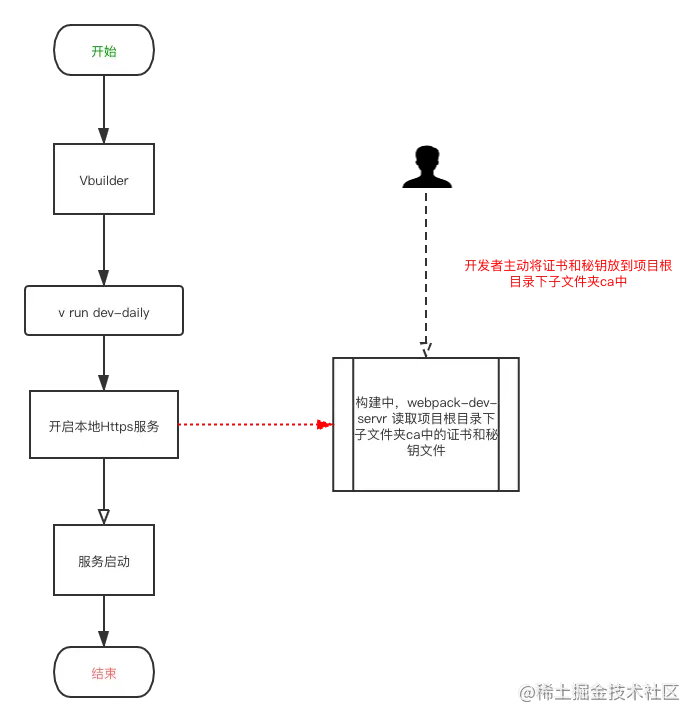

## 问题
1. 您的连接不是私密连接；因为此网站发送了 Google Chrome 无法处理的杂乱凭据。网络错误和攻击通常是暂时的，因此，此网页稍后可能会恢复正常。

    

    <span style="color: blue">当前页面点击任意空白处，直接键盘输入“thisisunsafe”即可解决。</span>

    原理是chrome认为这个网站是不安全的，不让你访问。而你输入了这句话，就类似于签了生死状，了解了风险。chrome就放你进去，但那之后再出问题也就没有责任了。

2. <span style="color: red">whistle</span>

    [whistle](/tools/Other/whistle.html) + SwitchyOmega(代理)  支持https访问？？？

3. 简单方式

    react项目
    ```md
    最简单切 https方案 export HTTPS=true && npm start 启动项目  然后node切换成10.6.0 https就可以正常访问了,直接键盘输入“thisisunsafe”即可解决。。
    ```
    [参考](https://github.com/nodejs/node/issues/24097)

    class FastBuffer extends Uint8Array {} 报错---重启iterm

## 背景
Chrome升级到80版本以上会将原来默认值**SameSite=None修改为SameSite=Lax**（其他浏览器，例如safari、firefox等都有此类似计划）,导致跨站cookie无法传递，从而导致类似登录失败等问题。通用的解决方案是将涉及业务开发的所有域名下的cookie设置成 **"SameSite=Node;Secure;"**，但该方案前提条件要求访问协议必须是https，然后目前前端本地开发大部分是http，导致请求还是无法携带Cookie，因而需要将本地http服务升级为https.

> 关于samesite的更多介绍可以查看[阮老师的文章](http://www.ruanyifeng.com/blog/2019/09/cookie-samesite.html?utm_content=buffer67e06&utm_medium=social&utm_source=twitter.com&utm_campaign=buffer)

## 整体方案
### 2.1 基于webpack-dev-server


- 方式一

    ```js
    devServer: {
        https: true
    }
    ```
    此设置使用了自签名证书，故通过，例如https://h5.dev.weidian.com:9003/pages/index.html这样的开发地址访问时，浏览器会有安全风险提示,需主动信任后可访问(主动忽略风险，虽然能开启https服务，但可能在个别场景下会有异常)

- 方式二

    ```js
    devServer: {
        https: {
            key: fs.readFileSync('/path/to/server.key'),
            cert: fs.readFileSync('/path/to/server.crt'),
            ca: fs.readFileSync('/path/to/ca.pem'),
        }
    }
    ```
    此设置需要由开发者自行提供证书，如果开发者提供了对应域名的证书，通过https访问该域名时，浏览器就不会有安全风险提示。

### 2.2 生成证书和秘钥
加入采用方式二，就必须提供证书和秘钥，传统的证书生成方案(例如OpenSSL)需要各种命令配置，比较繁琐，故这里提供了一种相对简单方便的证书生成方案，步骤如下

> 创建证书基于[mkcert](https://github.com/FiloSottile/mkcert)这个工具，相关详细信息可查看官方教程

- 第一步：安装mkcert

    ```js
    brew install mkcert // On macOS, use Homebrew
    ```
- 第二步: 生成根证书

    ```js
    mkcert install
    ```
- 第三步: 本地新建一个文件夹，并进入到该目录(用于存储证书)

    ```js
    mkdir ca
    cd ca
    ```

> 也可不用放在项目中,通用的解决方案是放在磁盘中,比如用户目录(/Users)

- 第四步:生成所需域名对应的本地证书,比如http://h5.dev.weidian.com

    ```js
    mkcert h5.dev.weidian.com
    ```
    命令执行完之后，在该文件下会生成h5.dev.weidian.com-key.pem（私钥）和h5.dev.weidian.com.pem（证书）两个文件，也就是webpack-dev-server配置需要的文件。

- 第五步:打开自己的项目,将步骤四生成的文件拷贝到项目中，然后修改webpack配置

    ```js
    devServer: {
        https: {
            key: fs.readFileSync('./cat/h5.dev.weidian.com-key.pem'),
            cert: fs.readFileSync('./cat/h5.dev.weidian.com.pem')
        }
    }
    ```
重启项目，打开开发地址，结果如下


### 2.3 一个自动生成证书和秘钥的库
除了手动生成证书和秘钥，还可以通过[devcert](https://github.com/davewasmer/devcert)这个库编写少量代码来生成证书和秘钥，方式如下
```js
// webpack.config.js

async webpackConfig(){
    let ssl = await devcert.certificateFor("h5.dev.weidian.com", { getCaPath: true });

    <!--key和cert分别就是开启Https服务的证书和秘钥-->
    const { key, cert } = ssl;
    
    return {
        "dev-server":{
            https: {
                key, cert;
            }
        }
    }
}

module.exports = webpackConfig()
```

## 总结

未来随着chrome升级，samesite的的默认设置必然会对本地开发产生重大影响，提前进行技术储备是必然的，个人可以结合公司开发情况酌情使用。

## 资料
[webpack官网](https://webpack.docschina.org/configuration/dev-server/#devserverhttps)

[本地https服务搭建指南](https://juejin.cn/post/6844904116481687565#heading-9)

[知乎-看起来有意思](https://zhuanlan.zhihu.com/p/142850469)

chrome://flags/#allow-insecure-localhost