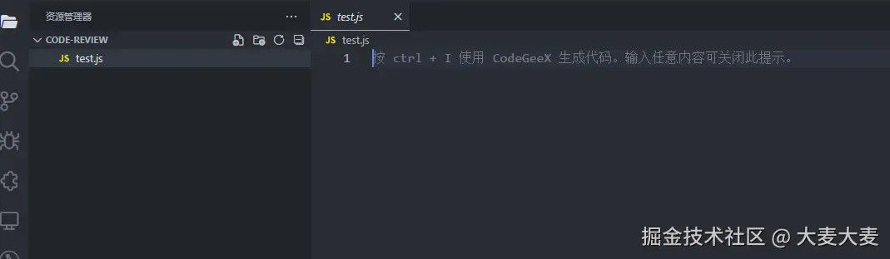
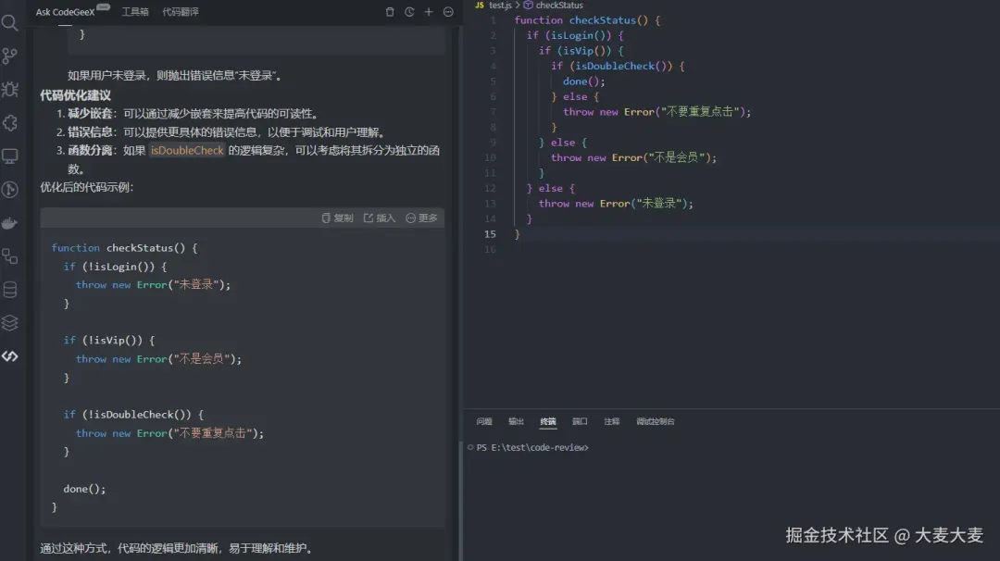

## 前言
Code Review是什么？

Code Review 通常简称CR，中文意思就是代码审查

一般来说 CR 只关心代码规范和代码逻辑，不关心业务

但是，如果CR的人是租场，建议有时间还是看下自己组内相关业务，能避免一些生产事故的发生

### 作为前端组长做 Code Review 有必要吗？
主要还是看公司业务情况吧，如果前端组长需求不多的情况，是可以做下CR，能避免一些生产事故

- 锻炼自己的 CR 能力
- 看看别人的代码哪方面写的更好，学习总结
- 和同事交流，加深联系
- 你做了CR,晋升和面试，不就有东西吹了不是

### 那要怎么去做 Code Review呢？
可以从几个方面入手
- 项目架构规范
- 代码编写规范
- 代码逻辑、代码优化
- 业务需求

具体要怎么做呢？

传统的做法是 PR 时查看，对于不合理的地方，打回并在 PR 中备注原因或优化方案

每隔一段时间，和组员开个简短的 CR 分享会，把一些平时 CR 过程中遇到的问题做下总结

**当然，不要直接指出是谁写出的代码有问题，毕竟这不是目的，分享会的目的是交流学习**

人工 CR 需要很大的时间精力与心智负担

随着 AI 的发展，我们可以借助一些AI来帮我们完成CR

接下来，我们来看下，vscode中是怎么借助 AI 工具来 CR的

安装插件 CodeGeex


新建一个项目
```shell
mkdir code-review
cd code-review
```
创建 test.js 并用vscode打开
```shell
cd .>test.js
code ./
```


编写下test.js
```js
function checkStatus() {
  if (isLogin()) {
    if (isVip()) {
      if (isDoubleCheck()) {
        done();
      } else {
        throw new Error("不要重复点击");
      }
    } else {
      throw new Error("不是会员");
    }
  } else {
    throw new Error("未登录");
  }
}
```
这是连续嵌套的判断逻辑，要怎么优化呢？

侧边栏选择这个 AI 插件，选择我们需要CR的代码

输入 codeReview，回车


我们来看下 AI 给出的建议



AI 给出的建议还是很不错的，我们可以通过更多的提示词，优化它给出的修改建议，这里就不过多赘述了

通常我们优化这种类型的代码，基本优化思路也是，前置校验逻辑，正常逻辑后置

除了CodeGeex外，还有一些比较专业的 codeRiview 的 AI 工具

比如：CodeRabbit

那既然都有 AI 工具了，我们还需要自己去CR 吗？

还是有必要的，借助 AI 工具我们可以减少一些阅读大量代码环节，提高效率，减少 CR 的时间

但是仍然需要我们根据 AI 工具的建议进行改进，并且总结，有利于拓宽我们见识，从而写出更优质的代码

## 具体 CR 实践
### 判断逻辑优化
### 1.深层对象判空
```js
// 深层对象
if(store.getters && store.getters.userInfo && store.getters.userInfo.menus) {}

// 可以使用  可选链进行优化
if(store?.getters?.userInfo?.menus) {}
```
#### 2.空函数判断
优化之前
```js
props.onChange && props.onChange(e)
```
支持ES11可选链写法，可这样优化，js中需要这样，ts因为有属性校验，可以不需要判断，当然也有特殊情况
```js
props?.onChange?.(e)
```
老项目，不支持ES11可以这样写
```js
const NOOP = () =>  8;
const { onChange = NOOP } = props;
onChange(e);
```
#### 3.复杂判断逻辑抽离成单独函数
```js
// 复杂判断逻辑
function checkGameStatus() {
    if(remaining === 0 || (remainning === 1 && remainingPlayers === 1) || remainingPlayers === 0) {
        quitGame();
    }
}
```
```js
// 复杂判断逻辑抽离成单独函数，更方便阅读
function isGameOver() {
  return (
    remaining === 0 ||
    (remaining === 1 && remainingPlayers === 1) ||
    remainingPlayers === 0
  );
}

function checkGameStatus() {
  if (isGameOver()) {
    quitGame();
  }
}
```
### 4.判断处理逻辑正确的梳理方式
```js
// 判断逻辑不要嵌套太深
function checkStatus() {
  if (isLogin()) {
    if (isVip()) {
      if (isDoubleCheck()) {
        done();
      } else {
        throw new Error('不要重复点击');
      }
    } else {
      throw new Error('不是会员');
    }
  } else {
    throw new Error('未登录');
  }
}
```
这个是不是很熟悉呀~

没错，这就是使用 AI 工具 CR的代码片段

通常这种，为了处理特殊状况，所实现的判断逻辑，都可以采用 “异常逻辑前置，正常逻辑后置” 的方式进行梳理优化

```js

// 将判断逻辑的异常逻辑提前，将正常逻辑后置
function checkStatus() {
  if (!isLogin()) {
    throw new Error('未登录');
  }

  if (!isVip()) {
    throw new Error('不是会员');
  }

  if (!isDoubleCheck()) {
    throw new Error('不要重复点击');
  }

  done();
}
```
### 函数传参优化
```js
// 形参有非常多个
const getMyInfo = (
    name,
    age,
    gender,
    address,
    phone,
    email
) => {
    // ...
}
```
有时,形参有非常多个，这会造成什么问题呢？

- 传实参的时候，不仅需要知道传入参数个数，还得知道传入顺序
- 有些参数非必传，还要注意添加默认值，且编写的时候只能从成才的后面添加，很不方便
- 所以那么多形参，会有很大的心智负担

```js
// 优化
// 行参封装成对象，对象函数内部解构
const getMyInfo = (options) => {
  const { name, age, gender, address, phone, email } = options;
  // ...
}

getMyInfo(
  {
    name: '张三',
    age: 18,
    gender: '男',
    address: '北京',
    phone: '123456789',
    email: '123456789@qq.com'
  }
)
```
这样是不是清爽了很多了

### 命名注释优化
#### 1.避免魔法数字
```js
// 魔法数字
if(state === 1 || state === 2) {
    // ...
} else if(state === 3) {
    //...
}
```
咋一看，这1、2、 3又是什么意思啊？这是判断啥的？

语义很不明确，当然，你也可以在旁边写注释

更优雅的做法是，将魔法数字改为常量

这样，其他人一看到常量名大概就知道，判断的是啥了
```js
// 魔法数字改用常量
const UNPUBLISHED = 1;
const PUBLISHED = 2;
const DELETED = 3;

if (state === UNPUBLISHED || state === PUBLISHED) {
  // ...
} else if (state === DELETED) {
  // ...
}
```
#### 2.注释别写只表面意思
注释的作用: 提供代码没有提供的额外信息
```js
// 无效注释
let id = 1; // id赋值为1

// 有效注释，写代码逻辑 what & why
let id = 1; // 赋值文章 id为1
```
#### 3.合理利用命名空间缩短属性前缀
```js
// 过长命名前缀
class User {
  userName;
  userAge;
  userPwd;

  userLogin() { };
  userRegister() { };
}
```
如果我们把前面的类里面，变量名、函数名前面的 user 去掉

似乎，也一样能理解变量和函数名称所代表的意思

代码却清爽了不少
```js
// 利用命名空间缩短属性前缀
class User {
  name;
  age;
  pwd;

  login() {};
  register() {};
}
```
### 分支逻辑优化
什么是分支逻辑呢？

使用 if else 、 switch case...

```js
// switch case
const statusMap = (status: string) => {
    switch(status) {
        case 'success':
            return 'SuccessFully'
        case 'fail':
            return 'failed'
        case 'danger'
            return 'dangerous'
        case 'info'
            return 'information'
        case 'text'
            return 'texts'
        default:
            return status
    }
}

// if else
const statusMap = (status: string) => {
    if(status === 'success') return 'SuccessFully'
    else if (status === 'fail') return 'failed'
else if (status === 'danger') return 'dangerous'
    else if (status === 'info') return 'information'
    else if (status === 'text') return 'texts'
    else return status
}
```
这些处理逻辑，我们可以采用 映射代替分支逻辑

```js

// 使用映射进行优化
const STATUS_MAP = {
    'success': 'Successfull',
    'fail': 'failed',
    'warn': 'warning',
    'danger': 'dangerous',
    'info': 'information',
    'text': 'texts'
}

return STATUS_MAP[status] ?? status
```
- 扩展

    ??是Typescript中'空值合并操作符'

    当前面的值为null或undefined时,取后面的值
    
### 对象赋值优化
```js
// 多个对像属性赋值
const setStyle = () => {
    content.body.head_style.style.color = 'red'
    content.body.head_style.style.background = 'yellow'
  content.body.head_style.style.width = '100px'
  content.body.head_style.style.height = '300px'
  // ...
}
```
这样一个个赋值太麻烦了，全部放一起赋值不就行了

可能，有些同学就这样写
```js

const setStyle = () => {
  content.body.head_style.style = {
      color: 'red',
      background: 'yellow',
      width: '100px',
      height: '300px'
    }
}
```
咋一看，好像没问题了呀？那 style 要是有其他属性呢，其他属性不就直接没了吗~
```js
const setStyle = () => {
  content.body.head_style.style = {
      ...content.body.head_style.style
      color: 'red',
      background: 'yellow',
      width: '100px',
      height: '300px'
    }
}
```
采用展开运算符，将原属性插入，然后从后面覆盖新属性，这样原属性就不会丢了

#### 隐式耦合优化
```js
// 隐式耦合
function responseInterceptor(response) {
  const token = response.headers.get("authorization");
  if (token) {
    localStorage.setItem('token', token);
  }
}

function requestInterceptor(response) {
  const token = localStorage.getItem('token');
  if (token) {
    response.headers.set("authorization", token);
  }
}
```
这个上面两个函数有耦合的地方，但是不太明显

比如这样的情况，有一天，我不想在 responseInterceptor 函数中保存 token 到 localStorage了
```js
function responseInterceptor(response) {
    const token = response.headers.get('authorization');
}
function requestInterceptor(response) {
    const token = localStorage.getItem('token');
    if (token) {
        response.headers.set("authorization", token);
    }
}
```
会发生什么？

localStorage.getItem('token') 一直拿不到数据,requestInterceptor这个函数就报废了，没用了

函数responseInterceptor改动，影响到函数 requestInterceptor了，隐式耦合了，

怎么优化？
```js
// 将隐式耦合的常数抽离成常量
const TOKEN_KEY = "authorization";
const TOKEN = 'token';

function responseInterceptor(response) {
  const token = response.headers.get(TOKEN_KEY);
  if (token) {
    localStorage.setItem(TOKEN_KEY, token);
  }
}

function requestInterceptor(response) {
  const token = localStorage.getItem(TOKEN_KEY);
  if (token) {
    response.headers.set(TOKEN_KEY, token);
  }
}
```
这样做有什么好处呢？bi刚才好在哪里？？

还是刚才的例子，我去掉了保存 localStorage.setItem(TOKEN_KEY, token)

我可以根据 TOKEN_KEY 这个常量来查找还有哪些地方用到了这个 TOKEN_KEY,从而进行修改，就不会出现冗余 或者错误

不对啊，那我不用常量，用token也可以查找啊，但你想想 token 这个词是不是得全局查找，其他地方也会出现token

查找起来比较费时间，有时可能还会改错了

用常量的话，全局查找出现重复的概率很小

而且如果你是用 ts 的话，window 下鼠标停在常量上，按 ALT 键就能看到使用到这个常量的地方了，非常方便

## 小结
codeRiview（代码审查）不仅对个人技能的成长有帮助，也对我们在升职加薪、面试有所裨益

CR 除了传统的方式外，也可以借助 AI 工具，来简化其中流程，提高效率

上述的优化案例，虽然优化方式不同，但是核心思想都是一样，都是为了代码 更简洁、更容易理解、更容易维护

当然了，优化方式还有很多，如果后期遇到了也会继续补充进来

[原文](https://mp.weixin.qq.com/s/WrKeEaKPpJoij0o2C5mV7g)