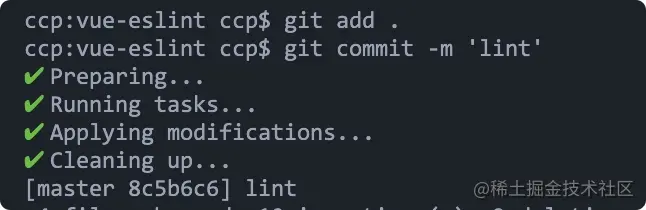

:::tip
最近遇到了一个老项目，比较有意思的是这个项目集前后端的代码于一起，而后端也会去修改前端代码，所以就出现了后端用IntelliJ IDEA来开发前端项目，而前端用VSCode来开发前端项目。于是，出现了代码规范的问题，所以整理了一下前端代码校验以及在Vue项目中的实践
:::

阅读完这篇文档，可收获
- 能够自己亲手写出一套ESLint配置;
- 会知道业界都有哪些注明的JS代码规范，熟读他们可以让你写出更规范的代码;
- vue-cli在初始化一个包含代码检查的项目时都做了什么;
- Prettier是什么？为什么要使用它？如何与ESLint配合使用;
- EditorConfig又是什么？如何使用;
- 如何在VSCode中通过插件来协助代码校验工作;
- 如果保证push到远程仓库中的代码是符合规范的；

## ESLint是什么
ESLint是一个集代码审查和修复的工具，它的核心功能是通过配置一个个规则来限制代码的合法性和风格。

### 配置解析器和解析参数
ESLint的解析器，早期的时候用的是[Esprima](https://esprima.org/),后面基于Esprima v1.2.2版本开发了一个新的解析器[Espree](https://github.com/eslint/espree),并且把它当做默认解析器。

除了使用ESLint自带的解析器外，还可以指定其他解析器:
- @babel/eslint-parser:使Babel和ESLint兼容,对一些Babel语法提供支持
- @typescript-eslint/parser：TSLint被弃用后，Typescript提供了此解析器用于将其与ESTree兼容，使ESLint对TypeScript进行支持。

为项目指定某个选择器的原则是什么？
- 如果你的项目用到了比较新的ES语法，比如ES2021的Promise.any(),那就可以指定@babel/eslint-parser为解析器;
- 如果项目是基于TS开发的，那就使用@typescript-eslint/parser

除了指定解析器parser外，还可以额外配置解析器参数paserOptions

```
{
    // ESLint默认解析器，也可以指定成别的
    parser: "espree",
    parserOptions: {
        // 指定要使用的ESMAScript版本，默认5
        ecmaVersion: 5, 
        // 设置为script(默认)或module(如果你的代码是ECMAScript模块)
        sourceType: "script",
        // 这是个对象，表示你想使用的额外的语言特性，所有选项默认都是false
        ecmafeatures: {
            // 是否允许在全局作用域下使用 return 语句
            globalReturn: false,
            // 是否启用全局 strict 模式（严格模式）
            impliedStrict: false,
            // 是否启用JSX
            jsx: false,
            // 是否启用对实验性的objectRest/spreadProperties的支持
            experimentalObjectRestSpread: false
        }
    }
}
```

### 指定环境env
指定不同的环境可以给对应环境下提供预设的全局变量。比如说在Browser环境下，可以使用window全局变量；在node环境下，可以使用process全局变量等；

ESLint中可配置的环境比较多，这里有份完整的列表，下面列出几个比较常见的：

- browser：浏览器全局变量
- node: Node全局变量和作用域
- es6: es6中除了模块之外的其他特性,同时将自动设置parserOptions.ecmaVersion参数为6，依次类推ES2017是7，而ES2021是12；
    - es2017：parserOptions.ecmaVersion 为 8；
    - es2020：parserOptions.ecmaVersion 为 11；
    - es2021：parserOptions.ecmaVersion 为 12；
配置方式
```
{
    env: {
        browser: true,
        node: true,
        es6: true,
        commonjs: true,
        mocha: true,
        jquery: true,
    }
}
```
可以指定多个环境并不意味着配置的环境越多约好，实际配置的时候还是得依据当前项目的环境来选择

### 配置全局变量globals
ESLint的一些核心规则依赖于对代码在运行时可用的全局变量的了解。由于这些在不同环境之间可能会有很大差异，并且在运行时会进行修改，因此ESLint不会假设你的执行环境中存在哪些全局变量.

如果你想使用这些全局变量，那就可以通过globals来指定。比如在react.eslintrc.js里就把spyOnDev、spyOnProd等变量挂载了global下作为全局变量
```
{
    globals: {
        spyOnDev: true,
        spyOnProd: true
    }
}
```
对于它的值需要特别说明：
- false、readable、readonly这三个是等价的，表示变量只可读不可写；
- true、writeable、writable这三个是等价的，表示变量可读科协

### 配置扩展extends

实际项目中配置规则的时候,不可能团队一条一条的去商议配置，太费经理了。通常的做法是使用业内大家普遍使用的、遵循的编码规范；然后通过extends去引入这些规范。extends配置的时候接受字符串或者数组
```
{
    extends: [
        'eslint:recommended',
        'plugin:vue/essential',
        'eslint-config-standard', // 可以缩写成 'standard'
        '@vue/prettier',
        './node_modules/coding-standard/.eslintrc-es6'
    ]
}
```
**从上面的的配置，可以知道extends支持的配置类型可以是一下几种**

- eslint开头的:是ESLint官方扩展;
- plugin开头的:是插件类型扩展,比如plugin:vue/essential;
- eslint-config开头的:来自npm包，使用时可以省略前缀eslint-config-,比如上面的可以直接写成standard；
- @开头: 扩展和eslint-config一样，只是在npm包上面加了一层作用域scope
- 一个执行配置文件的相对路径或者绝对路径

**有哪些常用的、比较著名的扩展可以被extends引入呢**

- [eslint:recommended](https://eslint.org/docs/rules/: https://link.juejin.cn?target=https%3A%2F%2Feslint.org%2Fdocs%2Frules%2F):ESLint内置的推荐规则，即ESLint Rules列表中打了钩的哪些规则
- [eslint:all](
https://eslint.org/docs/rules/: https://link.juejin.cn?target=https%3A%2F%2Feslint.org%2Fdocs%2Frules%2F): ESLint内置的所有规则
- [eslint-config-standard](
https://github.com/standard/eslint-config-standard: https://link.juejin.cn?target=https%3A%2F%2Fgithub.com%2Fstandard%2Feslint-config-standard)：standard 的 JS 规范；
- [eslint-config-prettier](https://github.com/prettier/eslint-config-prettier: https://link.juejin.cn?target=https%3A%2F%2Fgithub.com%2Fprettier%2Feslint-config-prettier)：关闭和 ESLint 中以及其他扩展中有冲突的规则；
- [eslint-config-airbnb-base](https://github.com/airbnb/javascript/tree/master/packages/eslint-config-airbnb-base: https://link.juejin.cn?target=https%3A%2F%2Fgithub.com%2Fairbnb%2Fjavascript%2Ftree%2Fmaster%2Fpackages%2Feslint-config-airbnb-base)：airbab 的 JS 规范；
- [eslint-config-alloy](
https://github.com/AlloyTeam/eslint-config-alloy: https://link.juejin.cn?target=https%3A%2F%2Fgithub.com%2FAlloyTeam%2Feslint-config-alloy)：腾讯 AlloyTeam 前端团队出品，可以很好的针对你项目的技术栈进行配置选择，比如可以选 React、Vue（现已支持 Vue 3.0）、TypeScript 等；


### 使用插件plugins

#### ESLint提供插件是干嘛用的
ESLint虽然可以定义很多的rules，以及通过extends来引入更多的规则，但是说到底只是检查JS语法。如果需要检查Vue中的template或者React中的JSX，就束手无策了，所以引入插件的目的是为了增强ESLint的检查能力和范围

#### 如何配置插件
ESLint相关的插件命名形式有两种:不带命名空间的和带命名空间的，比如：
- eslint-plugin-开发的可以省略这部分前缀
- @/开头的；

```
{
    plugins: [
        'jquery',          // 是指 eslint-plugin-jquery
        '@jquery/jquery',  // 是指 @jquery/eslint-plugin-jquery
        '@foobar',         // 是指 @foobar/eslint-plugin
    ]
}
```
当需要基于插件进行extends和rules的配置的时候，需要加上插件的引用,比如
```
{
    plugins: [
        'jquery',   // eslint-plugin-jquery
        '@foo/foo', // @foo/eslint-plugin-foo
        '@bar,      // @bar/eslint-plugin
    ],
    extends: [
        'plugin:jquery/recommended',
        'plugin:@foo/foo/recommended',
        'plugin:@bar/recommended'
    ],
    rules: {
        'jquery/a-rule': 'error',
        '@foo/foo/some-rule': 'error',
        '@bar/another-rule': 'error'
    },
}
```
### 配置规则rules
ESLint提供了大量内置的规则，这里是它的规则列表[ESLint Rules](https://eslint.org/docs/rules/: https://link.juejin.cn?target=https%3A%2F%2Feslint.org%2Fdocs%2Frules%2F),除此之外你还可以通过插件来添加更多的规则

**规则校验说明，有3个报错等级**
- off或0：关闭对该规则校验
- warn或1：启动规则，不满足抛出警告，且不会退出编译进程
- error或2：启动规则，不满足抛出错误，且会退出编译进程

通常贵天泽值需要配置开启还是关闭即可；但是也有些规则可以传入属性比如：
```
{
    rules: {
        'quotes': ['error', 'single'], // 如果不是单引号，则报错
        'one-val': ['error', {
            'var': 'always', // 每个函数作用域中，只允许1个val生命
            'let': 'never', // 每个块作用域中，允许多个let声明
            'const': 'never', // 每个块作用域中，允许多个const声明
        }]
    }
}
```
如何知道某个扩展有哪些规则可以配置，以及每个规则具体限制？这里直接给我业内著名且使用比较多的规则列表的宽恕连接

- ESLint rules，这整个列表对应 eslint:all，而打钩 ✔️ 的是 eslint:recommenmed；
- Prettier rules
- standard rules
- airbnb rules
- AlloyTeam vue rules

#### 规则优先级
- 如果 extends 配置的是一个数组，那么最终会将所有规则项进行合并，出现冲突的时候，后面的会覆盖前面的；
- 通过 rules 单独配置的规则优先级比 extends 高；

### 其他配置

#### 配置当前目录为root

ESLint检测配置文件步骤
1. 再要检测的文件同一目录里寻找.eslintrc.*和package.json;
2. 紧接着在父级目录里寻找，一直到文件系统的根目录；
3. 如果在前两步发现有 root：true 的配置，停止在父级目录中寻找 .eslintrc；
4. 如果以上步骤都没有找到，则回退到用户主目录 ~/.eslintrc 中自定义的默认配置；

通常我们都习惯把 ESLint 配置文件放到项目根目录，因此可以为了避免 ESLint 校验的时候往父级目录查找配置文件，所以需要在配置文件中加上 root: true。

```
{
    root: true
}
```

#### 添加共享数据

ESLint支持在配置文件添加共享设置，你可以添加settings对象到配置文件，它将提供给每一个将被执行的规则.如果你想添加的自定义规则而且使它们可以访问到相同的信息，这将会很有用，并且很容易配置
```
{
    settings: {
        sharedData: 'Hello'
    }
}
```
参考：ESLint配置文件.eslintrc参数说明

### 针对个别文件设置新的检查规则
比如webpack的中包含了某些运行时的JS文件，而这些文件只是泡在浏览器端的，所以需要针对这部分文件进行差异化配置
```
overrides: [
    {
        files: ["lib/**/*.runtime.js", "hot/*.js"],
        env: {
            es6: false,
            browser: true
        },
            globals: {
            Promise: false
        },
        parserOptions: {
            ecmaVersion: 5
        }
    }
]
```
## 如何校验

上面细说了ESLint的各种配置项，以及针对Vue如何进行差异配置的说明。

现在我们知道了如何配置，但是你知道这些配置都是配置到带那里了嘛？

### 配置方式

ESLint支持3中配置方式
- 命令行： 不推荐，不做介绍；
- 单文件内的注释：不推荐，不做介绍
- 配置文件：配置文件的类型可以是好几种，比如：.js、.yml、json等。推荐使用.eslintrc.js;

```
# 安装eslint
npm i eslint -D

# 初始化一个配置文件
npx eslint --lint
```
最后会在当前目录生成一个 .eslintrc.js 文件。这里就不把代码贴出来了，没参考意义。

上面我们知道了可以将配置统一写到一个配置文件里，但是你知道该如何去触发这个配置文件的校验规则嘛？

### 检验单个文件
```
// 校验a.js 和b.js
npx eslint a.js b.js

// 校验src和scripts目录
npx eslint src scripts
```

### 校验别的类型的文件
通常ESLint只能校验JS文件。比如需要检验.vue文件，光配置vue插件和vue-eslint-parse解析器是不够的，还需要让ESLint在查找文件的时候找到.vue文件。

可以通过--ext来指定具体需要校验的文件
```
npx eslint --ext .js,.jsx,.vue src
```
### 自动修复部分校验错误的代码

rules列表项中表示了一个扳手 🔧图案的规则就是表示该规则是可以通过ESLint工具自动修复代码的。如果自动修复呢。通过--fix即可。比如对于ESLint Rules里的这个semi规则，它就是带扳手图案的。

对于如下a.js代码
```
const num = 12
```
当在配置文件配置了'semi': [2, 'always']后 运行命令
```
npx eslint --fix a.js
```
校验直接就通过了，且会自动修复代码，在代码末尾自动加上分号。

### 把校验命令加到package.json
校验命令很长，也难记，习惯上会把这些命令直接加到package.json里
```
{
    "scripts": {
        "lint": "npx eslint --ext .js,.jsx,.vue src",
        "lint:fix": "npx eslint --fix --ext .js,.jsx,.vue src",
    }
}
```

### 过滤一些不需要校验的文件
对于一些公共的JS、测试脚本或者特定目录下的文件习惯上是不需要校验的，因此可以在项目根目录通过创建一个.eslintignore 文件来配置，告诉 ESLint 校验的时候忽略它们：
```
public/
src/main.js
```
除了.eslingignore中指定的文件或目录,ESLint总是忽略/node_modules/和/bower_component/中的文件;因此对于一些目前解决不了的规则报错，但是有急于打包上线，在不影响运行的情况下，我们就可以利用.eslintignore文件将其暂时忽略

## 在Vue项目中实践

上面把 ESLint 的几乎所有的配置参数和校验方式都详细的介绍了一遍，但是如果想在项目中落地，仅仅靠上面的知识还是不够的。下面将细说如何在 Vue 中落地代码校验。

关于如何在 Vue 中落地代码校验，一般是有 2 种情况：

- 通过 vue-cli 初始化项目的时候已经选择了对应的校验配置
- 对于一个空的 Vue 项目，想接入代码校验

其实这 2 种情况最终的校验的核心配置都是一样的，只是刚开始的时候安装的包有所区别。下面通过分析 vue-cli 配置的代码校验，来看看它到底做了哪些事情，通过它安装的包以及包的作用，我们就会知道如何在空项目中配置代码校验了。

### 通过vue-cli初始化的项目

如果你的项目最初是通过vue-cli新建的，那么在新建的时候会让你选
- 是否支持eslint
- 是否开启保存校验
- 是否支持提交前校验

如果都开启了话，会安装如下几个包：

- eslint：前面 2 大章节介绍的就是这玩意，ESLint 出品，是代码校验的基础包，且提供了很多内置的 Rules，比如 eslint:recommended 经常被作为项目的 JS 检查规范被引入；
- babel-eslint：一个对 Babel 解析器的包装，使其能够与 ESLint 兼容；
- lint-staged：请看后面 pre-commit 部分；
- @vue/cli-plugin-eslint
- eslint-plugin-vue

下面重点介绍 @vue/cli-plugin-eslint 和 eslint-plugin-vue，说下这 2 个包是干嘛的。

#### @vue/cli-plugin-eslint

这个包它主要干了2件事情

**第一件事**

往package.json里注册了一个命令
```
{
    "scripts": {
        "lint": "vue-cli-service lint"
    }
}
```
执行这个命令后，它会去检查和修复部分可以修复的问题。默认查找的文件是src和tests目录下所有的.js,.jsx,.vue文件，以及项目根目录下所有的JS文件(比如也会检查.eslintrc.js)

当然你也可以自定义的传入参数和校验文件
```
vue-cli-service lint [options] [...files]

```
支持的参数如下：

- --no-fix: 不会修复 errors 和 warnings；
- --max-errors [limit]：指定导致出现 npm ERR 错误的最大 errors 数量；

**第二件事**

增加了代码保存触发校验的功能 lintOnSave，这个功能默认是开启的。如果想要关闭这个功能，可以在 vue.config.js 里配置，习惯上只开启 development 环境下的代码保存校验功能：

```
module.exports = {
    lintOnSave: process.env.NODE_ENV === 'development',
}
```
intOnSave 参数说明：

- true 或者 warning：开启保存校验，会将 errors 级别的错误在终端中以 WARNING 的形式显示。默认的，WARNING 将不会导致编译失败；
- false：不开启保存校验；
- error：开启保存校验，会将 errors 级别的错误在终端中以 ERROR 的形式出现，会导致编译失败，同时浏览器页面变黑，显示 Failed to compile。

#### eslint-plugin-vue

**eslint-plugin-vue 是对 .vue 文件进行代码校验的插件。**

针对这个插件，它提供了这几个扩展
- plugin:vue/base: 基础
- plugin:vue/essential: 预防错误的(用于Vue2.x)
- plugin: vue/recommended: 推荐的，最小化任意选择和认知开销(用于vue2.x)
- plugin: vue/strongly-recommended: 强烈推荐，提高可读性(用于Vue2.x)
- plugin: vue/vue3-essential:（用于vue3.x）
- plugin: vue/vue3-recommended:(用于vue3.x)
- plugin: vue/vue3-strongly-recommended:(用于Vue3.x)
各扩展规则列表:vue rules

**看到这么一堆的扩展，是不是都不知道选那个了**

代码规范的东西，原则还是得由各自的团队去磨合商议一套适合大家的规则。不过，如果你用的是vue2,我这里推荐2套extends配置
```
{
  // vue官方示例上的配置
  extends: ['eslint:recommended', 'plugin:vue/recommended'],

  // 或者使用AlloyTeam团队那套
  extends: ['alloy', 'alloy/vue']
}
```
#### 配置和插件对应的解析器
如果是vue2.x项目，配置了eslint-plugin-vue插件和extends后，template校验还是会失效，因为不管是ESLint默认的解析器Espree还是babel-eslint都会能解析JS，无法解析template的内容

而vue-eslint-parser只能解析template的内容，但是不会解析JS，因此还需要对解析器做如下配置
```
{
  parser: 'vue-eslint-parser',
  parseOptions: {
    parser: 'babel-eslint',
    ecmaVersion: 12,
    sourceType: 'module'
  },
  extends: [
    'eslint: recommended',
    'plugin: vue/commended'
  ]
}
```
参考：eslint-plugin-vue faq

### 让Prettier管控代码风格
针对Prettier不得不提出一下疑问？
- Prettier是什么？
- 为什么有了ESLint,还需要引入Prettier？他两之间有什么区别
- 如果配置Prettier
- Prettier如何和ESLint结合使用

#### Prettier是什么
用它自己的话来说：我是一个自以为是的**代码格式化**工具，而且我支持的文件类型很多，比如
- javacript(包括实验中的特性)
- jsx
- Vue
- Typescript
- CS、Less、SCSS
- HTML
- JSON
- Markdown
以及还有一些其他类型的文件
##### Prettier对比ESLint
我们知道ESLint负责了对代码的校验功能，并且主要提供了2类规则
- 检查格式化的规则
- 检查代码质量的规则
说到底ESLint就是通过一条条的规则去限制代码的规则，但是这些规则毕竟是有限的，而且更重要的是这些规则终点并不是在代码风格上，所以单凭ESLint并不能完全的同意代码风格。

这个时候就需要引入Prettier了，因为它干的事就是直观代码格式化，不管代码质量
> Prettier:在代码风格这一块，我一直拿捏的死死的
##### 如何配置Prettier
初始化操作：
```
# 安装包
npm i prettier -D

# 新建.prettierrc.js
echo module.exports = {} > .prettierrc.js

# 新建.prettierignore
echo > .prettierignore
```
Prettier支持配置参数不对，总共才21个，这里是所有参数的说明[prettier options](https://prettier.io/docs/en/options.html#print-width)

所有的参数都有默认值，也就是说即使你没有配置.prettierrc.js,当你用Prettier去格式化代码的时候全部都会走默认设置。针对个别参数，你不想用默认设置的话，就可以在.prettierrc.js配置具体想要的值

如下，把项目中会用到的参数进行一个说明
```
module.exports = {
    printWidth: 80,                    //（默认值）单行代码超出 80 个字符自动换行
    tabWidth: 2,                       //（默认值）一个 tab 键缩进相当于 2 个空格
    useTabs: true,                     // 行缩进使用 tab 键代替空格
    semi: false,                       //（默认值）语句的末尾加上分号
    singleQuote: true,                 // 使用单引号
    quoteProps: 'as-needed',           //（默认值）仅仅当必须的时候才会加上双引号
    jsxSingleQuote: true,              // 在 JSX 中使用单引号
    trailingComma: 'all',              // 在多行的逗号分隔的句法结构的最后一行的末尾加上逗号
    bracketSpacing: true,              //（默认值）在括号和对象的文字之间加上一个空格
    jsxBracketSameLine: true,          // 把 > 符号放在多行的 JSX 元素的最后一行
    arrowParens: 'avoid',              // 当箭头函数中只有一个参数的时候可以忽略括弧
    htmlWhitespaceSensitivity: 'ignore', // vue template 中的结束标签结尾尖括号掉到了下一行
    vueIndentScriptAndStyle: false,    //（默认值）对于 .vue 文件，不缩进 <script> 和 <style> 里的内容
    embeddedLanguageFormatting: 'auto', //（默认值）允许自动格式化内嵌的代码块
};
```
> 扩张阅读：关于[Trailing commas](https://developer.mozilla.org/zh-CN/docs/Web/JavaScript/Reference/Trailing_commas)你或许想了解更多

然后可以通过命令来格式化代码
```
# 将格式化当前目录及子目录下所有文件
npx prettier --write .

# 检查某个文件是否已经格式化
npx prettier --check src/main.js
```
如果不想被Prettier格式化，可以将其写入到.prettierignore里
```
build/
package.json
public/
test/*.*
```
### Prettier和ESLint一起干活更配哦
上面介绍了Prettier的具体配置，这里主要介绍和ESLint组合使用的配置和注意事项

和ESLint配合使用需要用到eslint-plugin-prettier这个插件
```
npm i eslint-plugin-prettier -D
```
配置
```
{
    plugins: ['prettier'],
    rules: {
        'prettier/prettier': 'error'
    }
}
```
这个插件的工作原理是先调用Prettier对你的代码进行格式化，然后会把格式化前后不一致的地方进行标记，通过配置'prettier/prettier':'error'此条规则会将标记地方进行error级别报错提示，然后可以通过ESLint的--fix自动修复功能将其修复
#### 冲突了怎么办
通过前面的介绍，我们知道 ESLint 也是会对代码风格做一些限制的，而 Prettier 主要就是规范代码风格，所以在把它们结合一起使用的时候是存会在一些问题的。对于个别规则，会使得双方在校验后出现代码格式不一致的问题。

那么当 Prettier 和 ESLint 出现冲突之后，该怎么办呢？

用Prettier的话来说很简单，只要使用eslint-config-prettier就可以了。**解决冲突的思路就是通过将这个包提供的扩展放到extends最后面引入，依据rules生效的优先级，所以它会覆盖前面起冲突的规则，比如**
```
{
  extends: [
    'eslint: recommended',
    'prettier', // 必须放最后
  ]
}
```
除了能覆盖和ESLint中起冲突的规则之外，eslint-config-prettier还能覆盖以下插件规则(只列出了部分)
- eslint-plugin-standard
- eslint-plugin-vue

那eslint-config-prettier到底提供了那些覆盖规则呢？直接查看这个列表[eslint-config-prettier rules](https://github.com/prettier/eslint-config-prettier/blob/main/index.js)

如果想要覆盖某些插件的规则，需要引入对应插件的扩张 比如
```
{
    extends: [
        'standard',
        'plugin:vue/recommended',
        'prettier/standard',      // 覆盖 eslint-config-stanard 
        'prettier/vue',           // 覆盖 eslint-plugin-vue 
    ],
}
```
:::danger
提示：在eslint-config-prettier 8.0.0版本后，extends不在需要为单独的插件引入对应扩展来覆盖冲突了，统一引入prettier即可
:::

**如果同时使用了eslint-plugin-prettier和eslint-config-prettier 可以这么配置**
```
{
  extends: ['plugin:prettier/recommended']
}
```
它其实和下面这些配置是等价的
```
{
  extends: ['prettier'], // eslint-config-prettier提供的，用于覆盖起冲突的规则
  plugins: ['prettier'], // 注册eslint-plugin-prettier 插件
  rules: {
    'prettier/prettier': 'error',
    'arrow-body-style': 'off',
    'prefer-arrow-callback': 'off'
  }
}
```
所以如果在vue2项目中配置ESLint和Prettier会怎么配置
```
{
  parser: 'vue-eslint-parser',
  parserOptions: {
    parser: 'babel-eslint'，
    ecmaVersion: 12,
    sourceType: 'module'
  },
  extends: [
    'eslint:recommended', 
    'plugin:vue/recommended',
    'plugin:prettier/recommended',  // 在前面 Vue 配置的基础上加上这行
  ],
  plugins: ['vue']
}
```
其实如果你的项目是用vue-cli初始化的，且选择了eslint+prettier方案的话，生成的项目中，.eslintrc.js配置文件中extends的配置是这样的
```
{
    extends: [
        'plugin:vue/essential',
        'eslint:recommended', 
        '@vue/prettier'
    ]
}
```
它的最后一项扩展是@vue/prettier，这个对应的是@vue/eslint-config-prettier,让我们看看这个包

下面的index.js内容
```
{
  plugins: ['prettier'],
  extends: [
    require.resolve('eslint-config-prettier'),
    require.resolve('eslint-config-prettier/vue')
  ],
  rules: {
    'prettier/prettier': 'warn'
  }
}
```
这个和我们上面配置的内容相差无几的，而引入eslint-config-prettier/vue是因为这个@vue/eslin-config-prettier包依赖的eslint-config-prettier版本^6.0.0版本的，所以在处理冲突的时候需要特别指定和对应类型插件匹配的扩展
## 让EditorConfig助力多编辑器开发吧
[EditorConfig](https://editorconfig.org/)是啥玩意？它可以对多重类型的单文件进行简单的格式化，它提供的配置参数很少：
```
# 告诉 EditorConfig 插件，这是根文件，不用继续往上查找
root = true

# 匹配全部文件
[*]

# 设置字符集
charset = utf-8

# 缩进风格，可选 space、tab
indent_style = tab

# 缩进的空格数，当 indent_style = tab 将使用 tab_width
# 否则使用 indent_size
indent_size = 2
tab_width = 2

# 结尾换行符，可选 lf、cr、crlf
end_of_line = lf

# 在文件结尾插入新行
insert_final_newline = true

# 删除一行中的前后空格
trim_trailing_whitespace = true

# 匹配md结尾的文件
[*.md]
insert_final_newline = false
trim_trailing_whitespace = false
```
虽然它提供的格式化的配置参数很少，就3个，**缩进风格、是否在文件末尾插入新行和是否删除一行中前后空格**。但是它还是非常有必要存在的理由有三个
- 能够在不同的编辑器和IDE中保持一致的代码风格
- 配合插件打开文件即自动格式化，非常方便
- 支持格式化的文件类型很多
如果需要让以上配置生效，还得在VSCode里安装EditorConfig for VS Code 这个插件配合

**终点来了**

可以看到 EditorConfig 和 Prettier 会存在一些重复的配置，比如都提供了对缩进的配置参数，所以在实际使用的时候需要避免它们，或者把他们的参数设置为一致。

### 在VSCode中支持eslint
前面做的配置，都需要执行命令才能进行检查和修复代码，还是挺不方便的，如果我希望编辑完或保存的时候去检查代码改如何去做呢？可以直接在IDE里安装ESLint插件，因为我使用的是VSCode，所以这里只介绍vscode中配置

在使用前，需要把 ESLint 扩展安装到 VSCode 里，这里我就不细说安装步骤了。 安装完成后，需要在设置里写入配置：
- 在 VSCode 左下角找到一个齿轮 ⚙ 图标，点击后选择设置选项，这个时候打开了设置面板；
- 然后在 VSCode 右上角找到打开设置（json）的图标，点击后，会打开 settings.json 文件；
- 然后把以下配置贴进去即可；
```
{
    "eslint.alwaysShowStatus": true,  // 总是在 VSCode 显示 ESLint 的状态
    "eslint.quiet": true,             // 忽略 warning 的错误
    "editor.codeActionsOnSave": {     // 保存时使用 ESLint 修复可修复错误
        "source.fixAll": true,
        "source.fixAll.eslint": true
    }	
}
```
配置说明，在ESLint 2.0.4版本开始:
- 不需要通过eslint.validate来指定校验的文件类型了，已经自动支持了.vue文件
- editor.codeActionsOnSave 开启保存自动修复功能
当这样配置之后呢，每次编辑代码ESLint都会实时校验代码，且当保存的时候会自动fix，是不是很方便呢。不过对于有些无法自动fix的代码就需要你手动去修改了，如果不想修改的话可以配置rules把该条规则给关闭掉

其实在团队开发的时候，最好把针对VSCode的配置，写一个文件耿穗这项目，一起提交到远程仓库，这样的话就保证了项目成员都是用的这套配置。比如可以在项目的根目录新建.vscode/settings.json,然后写入上面的那串配置内容

### 在提交前做校验pre-commit
以上只是通过ESLint自动修复能够修复的错误以及通过Prettier进行代码格式化，但是在实际开发的时候难免遇到无法fix的错误，可能开发人员也忘记修改，如果这个时候把代码提交到远程仓库，那就把糟糕的嗲吗提交上去了

那么如何杜绝把糟糕的代码提交上去呢，可以通过配置git hooks的pre-commit钩子来实现这个目的。主要是利用了husky和lint-staged这两个包。husky就是用来配置git hooks的，而lint-staged则是对拿到的staged文件进行处理，比如执行npx eslint --fix进行代码校验。

具体操作分两种情况
- package.json和.git在同一个目录下
- package.json和.git不在同一个目录下
#### package.json和.git在同一个目录下
1. 执行一下命令
  ```
  npx mrm lint-staged
  ```
  会自动安装lint-staged和husky并且在package.json里写入lint-staged
  ::: danger
  注意：mrm是一个自动化工具，它会根据package.json依赖项中的代码质量工具来安装和配置 husky和lint-staged，因此请确保在此之前安装并配置所有代码质量工具如Prettier和eslint
  :::
  如果上面顺利会在package.json中吸入lint-staged,可以自行修改让他支持.vue文件校验
  ```
  {
    "lint-staged": {
      "*.{js,vue}": "eslint --cache --fix"
    }
  }
  ```
  可能你在别的地方有看过如下这种在lint-staged最后一项加了git add的配置，这样也是没问题的。需要说明的是，如果lint-staged是11.x.x的版本已经自动实现了将修改过的代码自动添加暂存区的功能，所以不需要在加git add
  ```
  "lint-staged": {
    "*.{js,vue}": ["eslint --cache --fix", "git add"]
  }
  ```
2. 启动git hooks
  ```
  npx husky install
  ```
  经过上面的命令后，v6版本的husky会在项目根目录新建一个.husky目录。如果是V4版本会写入到package.json里
3. 创建pre-commit钩子
  ```
  npx husky add .husky/pre-commit "npx lint-staged"
  ```
到这里后，git commit 前自动执行代码校验和修复的功能就算完成了。然后你可以试试修改文件，然后提交试试。


#### package.json和.git在不同目录下
如果你的项目不是纯前端项目，而是前后端代码放在一个项目下，比如如下这个shop-system的项目结构
```
|-.git  // .git目录
|- shop-service // 后端项目
|- show-web // 前端项目
```
如果package.json和.git在不同的目录下，那么通过第一种方式的npm nrm lint-staged 来创建会失败，将无法创建.husky目录，这个时候需要微微麻烦点了。

在shop-web目录终端下运行
```
# 安装 husky
npm install husky --save-dev

# 启动 git hooks
cd .. && husky install shop-web/.husky

# 添加 pre-commit 钩子
npx husky add .husky/pre-commit "cd shop-web && npx lint-staged"

# 安装 lint-staged
npm install lint-staged -D
```
然后在package.json里配置lint-staged,就可以大功告成
```
{
    "lint-staged": {
        "*.{js,vue}": "eslint --cache --fix"
    }
}
```
参考：[自定义目录启动 git hook](https://typicode.github.io/husky/#/?id=custom-directory), [前端代码规范检查最佳实践](/front-end/engineering/best-husky.html)


## 总结
这篇文章比较长，前前后后讲了很多代码校验的东西，现在我们来梳理下。

首先用 ESLint 来做代码校验，它自带的 ruels 能提供 2 种类型的校验，分别是代码错误校验和代码格式校验，而 ESLint 本身的核心工作其实就是校验和修复错误的代码，而对格式化的规则提供的不多。

所以如果我们相对代码格式化进行一个更加精细的配置则需要借助Prettier,因为它是只负责风格的管控，所以用它在合适不过了。但是如果ESLint和Perttier结合起来一起使用的话，就可能会出现规则的冲突了，毕竟两者都会对风格进行处理，所以这个时候就可以通过eslint-config-prettier这个扩展来把冲突的规则进行关闭，这个扩展不仅可以关闭和ESLint内置规则的冲突，还可以关闭实际项目中引用到的扩展规则的冲突，比如和Vue、React、Typescript、Flow的冲突

在把ESLint和Perttier结合的时候，我们希望让Eslint来检查代码的错误，而Prettier校验代码风格，那么这个时候其实有是有2个任务的，需要2条命令来处理。但是有了eslint-plugin-prettier这个插件就可以很方便的把他们结合起来，当需要校验代码错误的时候ESLint自动会给你校验，当然前提是VSCode离必须按ESLint插件，而当需要校验代码风格的时候ESLint就会调用Prettier的能力进行代码风格检查。

文章的后面分别又细说了EditorConfig和提交代码钱校验的处理，这里就不多讲了

## 参考文档
[原文地址](https://juejin.cn/post/6974223481181306888)

[原文地址1](https://mp.weixin.qq.com/s/f3WzR5lXTZ4FNuzMqlXQdA)

[vue3中加入eslint和prettier](https://juejin.cn/post/7021464780242321439)