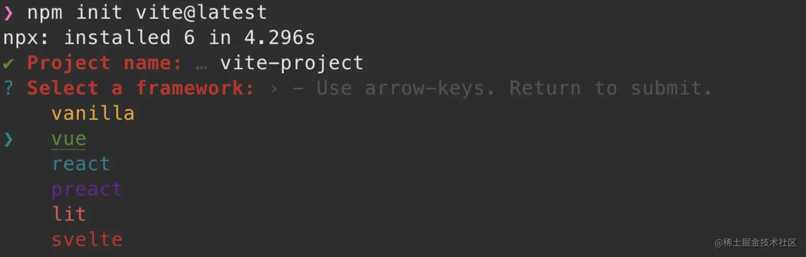
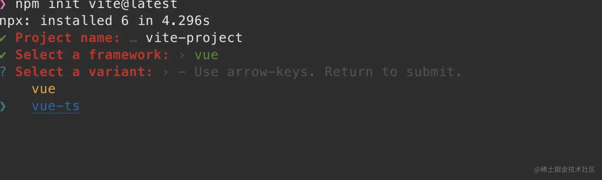

通过vite创建的vue3项目默认并没有像vue-cli一样可以选择加入lesint和prettier，需要自己手动加入，这里记录一下在项目配置eslint和prettier的过程

## 先使用vite初始化项目
使用NPM

```shell
$ npm init vite@latest
```
使用Yarn
```shell
$ yarn create vite
```


选择vue作为framework


选择vue-te

## 安装eslint
除了安装eslint之外我们还要安装一些常用的 eslint plugin
```shell
npm i eslint -D
npm eslint-config-standard -D
npm i eslint-plugin-import -D
npm i eslint-plugin-node -D
npm i eslint-plugin-promise -D
npm i eslint-plugin-vue -D
npm i @typescript-eslint/eslint-plugin -D
npm i @typescript-eslint/parser -D
npm i eslint-define-config -D
```
[eslint-config-standard](https://github.com/standard/eslint-config-standard)

[eslint-plugin-import](https://github.com/import-js/eslint-plugin-import)

[eslint-plugin-node](https://github.com/mysticatea/eslint-plugin-node)

[eslint-plugin-promise](https://github.com/xjamundx/eslint-plugin-promise)

[eslint-plugin-vue](https://github.com/vuejs/eslint-plugin-vue)

[typescript-eslint](https://github.com/typescript-eslint/typescript-eslint)

## 配置eslint
在项目根目录创建.eslintrc.js
```js
// .eslintrc.js
​
// eslint-define-config可以帮助我们做语法提示
const { defineConfig } = require('eslint-define-config')
​
module.exports = defineConfig({
  // ESLint 一旦发现配置文件中有 "root": true，它就会停止在父级目录中寻找。
  root: true,
  // 指定脚本的运行环境。每种环境都有一组特定的预定义全局变量。
  env: {
    browser: true,
    es2021: true,
  },
  // 启用的规则
  extends: [
    'plugin:vue/vue3-recommended',
    'standard',
  ],
  parserOptions: {
    // js的版本
    ecmaVersion: 13,
    // 解析器
    parser: '@typescript-eslint/parser',
    // 模块化方案
    sourceType: 'module',
  },
  // 引用的插件  下载的插件去掉eslint-plugin-前缀引入
  plugins: ['vue', '@typescript-eslint', 'import', 'node', 'promise'],
  // 自定义规则
  rules: {},
})
```
同时可以创建.eslintignore来配置eslint需要忽略哪些文件或者文件夹
```
ode_modules
.vscode
.idea
dist
/public
.eslintrc.js
```
## 安装prettier
```js
npm i prettier -D
```
## 配置prettier
在项目根目录创建 .prettierrc.js
```js
module.exports = {
  // 超过80就换行
  printWidth: 80,
  // 不适用分号
  semi: false,
  // 使用单引号
  singleQuote: true,
  // 对象的最后一项加逗号
  trailingComma: 'all',
}
```
[更多配置项](https://prettier.io/docs/en/options.html)

同时可以创建 .prettierignore 来配置prettire需要忽略哪些文件或者文件夹

> 大部分情况下.prettierignore 和eslintnore 配置一样

## 解决 eslint 和 prettier 的兼容问题

```shell
npm i eslint-config-prettier -D
npm i eslint-plugin-prettier -D
```
[eslint-config-prettier](https://github.com/prettier/eslint-config-prettier)

[eslint-plugin-prettier](https://github.com/prettier/eslint-plugin-prettier)

配置 .eslintrc.js
```js
const { defineConfig } = require('eslint-define-config')
​
module.exports = defineConfig({
  ...
  extends: [
    'plugin:vue/vue3-recommended',
    'standard',
+   'prettier',
+   'plugin:prettier/recommended',
  ],
  ...
})
```
## 解决vue3 defineProps is not defined
```js
const { defineConfig } = require('eslint-define-config')
​
module.exports = defineConfig({
  root: true,
  env: {
    browser: true,
    es2021: true,
  },
+  globals: {
+    defineProps: 'readonly',
+    defineEmits: 'readonly',
+    defineExpose: 'readonly',
+    withDefaults: 'readonly',
+  },
  extends: [
    'plugin:vue/vue3-recommended',
    'standard',
    'prettier',
    'plugin:prettier/recommended',
  ],
  ...
})
```

## 资料
[vue3中加入eslint和prettier](https://juejin.cn/post/7021464780242321439#heading-3)

[Vue3中eslint代码格式化prettier和standard规则比较（为什么推荐使用prettier）](https://blog.csdn.net/qq_21567385/article/details/109136668)