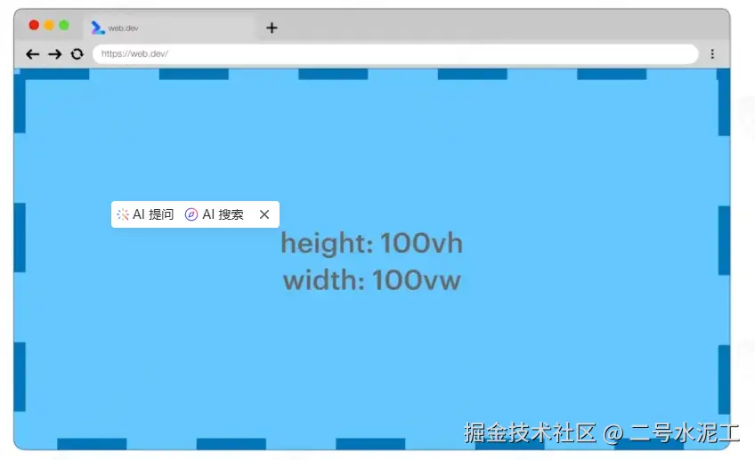
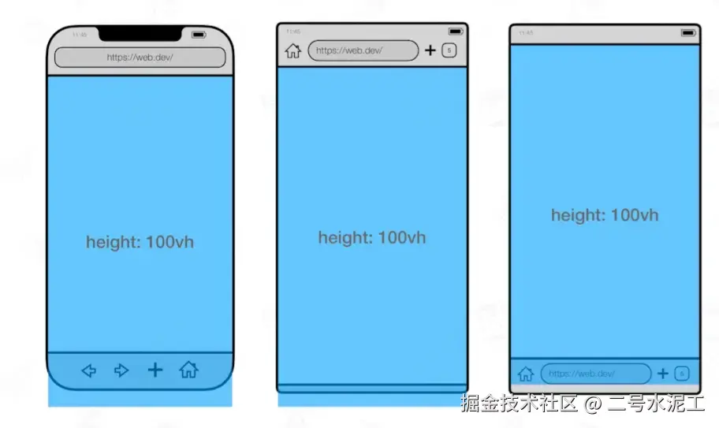
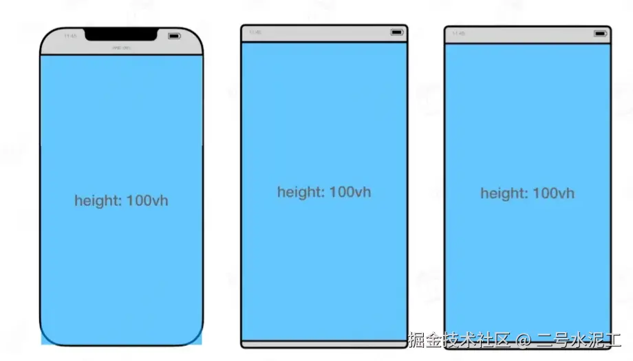
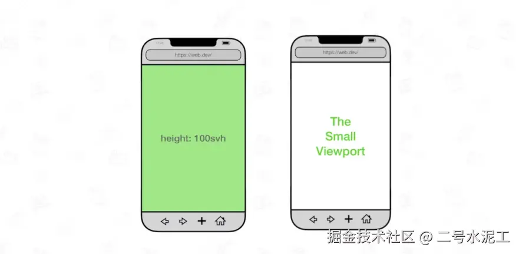
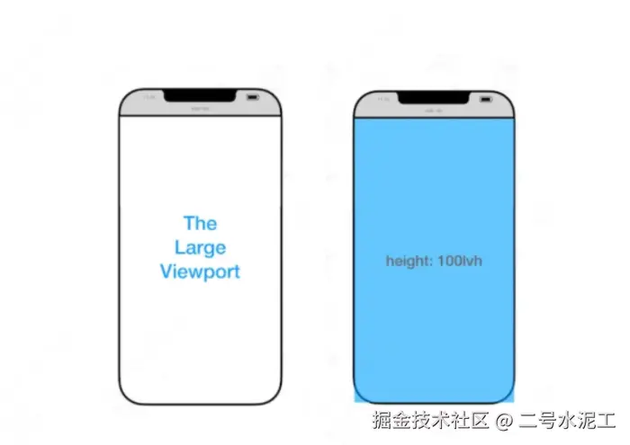
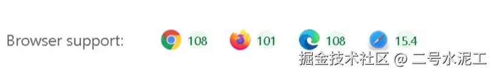

## 前言
在移动互联网浪潮下，前端开发者常常遭遇「桌面完美，移动翻车」的尴尬困境:静心设计的页面在手机端频繁出现内容阶段、页面抖动，甚至因浏览器工具栏的显隐引发「卫衣惨案」。这一切的罪魁祸首，往往是我们习以为常的CSS单位 height: 100vh --它在桌面端是「省心神器」，却在移动端成为「兼容性噩梦」

为什么 100vh在手机上会水土不服？动态变化的浏览器工具栏如何让布局「牵一发而动全身」？又有哪些CSS新特性能够根治这些顽疾？本文将深入解析移动端视口单位的底层逻辑，结合实战案例演示如何用 svh/lvh/dvh 替代传统 vh,让你的页面在手机端真正实现「丝滑适配」，同时附赠兼容性解决方案与选型指南，助你打造无懈可击的移动端体验

## 一、100vh的移动端困境
在桌面浏览器环境下，100vh（Viewport Height）的定义非常直观，它代表浏览器视窗的完整高度。但在移动端，情况却大不相同。移动浏览器的顶部地址栏和底部工具栏是动态变化的 —— 当用户首次打开页面时，这些 UI 元素会显示；而当用户开始滚动页面时，它们可能会自动隐藏，从而导致视窗高度发生变化。

问题的关键在于，100vh并不会感知这种动态变化。它始终以浏览器可能达到的最大高度为基准进行计算，这就导致也内容经常出现截断或溢出情况，严重影响用户体验。为了解决这个问题，许多开发者不得不使用Javascript，通过window.innerHeight来动态调整布局。但这种方法不仅增加了开发复杂度，还容易产生维护上的难题

## 如下图
vw和vh单位是我们都比较熟悉的两个单位，100vw和100vh代表着视口窗口的宽和高



兼容性


然而有一个问题，当我们使用100vh，且有顶部地址栏或底部操作栏的时候，会出现溢出屏幕情况



当滑动滚动条的时候，地址栏和操作栏又会搜索，此时100vh又会充满整个窗口

宽度也是如此，会收到滚动条的影响



## CSS新单位：svh、lvh
幸运的是，随着CSS技术的发展，我们有了更好的解决方案。CSS的Values and Units Module Level 4 引入了三个专门针对移动端布局问题的新单位

### 1. svh(Small Viewport Height,小视窗高度)
svh代表视窗的最小高度，也就是浏览器工具栏完全展开时的高度。这个单位特别适合那些必须始终保持可见的页面元素。例如固定在页面内的按钮、表单组件或底部导航栏



**使用示例**
```css
.element {
    height:100svh;
}
```
### 2. lvh(Large Viewport Height,大视窗高度)
lvh表示视窗的最大高度，即浏览器工作栏完全隐藏时的高度。如果你希望为用户提供一种完全沉浸式的体验，比如设计全屏启动页或欢迎页



**使用示例**
```css
.element {
    height:100lvh;
}
```

### 3. dvh(Dynamic Viewport Height， 动态视窗高度)
dvh是这三个单位中最灵活、最实用的一个。它能够自动使用浏览器工具栏的显示与隐藏：当工具栏显示时，dvh接近svh；当工具栏隐藏时，dvh接近lvh。可以说dvh真正实现了开发者期待的『动态100vh效果』

```css
.reponsive-element {
    height: 100dvh;
}
```

## 三、实际案例：从100vh到100dvh的转变
在一个产品登录页面项目中，开发者最初使用height: 100vh来设置hero区域的高度。在桌面端，效果非常理想，但在移动端却出现了一系列问题

- 背景图片超出可视区域
- 重要的CTA按钮被Safari工具栏遮挡
- 页面滚动时候布局发生明显抖动

当开发者将css属性改为height: 100dvh后，所有问题都迎刃而解，而且无需借助任何Javascript代码或复杂的布局调整。这种方法已经成为移动端全局布局的新趋势

## 四、为什么要尽快采用新单位
1. 简化开发流程：不在需要与浏览器UI进行反复的调试和优化
2. 提升用户体验：避免因工具栏变化导致的布局抖动和内容显示异常
3. 减少代码复杂度：无需使用Javascript来辅助布局调整
4. 增强兼容性：在真实设备上提供更稳定、可预测的显示效果

## 五、浏览器兼容性
截至 2025 年，主流浏览器如 Chrome、Safari 和 Firefox 都已全面支持svh、lvh和dvh这三个新单位。这意味着，开发者可以放心地在项目中使用这些新特性。

不过，在一些旧版本的浏览器或者一些不太主流的移动端浏览器上，可能存在兼容性问题。因此，在实际开发中，建议进行充分的测试，并为不支持这些单位的浏览器提供合适的备用方案，以确保页面在各种移动设备上都能有良好的显示效果。



在不支持svh、lvh和dvh的浏览器上，可以通过以下几种方式提供的备用方案

### 1.使用Javascript动态计算视口宽度
通过JavaScript监听窗口尺寸变化并动态设置CSS变量或样式，并模拟dvh的行为
```js
function updateViewportHeight() {
    // 计算动态视口宽度
    const dvh = window.innerHeight * 0.01;
    document.documentElement.style.setProperty('--dvh', `${dvh}px`);

    // 计算小视口宽度(可选)
    const svh = Math.min(window.innerHeight, screen.height) * 0.01;
    document.documentElement.style.setProperty('--svh', `${svh}px`);

    // 计算大视口高度(可选)
    const lvh = Math.max(window.innerHeight, screen.height) * 0.01;
    document.documentElement.style.setProperty('--lvh', `${lvh}px`);
}

// 初始化并监听窗口变化
updateViewportHeight();
window.addEventListener('resize', updateViewportHeight);
window.addEventListener('orientationchange', updateViewportHeight);
```
然后在CSS中使用这些变量作为备用值
```css
.element {
  height: 100vh; /* 备用方案 */
  height: 100dvh; /* 优先使用 dvh */
  height: calc(100 * var(--dvh, 1vh)); /* 动态计算的备用方案 */
}
```
### 2. 使用css @supports特性检测
通过 @supports 检测浏览器是否支持新单位，并提供降级方案
```css
/* 默认使用 vh 作为备用 */
.element {
  height: 100vh;
}

/* 如果支持 dvh，则覆盖上面的规则 */
@supports (height: 100dvh) {
  .element {
    height: 100dvh;
  }
}

/* 或者结合 CSS 变量 */
:root {
  --viewport-height: 1vh;
}

@supports (height: 100dvh) {
  :root {
    --viewport-height: 1dvh;
  }
}

.element {
  height: calc(100 * var(--viewport-height));
}
```
### 3.针对 Safari的地址栏问题特殊处理
在 iOS Safari 中，地址栏收起时 vh 会变小，导致内容溢出。可以结合 JavaScript 和 CSS 解决：
```js
// 检测是否为 iOS Safari
function isIOSSafari() {
  const userAgent = window.navigator.userAgent.toLowerCase();
  return (
    userAgent.indexOf('safari') !== -1 &&
    userAgent.indexOf('chrome') === -1 &&
    (userAgent.indexOf('iphone') !== -1 || userAgent.indexOf('ipad') !== -1)
  );
}

if (isIOSSafari()) {
  // 设置 CSS 变量以补偿 iOS Safari 的地址栏
  document.documentElement.classList.add('ios-safari');
}
```

```css
/* 针对 iOS Safari 的特殊处理 */
.ios-safari .fullscreen-element {
  height: 100vh;
  height: -webkit-fill-available;
}

/* 现代浏览器直接使用 dvh */
@supports (height: 100dvh) {
  .fullscreen-element {
    height: 100dvh;
  }
}
```
### 4. 使用 min() 和 max() 函数组合
结合vh和固定值，通过min()或max()函数减少地址栏的影响
```css
.element {
  /* 防止地址栏展开时内容被遮挡 */
  min-height: 100vh;
  min-height: calc(100vh - 56px); /* 减去底部导航栏高度 */
  
  /* 防止地址栏收起时内容溢出 */
  max-height: 100vh;
  max-height: calc(100vh + 56px); /* 加上地址栏高度 */
}
```
### 5. 组合多种方案
```css
/* 基础方案 */
.element {
  height: 100vh;
}

/* 针对支持 -webkit-fill-available 的浏览器（如 iOS Safari） */
@supports (-webkit-touch-callout: none) {
  .element {
    height: -webkit-fill-available;
  }
}

/* 针对支持 dvh 的现代浏览器 */
@supports (height: 100dvh) {
  .element {
    height: 100dvh;
  }
}

/* 针对所有浏览器的 JavaScript 增强 */
.element {
  height: calc(100 * var(--dvh, 1vh));
}
```
### 总结
- 优先使用原生单位：直接在CSS中写100dvh，让支持的浏览器直接使用
- 结合css变量和Javascript：通过动态计算和变量提供备用值
- 特性检测：使用 @supports 为不同浏览器提供不同规则
- 渐进增强：从基础vh开始，逐步增强到dvh和js方案

通过这些方法，可以在大多数浏览器中实现一致的视口高度布局效果

## 六、 如何选择合适的单位
- 始终可见区域：使用100svh，确保元素不会被工具栏遮挡
- 沉浸式全屏体验：使用100lvh；确保无干扰的视觉效果
- 动态自适应布局：使用100dvh，让页面高度随着工具栏状态自动调整

## 扩展
Chrome 108中，几个新的CSS视口单位

视口(viewport)代表当前可见的计算机图形区域。在web浏览器术语中，通常与浏览器窗口相同，但不包括浏览器的UI，菜单栏等--即指你正在浏览的文档的一部分

一般我们提供的视口有三种：布局视口、视觉视口、理想视口，在我之前写的一般我们提到的视口有三种：布局视口、视觉视口、理想视口，在我之前写的下面这篇文章中详细介绍了视口相关的概念和原理看兴趣可以看：
在响应式布局中，我们经常会用到两个视口相关的单位：

- vw(Viewport's width)：1vw 等于视觉视口的 1%
- vh(Viewport's height) : 1vh 为视觉视口高度的 1%

另外还有两个相关的衍生单位：

- vmin : vw 和 vh 中的较小值
- vmax : 选取 vw 和 vh 中的较大值

如果我们将一个元素的宽度设置为 100vw 高度设置为 100vh，它将完全覆盖视觉视口：

这些单位有很好的浏览器兼容性，也在桌面端布局中得到了很好的应用。

但是，在移动设备上的表现就差强人意了，移动设备的视口大小会受动态工具栏（例如地址栏和标签栏）存在与否的影响。视口大小可能会更改，但 vw 和 vh 的大小不会。因此，尺寸过大的 100vh 元素可能会从视口中溢出。

当网页向下滚动时，这些动态工具栏可能又会自动缩回。在这种状态下，尺寸为 100vh 的元素又可以覆盖整个视口。

为了解决这个问题，CSS 工作组规定了视口的各种状态。

Large viewport（大视口）：视口大小假设任何动态工具栏都是收缩状态。

Small Viewport（小视口）：视口大小假设任何动态工具栏都是扩展状态。

新的视口也分配了单位：

代表 Large viewport 的单位以 lv 为前缀：lvw、lvh、lvi、lvb、lvmin、lvmax。
代表 Small Viewport 的单位以 sv 为前缀：svw、svh、svi、svb、svmin、svmax。

> 除非调整视口本身的大小，否则这些视口百分比单位的大小是固定的

除了 Large viewport 和 Small ViewPort，还有一个 Dynamic ViewPort (动态视口)

当动态工具栏展开时，动态视口等于小视口的大小。
当动态工具栏被缩回时，动态视口等于大视口的大小。

相应的，它的视口单位以 dv 为前缀：dvw, dvh, dvi, dvb, dvmin, dvmax。

目前，各大浏览器均已经对新的视口单位提供了支持


[原文](https://juejin.cn/post/7507193016643321882)