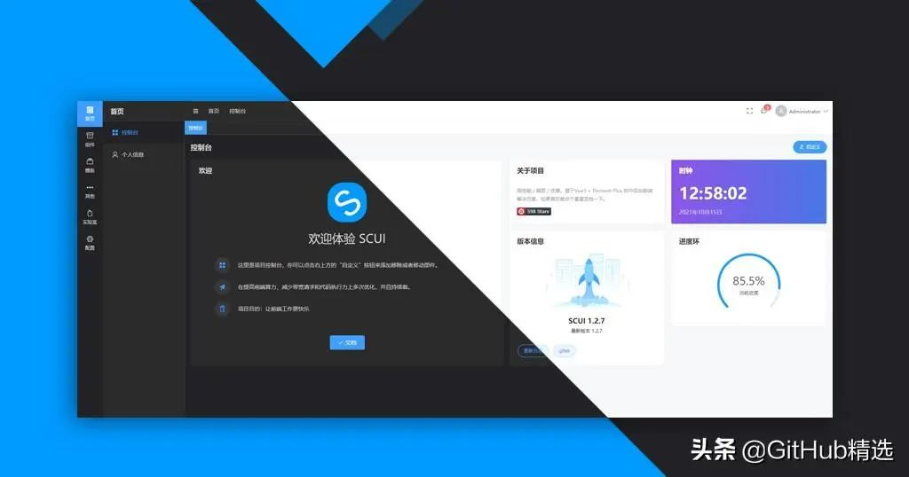
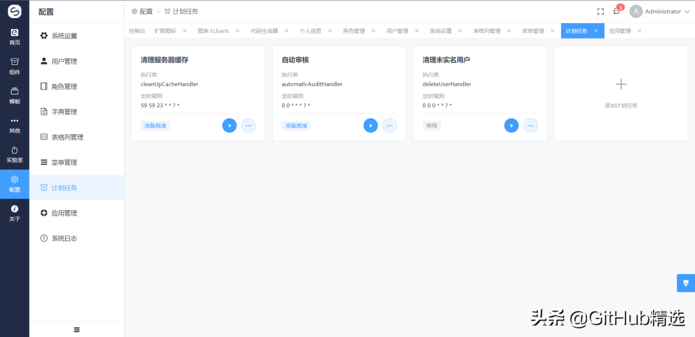
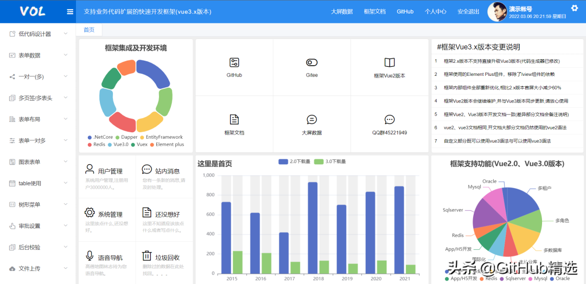
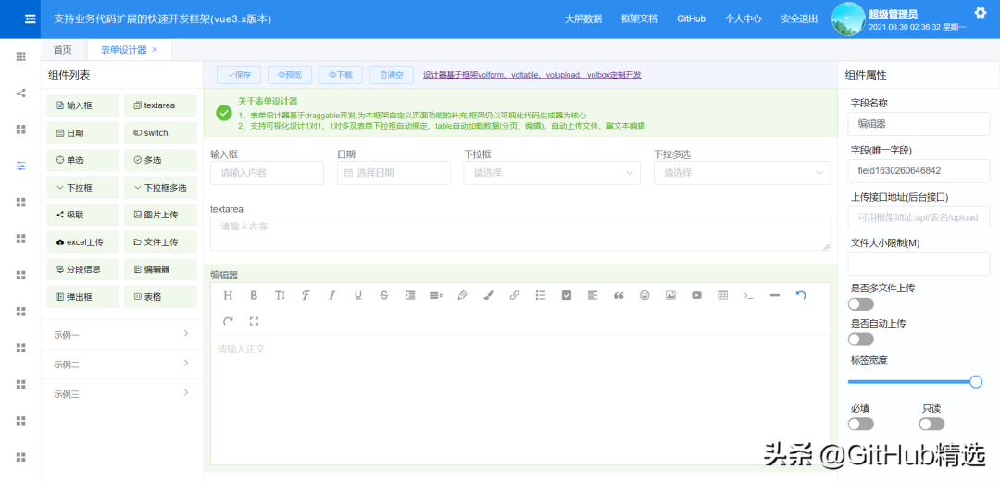
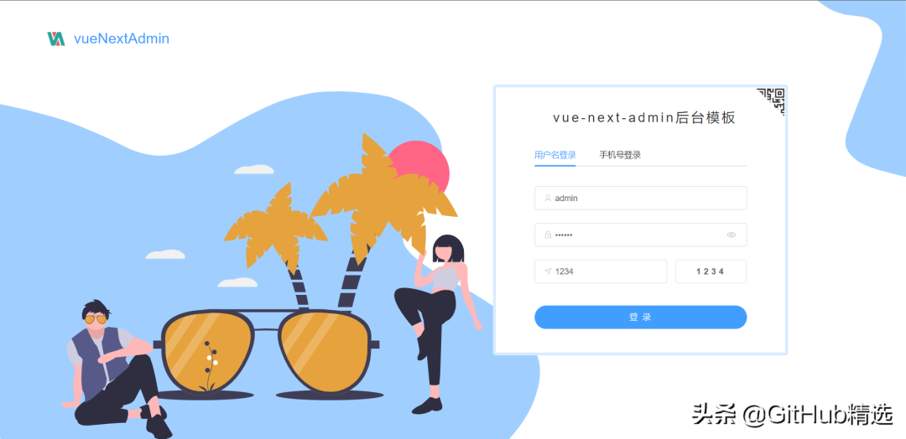
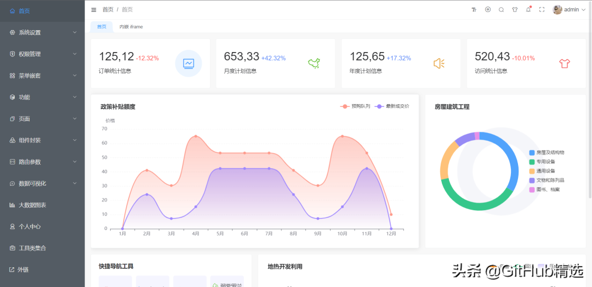
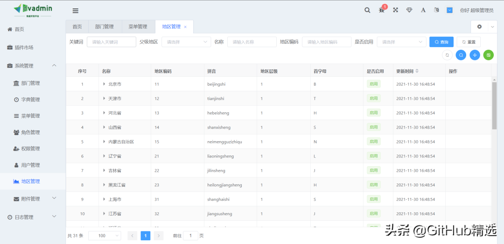

## SCUI Admin 中后台前端解决方案
SCUI是一个中后台前端解决方案，基于VUE3和ElementPlus实现。使用最新的前端技术栈，提供各类实用的组件方便在业务开发时的调用，并且持续性的提供丰富的业务模版帮助你快速搭建企业级中后台前端任务

>项目地址[https://gitee.com/lolicode/scui](https://gitee.com/lolicode/scui)

## Vue + .NetCore 前后端分离的快速发开框架
框架内置了大量的通用组件可直接使用，并内置了基于本框架定制开发的代码生成器，尽量避免重复性代码编写。支持前端、后台自定义业务代码扩展,后台提供了大量常用扩展与通用类；前端、后台提供了近300个扩展方法与属性,开发人员可在此功能上编写扩展自定义业务代码

> 项目地址: [https://gitee.com/x_discoverer/Vue.NetCore](https://gitee.com/x_discoverer/Vue.NetCore)

## next-admin 适配移动端、pc的后台模板
基于vue3.x + CompositionAPI  + typescript + vite + element plus + vue-router-next + next.vuex，适配手机、平板、pc的后台开源免费模板，希望减少工作量，帮助大家实现快速的开发

>项目地址：https://gitee.com/lyt-top/vue-next-admin

## django-vue-admin-pro 快速开发平台
django-vue-admin-pro 是一套全部开源的快速开发平台，毫无保留给个人及企业免费使用。前端采用 D2Admin 、Vue。后端采用 Python 语言 Django 框架。权限认证使用 Jwt，支持多终端认证系统。支持加载动态权限菜单，多方式轻松实现权限控制。

>项目地址：https://gitee.com/dvadmin/django-vue-admin-pro

## Admin.NET 通用管理平台

## RuoYi 若依权限管理系统

## Vue3.2 + Element-Plus 后台管理框架

## Pig RABC权限管理系统

## zheng 分布式敏捷开发系统架构

## Guns 快速开发平台

## D2Admin 企业中后台产品前端集成方案

## JeeSpringCloud 权限管理系统

## BootstrapAdmin 后台管理框架

## eladmin 后台管理系统

## FastAdmin 基于 ThinkPHP 和 Bootstrap

## Vben-Admin 中大型项目后台解决方案

## smart-admin 通用型中后台解决方案

## erupt 低代码全栈类框架

## 资料
[推荐几个开箱即用的开源管理系统做项目](https://mp.weixin.qq.com/s/xKPaflAg-K1i_V7Sqqm7Ww)