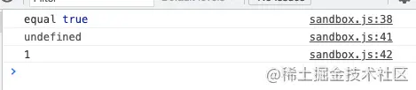
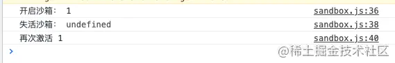
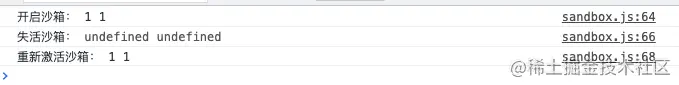
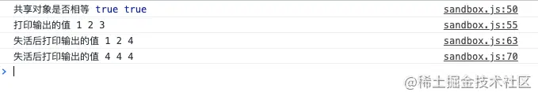

## 前言
在微前端领域当中，沙箱是很重要的一件事情。像微前端框架single-spa没有实现js沙箱，我们在构建大型微前端应用的时候，很容易造成一些变量冲突，对应用的可靠性面临巨大的风险。在微前端当中，有一些全局对象在所有应用中需要共享，如document,location等对象。子应用开发的过程中可能是多个团队在做，很难约束他们使用全局变量。有些页面可能会有多个不同的子应用，需要我们支持沙箱，每个沙箱都有加载，卸载，在恢复能力

## iframe实现沙箱
在前端中，有一个比较重要的html标签iframe，实际上，我们可以通过iframe对象，把原生浏览器对象通过contentWindow取出来，这个对象天然具有所有的属性，而且与主应用的环境隔离。下面我们通过代码看下
```js
let iframe = document.createElement('iframe', {src: 'about:blank'});
document.body.appendChild(iframe);
const sendboxGlobal = iframe.contentWindow;
```
**注意：只有同域的iframe才能取出对应的contentWindow，iframe的src设置为about:blank,可以保证一定是同域，也不会发生资源加载，参考[iframe src](https://developer.mozilla.org/zh-CN/docs/Web/HTML/Element/iframe#attr-src)**

在前言中我们提到，微前端除了有一个隔离的window环境外，其实还需要共享一些全局对象,这时候我们可以用代理去实现。下面我们通过代码看下
```js
class SandboxWindow {
    /**
     * 构造函数
     * @param {*} context 需要共享的对象
     * @param {*} frameWindow iframe的window
    */
   constructor(context, frameWindow) {
       return new Proxy(frameWindow, {
           get(target, name) {
               if(name in context) { // 优先使用共享对象 context.hasOwnProperty(name) / Reflect.has(context, name)
                    return context[name]
               }
               return target[name];
           },
           set(target, name, value) {
               if (name in context) { // 修改共享对象的值  
                    return context[name] = value;
               }
               target[name] = value;
           }
       })
   }
}

// 需要全局共享的变量
const context =  { document:window.document, history: window.history }

// 创建沙箱
const newSandboxWindow = new SandboxWindow(context, sendboxGlobal);

// 判断沙箱上的对象和全局对象是否相等
console.log('equal',newSandboxWindow.document === window.document)

newSandboxWindow.abc = '1'; //在沙箱上添加属性
console.log(window.abc);   // 在全局上查看属性
console.log(newSandboxWindow.abc) //在沙箱上查看属性
```
我们运行起来，看下结果



以上我们利用iframe沙箱可以实现以下特性：
- <span style="color:blue">全局变量隔离，如setTimeout、location、react不同版本隔离</span>
- <span style="color:blue">路由隔离，应用可以实现独立路由，也可以共享全局路由</span>
- <span style="color:blue">多实例，可以同事存在多个独立的微应用同时运行</span>

## diff方式实现沙箱
在不支持代理的浏览器中，我们可以通过diff的方式实现沙箱。在应用运行的时候保存一个快照window对象，将当前window对象的全部属性都复制到快照上，子应用卸载的将window对象修改做个diff，将不同的属性用modifyMap保存起来，再次挂载的时候在加上这些修改的属性如下
```js
class DiffSandbox {
    constructor(name) {
        this.name = name;
        this.modifyMap = {}; // 存放修改的属性
        this.windowSnapshot = {};
    }
    active() {
        // 缓存active状态的沙箱
        this.windowSnapshot = {};
        for (const item in window) {
            this.windowSnapshot[item] = window[item];
        }

        Object.key(this.modifyMap).forEach(p => {
            window[p] = this.modifyMap[p]
        })
    }
    inactive() { // 不活动卸载..
        for (const item in window) {
            if (this.windowSnapshot[item] !== window[item]) {
                // 记录更改
                this.modifyMap[item] = window[item];
                // 还原window
                window[item] = this.windowSnapshot[item];
            }
        }
    }
}
const diffSandbox = new DiffSandbox('diff沙箱');
diffSandBox.active(); // 激活沙箱
window.a = '1'
console.log('开启沙箱：',window.a);
diffSandbox.inactive(); //失活沙箱
console.log('失活沙箱：', window.a);
diffSandbox.active();   // 重新激活
console.log('再次激活', window.a);
```


这种方式也无法支持多实例，因为运行期间所有的属性都是保存在window上的。

## 基于代理Proxy实现单实例沙箱
在ES6当中，我们可以通过代理(Proxy)实现对象的劫持。基本原理也是通过window对象的修改进行记录，在卸载时删除这些记录，在应用再次激活时恢复这些记录，来达到模拟沙箱环境的目的。代码如下
```js
// 修改window属性的公共方法
const updateWindowProp = (prop, value, isDel) => {
    if (value === undefined || isDel) {
        delete window[prop];
    } else {
        window[prop] = value;
    }
}
class ProxySandbox {

    active() {
        // 根据记录还原沙箱
        this.currentUpdatedPropsValueMap.forEach((v, p) => updateWindowProp(p, v));
    }
    inactive() {
        // 1 将沙箱期间修改的属性还原为原先的属性
        this.modifiedPropsMap.forEach((v, p) => updateWindowProp(p, v));
        // 2 将沙箱期间新增的全局变量消除
        this.addedPropsMap.forEach((_, p) => updateWindowProp(p, undefined, true));
    }

    constructor(name) {
        this.name = name;
        this.proxy = null;
        // 存放新增的全局变量
        this.addedPropsMap  = new Map(); 
        // 存放沙箱期间更新的全局变量
        this.modifiedPropsMap = new Map();
        // 存在新增和修改的全局变量，在沙箱激活的时候使用
        this.currentUpdatedPropsValueMap = new Map();

        const { addedPropsMap, currentUpdatedPropsValueMap, modifiedPropsMap } = this;
        const fakeWindow = Object.create(null);
        const proxy = new Proxy(fakeWindow, {
            set(target, prop, value) {
                if (!window.hasOwnProperty(prop)) {
                    // 如果window上没有的属性，记录到新增属性里
                    // debugger;
                    addedPropsMap.set(prop, value);
                } else if (!modifiedPropsMap.has(prop)) {
                    // 如果当前window对象有该属性，且未更新过，则记录该属性在window上的初始值
                    const originalValue = window[prop];
                    modifiedPropsMap.set(prop, originalValue);
                }
                // 记录修改属性以及修改后的值
                currentUpdatedPropsValueMap.set(prop, value);
                // 设置值到全局window上
                updateWindowProp(prop, value);
                return true;
            },
            get(target, prop) {
                return window[prop];
            },
        });
        this.proxy = proxy;
    }
}


const newSandBox = new ProxySandbox('代理沙箱');
const proxyWindow = newSandBox.proxy;
proxyWindow.a = '1'
console.log('开启沙箱：', proxyWindow.a, window.a);
newSandBox.inactive(); //失活沙箱
console.log('失活沙箱：', proxyWindow.a, window.a);
newSandBox.active(); //失活沙箱
console.log('重新激活沙箱：', proxyWindow.a, window.a);
```
我们运行代码，看下结果


这种方式同一时刻只能有一个激活的沙箱，否则全局对象上的变量会有两个以上的沙箱更新，造成全局变量冲突
## 基于代理Proxy实现多实例沙箱
在单实例的场景中，我们的fakeWindow是一个空的对象，其没有任何存储变量的功能，尾应用创建的变量最终实际都是挂载在window上的，这就限制了同一时刻不能有两个激活的应用。
```js
class MultipleProxySandbox {

    active() {
        this.sandboxRunning = true;
    }
    inactive() {
        this.sandboxRunning = false;
    }

    /**
     * 构造函数
     * @param {*} name 沙箱名称 
     * @param {*} context 共享的上下文
     * @returns 
     */
    constructor(name, context = {}) {
        this.name = name;
        this.proxy = null;
        const fakeWindow = Object.create({});
        const proxy = new Proxy(fakeWindow, {
            set: (target, name, value) => { // 这里需要注意 不能用set(){}   主要是下面用到this
                if (this.sandboxRunning) {
                    if (Object.keys(context).includes(name)) {
                        context[name] = value;
                    }
                    target[name] = value;
                }
            },
            get: (target, name) => {
                // 优先使用共享对象
                if (Object.keys(context).includes(name)) {
                    return context[name];
                }
                return target[name];
            }
        })
        this.proxy = proxy;
    }
}

const context = { document: window.document };

const newSandBox1 = new MultipleProxySandbox('代理沙箱1', context);
newSandBox1.active();
const proxyWindow1 = newSandBox1.proxy;

const newSandBox2 = new MultipleProxySandbox('代理沙箱2', context);
newSandBox2.active();
const proxyWindow2 = newSandBox2.proxy;
console.log('共享对象是否相等', window.document === proxyWindow1.document, window.document ===  proxyWindow2.document);

proxyWindow1.a = '1'; // 设置代理1的值
proxyWindow2.a = '2'; // 设置代理2的值
window.a = '3';  // 设置window的值
console.log('打印输出的值', proxyWindow1.a, proxyWindow2.a, window.a);


newSandBox1.inactive(); newSandBox2.inactive(); // 两个沙箱都失活

proxyWindow1.a = '4'; // 设置代理1的值
proxyWindow2.a = '4'; // 设置代理2的值
window.a = '4';  // 设置window的值
console.log('失活后打印输出的值', proxyWindow1.a, proxyWindow2.a, window.a);

newSandBox1.active(); newSandBox2.active(); // 再次激活

proxyWindow1.a = '4'; // 设置代理1的值
proxyWindow2.a = '4'; // 设置代理2的值
window.a = '4';  // 设置window的值
console.log('失活后打印输出的值', proxyWindow1.a, proxyWindow2.a, window.a);
```
运行代码，结果如下


这种方式同一时刻只能有一个激活的多个沙箱，从而实现多实例沙箱。

## 结束
以上是微前端比较常用的沙箱实现方式，想要在生产中使用，需要我们做很多的判断和约束。请看下篇[qiankun沙箱源码解读](https://juejin.cn/post/6981756262304186405)，看看框架是怎么实现的。上面的代码在github，如需查看，请移步[js-sandbox](https://github.com/jiechud/micro-frontend-demo/tree/master/js-sandbox

)

## 资料
[原文](https://juejin.cn/post/6981374562877308936)

[【微前端】JS沙箱的基本实现](https://zhuanlan.zhihu.com/p/450103808)

