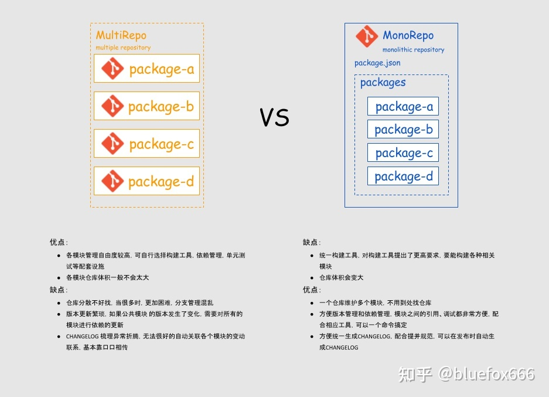

## 概念介绍
- multirepo

    一个项目，建立一个单独的代码仓库管理，单独开发，单独发布部署，这种方式称之为multirepo
- monorepo

    反过来，把多个项目放到同一个代码仓库管理，就称之为monorepo。包括vue3、babel、react在内的众多国内外著名项目都采用了这种方式

由以上的解释就明白了monorepo和multirepo就是两种不同的代码组织管理方式，分别对应着“合”和“分”两种设计哲学

## 对比优劣

在笔者之前的前端项目中，基本上都采用了multirepo的管理方式，但一旦在开发一些依赖关系比较密切的项目的时候，深感调试超级麻烦，因此笔者结合着自己的项目，参考业界流行的vue3项目，总结了一套monorepo开发架构的搭建流程，记录下来

## 使用工具
核心思路就是采用yarn包管理工具及它的workspace功能。加上lerna工具来配套使用

## 搭建流程

## 资料
[monorepo工程架构搭建总结](https://zhuanlan.zhihu.com/p/407446481)