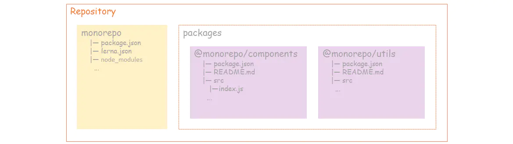
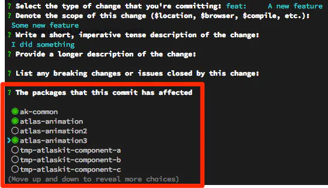
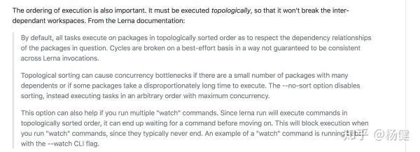
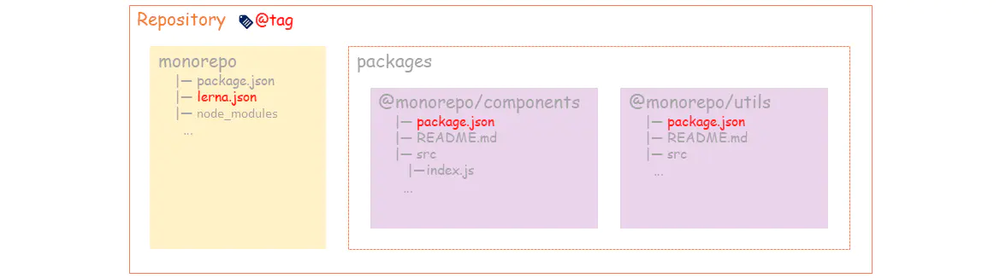
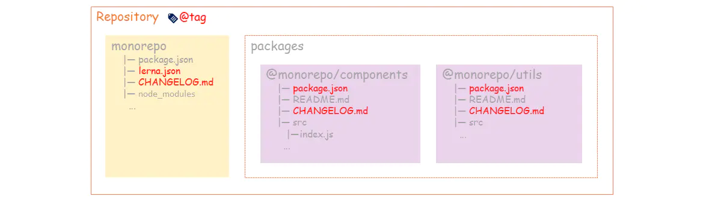

## Monorepo

Monorepo(monolithic repository)是管理项目代码的一个方式,指在一个项目仓库(repo)中管理多个模块/包(package),不同于常见的每个模块建一个repo。

目前不少大型开源项目采用了这种方式，如Babel、React、Vue等。monorepo管理代码只要搭建一套脚手架，就能管理(构建、测试、发布)多个package。

在项目的第一级目录的内容以脚手架为主，主要内容都在package目录中，分多个package进行管理。目录结构大致如下
```
├── packages
|   ├── pkg1
|   |   ├── package.json
|   ├── pkg2
|   |   ├── package.json
├── package.json
```
此时会有一个问题，虽然拆分了npm包管理项目简单了很多，但是当仓库内容有关联时，调试变得困难。**所以理想的开发环境应该是只关心业务代码，可以直接跨业务复用而不关心复用方式，调试时所有代码都在源码中**

目前最常用的monorepo解决方案是lerna和yarn的workspaces特性.用yarn处理依赖问题，lerna处理发布问题

## Lerna
Lerna是npm模块的管理工具,为项目提供了集中管理package的目录模式，如统一的repo依赖安装、package scripts和发版等特性。

### 安装
建议全局安装
```
npm i -g lerna
```

### 初始化项目
```
lerna init
```
初始化后，会生成package空目录和package.json和lerna.json配置文件，配置文件如下
```
// package.json
{
    "name": "root",
    "private": true, // 私有的，不会被发布，是管理整个项目，与要发布的npm包解耦
    "devDependencies": {
        "lerna": "^3.22.1"
    }
}

// lerna.json
{
    "package": [
        "packages/*"
    ],
    "version": "0.0.0"
}
```
### 创建npm包
执行命令后可修改包信息，这里创建@monorepo/components 和@monorepo/utils
```
lerna create @monorepo/components
```

### 安装依赖
lerna和yarn workspace安装依赖的方法都鸡肋
```
lerna add lodash // 为所有package增加lodash模块

// 为@monorepo/utils增加lodash模块(lodash可替换为内部模块，如@monorepo/components)
lerna add lodash --scope @monorepo/utils
```
> lerna add的鸡肋之处是一次只能安装一个包....

### 依赖包管理
一般情况下package的依赖都是在各自的node_modules目录下，这不仅增加了包的安装和管理成本，还可能会出现同一个依赖有多个的情况。所以可把所有package的依赖包提升到根目录。

lerna和yarn workspace都可以吧依赖包提升到repo根目录管理。lerna在安装依赖时(lerna bootstap)提供了--hoist选项，但其鸡肋的地方在于，由于lerna直接以字符串对比dependency的版本号，同一个依赖版本号完全相同时才会提升到根目录下，举个例子
```
A 依赖了 @babel/core@^7.10.0
B 依赖了 @babel/core@^7.11.4
```
lerna会在A的node_module目录下安装7.11.4版本的babel/core,并在A目录下生成了一份package.json,这无疑加大了维护成本和报的体积

而yarn workspace在这种情况下只会在根目录有一份yarn-lock.json,也不会重复在子目录下安装依赖。

## yarn workspace

### 搭建环境
主要是为安装依赖的配置调整

在monorepo管理项目中，各个库之间存在依赖，如A依赖于B，因此我们通常需要将B link到A的node_module里，一旦仓库有很多的话，手动管理这些link操作负担很大，因此需要自动化的link操作，按照拓扑排序将各个依赖进行link

解决方式：通过使用workspace，yarn install会自动的解决安装和link问题
```
yarn install # 等价于 lerna bootstrap --npm-client yarn --use-workspace
```
package.json & lerna.json如下
```
// lerna.json
{
  "packages": ["packages/*"],
  "npmClient": "yarn",
  "useWorkspaces": true, // 使用yarn workspaces
  "version": "0.0.0"
}
// package.json
{
  "name": "root",
  "private": true,
  "workspaces": [ //指定workspace路径
    "packages/*"
  ],
  "devDependencies": {
    "lerna": "^3.22.1"
  }
}
```
### 清理环境
在依赖乱调或者工程混乱的情况下，清理依赖
```
lerna clean # 清理所有packages的node_modules目录，不能删除根目录的node_modules
yarn workspaces run clean # 执行所有package的clean操作(应是自行写脚本)
```

### 安装/删除依赖
一般分为三种场景
- 给某个package安装、删除依赖
- 给root安装、删除依赖，一般的公用的开发工具都是安装在root里，如typescript
- 给所有package安装、删除依赖

关于最后一种情况，网上均显示yarn workspaces add/remove lodash可以给所有包安装/删除依赖，然而用就是报错-error Invalid subcommand. Try "info, run"，yarn 2.0 只能用 yarn workspaces foreach，运行前要装[workspace-tools插件](https://github.com/yarnpkg/berry/tree/master/packages/plugin-workspace-tools)，但还没有时间尝试过，所以这里直说前两种情况

```
yarn workspace packageA add/remove [packageB packageC] -D // 为packageA 安装/删除 packageB、C依赖
yarn add/remove typescript -W -D // 给root 安装/删除 typescript 
```
:::danger
注意：当使用yarn workspace packageA add Xxx 安装时，将会再次安装PackageA的所有依赖且安装在packageA目录下，要安装到根目录加配置 -W

对于安装local dependency，yarn的实现暂时有bug，第一次安装需要指明版本号，否则会安装失败如下
如果ui-button没有发布到 npm 则 yarn workspace ui-form add ui-button 会安装失败，但是 yarn workspace ui-form add ui-button@1.0.0会成功 ，[详情](https://github.com/yarnpkg/yarn/issues/3973)
:::
安装完依赖文件结构如下：



## 提交规范
在构建和发布之前还需要做一些关于代码提交的配置

### commitizen && cz-lerna-changelog
commitizen是用来格式化 git commit message的工具，它提供了一种问询式的方式去获取所需的提交信息。

cz-lerna-changelog是专门为Lerna项目凉生定制的提交规范，在问询的过程，会有类似影响哪些package的选择，如下：



我们使用commitizen和cz-lerna-changelog来规范提交，为后面自动生成日志做好准备。

因为这是整个工程的开发依赖，所以在根目录安装
```
yarn add commitizen cz-lerna-changlog -D -W
```
安装完成后，在package.json中增加config字段，把cz-lerna-changelog配置给commitizen。同时因为commitizen不是全局安全的，所以需要添加scripts脚本来执行git-cz
```
{
  "name": "monorepo",
  private": true,
  "workspaces": [
    "packages/*"
  ],
  "scripts": {
    "commit": "git-cz"
  },
  "config": {
    "commitizen": {
      "path": "./node_modules/cz-lerna-changelog"
    }
  },
  "devDependencies": {
    "commitizen": "^4.2.1",
    "cz-lerna-changelog": "^2.0.3",
    "lerna": "^3.22.1"
  }
}
```
之后在常规的开发中就可以使用yarn run commit来根据提示一步一步输入，来完成代码提交

### commitilint && husky
> 以下配置是强制开发者遵循上述规范，可暂时跳过，因为提交起来略久

上面我们使用了commitizen来规范提交，但很难靠开发自觉使用yarn run commit。万一忘记了，或者直接使用git commit提交怎么办？所以在提交时校验提交信息，如果不符合要求就不让提交，并提示。**校验的工作由commitlint来完成，校验的时机由husky来指定**。husky继承了Git下所有的钩子，在触发钩子的时候，husky可以阻止不合法的commit,push等。

安装commitlint以及要遵守的规范：
```
yarn add -D -W husky @commitlint/cli @commitlint/config-conventional
```
在工程根目录为commitlint增加配置文件commitlint.config.js为commitlint指定相应的规范
```
module.exports = {
  extends: ['@commitlint/config-conventional']
}
```
在package.json中增加如下配置
```
"husky": {
  "hooks": {
    "commit-msg": "commitlint -E HUSKY_GIT_PARAMS"
  }
}
```
"commit-msg"是git提交时校验提交信息的钩子，当触发时便会使用commitlint来校验。完成配置后，想通过git commit或者其他第三方工具提交时，只要提交信息不符合规范就无法提交。从而约束开发者使用yarn run commit来提交

### eslint && eslint-staged
>原本想先跳过eslint的规范的....然而如果项目已经有eslint，而npm包没有，调试都会报错，原以为一个.eslintlrc文件和装eslingt插件就能解决问题，然而并没有这么简单，累了....后期不上解决问题的过程

除了规范提交信息，代码本身肯定也少不了靠规范来统一风格
```
yarn add -D -W standerd lint-staged
```
eslint就是完整的一套Javascript代码规范，自带linter & 代码自动修正。自动格式化代码并修正，提前发现风格以及程序问题，同时也支持javascript的代码规范校验，eslintrc.json:
```
module.exports = {
  env: {
    browser: true,
    es2020: true
  },
  extends: ["eslint:recommended", "plugin:vue/essential"],
  parserOptions: {
    parser: "babel-eslint"
  },
  plugins: ["vue"],
  rules: {
    "prettier/prettier": [
      "off",
      {
        quotes: 0
      }
    ]
  }
}
```
lint-staged staged是Git里的概念，表示暂存区，lint-staged表示只检查并矫正暂存区中的文件。一来提高校验效率，二来可以为老的项目带去巨大的方便

package.json配置
```
{
  "name": "monorepo",
  "private": true,
  "workspaces": [
    "packages/*"
  ],
  "scripts": {
    "c": "git-cz"
  },
  "config": {
    "commitizen": {
      "path": "./node_modules/cz-lerna-changelog"
    }
  },
  "husky": {
    "hooks": {
      "pre-commit": "lint-staged"
    }
  },
  "lint-staged": {
    "*.(vue|js)": [
      //"eslint --fix",
      "prettier --write"
    ]
  },
  "devDependencies": {
    "commitizen": "^4.2.1",
    "cz-lerna-changelog": "^2.0.3",
    "lerna": "^3.22.1",
    "lint-staged": "^10.2.13",
    "standard": "^14.3.4"
  }
}
```
安装完成后，在package.json增加lint-staged配置"prettier --write", 校验时机定在pre-commit,在husky的配置中增加pre-commit的钩子用来执行lint校验。

> npm run eslint --fix xxx 校验并自动修复慎重，分分钟钟提交不了....

## 使用lerna构建和发布
### 项目构建
各个package之间存在相互依赖,如packageB只有在packageA构建完之后才能进行构建，否则就会出错，这实际上要求我们以一种拓扑排序的规则进行构建

我们可以自己构建拓扑排序规则，很不幸的是yarn的wrokspace暂时并未支持按照拓扑排序规则执行命令，虽然改rfc已经被accepted,但是尚未实现



幸运的是lerna支持按照拓扑排序规则执行命令，--sort参数可以控制以拓扑排序规则执行命令
```
lerna run --stream --sort build
```
可在根目录的package.json下配置
```
"scripts": {
  "build": "lerna run --stream --sort build"
}
```

### 版本升级及发包
经历重重困难终于到了发包最后一步了

项目测试完成后，就涉及到版本发布，版本发布一般涉及到如下一下步骤

- 条件验证:如验证测试测试是否通过,是否存在未提交的代码，是否在主分支上进行版本发布操作
- version_bump:发版的时候需要更新版本号，这时候如何更新版本号的问题，一般大家都会遵循semVer语义
- 生成changelog:为了方便查看每个pageage每个版本解决了哪些功能，我们需要给每个package都生成一份changelog方法用户查看各个版本的功能变化
- 生成git tag: 为了方便后续回滚问题及问题啪嚓通常需要给每个版本创建一个git tag
- git发布版本: 每次发版我们都需要单独生成一个commit记录来标记milestone
- 发布npm包:发布完git后我们还需要将更新的版本发布到npm上，以便外部用户使用

yarn官方并不打算支持发布流程，只是想做好包管理工具，因此这部分还是需要通过lerna支持

lerna提供了publush和version来支持版本的升级和发布，publish的功能可能即包含version的工作，也可以单纯的只做发布操作。

### 只发布某个package

[lerna官方不支持仅发布某个package](https://github.com/lerna/lerna/issues/1691),如果需要，只能自己手动的进入package进行发布，这样lerna自带的各种功能就需要手动完成且可能和lerna的功能相互冲突。

由于lerna会自动的检测git提交记录里是否包含指定package的文件修改记录，来确定版本更新，这要求设置好合理的ignore规则(否咋会造成，无意义的某个版本更新)，好处是可以自动的帮助package之间更新版本。

例如如果ui-form依赖了ui-button，如果ui-button发生了版本变动，会自动的将ui-form的对ui-button版本依赖更新为ui-button的最新版本。如果ui-form发生了版本变动，对ui-button并不会造成影响。

经测试version_bump是依赖于文件检测和subject结合，并不依赖于scope,scope的作用是用来生成changelog的吧，即如果修改ui-form的文件，commit记录写的是fix(ui-button)，lerna是会生成ui-form的版本更新，并不会更新ui-button的版本。

### 发布自动生成日志

有了之前的规范提交，自动生成日志就水到渠成了。lerna publish时主要做了一下事情

**lerna version更新版本**

- 找出从上一个版本发布依赖有过变更的package
- 提示开发者确定要发布的版本号
- 将所有更新过的package中的package.json的version字段更新
- 将依赖更新过的package的包中的依赖版本号更新
- 更新lerna.json中的version字段
- 提交上述修改，并打一个tag
- 推送到git仓库



**lerna publish**

版本自动更新可使用--conventional-commits参数会自动根据conventional commit规范和git commit message记录帮忙确定更新的版本号：
```
// lerson
{
  "packages": ["packages/*"],
  "npmClient": "yarn",
  "useWorkspaces": true,
  "command": {
    "version": {
      "conventionalCommits": true # 生成changelog文件以及根据commit来进行版本变动
    }
  },
  "ignoreChanges": ["**/*.md"], # md文件更新，不触发版本变动
  "version": "0.0.0"
}
```
包内的package.json还需publishConfig配置
```
"publishConfig": {
  "access": "publish" // 如果该模块需要发布,对于scope模块，需要设置为publish,否则需要权限验证
}
```



最后执行命令发布
```
lerna publish [from-git]
```
> 如果第一次没有发成功但是确显示成功了，则要加from-git才能重新发，发布也还有一些坑....

### 完善测试用例

monorepo项目:测试有两种方式

- 使用统一的jest测试配置这样方便全局的跑jest即可，好处是可以方便统计所有代码的测试覆盖了，坏处是如果package比较异构(如小程序，前端，node服务器等)，统一的测试配置不太好写
- 每个package单独支持test命令，使用yarn workspace run test，坏处是不好统一手机所有代码的测试覆盖了

附上typescript的测试例子，初始化配置jest.config.js
```
module.exports = {
  preset: 'ts-jest'，
  moduleFileExtensions: ['ts'],
  testEnvironment: 'node'
}
```

最后附上github地址：https://github.com/moon-bonny/monorepo


## 资料
[前端代码规范检查工作流实践方案](/front-end/engineering/tools-husky.html)

[monorepo实战](https://www.jianshu.com/p/dafc2052eedc)

[Monorepo是什么，为什么大家都在用？](https://zhuanlan.zhihu.com/p/77577415)

[lerna管理前端packages的最佳实践](http://www.xiaoheidiannao.com/6744.html)

[简单使用Commitizen-规范你的commit message](https://www.jianshu.com/p/36d970a2b4da)