首先先介绍需要的依赖
依赖|作用
---|---
typescirpt | 支持typescript
rollup | 打包工具
rollup-plugin-typescript2 | rollup和ts桥梁
@rollup/plugin-node-resolve | 解析node第三方模块
@rollup/plugin-json | 支持引入json
execa | 开启子进程方便执行命令

初始化项目yarn init -y

然后配置package.json文件
```
{
  "provate": true, // 私有
  "workspaces": [ // 工作目录
    "packages/*"
  ],
  "name": "rollup-vue3",
  "version": "1.0.0",
  "main": "index.js",
  "license": "MIT"
}
```
workspaces规定我们的代码都在packages目录下

所有新建一个packages文件夹

然后这次的例子我们创建两个文件夹分别为reactivity和shared实现vue3的这两个功能。并且进入这两个文件夹分别初始化yarn init -y

然后在到reactivity和shared文件夹创建入口文件src/index.js

接下来我们要修改reactivity和shared文件夹下的package.json文件

比如reactivity的初始化文件
```
{
  "name": "reactivity",
  "version": "1.0.0",
  "main": "index.js",
  "license": "MIT"
}
```
接下来我们要修改reativity和shared文件夹下的package.json文件

比如reactivity的初始化文件
```
{
  "name": "@vue/reactivity",
  "version": "1.0.0",
  "main": "index.js",
  "license": "MIT"
}
```
还需要一个入口,main是给commonjs服务端用的(require)。如果我们要用es6(import)，需要增加一个入口module
```
{
  "name": "@vue/reactivity",
  "version": "1.0.0",
  "main": "index.js",
  "module": "dist/reactivity.esm-bundler.js",
  "license": "MIT"
}
```
入口文件为打包后的dist文件夹下的reactivity.esm-bundler.js文件

继续，我们还需要配置自定义配置属性buildOptions
```
{
  "name": "@vue/reactivity",
  "version": "1.0.0",
  "main": "index.js",
  "module": "dist/reactivity.esm-bundler.js",
  "license": "MIT",
  "buildOptions": {
    "name": "VueReactivity", //打包成 全局模块 的命名 类似于暴露的方法挂载到window.VueReactivity上
    "formats": [    // 当前模块可以构建成哪些模块
      "cjs",  // commonjs
      "esm-bundler", // es6 module
      "global" // 全局 模块
    ]
  }
}
```
buildOptions中name是为了给打包为全局模块的命名，类似于暴露的方法挂载到window.VueReactivity上，formats是告诉rollup我需要打包出多少种模块

其中
- cjs -> commonjs
- esm-bundler -> es6 module
- global -> 全局

shared模块我们不需要打包为全局，其实这里的name：VueShared没有用到
```
{
  "name": "@vue/shared",
  "version": "1.0.0",
  "main": "index.js",
  "module": "dist/shared.esm-bundler.js",
  "license": "MIT",
  "buildOptions": {
    "name": "VueShared",
    "formats": [    
      "cjs", 
      "esm-bundler" 
    ]
  }
}
```
安装依赖
```
yarn add typescript rollup rollup-plugin-typescript2 @rollup/plugin-node-resolve @rollup/plugin-json execa
```
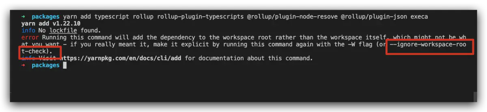

因为项目中有多个package.json文件，如果只给 根安装 需要添加--ignore-workspaces-root-check

重新安装依赖
```
yarn add typescript rollup rollup-plugin-typescript2 @rollup/plugin-node-resolve @rollup/plugin-json execa --ignore-workspace-root-check
// 或者
yarn add typescript rollup rollup-plugin-typescript2 @rollup/plugin-node-resolve @rollup/plugin-json execa -W
```
如果安装的时候，报错看一下，yarn源地址，是不是修改过
```
yarn config get registry // 查看当前镜像源
yarn config set registry https://registry.yarnpkg.com   // yarn  原本的地址
```
安装成功之后。我们去根package.json中配置脚本
```
{
  "private": true,
  "workspaces":[
    "packages/*"
  ],
  "scripts": {
    "dev": "node scripts/dev.js",
    "build": "node scripts/build.js"
  },
  "name": "rollup-vue3",
  "version": "1.0.0",
  "main": "index.js",
  "license": "MIT"
}
```
当运行命令yarn dev时，我们去运行dev.js(打包单个模块)

yarn build时我们去scripts运行build.js(打包packages下所有模块)

我们先编写build.js文件

首先获取packages下素有目录，并且过滤只要文件夹
```
const fs = reqire('fs');

// 读取packages文件夹下所有文件，并且过滤
const targets = fs.readdirSync('packages').filter(f => fs.statSync(`packages/${f}`).isDirectory());

console.log('target', targets)
```
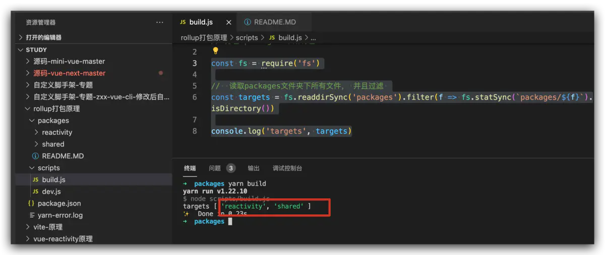

然后对目标依次进行并行打包
```
/ **
* 对目标进行依次打包，并且是并行打包
** /
// 打包
function build() {}

// 循环目标 依次打包
function runParallel(targets, iteratorFn) {

}
// 执行
runParallel(targets, build)
```
我们对runParalled进行依次打包返回Promise.在build中console看一下
```
// 打包packages下所有包
const fs = require('fs');

// 读取packages文件夹下所有文件，并且过滤
const target = fs.readdirSync('packages').filter(f => fs.statSync(`packages/${f}`).isDirectory());

/ **
* 对目标进行依次打包，并且是并行打包
** /
async function build(target) {
  console.log('target', target);
}
// 循环目标 依次打包
function runParalled(targets, iteratorFn) {
  const res = []; // 保存打包结果
  // 遍历
  for(const item of targets) {
    // 依次执行
    const p = iteratorFn(item);
    res.push(p)
  }
  return Promise.all(res);
}
// 执行
runParalled(targets, build)
```
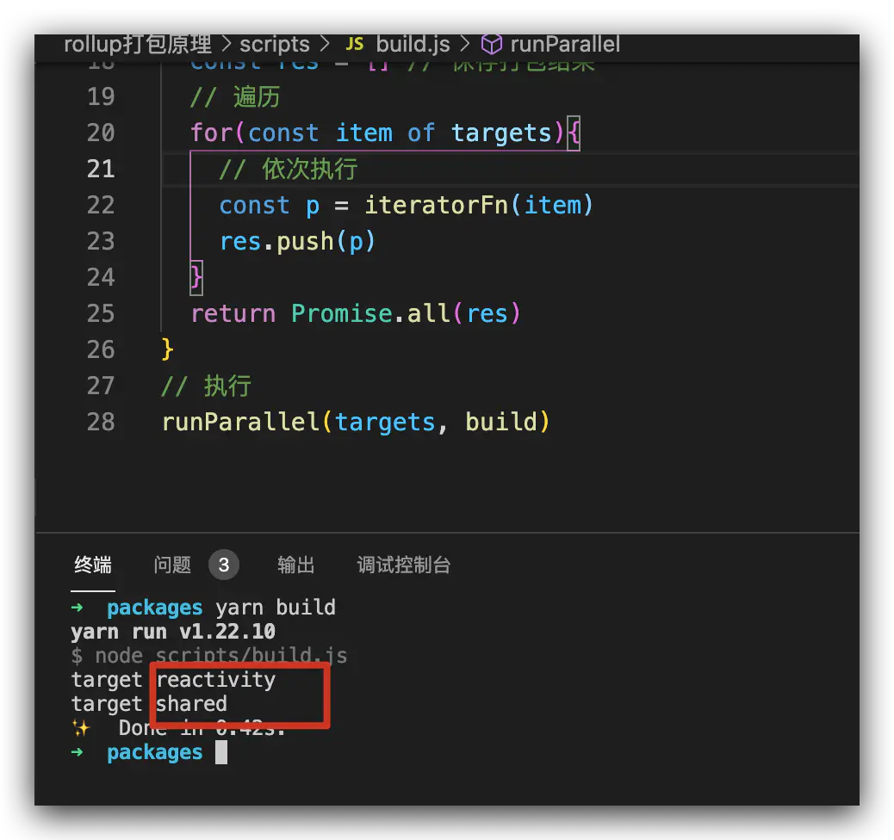

我们依次拿到了需要的包

然后引入execa包 开启子进程
```
async function build(target) {
  console.log('taget', target);
  // 第一参数 是命令
  // 第二个参数 是rollup 运行时的执行的参数  
  //          -c 采用配置文件 
  //          --environment 设置环境变量 
  //          `TARGET:${target}` 环境变量 里面设置的对象。在rollup 配置文件执行时，可以获取到
  // 第三个参数 execa 执行的参数  stdio: 'inherit' 子进程打包的信息 共享给父进程
  await execa('rollup', ['-c', '--envrionment', `TARGET:${target}`], {
    stdio: 'inherit'
  })
}
```
由于rollup执行的配置文件为rollup.config.js,所有我们创建一个rollup.config.js来配置rollup执行时候的参数

首先我们需要拿到--environment传入的环境变量，我们先在rollup.config.js中console.log(process.env.TARGET)一下，获取环境变量中的target属性去获取对应模块中的package.json
```
// rollup 配置

import path from 'path'

console.log('___________________', process.env.TARGET);
// 根据环境变量中 target 属性，获取对应模块中的 package.json
if (!process.env.TARGET) {
  throw new Error('TARGET package must be specified via --environment flag.')}

// 获取packages 目录
const packagesDir = path.resolve(__dirname, 'packages')

// 获取要打包的某个包 (打包的基本目录)
const packageDir = path.resolve(packagesDir, process.env.TARGET)

// 获取 对应打包目录 下的文件（这里用来取 package.json文件）
const resolve = p => path.resolve(packageDir, p)

// 获取package.json文件
const pkg = require(resolve(`package.json`))

// 获取 package.json文件中我们自定义的属性 buildOptions
const packageOptions = pkg.buildOptions || {}

// 获取我们 文件名
const name = packageOptions.filename || path.basename(packageDir)
```
之后我们需要对打包类型做一个映射表，根据package.json中的formats来格式化需要打包的内容
```
// 对打包类型做一个映射表，根据package.json中的formats来格式化需要打包的内容
const outputConfigs = {
  'esm-bundler': {
    file: resolve(`dist/${name}.esm-bundler.js`), // 打包后的文件 
    format: `es` // 采用的 格式
  },
  cjs: {
    file: resolve(`dist/${name}.cjs.js`),
    format: `cjs`
  },
  global: {
    file: resolve(`dist/${name}.global.js`),
    format: `iife` // 立即执行函数
  }
}
```
好了， 有了映射表，我们来取package.json中 formats参数
```
// 获取 package.json中 formats
const defaultFormats = ['esm-bundler', 'cjs'] // 默认formats 配置
const inlineFormats = process.env.FORMATS && process.env.FORMATS.split(',') // 环境变量中获取fromats配置
// 首先取 build.js中环境变量 formats 否则 到package.json中取  都没有取默认配置formats
const packageFormats = inlineFormats || packageOptions.formats || defaultFormats
```
比如 reactivity中package.json中的 formats
```
formats:[
  "cjs", 
  "esm-bundler", 
  "global" 
]
```
然后我们 把formats 循环调用 createConfig函数处理
```
// 循环调用 createConfig 处理 formats (比如： formats=['cjs', 'esm-bundler', 'global'])
const packageConfigs = packageFormats.map(format => createConfig(format, outputConfigs[format]))


function createConfig(format, output) {

}

// 导出配置变量
export default packageConfigs
```
好，我们来处理createConfig文件

format比如就是global:那么output就是映射表中的{ file: resolve(`dist/${name}.global.js`), format: `iife` // 立即执行函数 }

处理createConfig函数
```
function createConfig(format, output) {

  // 如果是全局模式  需要 配置名字
  const isGlobalBuild = /global/.test(format)
  if (isGlobalBuild) {
    output.name = packageOptions.name
  }
 
  // 生成sourcemap文件
  output.sourcemap = !!process.env.SOURCE_MAP

  // 生成roullup 配置
  return {
    input: resolve('src/index.ts'), // 入口
    output, //出口 就是上面的output
    plugins: [ // 插件  从上到下 
      json(), // import json from '@rollup/plugin-json'
      ts(), // import ts from 'rollup-plugin-typescript2'
      resolvePlugin(), //import resolvePlugin from '@rollup/plugin-node-resolve'
    ]
  }
}
```
对应ts处理，我们需要一个ts配置文件

来到根目录 运行npx tsc --init生成配置文件

生成tsconfig.json文件后，我们把默认项target和module都改为esnext(最新JavaScript/ECMAScript特性https://esnext.justjavac.com/)

然后回到createConfig函数，修改返回生成rollup配置中的ts()；
```
function createConfig(format, output) {

  // 如果是全局模式  需要 配置名字
  const isGlobalBuild = /global/.test(format)
  if (isGlobalBuild) {
    output.name = packageOptions.name
  }

  // 生成sourcemap文件
  output.sourcemap = !!process.env.SOURCE_MAP

  // 生成roullup 配置
  return {
    input: resolve('src/index.ts'), // 入口
    output, //出口 就是上面的output
    plugins: [ // 插件  从上到下 
      json(), // import json from '@rollup/plugin-json'
      ts({ // import ts from 'rollup-plugin-typescript2'
        tsconfig: path.resolve(__dirname, 'tsconfig.json')
      }), 
      resolvePlugin(), //import resolvePlugin from '@rollup/plugin-node-resolve'
    ]
  }
}
```
继续，终端运行命令yarn build命令
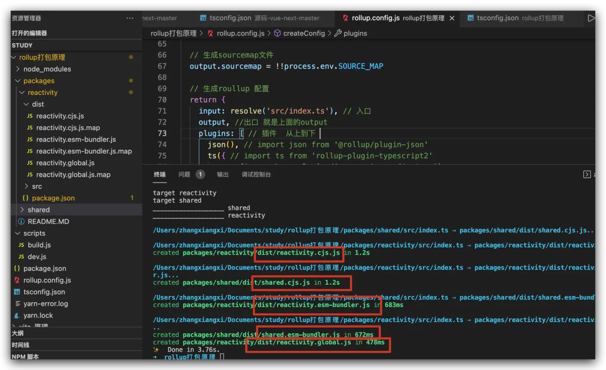
打包成功。由于shared没有配置global 所有没有打包出global.js文件

而且reactivity.global.js中，全局变量也是我们在package.json的buildOptions中配置的
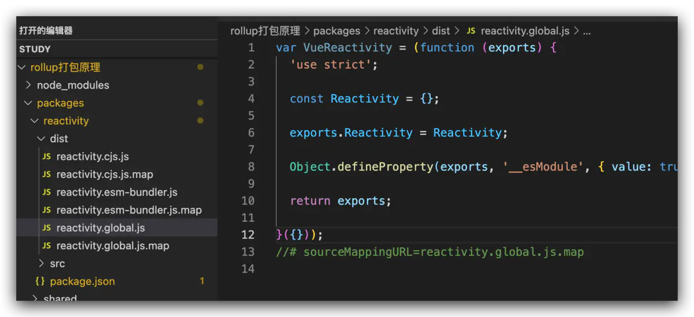

cjs.js会采用commonjs的方法
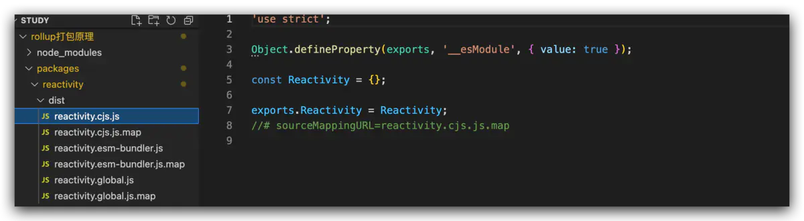

esm-bundler.js 会采用es6的方法
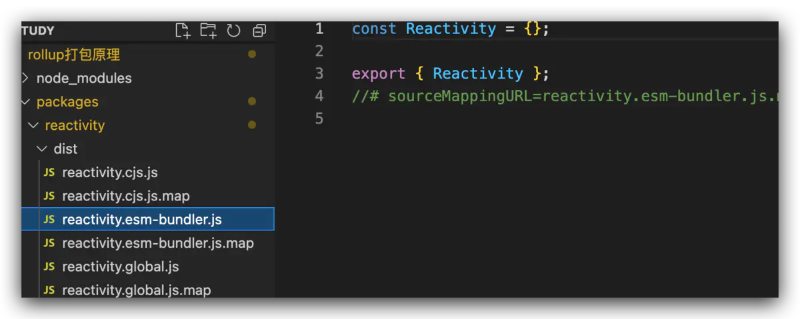


接下来我们处理dev.js打包单个文件。而不是build.js打包所有

首先我们安装yarn add minimist -D -W 来处理我们运行yarn dev时传递的参数

比如我们运行yarn dev --test=123, 我们在dev.js中就可以获取到{test: 123}
```
// dev.js

const execa = require('execa')// 开启子进程 打包， 最终还是rollup来打包的

// 获取 yarn dev --target=xxx 比如 yarn dev --target=reactivity 可以 执行 reactivity打包
const args = require('minimist')(process.argv.slice(2))
const target = args.target

build(target)
/**
 * 对目标进行依次打包，并且是并行打包
 * */
// 打包
async function build(target) {
  // 第一参数 是命令
  // 第二个参数 是rollup 运行时的执行的参数  
  //          -c 采用配置文件 
  //          --environment 设置环境变量 
  //          `TARGET:${target}` 环境变量 里面设置的对象。在rollup 配置文件执行时，可以获取到
  //          SOURCE_MAP 是否生成 sourceMap文件
  // 第三个参数 execa 执行的参数  stdio: 'inherit' 子进程打包的信息 共享给父进程
  await execa('rollup', ['-c', '--environment', [`TARGET:${target}`, `SOURCE_MAP:ture`].join(',')], { stdio: 'inherit' })
}
```
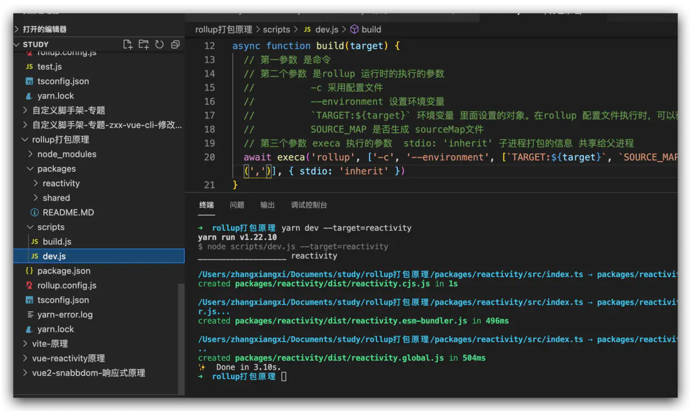

可以看到此时，就单独完成了reactivity 的打包

我们还能去 dev.js中 一直监听文件打包 增加 -w
await execa('rollup', ['-cw',

现在打包好， 但是还有点问题。
我们 yarn install 在node_modules 下会生成一个 @vue 文件夹 下面的
reactivity 和 shared会生成一个软链接，链接到我们写的packages文件夹下的真实文件;

比如： 如果我们要在reactivit中 用 @vue下的shared文件
```
import {shared} from '@vue/shared'

const Reactivity = {

}
export {
  Reactivity
}
```
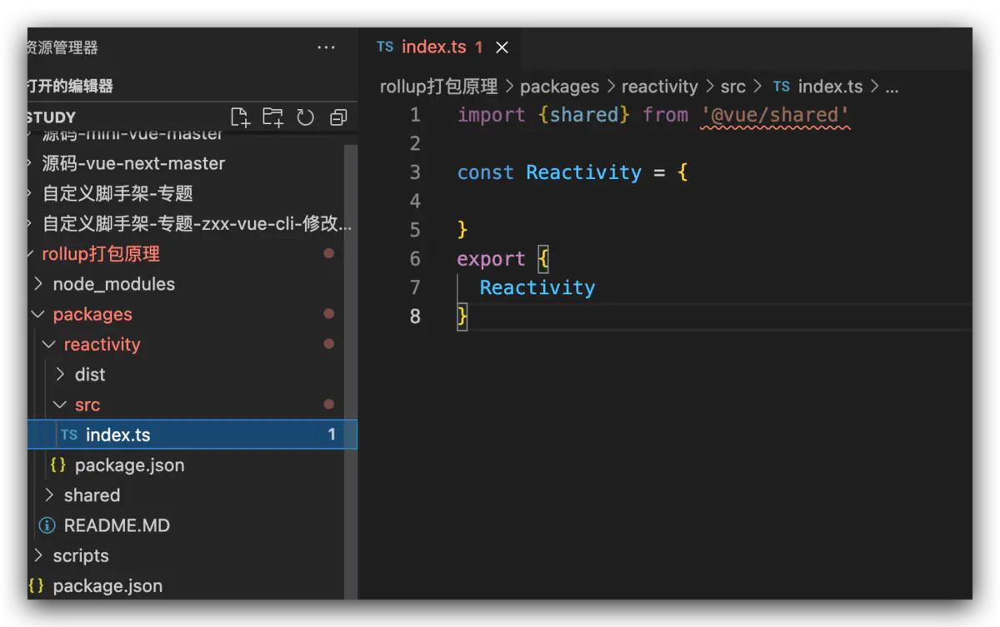

可以看到 @vue/shared 报错，找不到这个模块

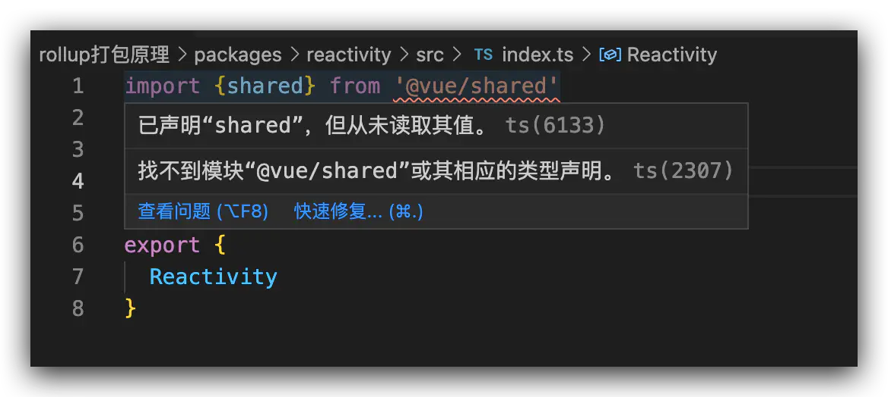

我们需要tsconfig.json中增加配置
```
// 解析规则为  node 
"moduleResolution": "node",
// 做一个映射表  依赖于 baseUrl配置
"paths":{
  "@vue/*": [
    "packages/*/src"
  ]
}, 
// 基本目录
"baseUrl": "./", 
```
然后 把 reactivity/src/index.ts重新打开一下
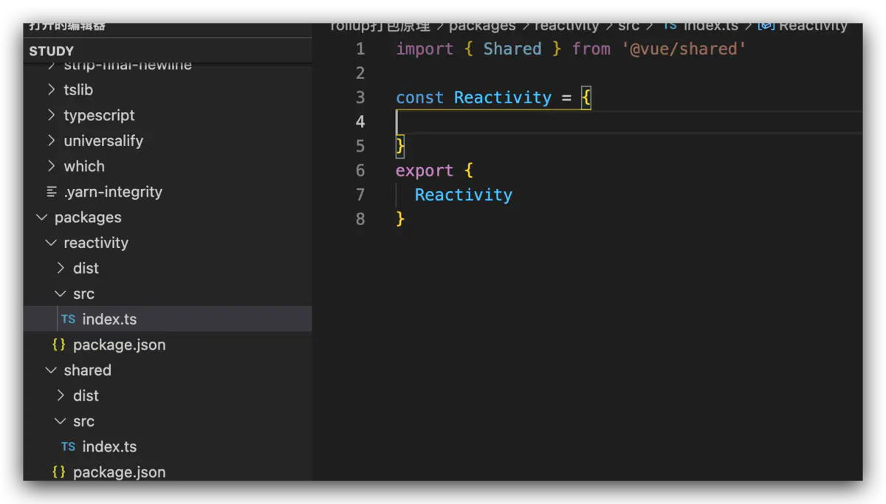

不报错了。我们 点击 安装command 鼠标左键点击 '@vue/shared' 也会跳转到 /packages/shared/src/index.ts 中

ok。下面是 开发文件
ts.config.js
```
{
  // 其他为默认配置
  "compilerOptions": {                       
    "target": "esnext", // esnext 最新的js标准
    "module": "esnext", // 修改为esnext
    "strict": false,    
    "skipLibCheck": true,  
    "forceConsistentCasingInFileNames": true,        
    "esModuleInterop": true,  
    "moduleResolution": "node",
    // 做一个映射表  依赖于 baseUrl配置
    "paths":{
      "@vue/*": [
        "packages/*/src"
      ]
    }, 
    // 基本目录
    "baseUrl": "./"
  }
}
```
rollup.config.js
```
// rollup 配置

import path from 'path'
import ts from 'rollup-plugin-typescript2'
import json from '@rollup/plugin-json'
import resolvePlugin from '@rollup/plugin-node-resolve'

console.log('___________________', process.env.TARGET);
// 根据环境变量中 target 属性，获取对应模块中的 package.json
if (!process.env.TARGET) {
  throw new Error('TARGET package must be specified via --environment flag.')
}

// 获取packages 目录
const packagesDir = path.resolve(__dirname, 'packages')

// 获取要打包的某个包 (打包的基本目录)
const packageDir = path.resolve(packagesDir, process.env.TARGET)

// 获取 对应打包目录 下的文件（这里用来取 package.json文件）
const resolve = p => path.resolve(packageDir, p)

// 获取package.json文件
const pkg = require(resolve(`package.json`))

// 获取 package.json文件中我们自定义的属性 buildOptions
const packageOptions = pkg.buildOptions || {}

// 获取我们 打包后的全局模块命名  
const name = packageOptions.filename || path.basename(packageDir)

//  对打包类型 做一个映射表 ，根据package.json中的 formats 来格式化 需要打包的内容
const outputConfigs = {
  'esm-bundler': {
    file: resolve(`dist/${name}.esm-bundler.js`), // 打包后的文件 
    format: `es` // 采用的 格式
  },
  cjs: {
    file: resolve(`dist/${name}.cjs.js`),
    format: `cjs`
  },
  global: {
    file: resolve(`dist/${name}.global.js`),
    format: `iife` // 立即执行函数
  }
}

// 获取 package.json中 formats
const defaultFormats = ['esm-bundler', 'cjs'] // 默认formats 配置
const inlineFormats = process.env.FORMATS && process.env.FORMATS.split(',') // 环境变量中获取fromats配置
// 首先取 build.js中环境变量 formats 否则 到package.json中取  都没有取默认配置formats
const packageFormats = inlineFormats || packageOptions.formats || defaultFormats

// 循环调用 createConfig 处理 formats (比如： formats=['cjs', 'esm-bundler', 'global'])
const packageConfigs = packageFormats.map(format => createConfig(format, outputConfigs[format]))


function createConfig(format, output) {

  // 如果是全局模式  需要 配置名字
  const isGlobalBuild = /global/.test(format)
  if (isGlobalBuild) {
    output.name = packageOptions.name
  }

  // 生成sourcemap文件
  output.sourcemap = !!process.env.SOURCE_MAP

  // 生成roullup 配置
  return {
    input: resolve('src/index.ts'), // 入口
    output, //出口 就是上面的output
    plugins: [ // 插件  从上到下 
      json(), // import json from '@rollup/plugin-json'
      ts({ // import ts from 'rollup-plugin-typescript2'
        tsconfig: path.resolve(__dirname, 'tsconfig.json')
      }), 
      resolvePlugin(), //import resolvePlugin from '@rollup/plugin-node-resolve'
    ]
  }
}

// 导出配置变量
export default packageConfigs
```
package.json
```
{
  "private": true,
  "workspaces": [
    "packages/*"
  ],
  "scripts": {
    "dev": "node scripts/dev.js",
    "build": "node scripts/build.js"
  },
  "name": "rollup-vue3",
  "version": "1.0.0",
  "main": "index.js",
  "license": "MIT",
  "dependencies": {
    "@rollup/plugin-json": "^4.1.0",
    "@rollup/plugin-node-resolve": "^13.0.0",
    "execa": "^5.0.0",
    "rollup": "^2.48.0",
    "rollup-plugin-typescript2": "^0.30.0",
    "typescript": "^4.2.4"
  }
}
```
scripts/build.js 
```
// 打包 packages 下所有包

const fs = require('fs')
const execa = require('execa')// 开启子进程 打包， 最终还是rollup来打包的

//  读取packages文件夹下所有文件， 并且过滤 
const targets = fs.readdirSync('packages').filter(f => fs.statSync(`packages/${f}`).isDirectory())

/**
 * 对目标进行依次打包，并且是并行打包
 * */
// 打包
async function build(target) {
  console.log('target', target);
  // 第一参数 是命令
  // 第二个参数 是rollup 运行时的执行的参数  
  //          -c 采用配置文件 
  //          --environment 设置环境变量 
  //          `TARGET:${target}` 环境变量 里面设置的对象。在rollup 配置文件执行时，可以获取到
  //          SOURCE_MAP 是否生成 sourceMap文件
  // 第三个参数 execa 执行的参数  stdio: 'inherit' 子进程打包的信息 共享给父进程
  await execa('rollup', ['-c', '--environment', [`TARGET:${target}`, `SOURCE_MAP:ture`].join(',')], { stdio: 'inherit' })
}

// 循环目标 依次打包
function runParallel(targets, iteratorFn) {
  const res = [] // 保存打包结果
  // 遍历
  for (const item of targets) {
    // 依次执行
    const p = iteratorFn(item)
    res.push(p)
  }
  return Promise.all(res)
}
// 执行 
runParallel(targets, build)
```
scripts/dev.js
```
const execa = require('execa')// 开启子进程 打包， 最终还是rollup来打包的

// 获取 yarn dev --target=xxx 比如 yarn dev --target=reactivity 可以 执行 reactivity打包
const args = require('minimist')(process.argv.slice(2))
const target = args.target

build(target)
/**
 * 对目标进行依次打包，并且是并行打包
 * */
// 打包
async function build(target) {
  // 第一参数 是命令
  // 第二个参数 是rollup 运行时的执行的参数  
  //          -c 采用配置文件 
  //          --environment 设置环境变量 
  //          `TARGET:${target}` 环境变量 里面设置的对象。在rollup 配置文件执行时，可以获取到
  //          SOURCE_MAP 是否生成 sourceMap文件
  // 第三个参数 execa 执行的参数  stdio: 'inherit' 子进程打包的信息 共享给父进程
  await execa('rollup', ['-cw', '--environment', [`TARGET:${target}`, `SOURCE_MAP:ture`].join(',')], { stdio: 'inherit' })
}
```

packages/reactivity/package.json
```
{
  "name": "@vue/reactivity",
  "version": "1.0.0",
  "main": "index.js",
  "module": "dist/reactivity.esm-bundler.js",
  "license": "MIT",
  "buildOptions": {
    "name": "VueReactivity",
    "formats": [    
      "cjs", 
      "esm-bundler", 
      "global" 
    ]
  }
}
```
packages/reactivity/src/index.ts
```
import { Shared } from '@vue/shared'

const Reactivity = {

}
export {
  Reactivity
}
```

目录结构
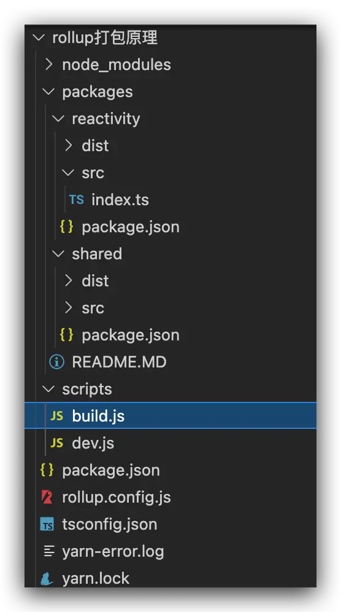

## 资料
[vue3-rollup打包](https://www.jianshu.com/p/3c49f2420f45)

[用rollup打包vue组件库](https://www.jianshu.com/p/464e2bb58eda?utm_campaign=haruki&utm_content=note&utm_medium=seo_notes&utm_source=recommendation)
