## 简单说明原理
::: danger
使用babel-plugin-component实现按需引入、打包。
将webpack配置成多入口，保证最终打包的目录结构符合babel-plugin-component插件要求，实现按需加载
:::
## element源码关于按需引入研究
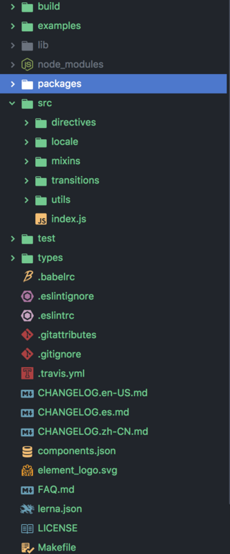

1. build目录中cooking配置文件，cooking是饿了么前端研发的基于webpack的前端构建工具，我们使用原始的webpack实现。此处源码忽略。
2. example中是element项目的例子存放，打开element网页，可看到项目入口
3. packages目录中，是所有功能模块，以alert模块为例，分析目录结构
    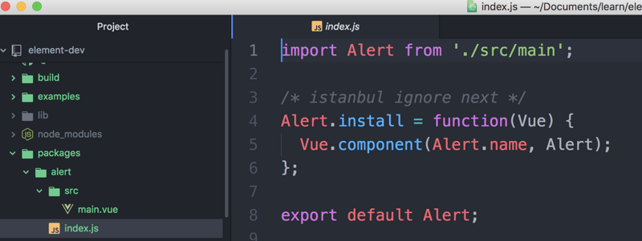
    alert模块目录,有一个index.js作为模块入口，在入口处，引入src目录中的主要组件，在对该组件进行拓展，增加install方法，我们知道，在对vue进行扩展，使用vue.use(...)时，vue内部会调用插件的install方法，此处给alert组件增加install方法，则最终打包完成，按需引入alert功能组件时候，可以使用vue.use(alert)进行注册组件到全局

    其他功能模块的目录结构大同小异，在入口处对组件进行install扩展
4. src目录中存放一些公共的mixin等工具和一个index.js入口文件，这个入口文件是打包后间距所有功能组件的入口，源码，一个个分析
    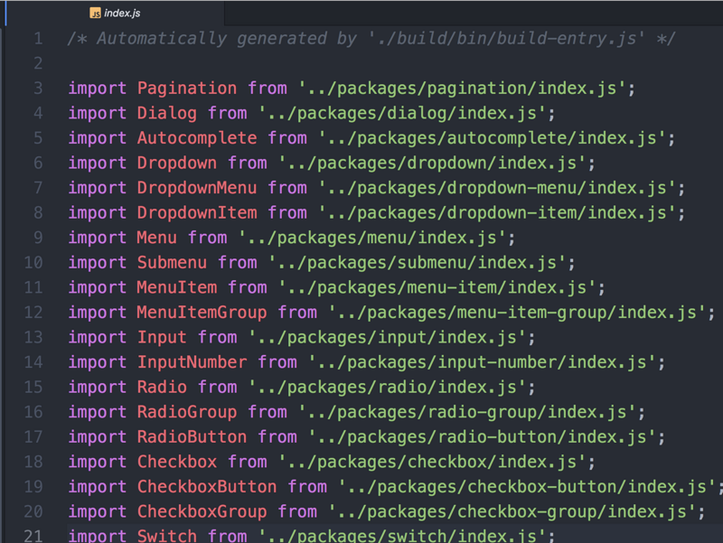
    首先将packages中的各个功能模块引入
    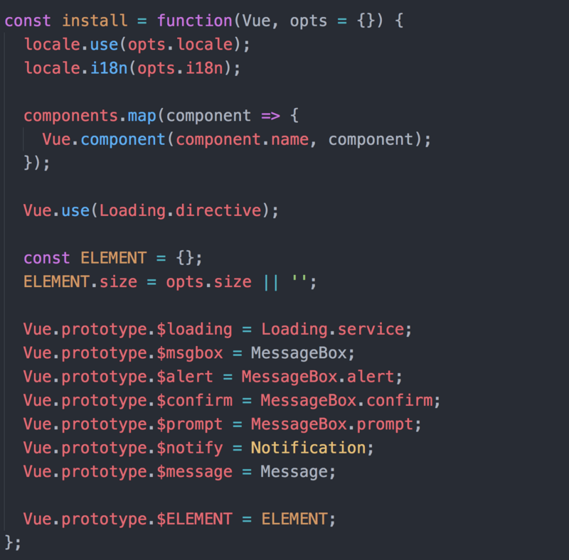
    定义一个install方法，在此方法中，将所有功能模块进行注册。

    ```
    components.map(component => {
        Vue.component(component.name, component);
    })
    ```
    遍历注册

    ```
    Vue.prototype.$loading = Loading.service;
    Vue.prototype.$msgbox = MessageBox;
    Vue.prototype.$alert = MessageBox.alert;
    Vue.prototype.$confirm = MessageBox.confirm;
    Vue.prototype.$prompt = MessageBox.prompt;
    Vue.prototype.$notify = Notification;
    Vue.prototype.$message = Message;
    
    Vue.prototype.$ELEMENT = ELEMENT
    ```
    对vue原型进行扩展，使vue实例中可以直接使用this.$alert等便捷方法
    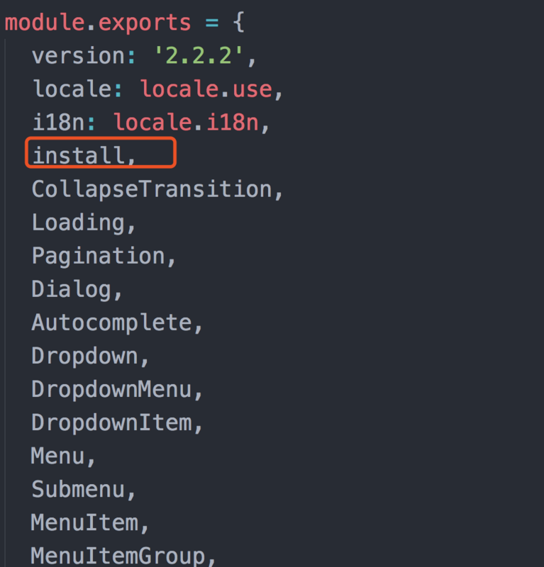
    最后，将所有功能模块和install方法一起导出。这样当引入element-ui时，便可以使用vue.use(element-ui)进行注册，即将所有功能组件进行全局注册

5. lib目录是按babel-plugin-component插件要求打包后存放最终代码的目录
    详细看看这个目录中的结构
    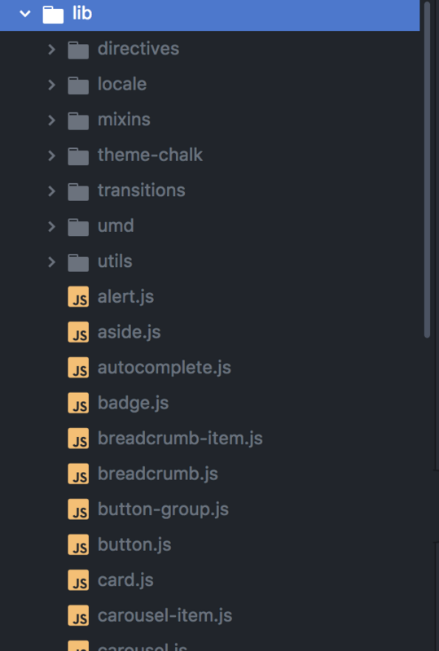

目录中，将各个功能模块打包成了一个.js文件，在theme-chalk中，存放着名称和功能模块相同的.css文件。为何要这样打包？？这就进入我们的重点，看看babel-plugin-component插件的文档
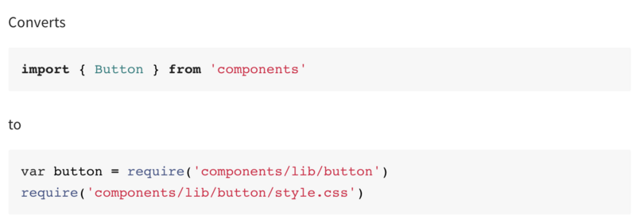
**<span style="color: red">import { Button } from 'antd'会被解析成同时引入and/lib/button/index.js和引入lib/button/style.css这就是这个插件为我们带来的按需引入的功能。插件会去解析你的代码，当你引入的是配置的modules中某一部分时，自动为你解析，只为你的项目引入指定的部分。</span>**

这个插件有几种目录结构的配置方案，刚刚解释的只是其中一种，我们来看element-ui采用的也是我们要使用的一种：
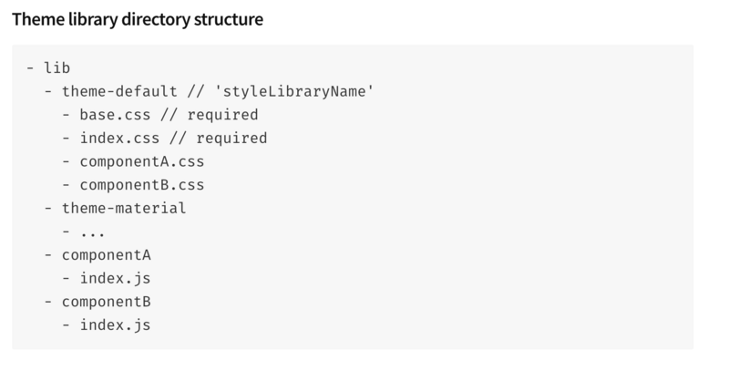
**<span style="color: red">在lib下，存在几个模块componentA、componentB，当import {compoentA} from '...'会被解析成从lib/componentA,此时，这个componentA若是目录，则进入目录找目录入口，也就是index.js，若componentA是个.js文件，则直接引入这个文件。</span>**

**<span style="color: red">在lib下，存在几个模块componentA、componentB，当import样式文件会通过你的bablerc配置，从lib中指定的目录中去引入同名文件</span>**

看看bablerc中的相关配置：
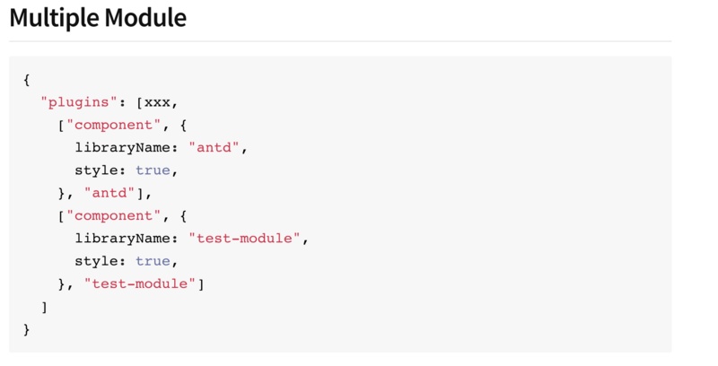

在plugins中，增加component配置，component相关option配置：
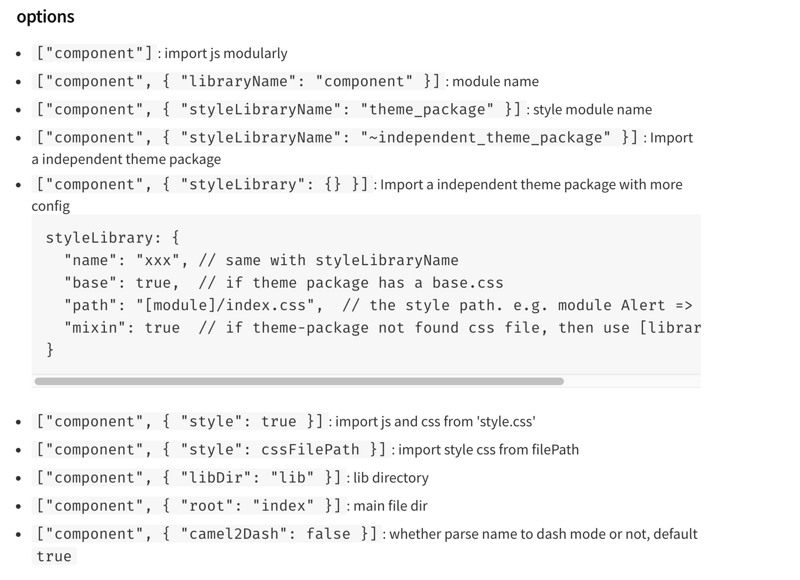
看看element官网说明的配置：
```
{
    "presets": [["es2015", {"modules": false}]], 
    "plugins": [
        [
            "component",
            {
                "libarayName": "element-ui",
                "styleLibraryName": "theme-chalk"
            }
        ]
    ]
}
```
配置了libraryName和styleLibraryName。

好，到此element的分析及babel-plugin-componentbable插件的说明暂时告一段落。
咱们继续看我们如何去实现。

## 个人实现，按需引入
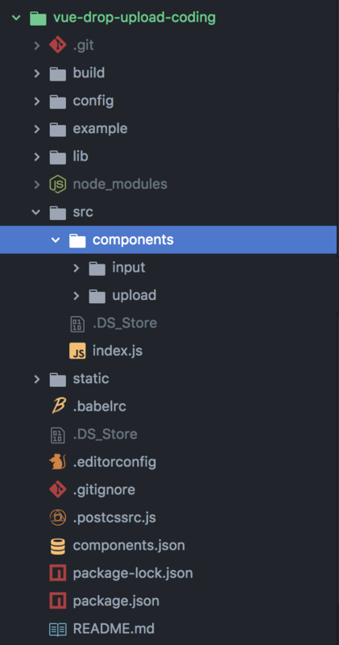
项目是用vue-cli搭建的项目
1. build是webpack相关配置
2. example目录是开发时候调试用的
3. src目录中components中各个功能模块，各功能模块的入口中同element一样，对组件进行扩展，增加install方法，将组件进行全局注册，index.js是入口，其中引入所有功能模块，同事导出模块和install方法，将所有模块注册。
4. lib中是最终打包的目标目录
5. 增加components.json文件
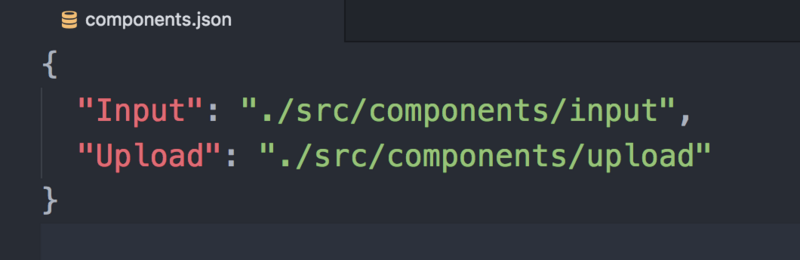
记录将要打包的功能模块名称和路径

### webpack相关配置和更改
规划中，需要将各个模块打包至lib，一个功能模块为一个.js文件，并且在theme目录中存在一个同名的.css文件，这样使用时借助babel-plugin-component插件就可实现按需引入。还需要一个总的index.js包含所有的功能模块，和一个index.css包含所有的样式。

这里采用多入口(entry)配置，实现各个功能模块分别打包成一个.js文件，并使用extract-text-webpack-plugin将样式进行抽离后，按入口chunk进行打包为对应的.css文件。
当将需要打包至一起是，使用单个入口，抽离所有css到一个css文件。

所以完成打包目标需要执行两个打包命令，看package.json相关配置：
```
"scripts": {
    "dev": "webpack-dev-server --inline --progress --config build/webpack.dev.conf.js",
    "start": "npm run dev",
    "build": "node build/build.js",
    "build_all": "node build/build.js all"
 }
```


## 资料
[实现element-ui的按需引入，按需打包加载](https://blog.csdn.net/weixin_34066347/article/details/88758377)