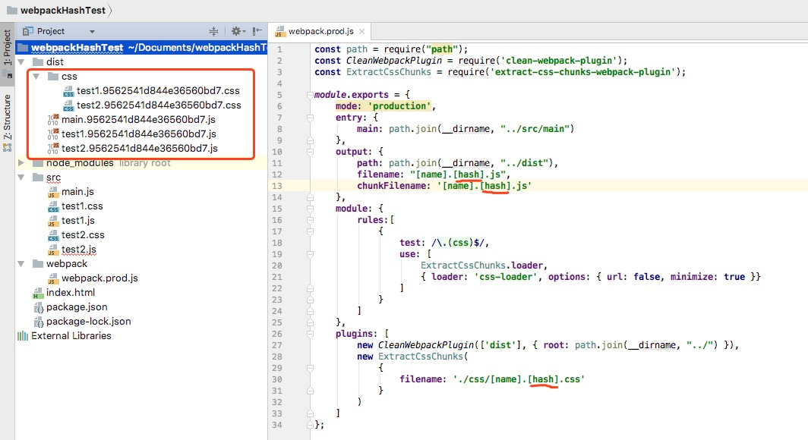
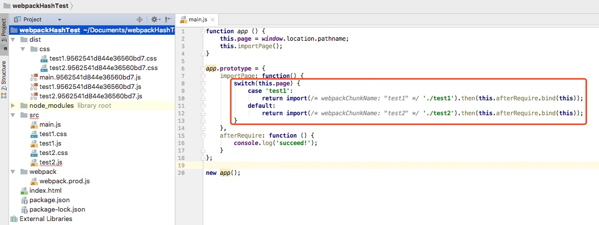
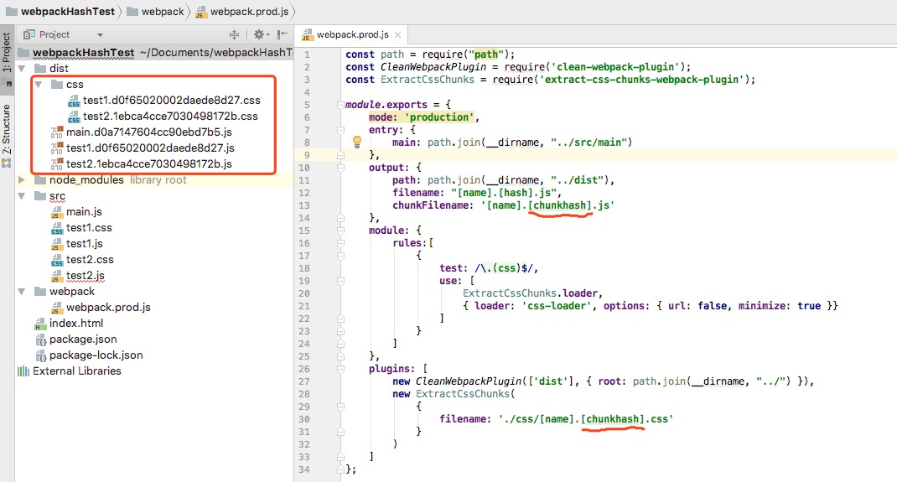
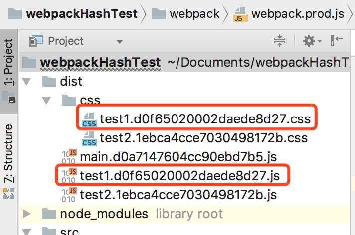
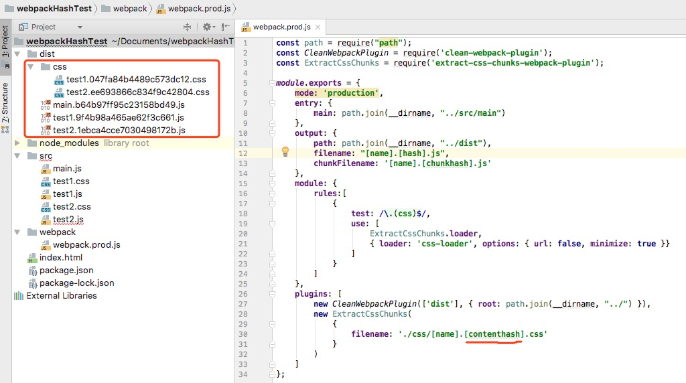

webpack中对于输出文件名可以有三种hash值
1. hash
2. chunkhash
3. contenthash

## hash
如果都使用hash的话，因为这是工程南级别的，即每次修改任何一个文件，所有文件名的hash都将改变。所以一旦修改了任何一个文件，整个项目的文件缓存都将失效。如：

从上图清晰的看到每个压缩后的文件hash值是一样的，所以对于没有改变的模块而言，这样做显然不恰当，因为缓存失效了嘛，此时，chunkhash的用途随之而来

## chunkhash
chunkhash根据不同的入口文件(Entry)进行依赖文件的分析、构建对应的chunk，生成对应的哈希值。在生成环境里把一些公共库和程序入口文件区分开，单独打包构建，接着我们采用chunkhash方式生成哈希值，那么之哟啊我们不改动公共库的代码，就可以保证其哈希值不会受到影响。并且webpack4中支持了异步import功能，故chunkhash也作用于此

我们将各个模块的hash值(除主干文件)改为chunkhash，然后重新build一下，可得到图：

我们可以清晰的看到每个chunk模块的hash是不一样了。

但是这样又有一个问题，因为我们是将样式作为模块import到javascript文件中的，所以他们的chunkhash是一致的，如test1.js和test1.css

这样就会有个问题，只要对应css或者js改变，与其关联的文件hash值也会改变，但其内容并没有改变呢，所以没有达到缓存依依。故contenthash随之而来

## contenthash
contenthash是针对文件内容级别的，只要你自己的模块的内容改变了，那么hash值才会改变，所以我们可以通过contentHash解决上诉问题

## 资料
[原文](https://www.cnblogs.com/giggle/p/9583940.html)