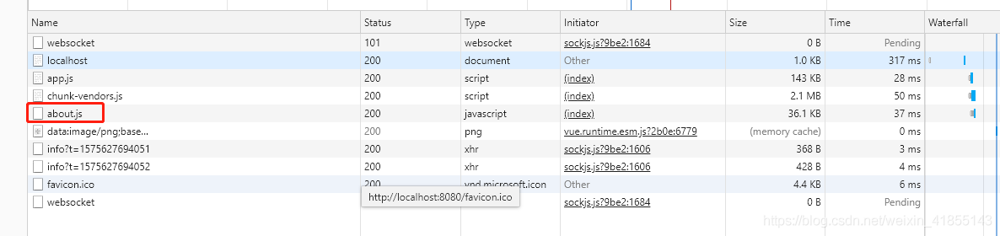

```
// 官方提供的路由懒加载的写法
{
    path: '/about',
    name: 'about', 
    component: () => import(/* webpackChunkName: "about" */ '../views/About.vue')
}
```
vue-cli3中模板提供了路由懒加载的写法，/* webpapckChunkName: "about" */ 是指about.vue的js代码提取到about.[hash].js上，减少入口js文件的体积，提高加载性能。

但我在chrome的dev tools中看到了about路由居然在首页就加载了



这就奇怪了，官方案例还会出错，于是查了下有没有其他人遇到相同的问题。最后发现是prefetching和preloading这两个html5的新特性(Resource Hint)在影响架子啊。

由于vue-cli是使用webpack进行编译和打包的，本文对prefetching和preloading的研究从webpack的官方文档分析，html的特性请自行百度

## prefetching
webpack4.6.0以上支持prefetching特性
> prefetch是一种resource hint，用来告诉浏览器在页面加载完成后，利用空闲时间提前获取用户未来可能会访问的内容

两个关键词，**空闲时间和未来**，空闲时间表明这个预加载的内容是不会影响当前页面的加载，未来表明这个内容是当前页面不需要呈现的内容。这样子，岂不是和路由懒加载的理念冲突了呢？那就把prefetch给关了吧，在vue.config.js增加如下配置
```
// vue.config.js
module.exports = {
    chainWebpack: config => {
        // 移除prefetch插件
        config.plugins.delete('prefetch');

        // 或者
        // 修改它的选项
        config.plugin('prefetch').tap(options => {
            options[0].fileBlacklist = options[0].fileBlacklist || []
            options[0].fileBlacklist.push(/myasyncRoute(.)+?.js$/)
            return options
        })
    }
}
```
**这样就解决了路由无法懒加载的问题了。**

**但是！！！** 这个预加载是不会影响当前页面的加载性能的，因此预加载是可以被保留的，那在什么情况下我们需要禁用预加载呢？当然是对流量损耗敏感（移动端）的应用场景，在首页对子页面进行全面的预加载，而用户可能只需要跳转其中的一两个子页面甚至停留在首页，造成大量的流量浪费。因此，需要做到控制特定的路由预加载。首先，先移除prefetch插件，然后按需添加预加载。

```
import(/* webpackPrefetch: true */ './someAsyncComponent.vue')
```
这样就能做到按需预加载了。

## preloading
webpack4.6.0以上支持的特性
> preloading是一种resource hint，用来指定页面加载后很快会被用到的资源，所以在页面加载过程中，我们希望在浏览器开始主题渲染之前尽早preload

preloading用于提高资源加载的优先级，当页面开始加载时，我们总是想核心的代码或资源得到优先处理，因此可以通过preloading提高优先级
```
import(/* webpackPreload: true */ 'ChartingLibary')
```
但是在webpack上有一句提醒

:::danger
Using webpackPreload incorrectly can actually hurt performance, so be careful when using it.
错误的使用webpackPreload实际上会影响性能，因此要谨慎使用。
:::

如果把一个体积巨大的资源放在最高优先级加载，页面可能会长时间空白，用户体验体验非常差，因此，慎用。

目前，我依然没有找到如何在vue中使用preloading的方法，官网没有代码案例，webpack上的方法也无法在vue中实现，暂时先记录下来，等调通后再来更新，如果知道这一块的，不妨留言传授，十分感谢！

## 最后
懒加载优化了首屏加载的速率
prefetch预加载优化了子页面加载的速率
amazing~

## 资料
[vue-cli3中关于prefetch、preload和路由懒加载的研究](https://blog.csdn.net/weixin_41855143/article/details/103427765)


