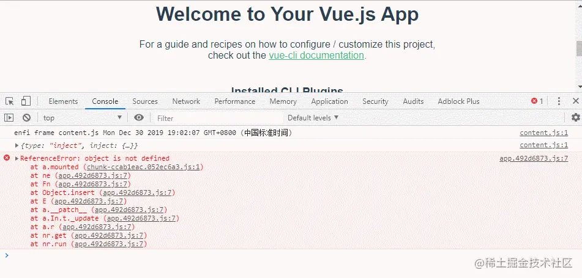
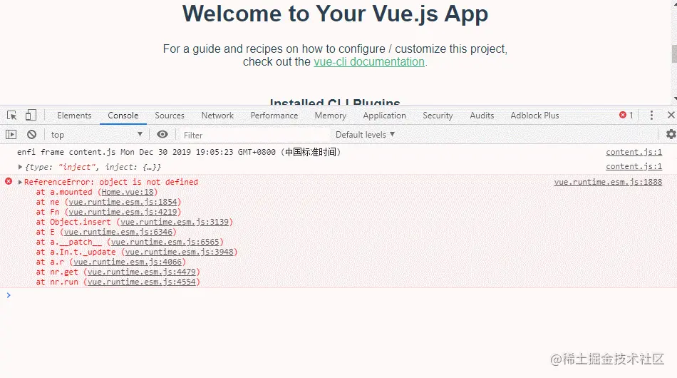
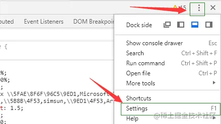
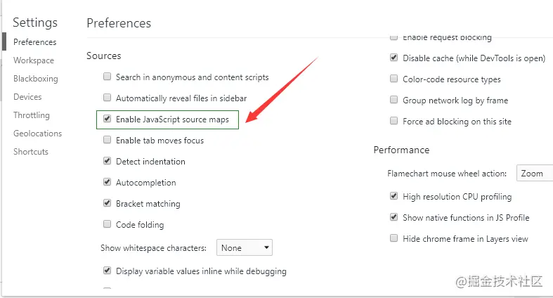
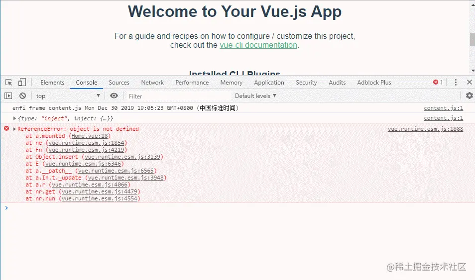
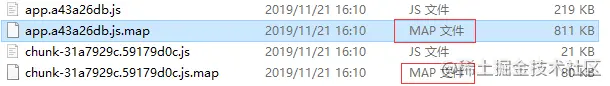
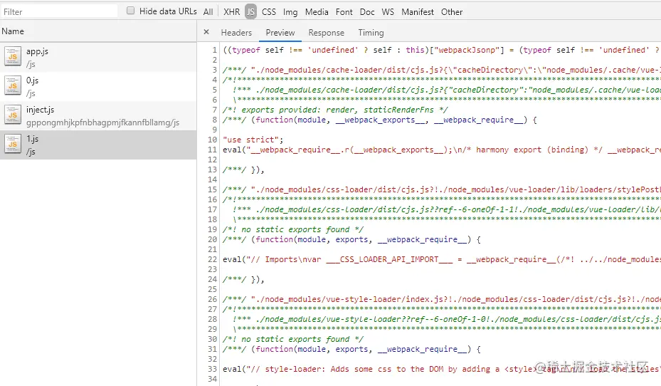

## sourceMap的作用
通常,js代码出错,控制台会提示第几行第几列代码出错。但是webpack打包压缩后的代码，都被压缩到了一行，变量也变成了a,b,c,d。代码出错，控制台就没办法正确的提示错误位置。

sourceMap就可以解决这个问题。sourceMap就是一个信息文件，里面存储着打包前的位置信息。也就是说转换后的代码的每一个位置，所对应的转换前的位置。具体编码,[可以看下阮一峰的文章](https://link.juejin.cn/?target=http%3A%2F%2Fwww.ruanyifeng.com%2Fblog%2F2013%2F01%2Fjavascript_source_map.html)

有了它，出错的时候，浏览器控制台将直接显示原始代码出错的位置，而不是转换后的代码，点击出错信息将直接跳转到原始代码位置


## sourceMap的调试
1. Console直接点击错误提示跳转到源码(如上图所示)
  一般浏览器会默认开启sourceMap调试，如果控制台不能显示源码错误位置，则需要打开配置。
  
  
  打开浏览器的这个设置后，控制台的Console面板的错误提示，直接点击就会跳转到对应的源文件出错位置。

2. Source面板找到源文件，进行断点调试
  如果Console没报错，但是也没显示不正确。可以点击控制台的Source面板，源文件都在webpack://目录下，或者直接搜索文件，打开源文件进行断点调试。

  > 按需加载的路由，只有页面加载了，源文件才会在这个目录下显示
  

## webpack配置

vue-cli3的vue.config.js文件:
```
module.exports = {
  productionSourceMap: false, // 默认是true
}
```
打包后的文件


对于打包后的sourceMap，[webpack提供多重类型的配置](https://webpack.docschina.org/configuration/devtool/#devtool)

devtool | 构建速度 | 重新构建速度 | 生成环境 | 品质(quality)
--- | --- | --- | --- | ---
(none) | +++ | +++ | yes | 打包后的代码
eval | +++ | +++ | no | 打包后的代码
cleap-eval-source-map | + | ++ | no | 打包后的代码(仅限行)
cleap-module-eval-source-map | o | ++ | no | 原始源代码(仅限行)
eval-source-map | -- | + | no | 原始源代码
cheap-source-map | + | o | yes | 转换过的代码(仅限行)
cheap-moudule-source-map | o | - | yes | 原始源代码(仅限行)
inline-cheap-source-map | + | o | no | 转换过的代码(仅限行)
inline-cheap-module-source-map | o | - | no | 原始源代码(仅限行)
source-map | -- | -- | yes | 原始源代码
inline-source-map | -- | -- | no | 原始源代码
hidden-source-map | -- | -- | yes | 原始源代码
nosources-source-map | -- | -- | yes | 无源代码内容

> +++ 非常快速 ++ 快速 + 比较快 o 中等 - 比较慢 -- 慢

其中，开发环境使用:
  - eval: 会把每个模块封装到eval里包裹起来执行，并且会在末尾追加map文件的地址。map文件映射到转换后的代码(可执行的js文件)，而不是映射到原始文件(vue文件)，所以不能正确的显示错误行数
  

  - eval-source-map: 和eval类似，为每个模块生成原始的sourceMap，map文件会以dataURL的形式添加到js中(类似于图片的base64形式)。原始的sourceMap可以争取提示错误行数

  - cheap-module-eval-source-map: 与eval-cheap-source-map相同,但是包含了不同loader模块之间的sourceMap


## 资料
[你所不知道的sourceMap](https://juejin.cn/post/6844903971648372743)


