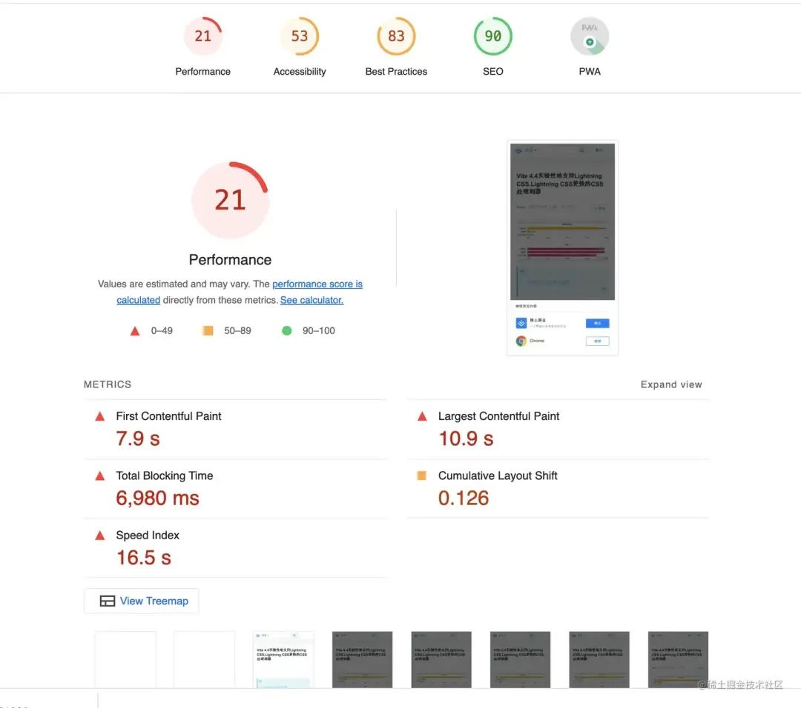
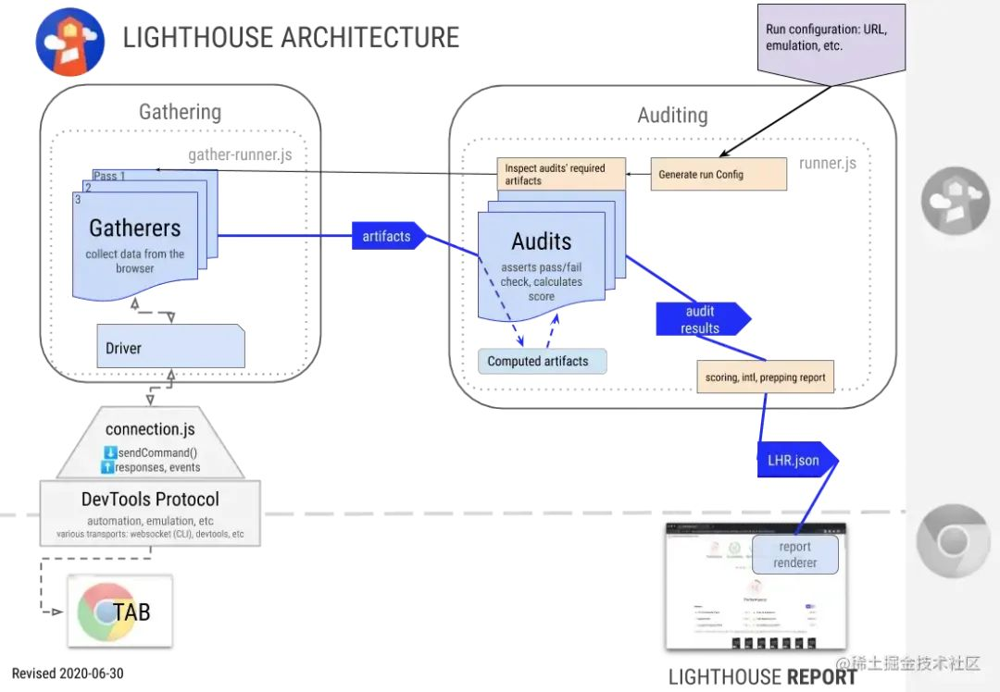
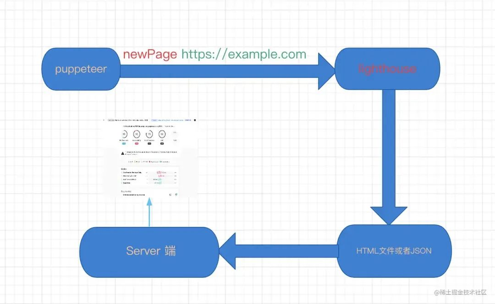
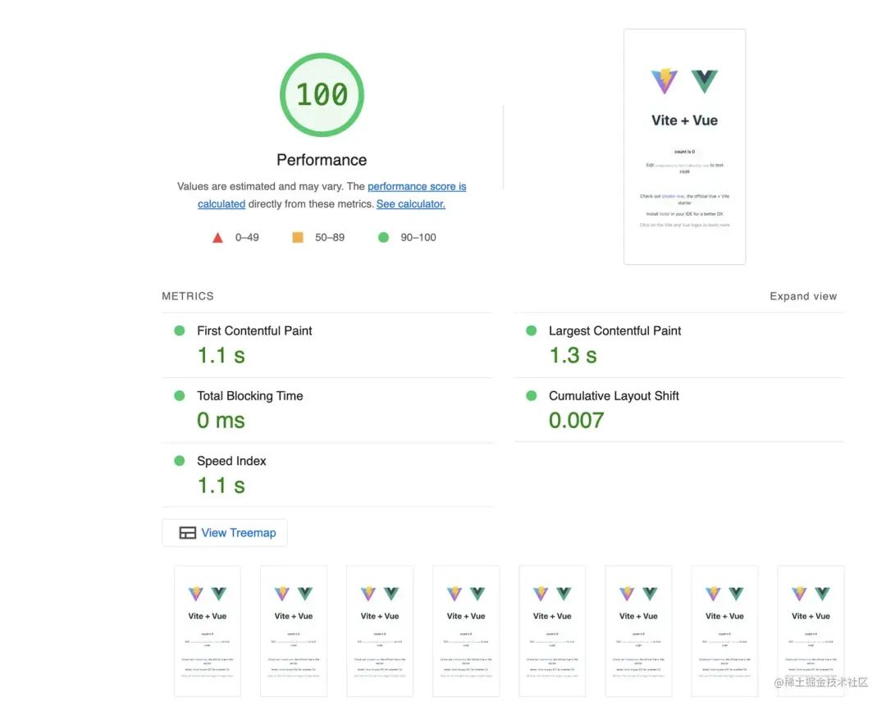
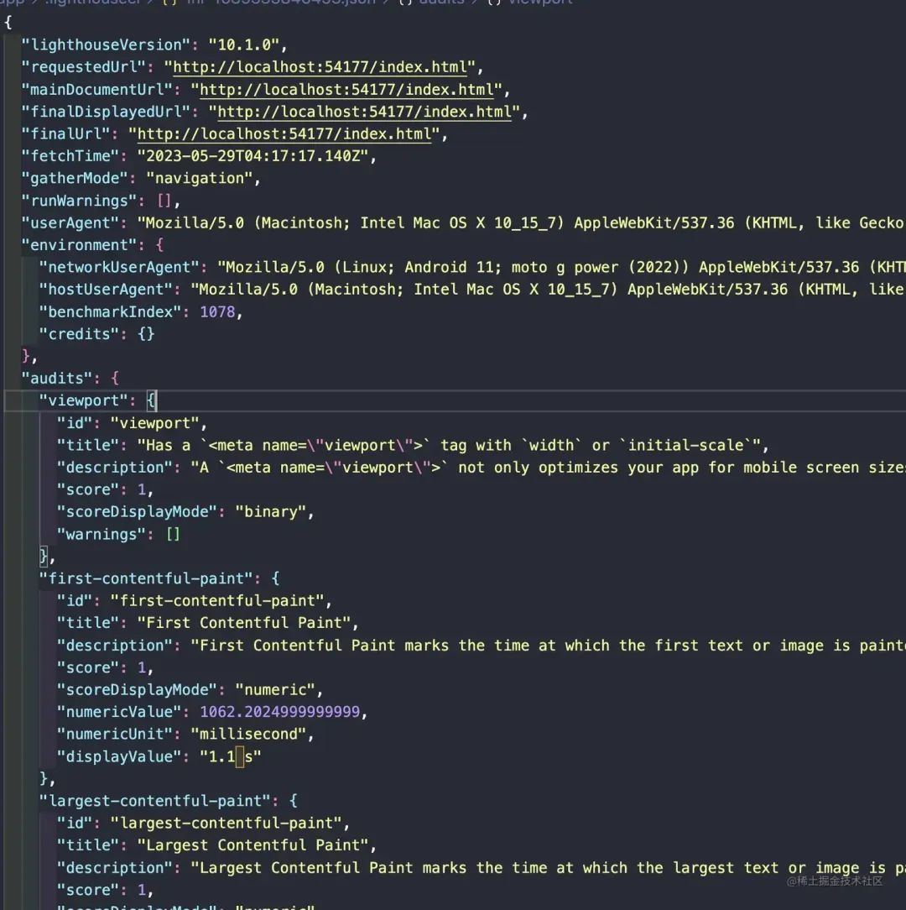
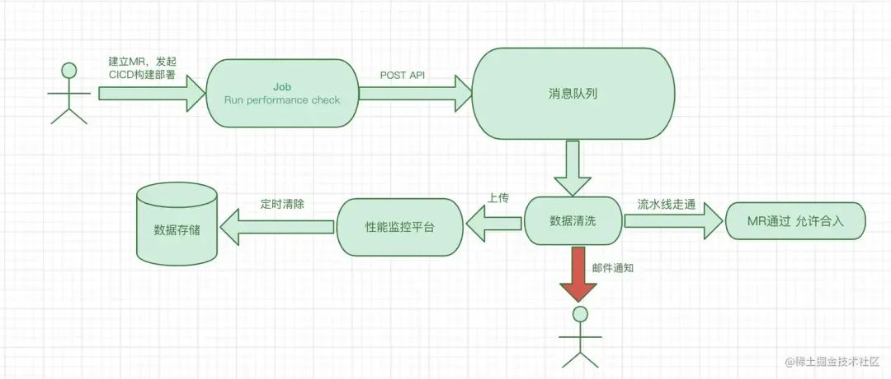

## 前言
:::tip
由于老板比较关注性能方面的指标，比如首页打开速度，所以一般会关注FP,FCP等等指标,所以一般项目写完以后都会用 lighthouse 查看，或者接入性能监控系统采集指标
:::



但是会出现两个问题，如果采用第一种方式，使用 lighthouse 查看性能指标，这个的以来 开发自身的积极性，他要开发完就merge上线，你也不知道具体指标怎么样。如果采用第二种方式，那么同样是发布到线上才能查看。**最好的方式是能强制要求开发在还没有发布的时候使用 lighthouse 查看一下**,那么在什么阶段做这个策略呢。聪明的同学可能想到，能不能在 CICD 构建阶段加上策略。其实是可以的，谷歌也想到了这个场景，提供性能守卫这个 lighthouse 插件

## 性能守卫
:::tip
性能守卫是一种系统或工具，用于监控和管理应用程序或系统的性能。它旨在确保应用程序在各种负载和使用情况下能够提供稳定和良好的性能。
:::
Lighthouse是一个开源的自动化工具，提供了四种使用方式
- Chrome DevTools
- Chrome插件
- Node CLI
- Node模块



其架构实现图是这样的，有兴趣的同学可以深入了解一下

这里我们我们借助Lighthouse Node模块继承到CICD流程中，这样我们就能在构建阶段知道我们的页面具体性能，如果指标不合格，那么就不给合并MR

## 剖析 lighthouse-ci 实现
[lighthouse-ci](https://github.com/GoogleChrome/lighthouse-ci) 实现机制很简单，核心实现步骤如图，差异就是 lighthouse-ci 实现了自己的server端，保持导出的性能指标数据，由于公司一般对这类数据敏感，所以一般只需要导出对应的数据指标JSON，上传到我们自己的平台就行了



接下来，我们就来看看 lighthouse-ci 实现步骤
```js
const browser = await puppeteer.launch();
```
1. 启动浏览器实例--CLI通过Puppeteer启动一个Chrome实例

    ```js
    const page = await browser.newPage();
    ```
2. 创建新的浏览器标签页--CLI创建一个新的标签页(或称为页面)

    ```js
    await page.goto('https://example.com')
    ```
3. 导航到目标URL--CLI命令浏览器加载指定URL
4. 收集数据-- 在加载页面的同时，CLI使用各种Chrome提供的API收集数据，包括网络请求数据、Javascript执行时间、页面渲染时间等。
5. 运行审计--数据收集完成后，CLI将这些数据传递给Lighthouse核心，该核心运行一些列预定义的审计

    ```js
    const report = await lighthouse(url, opts, config).then(results => {
        return results.report;
    })
    ```
6. 生成和返回报告--最后，审计结果被用来生成一个JSON或HTML格式的报告

    ```js
    await browser.close();
    ```
7. 关闭浏览器实例: 报告生成后，CLI关闭Chrome实例

```js
const puppeteer = require('puppeteer');
const lighthouse = require('lighthouse');
const {URL} = require('url');

async function run() {
    // 使用 puppeteer 连接到 Chrome 浏览器
    const browser = await puppeteer.launch({
        headless: true,
        args: ['--no-sandbox', '--disabled-setuid-sandbox'],
    });

    // 新建一个页面
    const page = await browser.newPage();

    // 在这里，你可以执行任何Puppeteer代码例如
    // await page.goto('https://example.com');
    // await page.click('button');

    const url = 'https://example.com';

    // 使用Lighthouse 进行审查
    const {lhr} = await lighthouse(url, {
        port: new URL(browser.wsEndpoint()).port,
        output: 'json',
        logLevel: 'info',
    })

    console.log(`Lighthouse score: ${lhr.categories.performance.score * 100}`);

    await browser.close();
}
run();
```
导出的HTML文件



导出的JSON数据



## 实现一个性能守卫插件
在实现一个性能守卫插件，我们需要考虑一下因素
1. 易用性和灵活性
2. 稳定性和可靠性
3. 性能
4. 可维护性和扩展性
5. 报告和通知
6. 集成
7. 安全性



```js
// 伪代码
// prefci插件
const puppeteer = require('puppetter');
const lighthouse = require('lighthouse');
const {port} = new URL(browser.wsEndpoint());

async function runAudit(url) {
    const browser = await puppeteer.launch();
    const {lhr} = await lighthouse(url, {
        port, 
        output: 'json',
        logLevel: 'info',
    })
    await browser.close();

    // 在这里定义你的性能瓶颈
    const performanceScore = lhr.categories.performance.score;
    if(proformanceScore < 0.9) { // 如果性能得分低于0.9 脚本抛出异常
        throw new Error(`Performance score of ${performanceScore} is below the threshold of 0.9`);
    }
}
runAudit('https://example.com').catch(console.error);
```
使用
```shell
name: CI
on: [push]
jobs:
  lighthouseci:
    runs-on: ubuntu-latest
    steps:
      - uses: actions/checkout@v3
      - uses: actions/setup-node@v3
        with:
          node-version: 16
      - run: npm install && npm install -g @lhci/cli@0.11.x
      - run: npm run build
      - run: perfci autorun
```
### 性能审计
```js
const lighthouse = require('lighthouse');
const puppeteer = require('puppeteer');
const nodemailer = require('nodemailer');

// 配置邮件发送器
const transporter = nodemailer.createTransport({
  service: 'gmail',
  auth: {
    user: 'your-email@gmail.com',
    pass: 'your-password',
  },
});

// 定义一个函数用于执行Lighthouse审计并处理结果
async function runAudit(url) {
  // 通过Puppeteer启动Chrome
  const browser = await puppeteer.launch({ headless: true });
  const { port } = new URL(browser.wsEndpoint());

  // 使用Lighthouse进行性能审计
  const { lhr } = await lighthouse(url, { port });

  // 检查性能得分是否低于阈值
  if (lhr.categories.performance.score < 0.9) {
    // 如果性能低于阈值，发送警告邮件
    let mailOptions = {
      from: 'your-email@gmail.com',
      to: 'admin@example.com',
      subject: '网站性能低于阈值',
      text: `Lighthouse得分：${lhr.categories.performance.score}`,
    };
    
    transporter.sendMail(mailOptions, function(error, info){
      if (error) {
        console.log(error);
      } else {
        console.log('Email sent: ' + info.response);
      }
    });
  }

  await browser.close();
}

// 使用函数
runAudit('https://example.com');
```
### 数据告警
```js
// 伪代码
const lighthouse = require('lighthouse');
const puppeteer = require('puppeteer');
const nodemailer = require('nodemailer');

// 配置邮件发送器
const transporter = nodemailer.createTransport({
  service: 'gmail',
  auth: {
    user: 'your-email@gmail.com',
    pass: 'your-password',
  },
});

// 定义一个函数用于执行Lighthouse审计并处理结果
async function runAudit(url) {
  // 通过Puppeteer启动Chrome
  const browser = await puppeteer.launch({ headless: true });
  const { port } = new URL(browser.wsEndpoint());

  // 使用Lighthouse进行性能审计
  const { lhr } = await lighthouse(url, { port });

  // 检查性能得分是否低于阈值
  if (lhr.categories.performance.score < 0.9) {
    // 如果性能低于阈值，发送警告邮件
    let mailOptions = {
      from: 'your-email@gmail.com',
      to: 'admin@example.com',
      subject: '网站性能低于阈值',
      text: `Lighthouse得分：${lhr.categories.performance.score}`,
    };
    
    transporter.sendMail(mailOptions, function(error, info){
      if (error) {
        console.log(error);
      } else {
        console.log('Email sent: ' + info.response);
      }
    });
  }

  await browser.close();
}

// 使用函数
runAudit('https://example.com');
```

### 处理设备、网络不稳定情况
```js
// 伪代码

// 网络抖动
const { lhr } = await lighthouse(url, {
    port,
    emulatedFormFactor: 'desktop',
    throttling: {
        rttMs: 150,
        throughputKbps: 1638.4,
        cpuSlowdownMultiplier: 4,
        requestLatencyMs: 0,
        downloadThroughputKbps: 0,
        uploadThroughputKbps: 0,
    }
}) 

// 设备
const { lhr } = await lighthouse(url, {
  port,
  emulatedFormFactor: 'desktop', // 这里可以设定为 'mobile' 或 'desktop'
});
```

### 用户登录态问题
```js
const puppeteer = require('puppeteer');
const lighthouse = require('lighthouse');
const fs = require('fs');
const axios = require('axios');
const { promisify } = require('util');
const { port } = new URL(browser.wsEndpoint());

// promisify fs.writeFile for easier use
const writeFile = promisify(fs.writeFile);

async function runAudit(url, options = { port }) {
    // 使用 Puppeteer 启动 Chrome
    const browser = await puppeteer.launch();
    const page = await browser.newPage();

    // 访问登录页面
    await page.goto('https://example.com/login');

    // 输入用户名和密码
    await page.type('#username', 'example_username');
    await page.type('#password', 'example_password');

    // 提交登录表单
    await Promise.all([
        page.waitForNavigation(), // 等待页面跳转
        page.click('#login-button'), // 点击登录按钮
    ]);

    // 运行Lighthouse
    const { lhr } = await lighthouse(url, options);

    // 保存审计结果到JSON文件
    const resultJson = JSON.stringify(lhr);
    await writeFile('lighthouse.json', resultJson);

    // 上传JSON文件到服务器
    const formData = new FormData();
    formData.append('file', fs.createReadStream('lighthouse.json'));
    
    // 上传文件到你的服务器
    const res = await axios.post('https://your-server.com/upload', formData, {
        headers: formData.getHeaders()
    });

    console.log('File uploaded successfully');
    
    await browser.close();
}

// 运行函数
runAudit('https://example.com')
```

## Puppeteer
```js
const Koa = require('koa');
const Router = require('koa-router');
const puppeteer = require('puppeteer');
const app = new Koa();
const router = new Router();
router.get('/ssr', async (ctx, next) => {
  const url = 'http://your-domain.com'; // 目标网站URL
  const browser = await puppeteer.launch(); // 启动Puppeteer浏览器
  const page = await browser.newPage(); // 创建一个新页面
  await page.goto(url, {waitUntil: 'networkidle2'}); // 跳转到目标网站并等待页面完全加载
  const html = await page.content(); // 获取页面HTML代码
  await browser.close(); // 关闭浏览器
  ctx.body = html; // 将HTML代码返回给前端
});
app.use(router.routes());
app.listen(4000, () => {
  console.log('Server is running at http://localhost:4000');
});
```

## 资料
[原文](https://juejin.cn/post/7253331974051823675)

[性能测评工具lighthouse的使用](https://www.cnblogs.com/wenxuehai/p/14236426.html#_label5)


[自研前端性能监控平台之 Lighthouse 篇](https://heapdump.cn/article/3469499)

[Lighthouse CI](https://github.com/GoogleChrome/lighthouse-ci/blob/main/README.md)

[demo](https://github.com/hchiam/learning-lighthouse-ci/tree/master)