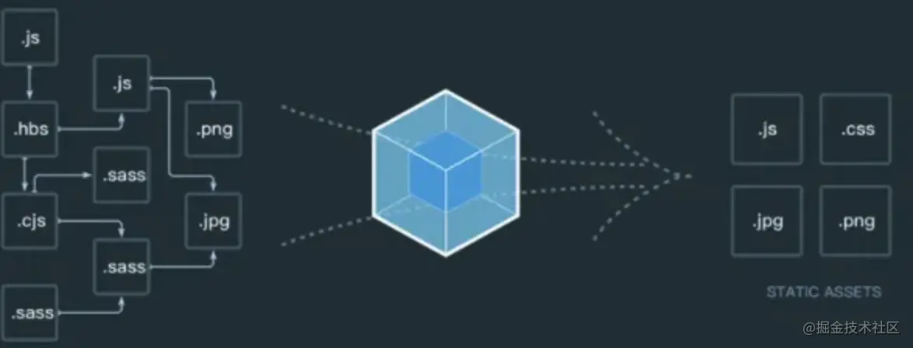
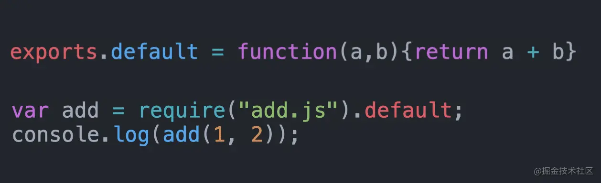
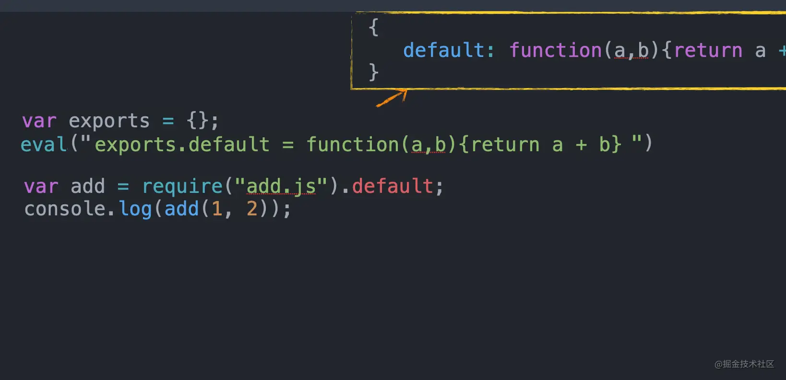
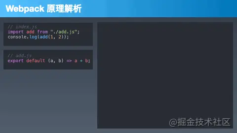

## 什么是webpack

webpack是一个打包工具，他的宗旨是一切静态资源皆可打包。



## 原理分析

首先我们通过一个制作一个打包文件的原型

假设有两个js模型，这里我们先假设这两个模型是符合commonjs标准的es5模块.

语法和模块化规范转换的事我们先放一放，后面说。

我们的目的是将这两个模块大包围一个能在浏览器运行的文件，这个文件其实叫bundle.js

```
// index.js
var add = require('add.js').default;
console.log(add(1, 2));

// add.js
export.default = function(a, b) { return a + b; }
```

假设在浏览器中直接执行这个程序肯定会有问题，最主要的问你题是在浏览器中没有exports对象与require方法所以一定会报错。

我们需要通过模拟export对象和require对象。

### 模拟export对象

首先我们知道在nodejs打包的时候我们会使用fs.readfileSync()来读取js文件。这样的话js文件会是一个字符串。而如果我们将字符串.而如果需要将字符串中的代码运行会有两个方法分别是new Function与Eval.

在这里我们选用执行效率高的eval。




```
exports = {};
eval('exports.default = function(a, b) {return a + b}'); // node 文件读取后的代码字符串
exports.default(1, 3); // 4
```

上面这段代码的运行结果可以将模块中的方法绑定奶在exports对象中。由于子模块中会声明变量，为了不污染全局我们使用一个自运行函数来封装一下
```
var exports = {};
(function(exports, code) {
    eval(code);
})(exports, 'exports.default = function(a, b) {return a + b}')
```

### 模拟require函数

require函数的功能比较简单，就是根据提供的file名称加载对应的模块。

首先我们先看看如果只有一个固定模块应该怎么写



```
function require(file) {
    var exports = {};
    (function(exports, code) {
        eval(code)
    })(exports, 'exports.default = function(a,b) {return a + b}');
    return exports;
}
var add = require('add.js').default;
cosnole.log(add(1,2));
```

完成来了固定模块，下面只需要少加改动，就将所有模块的文件名和代码字符串整理为一个ke-value表就可以根据传入的文件名加载不同的模块了。
```
(function(list) {
    function require(file) {
        var exports = {};
        (function(exports, code) {
            eval(code)
        })(exports, list[file]);
        return exports;
    }
    require('inndex.js');
})({
    'index.js': `
    var add = require('add.js').default
    console.log(add(1 , 2))
        `,
  'add.js': `exports.default = function(a,b){return a + b}`,
})
```

当然要说明的一点是真正webpack生成的bundle.js还需要增加模块见得依赖关系

叫做依赖图

类似下面的情况

```
{
    './src/index': {
        'deps': {'./add.js': './src/add.js'},
        'code': '...'
    },
    './src/add.js': {
        'deps': {},
        'code': '...'
    }
}
```
另外，由于大多数前端程序都习惯使用es6语法所以还需要预先将es6语法转换为es5语法。

总结一下思路，webpack打包分为三个步骤



1. 分析依赖

2. es6转es5

3. 替换exports和require

下面进入功能实现阶段

## 代码实现

我们的目标是将以下两个互相依赖的ES6Module打包为一个可以在浏览器中运行的JS文件(bundle.js)

- 处理模块化
- 多模块合并打包-优化网络请求

```
// src/add.js
export default (a, b) =>  a+ b;

// src/index.js
import add from './add.js';
console.log(add(1,2));
```

## 分析模块

分析模块分为三个步骤：

模块的分析相当于对读取的文件代码字符串进行解析。这一步其实和高级语言的编译过程一致。需要将模块解析为抽象语法树AST,我们借助babel/parser来完成

:::tip
AST(Abstract Syntax tree)抽象语法树，或简称语法树，是源代码语法解构的一种抽象表示。它以树状的形式表现编程语言的语法解构，树上的每个节点都表示源代码的一种解构[https://astexplorer.net/](https://astexplorer.net/)
:::

```
yarn add @babel/parser
yarn add @babel/traverse
yarn add @babel/core
yarn add @babel/preset-env
```

- 读取文件
- 收集一路来
- 编译与AST解析

```
const fs = require("fs");
const path = require("path");
const parser = require("@babel/parser");
const traverse = require("@babel/traverse").default;
const babel = require("@babel/core");

function getModuleInfo(file) {
  // 读取文件
  const body = fs.readFileSync(file, "utf-8");

  // 转化AST语法树
  const ast = parser.parse(body, {
    sourceType: "module", //表示我们要解析的是ES模块
  });

  // 依赖收集
  const deps = {};
  traverse(ast, {
    ImportDeclaration({ node }) {
      const dirname = path.dirname(file);
      const abspath = "./" + path.join(dirname, node.source.value);
      deps[node.source.value] = abspath;
    },
  });

  // ES6转成ES5
  const { code } = babel.transformFromAst(ast, null, {
    presets: ["@babel/preset-env"],
  });
  const moduleInfo = { file, deps, code };
  return moduleInfo;
}
const info = getModuleInfo("./src/index.js");
console.log("info:", info);
```

### 收集依赖

上一步开发的函数可以单独解析某一个模块，这一步我们需要开发一个函数从入口模块开始根据依赖关系进行递归解析。最后将依赖关系构成为依赖图（Dependency Graph）

```
/**
 * 模块解析
 * @param {*} file 
 * @returns 
 */
function parseModules(file) {
  const entry = getModuleInfo(file);
  const temp = [entry];
  const depsGraph = {};

  getDeps(temp, entry);

  temp.forEach((moduleInfo) => {
    depsGraph[moduleInfo.file] = {
      deps: moduleInfo.deps,
      code: moduleInfo.code,
    };
  });
  return depsGraph;
}

/**
 * 获取依赖
 * @param {*} temp 
 * @param {*} param1 
 */
function getDeps(temp, { deps }) {
  Object.keys(deps).forEach((key) => {
    const child = getModuleInfo(deps[key]);
    temp.push(child);
    getDeps(temp, child);
  });
}
```

### 生成bundle文件

这一步我们需要将刚才编写的执行函数和依赖图合成起来输出最后的打包文件。

```
function bundle(file) {
  const depsGraph = JSON.stringify(parseModules(file));
  return `(function (graph) {
        function require(file) {
            function absRequire(relPath) {
                return require(graph[file].deps[relPath])
            }
            var exports = {};
            (function (require,exports,code) {
                eval(code)
            })(absRequire,exports,graph[file].code)
            return exports
        }
        require('${file}')
    })(${depsGraph})`;
}


!fs.existsSync("./dist") && fs.mkdirSync("./dist");
fs.writeFileSync("./dist/bundle.js", content);

```

最后可以编写一个简单的测试程序测试一下结果

```
<script src="./dist/bundle.js"></script>
```

output: 3


[做了一夜动画，让大家十分钟搞懂Webpack](https://juejin.cn/post/6961961165656326152)

[webpack官网](https://webpack.docschina.org/)