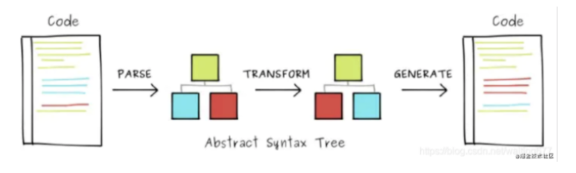

## Rollup体验Tree-sharking树摇

```
// index.js
import {add} from './add.js';
console.log(add(2,4));

// add.js
export const add(a, b) => a + b;

// 执行
rollup src/case01/index.js
```

## 编译经典过程



:::tip
AST(Abstract Syntax Tree) 抽象语法树 在计算机科学中，或简语法树(Syntax treee),是源代码语法解构的一种抽象表示。它以树状的形式表现变成语言的语法结构，树上的每个节点都表示源代码中的一种解构[https://astexplorer.net/](https://astexplorer.net/)
:::

## 准备工具
### Magic-string

[为什么eslint没有no-magic-string](https://zhuanlan.zhihu.com/p/138322881)

```
var MagicString = require('magic-string');

const s = new MagicString('export var answer = 42;');

console.log('s', s.snip(7).toString);

var bundle = nnew MagicString.bundle();

bundle.addSource({
    filename: 'foo.js',
    content: new MagicString('var answer = 42;')
})

bundle.addSource({
    filename: 'bar.js',
    content: new MagicString('console.log(answer)')
})

// options are as per `s.generateMap()` above

var map = bundle.generateMap({
    file: 'bundle.js',
    includeContent: true,
    hires: true
})

console.log(map);
```

code =》 报错

Sourcemap => sentry => 异常监控平台 

webpack插件

### 编译器acorn

[https://astexplorer.net/](https://astexplorer.net/)

[https://www.npmjs.com/package/acorn](https://www.npmjs.com/package/acorn)

```
const acorn = require('acorn');

consnt walk = require('./walk');

const code = `
    import {a} from "./foo";
    console.log("Hello" + a);
    console.log("World");
    export const b = 1
`

let ast = acorn.parse(code, {
    locations: true, // 索引位置
    ranges: true, 
    sourceType: "module",
    ecmaVerson: 7
})
```

### 语法树访问者
```
/**
* AST语法树遍历
*
*/
function walk(ast, {enter, leave}) {
    visit(ast, null, enter, leave);
}
/**
* 访问者
* @param {*} node
* @param {*} parent * @param {*} enter * @param {*} leave * @returns
*/
function visit(node, parent, enter, leave) {
    if (!node) return;
    // 先执行enter
    if(enter) {
        enter.call(null, node, parent);
    }

    let childkeys = Object.keys(node).filter(
        (key) => typeof node[key] === 'object'
    );

    childkeys.forEach((childKey) => {
        let value = node[childKey];
        if (Array.isArray((val) => visit(val, node, enter, leave))) {
            value.forEach(val => visit(val, node, enter, leave);)
        } else {
            visit(value, node, enter, leave);
        }
    })

    if (leave) {
        leave(node, parent);
    }
}

module.exports = walk;
```

Ast遍历

```
let indent = 0;
const padding = () => ' '.repeat(indent);

// 遍历语法树中的每一条语句，由walk遍历子元素
// 深度优先原则
ast.body.forEach(statement => {
    walk(statement, {
        enter(node) {
            if (node.type) {
                console.log(paddinng() + node.type + ' enter');
                indent += 2;
            }
        }, 
        leave(node) {
            if (node.tpye) {
                indent -= 2;
                console.log(padding() + node.type + ' leave');
            }
        }
    })
})
```

### 作用域描述对象Scope

```
/**
* 模拟作用域链 
*/
class Scope {
    constructor(options = {}) {
        this.parent = options.parent // 父作用域
        this.depth = this.parent ? this.parent.depth + 1 : 0 // 作用域层级
        this.names = options.params || [] // 作用域内的变量
        this.isBlockScope = !!options.block // 是否块作用域
    }
    /**
    * 将变量添加到作用域
    * @param {*} name
    * @param {*} isBlockDeclaration */
    add(name, isBlockDeclaration) {
        if (!isBlockDeclaration && this.isBlockScope) {

            // it's a `var` or function declaration, and this // is a block scope, so we need to go up this.parent.add(name, isBlockDeclaration)
        } else {
            this.names.push(name)
        }
    }
    /**
    * 判断变量是否被声明 * @param {*} name * @returns
    */
    cantains(name) {
        return !!this.findDefiningScope(name)
    }
    /**
    * 返回变量坐在的作用域 * @param {*} name * @returns
    */
    findDefiningScope(name) {
        if (this.names.includes(name)) {
            return this
        }
        if (this.parent) {
            return this.parent.findDefiningScope(name)
        }
        return null
    }
}
module.exports = Scope
```

## 原型系统
Parse阶段
```
 
const acorn = require("acorn");
const walk = require("../../lib/ast/walk");
const Scope = require("../../lib/ast/scope");
const MagicString = require("magic-string");
const code = {
    index: `import { add } from "./add.js"; console.log(add(2, 4));`,
    add: `export const add = (a,b) => a + b `,
}
```

Import 分析
```
 
function getImports(ast) {
    console.log("========分析import=======");
    const imports = {};
    ast.body.forEach((node) => {
        if (node.type === "ImportDeclaration") {
            console.log("import:", node._source.toString()); 
            // ex: import { a : b } from 'foo'
            // let source = node.source.value;
            const source = "";
            let specifiers = node.specifiers;
            specifiers.forEach((specifier) => {
                const name = specifier.imported.name; // a
                const localName = specifier.local.name; // b
                console.log("specifiers", name, localName);
                imports[localName] = { name, localName, source };
            });
        }
    });
  return imports;
}
```

Export 分析


语法分析
- 变量定义
- 变量依赖
- 语句

```
 
// 分析函数
function analyse(ast, magicString) {
    console.log("======analyse====="); // 创建全局作用域
    let scope = new Scope();
    // 遍历当前语法树
     
    ast.body.forEach((statement) => {
        /**
        * 给作用域内添加变量
        * @param {*} declaration */
        function addToScope(declaration) {
            var name = declaration.id.name; // 获取声明的变量
            scope.add(name);
            if (!scope.parent) {
                // 如果此变量作用域不在父级作用域 即当前作用域 // 如果当前是全局作用域的话
                // 在全局作用域下声明全局变量 statement._defines[name] = true;
            }
        }

        Object.defineProperties(statement, {
            // 变量定义
            _defines: { value: {} },

            // 变量依赖
            _dependsOn: { value: {} },

            // 此语句是否被打包Bundle 防止多次打包Bundle 
            _included: { value: false, writable: true },

            // 变量语句
            _source: { value: magicString.snip(statement.start, statement.end) },
        });
        // 作用域链遍历
        // 分析变量定义的
        // 构造作用域链
        walk(statement, {
            enter(node) {
                let newScope;
                // 防止空节点和空数组
                if (node === null || node.length === 0) return;
                switch (node.type) {
                    // 变量声明
                    case "VariableDeclaration":
                        declarations.push(node);
                        node.declarations.forEach(addToScope);
                        break;
                }
                 if (newScope) {
                    console.log("newScope", newScope); 
                    // 当前节点声明的新作用域
                    // 如果此节点生成一个新作用域
                     
                    Object.defineProperties(node, { _scope: { value: newScope } });
                    scope = newScope;
                }
            },
            leave(node) {
                if (node._scope) {
                    // 如果此节点离开退回父作用域
                    scope = scope.parent;
                }
            },
        })
    })

    ast._scope = scope;

    // 找出外部依赖关系 dependsOn 
    ast.body.forEach((statement) => {
        walk(statement, {
            enter(node) {
                if (node._scope) {
                    scope = node._scope;
                }
                // 遇到导出节点
                if (node.type === "Identifier") {
                    // 遇到 exports const a => node.name = 'a'

                    // 向上递归
                    const definingScope = scope.findDefiningScope(node.name); 
                    if (!definingScope) {
                        console.log("Identifier:", node.name);
                        statement._dependsOn[node.name] = true; // 表示属于外部依赖变量
                    }
                }
            },
            leave(node) {
                if (node._scope) scope = scope.parent;
            },
        });
    });
})
```

语句扩展添加声明

```
let declarations = [];
analyse(add, new MagicString(code.add));
analyse(index, new MagicString(code.index)); // 追加
const statments = expandAllStatements(index);
 
/**
* 展开所有语句节点 * @returns
*/
function expandAllStatements(ast) {
    console.log("=========expandAllStatements============="); const allStatements = [];
    ast.body.forEach((statement) => {
        // 忽略所有Import语句
        if (statement.type === "ImportDeclaration") {
            return;
        }
        allStatements.push(...declarations, statement);
    });
    return allStatements;
}
```

generate阶段

```
 
function generate(statments) {
    console.log('======generate=====')
    // statments.forEach(v => console.log(magicString.snip(v.start, v.end))) let v = statments[0]
    console.log(new MagicString(code.add).snip(v.start, v.end).toString())
    v = statments[1]
    console.log(new MagicString(code.index).snip(v.start, v.end).toString())
}
```