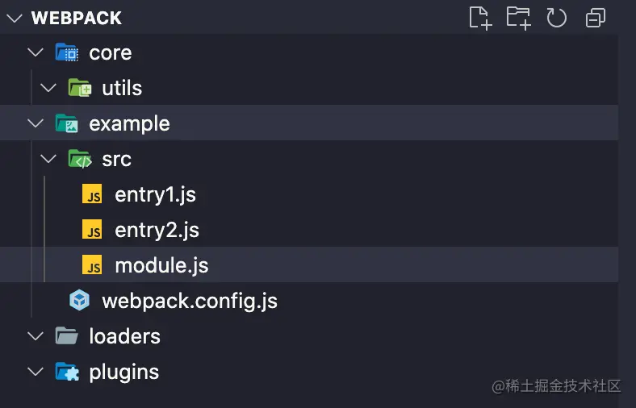
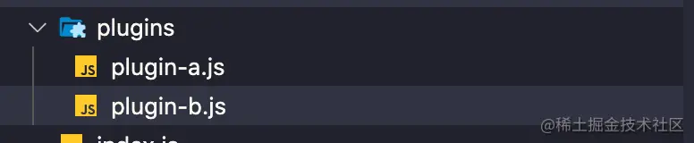
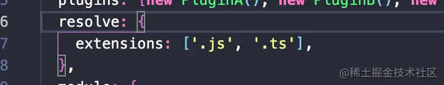
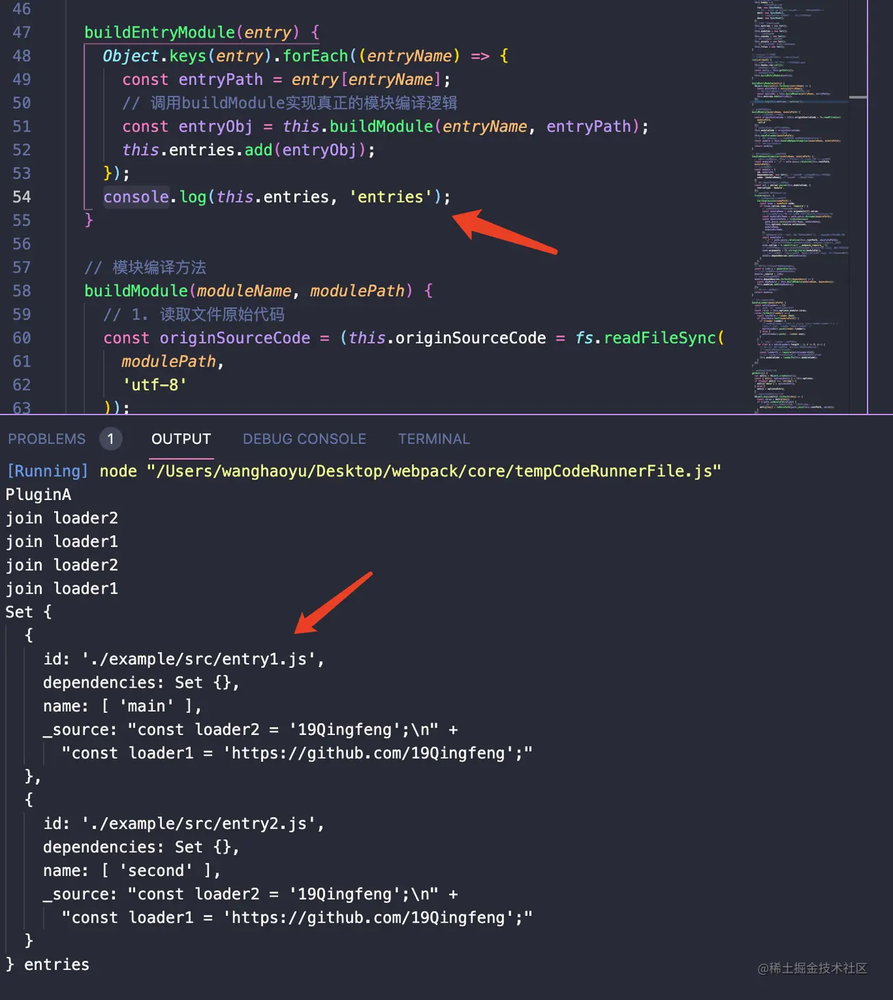
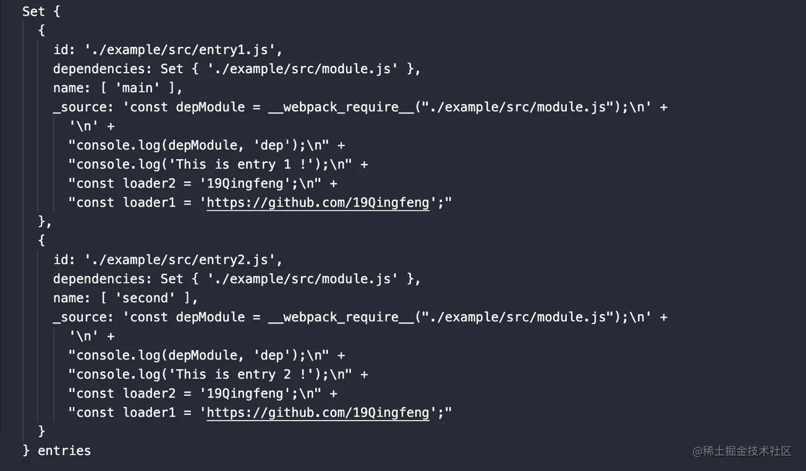
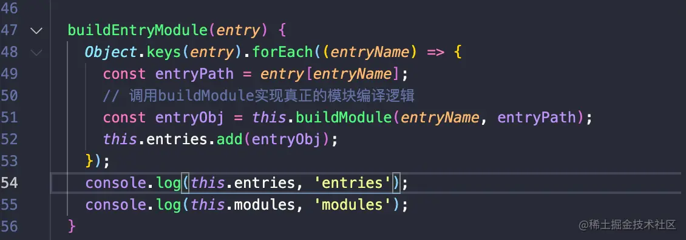
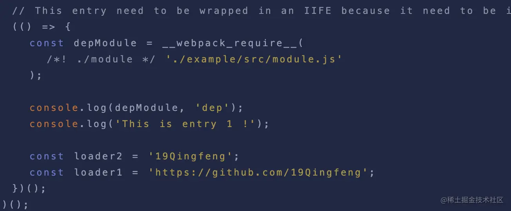
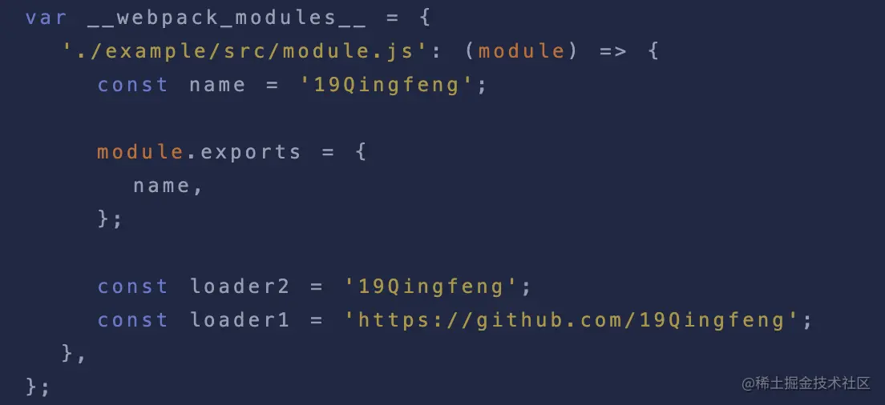
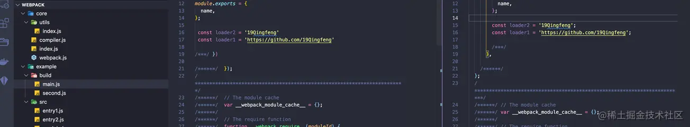
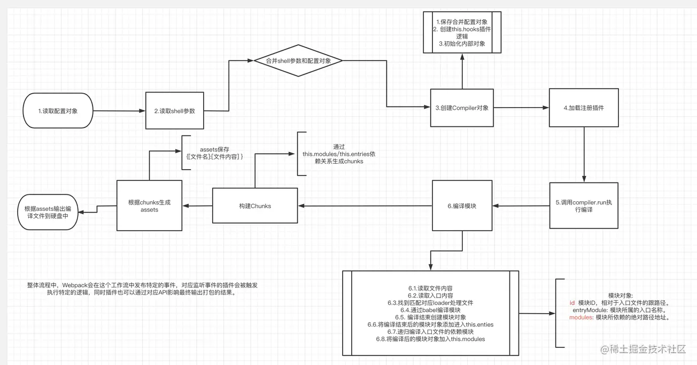

webpack核心点

Compiler类(创建编译器，提供一些编译中的通用数据)->Compilation类(编译类，编译打包)

Dependency类 context类，Module类，Chunk类、Template类


基于事件流的webpack

基于是拘留的webpack


- 处理配置选项
- 注册内置插件
    - 注册一个入口解析的插件
    - 在compiler.hooks.compilation中猪儿侧入口解析插件
- Compiler.run()
- Compiler.compile()
    - 创建Compilation params
    - 创建Compilation compiler
- Dependency类(用来描述一个模块相关的信息的对象)
    - EntryDependency对象
    - NormalModule对象
    - 解析该模块的路径和读取该模块的内容
    - 根据内容构建ast
    - 根据ast提取以来对象
    - 循环依赖对象构建依赖对应的模块对象
    - 通过上述步骤

## 前置知识
- [Tapable](https://github.com/webpack/tapable)

    Tapable包本质上是为我们更方便创建自定义事件和触发自定义事件的库，类似于Node.js中的EventEmitter API

    <span style="color: red">webpack中插件机制就是基于Tapable实现与打包流程解耦，插件的所有形式都是基于Tapable实现。</span>
- [Webpack Node Api](https://webpack.docschina.org/api/node/)

    基于学习目的我们会着重与Webpack Node Api流程去讲解，实际上我们在前端日常使用**npm run build命令也是通过环境变量调用bin脚本去调用Node API去执行编译打包**
- [Babel](https://babeljs.io/docs/en/)

    webpack内部的AST分析同样依赖于Babel进行处理，如果你对Babel不是很熟悉，建议你先去阅读下这两篇文章[「前端基建」带你在Babel的世界中畅游](https://juejin.cn/post/7025237833543581732)、[# 从Tree Shaking来走进Babel插件开发者的世界](https://juejin.cn/post/7028584587227824158)。

## 流程梳理
在开始之前先对整个打包流程进行一次梳理

这里仅仅是一个全流程的梳理，现在你没有必要非常详细的去思考每一个步骤发生了什么，我们会在接下来的步骤中去一步一步串联他们


整体我们会从上面5个方面来分析webpack打包流程
1. <span style="color: red">初始化参数阶段。</span>

    <span style="color:blue">这一步会从我们配置的webpack.config.js中读取到对应的配置参数和shell命令中传入的参数进行合并得到最终打包配置参数</span>

2. <span style="color: red">开始编译准备阶段</span>

    <span style="color:blue">这一步我们会通过调用webpack()方法返回一个compiler方法，创建我们compiler对象，并且注册各个webpack Plugin。找到配置入口中的entry代码，调用compiler.run()方法进行编译</span>

3. <span style="color: red">模块编译阶段</span>

    从入口模块进行分析，调用匹配文件的loaders对文件进行处理。同时分析模块依赖的模块，递归进行模块编译工作

4. <span style="color: red">完成编译阶段</span>

    在递归完成后，每个引用模块通过loaders处理完成同时得到模块之间的相互依赖关系

5. <span style="color: red">输出文件阶段</span>

    整理模块依赖关系，同时将处理后的文件输出到output的磁盘目录中

接下来我们详细去探索每一步发生了什么

## 创建目录
工欲善其事必先利其器。首先我们创建一个良好的目录来管理我们需要实现的Packing tool吧

创建一个目录



- webpack/core存放我们自己将要实现的webpack核心代码。
- webpack/example存放我们将用来打包的实例项目。
    - webpack/example/webpak.config.js配置文件.
    - webpack/example/src/entry1第一个入口文件
    -  webpack/example/src/entry1第二个入口文件
    - webpack/example/src/index.js模块文件
- webpack/loaders存放我们的自定义loader。
- webpack/plugins存放我们的自定义plugin。

## 初始化参数阶段
往往，我们在日常使用阶段有两种方式去给webpack传递打包参数，让我们先看看如何传递参数

### CLI命令行传递参数
通常我们在使用调用webpack命令时候，有时会传入一定命令行参数

```bash
webpack --node-production
# 调用webpack命令执行打包 同时传入mode为production
```

### webpack.config.js传递参数
我们在项目下使用webpack.config.js导出一个对象进行webpack配置
```js
const path = require('path');

// 引入loader和plugin...
module.exports = {
    mode: 'development',
    entry: {
        main: path.resolve(__dirname, './src/entry1.js'),
        second: path.resolve(__dirname, './src/entry2.js')
    },
    devtool: false
    // 基础目录，绝对路径，用于从配置中解析入口点(entry, point)和加载器(loader)；
    // 换言之entry和loader的所有相对路径都是相对这个路径而言的
    context: process.cwd();
    output: {
        path: path.resolve(__dirname, './build'),
        filename: '[name].js',
    }
    plugins: [new PluginA(), new PluginB()],
    resolve: {
        extensions: ['.js', '.ts']
    },
    module:  {
        rules: [
            {
                test: /\.js/,
                use: [
                    // 使用自己loader有三种方式 这里仅仅是一种
                    path.resolve(__dirname, '../loaders/loader-1.js'),
                    path.resolve(__dirname, '../loaders/loader-2.js'),
                ],
            }
        ]
    }
}
```
同时这份配置也是我们需要作为实例项目example下的实例配置，接下来让我们修改example/webpack.config.js中的内容配置吧

### 实现合并参数阶段
这一步，让我们真正开始动手实现我们的webpack吧

首先让我们在webpack/core下新建一个index.js文件作为核心入口文件

同时建立一个webpack/core下新建一个webpack.js作为webpack()方法的实现文件。

首先，我们清楚在Node.js API中是通过webpack()方法去得到compiler对象的
```js
const webpack = require('webpack');
const compiler = webpack({
    // [Configuration Object](/configguration/)
})
compiler.run((err, stats) => { // [Stats Object](#stats-object)
    // ...
    compiler.close((closeErr) => {
        //...
    })
})
```
此时让我们按照原来webpack接口格式来补充一些index.js中的逻辑：

- 我们需要一个webpack 命令去执行调用命令
- 同时我们引入webpack.config.js配置文件传入webpack方法
```js
// index.js
const webpack = require('./webpack');
const config = require('../example/webpack.config');
// 步骤一，初始化参数，根据配置文件和shell参数合成参数
const compiler = webpack(config);
```
接下来我们去试下一下webpack.js
```js
// webpack.js
function webpack(options) {
    // 合并参数，得到合并后的参数mergeOptions
    const mergeOptions = _mergeOptions(options);
}
// 合并参数
function _mergeOptions(options) {
    const shellOptions = process.argv.slice(2).reduce((option, argv) => {
        // argv -> --mode=production
        const [key, value] = argv.split('=');
        if (key && value) {
            const parseKey = key.slice(2);
            option[parseKey] = value;
        }
        return option;
    }, {})
    return {...options, ...shellOptions}
}
```
这里我们需要额外说明的是

<span style="color: blue">webpack文件中需要导出一个名为webpack的方法，同时接受外部传入的配置对象。</span>这个上述讲过

当然关于我们合并参数的逻辑，<span style="color: red">**是将外部传入的对象和执行shell时的传入参数进行最终合并**</span>

在Node.js中我们可以通过process.argv.slice(2)来获取shell命令中传入的参数

```js
console.log(process.argv.slice(2));

node index --mode=production --devtool=false // ['--node=production', '--devtool=false']
```

## 编译阶段
在得到最终的配置参数之后，我们需要在webpack()函数中做一下几件事情
- <span style="color: red">通过创建compiler对象。我们看到官方案例中通过调用wepack(options)方法返回一个compiler对象。并且同时调用compiler.run()方法启动代码进行打包</span>
- <span style="color: red">注册我们定义的webpack plugin插件</span>
- <span style="color: red">根据传入的配置对象寻找对应的打包入口文件</span>

### 创建compiler对象
让我们对index.js中逻辑补全
```js
// index.js
const webpack = require('./webpack');
const config = require('../example/webpack.config');
// 步骤一:初始化参数 根据配置文件和shell参数合成参数
// 步骤二:调用Webpack(options) 初始化compiler参数
// webpack()方法返回一个compiler对象
const compiler = webpack(config);

// 调用run方法进行打包
compiler.run((err, stats) => {
    if(err) {
        console.log(err, 'err');
    }
})
```
可以看到，核心编译实现在于webpack()方法返回的compiler.run()方法上

一步一步完善这个webpack()方法
```js
// webpack.js
function webpack(options) {
    // 合并参数 得到合并后的参数mergeOptions
    const mergeOptions = _mergeOptions(options);
    // 创建compiler对象
    const compiler = new Compiler(mergeOptions);

    return compiler
}
//...
```
我们在webpack/core目录下同样新建一个compiler.js文件，作为compiler的核心实现代码
```js
// compiler.js
// Compiler类进行核心编译实现
class Compiler {
    constructor(options) {
        this.options = options;
    }
    // run方法启动编译
    // 同时run方法接受外部传递的callback
    run(callback) {}
}
module.exports = Compiler
```
此时我们的Compiler先搭建了一个基础的骨架代码
目前我们有了

- webpack/core/index.js作为打包命令的入口文件，这个文件引用了我们自己实现的webpack同时引用了外部的webpack.config.js(options)。调用webpack(options).run()开始编译。


- webpack/core/webpack.js这个文件目前处理了参数的合并以及传入合并后的参数new Compiler(mergeOptions)，同时返回创建的Compiler实力对象。


- webpack/core/compiler，此时我们的compiler仅仅是作为一个基础的骨架，存在一个run()启动方法。

### 编写plugin
还记得我们在webpack.config.js中使用了plugin--- pluginA、pluginB插件吗？接下来我们依次来实现他们

在实现Plugin钱，我们需要先来完善一下compiler方法
```js
// compiler.js完善
const { SyncHook } = require('Tabable');

class Compiler {
    constructor(options) {
        this.options = options;
        // 创建plugin hooks
        this.hooks = {
            // 开始编译时的钩子
            run: new SyncHook(),
            // 输出 asset 到 output 目录之前执行(写入文件之前)
            emit: new SyncHook(),
            // 在compilation 完成时执行 全部完成编译执行
            done: new SyncHook();
        }
    }

    // run方法启动编译
    // 同时run方法接受外部传递的callback
    run(callback) {}
}
module.exports = Compiler
```
<span style="color: red">这里，我们在Compiler这个类的构造函数中创建了一个属性hooks，它的值有三个属性run、emit、done</span>

关于这三个属性的值就是我们上文提到前置知识的tapable的SyncHook方法，本质上你可以简单的将SyncHook()方法理解成为一个Emitter Event类

<span style="color: red">我们通过new SyncHook()返回一个对象对象实例后，我们可以通过this.hook.run.tap('name', callback)方法为这个对象上添加事件监听，然后通过this.hook.run.call()执行所有tap注册的时间</span>

> webpack真实源码中，这里有非常多的hook。以及分别存在同步、异步钩子，我们这里更多为大家讲解清楚流程，所以紧列举了三个常见且简单的同步钩子

此时，我们需要明白，我们可以通过Compiler类返回的实例对象上compiler.hooks.run.tap注册钩子

接下来我们切回webpack.js中，让我们来填充关于插件注册逻辑
```js
const Compiler = require('./compiler');

function webpack(options) {
    // 合并参数
    const mergeOptions = _mergeOptions(options);
    // 创建compiler对象
    const compiler = new Compiler(mergeOptions);
    // 加载插件
    _loadPlugin(options.plugins, compiler);
    return compiler;
}
// 合并参数
function _mergeOptions(options) {
  const shellOptions = process.argv.slice(2).reduce((option, argv) => {
    // argv -> --mode=production
    const [key, value] = argv.split('=');
    if (key && value) {
      const parseKey = key.slice(2);
      option[parseKey] = value;
    }
    return option;
  }, {});
  return { ...options, ...shellOptions };
}
// 加载插件函数
function _loadPlugin(plugins, compiler) {
    if (plugins && Array.isArray(plugins)) {
        plugins.forEach(plugin => {
            plugin.apply(compiler)
        })
    }
}
module.exports = webpack;
```
这里我们在创建完成compiler对象后，调用了_loadPlugin方法进行注册插件。

有接触过webpack插件开发的同学，或多或少可能都有了解过，<span style="color: red">任何一个webpack插件都是一个类(本质上都是function的语法糖)，每个插件都必须存在一个apply方法</span>

这个apply方法会接受一个compiler对象。我们上面做的就是依次调用传入的plugin的apply方法并且传入我们的compiler对象
:::danger
这里请记住上面的流程，日常我们编写webpack pulugin时本质上就是操作compiler对象从而影响打包结果进行
:::
接下来我们去编写这个插件

不了解插件开发的同学可以去稍微看下[官方介绍](https://webpack.js.org/api/compiler-hooks/),其实不是很难，强烈建议先去看看，在结合上面讲的内容一定会有所收货

首先我们先创建文件


```js
// plugin-a.js
// 插件A
class PluginA {
    apply(compiler) {
        // 注册同步钩子
        // 这里的compiler对象就是我们new Compiler()创建的实例哦
        compiler.hooks.run.tab('Plugin A', () => {
            // 调用
            console.log('PluginA')
        })
    }
}

module.exports = PluginA

// plugin-b.js
class PluginB {
    apply(compiler) {
        compiler.hooks.done.tap('Plugin a', () => {
            console.log('Plugin B')
        })
    }
}
module.exports = PluginB
```
看到这里相信大部分同学已经反应过来, compiler.hooks.done.tap不就是我们上面讲到的通过tapable创建一个SyncHook实例然后通过tap方法注册的事件吗？

没错，<span style="color: red">**关于webpack插件上就是通过发布订阅模式，通过compiler上监听事件。然后在打包编译过程中触发事件从而添加一定的逻辑影响打包结果**</span>

<span style="color: blue">我们在每个插件的apply方法上通过tap在编译准备阶段(也就是调用webpack()函数时)进行订阅对应的事件，当我们的编译执行到一定阶段时发布对应的时间告诉订阅者去执行监听的事件，从而达到在编译阶段的不同生命周期内去触发对应的plugin</span>

> 所以这里，我们在进行webpack插件开发时，compiler对象上存放着本次打包的所有相关属性，比如options打包的配置，以及我们会在之后讲到的各种属性

### 寻找入口文件
这之后，我们的绝大多数内容都会放在compiler.js中去实现Compiler这个类打包的核心流程

<span style="color: red">任何一次打包都需要入口文件，接下来让我们就从真正进入打包编译阶段。首当其冲的事情就是，我们需要根据入口配置文件路径寻找到对应入口文件</span>

```js
// compiler.js
const { SyncHook } = require('tapable');
const { toUnixPath } = require('./utils');

class Compiler {
    constructor(options) {
        this.options = options;
        // 相对路径跟路径Context参数
        this.rootPath = this.options.context || toUnixPath(process.cwd());
        // 创建plugin hooks
        this.hooks = {
            // 开始编译时的钩子
            run: new SyncHook(),
            // 输出 asset 到 output， 目录之前执行(写入文件之前)
            emit: new SyncHook(),
            // 在compilation完成时执行，全部完成编译
            done: new SyncHook()
        }
    }

    // run方法启动编译
    // 同时run方法接受外部传递的callback
    run(callback) {
        // 当调用run方式时 触发开始编译的plugin
        this.hooks.run.call();
        // 获取入口配置对象
        const entry = this.getEntry();
    }

    // 获取入口文件路径
    getEntry() {
        let entry = Object.create(null);
        const { entry: optionsEntry } = this.options;
        if (typeof optionsEntry === 'string') {
            entry['main'] = optionsEntry;
        } else {
            entry = optionsEntry
        }
        // 将entry编程绝对路径
        Object.keys(entry).forEach(key) => {
            const value = entry[key];
            if (!path.isAbsolute(value)) {
                // 转化为绝对路径的同事同意路径分隔符为/
                entry[key] = toUnixPath(path.join(this.rootPath, value))
            }
        }
    }
}
module.exports = Compiler;

// utils/index.js
/**
 *
 * 统一路径分隔符 主要是为了后续生成模块ID方便
 * @param {*} path
 * @returns
 */
function toUnixPath(path) {
  return path.replace(/\\/g, '/');
}
```
这一步我们通过options.entry处理获得入口文件的绝对路径。

这里注意几个小点
- <span style="orange">this.hooks.run.call()</span>

    在我们_loadePlugin函数中对于每一个传入的插件在compiler实例对象中进行了订阅，那么当我们调用run方法时，等于真正开始执行编译。这个阶段**相当于我们告诉订阅者，发布开始自行订阅**。此时我们通过this.hooks.run.call()执行关于run的所有tap监听方法，从而触发对应的plugin逻辑。

- <span style="orange">this.rootPath</span> 

    在上述的外部webpack.config.js中我们配置了一个context:process.cwd()，其实真实webpack中这个context值默认也是process.cwd();

    关于它的详细解释可以在这里看到[context](https://webpack.js.org/configuration/entry-context/#root)

    简而言之，这个路径就是我们项目启动的目录路径，任何entry和loader中的相对路径都是针对于context这个参数的相对路径

    这里我们使用this.rootPath在构造函数中保存这个变量

- <span style="orange">toUnixPath工具方法</span>

    因为不同操作系统下，文件分隔路径是不同的。这里我们统一使用\来替换路径中的//来替换模块路径。**后续我们会使用模块相对于rootPath的路径作为每一个文件的唯一ID**，所以这里统一处理下路径分隔符。

- <span style="orange">entry的处理方法</span>

    关于entry配置，webpack中其实有很多种。我们这里考虑了比较常见的两种配置方式:
    ```js
    // 第一种
    entry: 'entry1.js',

    // 本质上这段代码在webpack会被转化为
    entry: {
        main: 'entry1.js'
    }
    // 第二种
    entry: {
        'entry1':'./entry1.js',
        'entry2':'/user/wepback/example/src/entry2.js'
    }
    ```
    这两种方式任何方式都会经过getEntry方法最终转化称为{ [模块名]:[模块绝对路径]... }的形式，关于geEntry()方法其实非常简单，这里我就不过于累赘这个方法的实现过程了。

    这一步，我们就通过getEntry方法获得了一个key为entryName,value为entryAbsolutePath的对象了，接来下就让我们从入口文件出发进行编译流程吧。

## 模块编译阶段
上面我们讲述了关于编译阶段的准备工作：
- <span style="color: blue">目录、文件基础逻辑补充</span>
- <span style="color: blue">通过hooks.tap注册webpack插件</span>
- <span style="color: blue">getEntry方法获取各个入口的对象</span>

接下来我们继续完善compiler.js

在模块编译阶段，我们需要做的事件
- <span style="color: red">根据入口文件路径分析入口文件，对于入口文件进行匹配对应的loader进行处理入口文件</span>
- <span style="color: red">将loader处理完成的入口文件使用webpack进行编译</span>
- <span style="color: red">分析入口文件依赖，重复上面两个步骤进行对应依赖</span>
- <span style="color: red">如果嵌套文件存在依赖，递归调用依赖模块进行编译</span>
- <span style="color: red">递归编译完成后，组成一个包含多个模块的chunk</span>

首先，我们先来给compiler.js的构造函数中补充一些对应逻辑
```js
class Compiler {
  constructor(options) {
    this.options = options;
    // 创建plugin hooks
    this.hooks = {
      // 开始编译时的钩子
      run: new SyncHook(),
      // 输出 asset 到 output 目录之前执行 (写入文件之前)
      emit: new SyncHook(),
      // 在 compilation 完成时执行 全部完成编译执行
      done: new SyncHook(),
    };
    // 保存所有入口模块对象
    this.entries = new Set();
    // 保存所有依赖模块对象
    this.module = new Set();
    // 所有代码的块对象
    this.chunks = new Set();
    // 存放本次产出的文件对象
    this.assets = new Set();
    // 存放本次编译所产出的文件名
    this.files = new Set();
  }
  //...
}
```
这里我们通过给compiler构造函数中添加一些列属性来保存关于编译阶段生成的对应资源/模块对象。
:::tip
关于entries\modules\chunks\assets\files这几个Set对象是贯穿我们核心打包流程的属性，它们各自用来储存编译阶段不同的资源从而最终通过对应的属性进行生成编译后的文件。
:::

### 根据入口文件路径分析入口文件
上面说到我们在run方法中可以通过this.getEntry();获得对应的入口文件对象了。

接下来我们就从入口文件开始分析文件吧
```js
class Compile {
    // run方法启动编译
    // 同时run方法接受外部传递的callback
    run(callback) {
        // 当调用run方法时候，触发开始编译的plugin
        this.hooks.run.call();
        // 获取入口配置对象
        const entry = this.getEntry();
        // 编译入口文件
        this.buildEntryModule(entry);
    }
    buildEntryModule(entry) {
        Object.key(entry).forEach(entryName => {
            const entryPath = entry[entryName];
            const entryObj = this.buildModule(entryName, entryPath);
            this.entries.add(entryObj);
        }) 
    }

    // 模块编译方法
    buildModule(moduleName, modulePath) {
        // ...
        return {}
    } 
}
```
这里我们添加了一个名为buildEntryModule方法作为入口模块编译方法。循环入口对象，得到一个入口对象的名称和路径

:::danger
比如如假使我们在开头传入entry:{ main:'./src/main.js' }的话，buildEntryModule获得的形参entry为{ main: "/src...[你的绝对路径]" }, 此时我们buildModule方法接受的entryName为main,entryPath为入口文件main对应的的绝对路径

单个入口编译完成后，我们会在buildModule方法中返回一个对象。这个对象就是我们编译入口文件后的对象。
:::

### buildModule模块编译方法
在进行代码编写之前，我们来梳理一下buildModule方法它所需要做哪些事情
- <span style="color: blue">buildModule接受两个参数进行模块编译，第一个为模块所属的入口文件名称，第二个为需要编译的模块路径。</span>
- <span style="color: blue">buildModule方法要进行代码编译的前提就是，通过fs模块根据入口文件路径读取文件源代码。</span>
- <span style="color: blue">读取文件内容之后，调用所有匹配的loader对模块进行处理得到返回后的结果</span>
- <span style="color: blue">得到loader处理后的结果后，通过babel分析loader处理后的代码，进行代码编译。(这一步编译主要是针对require语句，修改源代码中require语句的路径)。</span>
- <span style="color: blue">如果该入口文件没有依赖与任何模块(require语句)，那么返回编译后的模块对象</span>
- <span style="color: blue">如果该入口文件存在依赖的模块，递归buildModule方法进行模块编译</span>

#### 读取文件内容
先调用fs模块读取文件内容

```js
const fs = require('fs');
// ...
class Compiler {
    //...
    // 模块编译方法
    buildModule(moduleName, modulePath) {
        // 1. 读取文件原始代码
        const originSourceCode =
        ((this.originSourceCode = fs.readFileSync(modulePath, 'utf-8'));
        // moduleCode为修改后的代码
        this.moduleCode = originSourceCode;
    }
    
    // ...
}
```
#### 调用loader匹配后缀文件
接下来我们获得了文件的具体内容之后，就需要匹配对应loader对我们的源代码进行编译了。

<span style="color: #fff; background:red;">实现简单自定义loader</span>

在进行loader编译前，我们先来实现一下我们上方传入的自定义loader吧。
```js
module:  {
    rules: [
        {
            test: /\.js/,
            use: [
                // 使用自己loader有三种方式，这里仅仅是一种
                path.resolve(__dirname, '../loaders/loader-1.js'),
                path.resolve(__dirname, '../loaders/loader-2.js'),
            ]
        }
    ]
}
```
webpack/loader目录下新建loader-1.js,loader-2.js:

<span style="color: red">首先我们需要清楚简单来说loader本质上就是一个函数，接受我们的源代码作为入参同时返回处理后的结果</span>

> 关于loader的特性，更加详细你可以在[这里](https://webpack.docschina.org/concepts/loaders/#loader-features)看到，因为文章主要讲述打包流程所以loader我们简单的作为倒序处理。更加具体的loader/plugin开发我会在后续的文章详细补充。

```js
function loader1(sourceCode) {
  console.log('join loader1');
  return sourceCode + `\n const loader1 = 'https://github.com/19Qingfeng'`;
}

module.exports = loader1;

function loader2(sourceCode) {
  console.log('join loader2');
  return sourceCode + `\n const loader2 = '19Qingfeng'`;
}

module.exports = loader2;
```
<span style="color: #fff; background:red;">使用loader处理文件</span>

在搞清楚了loader就是一个单纯的函数之后，让我们在进行模块分析之前将内容先交给匹配的loader去处理下吧。
```js
// 模块编译方法
  buildModule(moduleName, modulePath) {
    // 1. 读取文件原始代码
    const originSourceCode =
      ((this.originSourceCode = fs.readFileSync(modulePath)), 'utf-8');
    // moduleCode为修改后的代码
    this.moduleCode = originSourceCode;
    //  2. 调用loader进行处理
    this.handlerLoader(modulePath);
  }
// 匹配loader处理
handlerLoader(modulePath) {
    const matchLoaders = [];
    // 1. 获取所有传入的loader规则
    const rules = this.options.module.rules;
    rules.forEach(loader => {
        if(testRule.test(modulePath)) {
            if (loader.loader) {
                // 仅考虑loader { test:/\.js$/g, use:['babel-loader'] }, { test:/\.js$/, loader:'babel-loader' }
                matchLoaders.push(loader.loader);
            } else {
                matchLoader.push(...loader.user)
            }
        }
        // 倒序执行loader传入源代码
        for(let i = matchLoaders.length - 1; i >= 0; i--) {
            // 目前我们外部仅支持传入绝对路径的loader模式
            // require引入对应loader
            const loaderFn = require(matchLoaders[i]);
            // 通过loader同步处理我的每一次编译的moduleCode
            this.moduleCode = loaderFn(this.moduleCode);
        }
    })
}
```
这里我们通过handleLoader函数，对于传入的文件路径匹配到对应后缀的loader后，依次倒序执行loader处理我们的代码this.moduleCode并且同步更新每次moduleCode。
最终，在每一个模块编译中this.moduleCode都会经过对应的loader处理

#### webpack模块编译阶段
上一步我们经历过loader处理了我们的入口文件代码，并且得到了处理后的代码保存在了this.moduleCode中。

此时，经过loader处理后我们就要进入webpack内部的编译阶段了。

这里我们需要做的是:<span style="color: red">**针对当前模块进行编译，将当前模块所有依赖的模块(require())语句引入的路径变为相对于跟路径(this.rootPath)的相对路径**。</span>

> 总之你需要搞明白的是，我们这里编译的结果是期望将源代码中的依赖模块路径变为相对跟路径的路径，同时建立基础的模块依赖关系。后续我会告诉你为什么针对路径进行编译。
```js
const parser = require('@babel/parser');
const traverse = require('@babel/traverse').default;
const generator = require('@babel/generator').default;
const t = require('@babel/types');
const tryExtensions = require('./utils/index')
// ...
class Compiler {
    // ...
    
    // 模块编译方法
    buildModule(moduleName, modulePath) {
        // 1. 读取文件原始代码
        const originSourceCode =
            ((this.originSourceCode = fs.readFileSync(modulePath)), 'utf-8');
        // moduleCode为修改后的代码
        this.moduleCode = originSourceCode;
        //  2. 调用loader进行处理
        this.handleLoader(modulePath);
        // 3. 调用webpack 进行模块编译 获得最终的module对象
        const module = this.handleWebpackCompiler(moduleName, modulePath);
        // 4. 返回对应module
        return module
    }
    // 调用webpack进行模块编译
    handleWebpackCompiler(moduleName, modulePath) {
        // 将当前模块相对于项目启动根目录计算出相对路径 作为模块ID
        const moduleId = './' + path.posix.relative(this.rootPath, modulePath);
        // 创建模块对象
        const module = {
            id: moduleId,
            dependencies: new Set(), // 该模块所依赖模块绝对路径地址
            name: [moduleName], // 该模块所属的入口文件
        };
        // 调用babel分析我们的代码
        const ast = parser.parse(this.moduleCode, {
            sourceType: 'module',
        });
        // 深度优先 遍历语法Tree
        traverse(ast, {
            // 当遇到require语句时
            CallExpression:(nodePath) => {
            const node = nodePath.node;
            if (node.callee.name === 'require') {
                // 获得源代码中引入模块相对路径
                const requirePath = node.arguments[0].value;
                // 寻找模块绝对路径 当前模块路径+require()对应相对路径
                const moduleDirName = path.posix.dirname(modulePath);
                const absolutePath = tryExtensions(
                    path.posix.join(moduleDirName, requirePath),
                    this.options.resolve.extensions,
                    requirePath,
                    moduleDirName
                );
                // 生成moduleId - 针对于跟路径的模块ID 添加进入新的依赖模块路径
                const moduleId =
                './' + path.posix.relative(this.rootPath, absolutePath);
                // 通过babel修改源代码中的require变成__webpack_require__语句
                node.callee = t.identifier('__webpack_require__');
                // 修改源代码中require语句引入的模块 全部修改变为相对于跟路径来处理
                node.arguments = [t.stringLiteral(moduleId)];
                // 为当前模块添加require语句造成的依赖(内容为相对于根路径的模块ID)
                module.dependencies.add(moduleId);
            }
            },
        });
        // 遍历结束根据AST生成新的代码
        const { code } = generator(ast);
        // 为当前模块挂载新的生成的代码
        module._source = code;
        // 返回当前模块对象
        return module
    }
}
```
这一步我们关于webpack编译的阶段就完成了。

需要注意的是:

- 这里我们使用babel相关的API针对于require语句进行了编译，如果对于babel相关的api不太了解的朋友可以在前置知识中查看我的另两篇文章。这里我就不在累赘了


- 同时我们代码中引用了一个tryExtensions()工具方法，这个方法是针对于后缀名不全的工具方法，稍后你就可以看到这个方法的具体内容。


- 针对于每一次文件编译，我们都会返回一个module对象，这个对象是重中之重。

    - <span style="color: red">**id属性，表示当前模块针对于this.rootPath的相对目录。**</span>
    - <span style="color: red">**dependencies属性，它是一个Set内部保存了该模块依赖的所有模块的模块ID。**</span>
    - <span style="color: red">**name属性,它表示该模块属于哪个入口文件。**</span>
    - <span style="color: red">**_source属性，它存放模块自身经过babel编译后的字符串代码。**</span>

<span style="color: #fff; background:red;">tryExtensions方法实现</span>

我们在上文的webpack.config.js有这么一个配置


<span style="color: blue">熟悉webpack配置的同学可能清楚，resolve.extensions是针对于引入依赖时，在没有书写文件后缀的情况下，webpack会自动帮我们按照传入的规则为文件添加后缀。</span>

在清楚了原理后我们来一起看看utils/tryExtensions方法的实现:
```js

/**
 *
 *
 * @param {*} modulePath 模块绝对路径
 * @param {*} extensions 扩展名数组
 * @param {*} originModulePath 原始引入模块路径
 * @param {*} moduleContext 模块上下文(当前模块所在目录)
 */
function tryExtensions(
  modulePath,
  extensions,
  originModulePath,
  moduleContext
) {
  // 优先尝试不需要扩展名选项
  extensions.unshift('');
  for (let extension of extensions) {
    if (fs.existsSync(modulePath + extension)) {
      return modulePath + extension;
    }
  }
  // 未匹配对应文件
  throw new Error(
    `No module, Error: Can't resolve ${originModulePath} in  ${moduleContext}`
  );
}
```
<span style="color: blue">这个方法很简单，我们通过fs.existsSync检查传入文件结合extensions依次遍历寻找对应匹配的路径是否存在，如果找到则直接返回。如果未找到则给予用于一个友好的提示错误。</span>

> 需要注意 extensions.unshift('');是防止用户如果已经传入了后缀时，我们优先尝试直接寻找，如果可以找到文件那么就直接返回。找不到的情况下才会依次尝试。

#### 递归处理
经过上一步处理，针对入口文件我们调用buildModule可以得到这样的返回对象。

我们先来看看运行webpack/core/index.js得到的返回结果吧。


我在buildEntryModule中打印了处理完成后的entries对象。可以看到正如我们之前所期待的:
- <span style="color: blue">id为每个模块相对于跟路径的模块.(这里我们配置的context:process.cwd())为webpack目录。</span>
- <span style="color: blue">dependencies为该模块内部依赖的模块，这里目前还没有添加。</span>
- <span style="color: blue">name为该模块所属的入口文件名称。</span>
- <span style="color: blue">_source为该模块编译后的源代码。</span>

此时让我们打开src目录为我们的两个入口文件添加一些依赖和内容吧:
```js
// webpack/example/entry1.js
const depModule = require('./module');

console.log(depModule, 'dep');
console.log('This is entry 1 !');


// webpack/example/entry2.js
const depModule = require('./module');

console.log(depModule, 'dep');
console.log('This is entry 2 !');

// webpack/example/module.js
const name = '19Qingfeng';

module.exports = {
  name,
};
```
此时让我们重新运行webpack/core/index.js:



OK，目前为止我们针对于entry的编译可以暂时告一段落了。

<span style="color: blue">**总之也就是，这一步我们通过``方法将entry进行分析编译后得到一个对象。将这个对象添加到this.entries中去**</span>

接下来让我们去处理依赖的模块吧。

其实对于依赖的模块无非也是相同的步骤：

- <span style="color: blue">检查入口文件中是否存在依赖。</span>
- <span style="color: blue">存在依赖的话，递归调用buildModule方法编译模块。传入moduleName为当前模块所属的入口文件。modulePath为当前被依赖模块的绝对路径。</span>
- <span style="color: blue">同理检查递归检查被依赖的模块内部是否仍然存在依赖，存在的话递归依赖进行模块编译。这是一个深度优先的过程。</span>
- <span style="color: blue">将每一个编译后的模块保存进入this.modules中去。</span>

接下来我们只要稍稍在handleWebpackCompiler方法中稍稍改动就可以了:
```js
 // 调用webpack进行模块编译
  handleWebpackCompiler(moduleName, modulePath) {
    // 将当前模块相对于项目启动根目录计算出相对路径 作为模块ID
    const moduleId = './' + path.posix.relative(this.rootPath, modulePath);
    // 创建模块对象
    const module = {
      id: moduleId,
      dependencies: new Set(), // 该模块所依赖模块绝对路径地址
      name: [moduleName], // 该模块所属的入口文件
    };
    // 调用babel分析我们的代码
    const ast = parser.parse(this.moduleCode, {
      sourceType: 'module',
    });
    // 深度优先 遍历语法Tree
    traverse(ast, {
      // 当遇到require语句时
      CallExpression: (nodePath) => {
        const node = nodePath.node;
        if (node.callee.name === 'require') {
          // 获得源代码中引入模块相对路径
          const requirePath = node.arguments[0].value;
          // 寻找模块绝对路径 当前模块路径+require()对应相对路径
          const moduleDirName = path.posix.dirname(requirePath);
          const absolutePath = tryExtensions(
            path.posix.join(moduleDirName, requirePath),
            this.options.resolve.extensions,
            moduleName,
            moduleDirName
          );
          // 生成moduleId - 针对于跟路径的模块ID 添加进入新的依赖模块路径
          const moduleId =
            './' + path.posix.relative(this.rootPath, absolutePath);
          // 通过babel修改源代码中的require变成__webpack_require__语句
          node.callee = t.identifier('__webpack_require__');
          // 修改源代码中require语句引入的模块 全部修改变为相对于跟路径来处理
          node.arguments = [t.stringLiteral(moduleId)];
          // 为当前模块添加require语句造成的依赖(内容为相对于根路径的模块ID)
          module.dependencies.add(moduleId);
        }
      },
    });
    // 遍历结束根据AST生成新的代码
    const { code } = generator(ast);
    // 为当前模块挂载新的生成的代码
    module._source = code;
    // 递归依赖深度遍历 存在依赖模块则加入
    module.dependencies.forEach((dependency) => {
      const depModule = this.buildModule(moduleName, dependency);
      // 将编译后的任何依赖模块对象加入到modules对象中去
      this.modules.add(depModule);
    });
    // 返回当前模块对象
    return module;
  }
```
这里我们添加了这样一段代码:
```js
// 递归依赖深度遍历，存在依赖模块则加入
module.dependenciesforEach(dependency => {
    const depModule = this.buildModule(moduleName, dependecy);
    // 将编译后的任何依赖模块对象加入到modules对象中去
    this.modules.add(depModule);
})
```
这里我们对于依赖的模块进行了递归调用buildModule,将输出的模块对象添加进入了this.modules中去。

此时让我们重新运行webpack/core/index.js进行编译，这里我在buildEntryModule编译结束后打印了assets和modules:


```js
Set {
  {
    id: './example/src/entry1.js',
    dependencies: Set { './example/src/module.js' },
    name: [ 'main' ],
    _source: 'const depModule = __webpack_require__("./example/src/module.js");\n' +
      '\n' +
      "console.log(depModule, 'dep');\n" +
      "console.log('This is entry 1 !');\n" +
      "const loader2 = '19Qingfeng';\n" +
      "const loader1 = 'https://github.com/19Qingfeng';"
  },
  {
    id: './example/src/entry2.js',
    dependencies: Set { './example/src/module.js' },
    name: [ 'second' ],
    _source: 'const depModule = __webpack_require__("./example/src/module.js");\n' +
      '\n' +
      "console.log(depModule, 'dep');\n" +
      "console.log('This is entry 2 !');\n" +
      "const loader2 = '19Qingfeng';\n" +
      "const loader1 = 'https://github.com/19Qingfeng';"
  }
} entries
Set {
  {
    id: './example/src/module.js',
    dependencies: Set {},
    name: [ 'main' ],
    _source: "const name = '19Qingfeng';\n" +
      'module.exports = {\n' +
      '  name\n' +
      '};\n' +
      "const loader2 = '19Qingfeng';\n" +
      "const loader1 = 'https://github.com/19Qingfeng';"
  },
  {
    id: './example/src/module.js',
    dependencies: Set {},
    name: [ 'second' ],
    _source: "const name = '19Qingfeng';\n" +
      'module.exports = {\n' +
      '  name\n' +
      '};\n' +
      "const loader2 = '19Qingfeng';\n" +
      "const loader1 = 'https://github.com/19Qingfeng';"
  }
} modules
```
可以看到我们已经将module.js这个依赖如愿以偿加入到modules中了，同时它也经过loader的处理。但是我们发现它被重复加入了两次。

这是因为module.js这个模块被引用了两次，它被entry1和entry2都已进行了依赖，在进行递归编译时我们进行了两次buildModule相同模块。

让我们来处理下这个问题:

```js
    handleWebpackCompiler(moduleName, modulePath) {
       ...
        // 通过babel修改源代码中的require变成__webpack_require__语句
          node.callee = t.identifier('__webpack_require__');
          // 修改源代码中require语句引入的模块 全部修改变为相对于跟路径来处理
          node.arguments = [t.stringLiteral(moduleId)];
          // 转化为ids的数组 好处理
          const alreadyModules = Array.from(this.modules).map((i) => i.id);
          if (!alreadyModules.includes(moduleId)) {
            // 为当前模块添加require语句造成的依赖(内容为相对于根路径的模块ID)
            module.dependencies.add(moduleId);
          } else {
            // 已经存在的话 虽然不进行添加进入模块编译 但是仍要更新这个模块依赖的入口
            this.modules.forEach((value) => {
              if (value.id === moduleId) {
                value.name.push(moduleName);
              }
            });
          }
        }
      },
    });
    ...
    }
```
这里在每一次代码分析的依赖转化中，首先判断this.module对象是否已经存在当前模块了（通过唯一的模块id路径判断）。

如果不存在则添加进入依赖中进行编译，如果该模块已经存在过了就证明这个模块已经被编译过了。所以此时我们不需要将它再次进行编译，我们仅仅需要更新这个模块所属的chunk，为它的name属性添加当前所属的chunk名称。

重新运行，让我们在来看看打印结果:
```js
Set(2) {
  {
    id: './example/src/entry1.js',
    dependencies: Set(1) { './example/src/module.js' },
    name: [ 'main' ],
    _source: 'const depModule = __webpack_require__("./example/src/module.js");\n' +
      '\n' +
      "console.log(depModule, 'dep');\n" +
      "console.log('This is entry 1 !');\n" +
      "const loader2 = '19Qingfeng';\n" +
      "const loader1 = 'https://github.com/19Qingfeng';"
  },
  {
    id: './example/src/entry2.js',
    dependencies: Set(0) {},
    name: [ 'second' ],
    _source: 'const depModule = __webpack_require__("./example/src/module.js");\n' +
      '\n' +
      "console.log(depModule, 'dep');\n" +
      "console.log('This is entry 2 !');\n" +
      "const loader2 = '19Qingfeng';\n" +
      "const loader1 = 'https://github.com/19Qingfeng';"
  }
} 入口文件
Set(1) {
  {
    id: './example/src/module.js',
    dependencies: Set(0) {},
    name: [ 'main', 'second' ],
    _source: "const name = '19Qingfeng';\n" +
      'module.exports = {\n' +
      '  name\n' +
      '};\n' +
      "const loader2 = '19Qingfeng';\n" +
      "const loader1 = 'https://github.com/19Qingfeng';"
  }
} modules
```
此时针对我们的“模块编译阶段”基本已经结束了，这一步我们对于所有模块从入口文件开始进行分析。

- <span style="color: blue">从入口出发，读取入口文件内容调用匹配loader处理入口文件。</span>
- <span style="color: blue">通过babel分析依赖，并且同时将所有依赖的路径更换为相对于项目启动目录options.context的路径。</span>
- <span style="color: blue">入口文件中如果存在依赖的话，递归上述步骤编译依赖模块。</span>
- <span style="color: blue">将每个依赖的模块编译后的对象加入this.modules。</span>
- <span style="color: blue">将每个入口文件编译后的对象加入this.entries。</span>

## 编译完成阶段
在上一步我们完成了模块之间的编译，并且为module和entry分别填充了内容。

**在将所有模块递归编译完成后，我们需要根据上述的依赖关系，组合最终输出的chunk模块。**

让我们来继续改造我们的Compiler吧:
```js
class Compiler {

    // ...
    buildEntryModule(entry) {
        Object.keys(entry).forEach((entryName) => {
          const entryPath = entry[entryName];
          // 调用buildModule实现真正的模块编译逻辑
          const entryObj = this.buildModule(entryName, entryPath);
          this.entries.add(entryObj);
          // 根据当前入口文件和模块的相互依赖关系，组装成为一个个包含当前入口所有依赖模块的chunk
          this.buildUpChunk(entryName, entryObj);
        });
        console.log(this.chunks, 'chunks');
    }
    
     // 根据入口文件和依赖模块组装chunks
      buildUpChunk(entryName, entryObj) {
        const chunk = {
          name: entryName, // 每一个入口文件作为一个chunk
          entryModule: entryObj, // entry编译后的对象
          modules: Array.from(this.modules).filter((i) =>
            i.name.includes(entryName)
          ), // 寻找与当前entry有关的所有module
        };
        // 将chunk添加到this.chunks中去
        this.chunks.add(chunk);
      }
      
      // ...
}
```
这里，我们根据对应的入口文件通过每一个模块(module)的name属性查找对应入口的所有依赖文件。

我们先来看看this.chunks最终会输出什么:

```js
Set {
  {
    name: 'main',
    entryModule: {
      id: './example/src/entry1.js',
      dependencies: [Set],
      name: [Array],
      _source: 'const depModule = __webpack_require__("./example/src/module.js");\n' +
        '\n' +
        "console.log(depModule, 'dep');\n" +
        "console.log('This is entry 1 !');\n" +
        "const loader2 = '19Qingfeng';\n" +
        "const loader1 = 'https://github.com/19Qingfeng';"
    },
    modules: [ [Object] ]
  },
  {
    name: 'second',
    entryModule: {
      id: './example/src/entry2.js',
      dependencies: Set {},
      name: [Array],
      _source: 'const depModule = __webpack_require__("./example/src/module.js");\n' +
        '\n' +
        "console.log(depModule, 'dep');\n" +
        "console.log('This is entry 2 !');\n" +
        "const loader2 = '19Qingfeng';\n" +
        "const loader1 = 'https://github.com/19Qingfeng';"
    },
    modules: []
  }
} 
```
这一步，我们得到了Webpack中最终输出的两个chunk。
它们分别拥有:

- <span style="color: red">name:当前入口文件的名称</span>
- <span style="color: red">entryModule: 入口文件编译后的对象。</span>
- <span style="color: red">modules: 该入口文件依赖的所有模块对象组成的数组，其中每一个元素的格式和entryModule是一致的。</span>

此时编译完成我们拼装chunk的环节就圆满完成。

## 输出文件阶段
我们先放一下上一步所有编译完成后拼装出来的this.chunks。

### 分析原始打包输出结果
这里，我把webpack/core/index.js中做了如下修改:

```js
- const webpack = require('./webpack');
+ const webpack = require('webpack')
...
```
运用原本的webpack代替我们自己实现的webpack先进行一次打包。

运行webpack/core/index.js后，我们会在webpack/src/build中得到两个文件:main.js和second.js,我们以其中一个main.js来看看它的内容:
```js
(() => {
  var __webpack_modules__ = {
    './example/src/module.js': (module) => {
      const name = '19Qingfeng';

      module.exports = {
        name,
      };

      const loader2 = '19Qingfeng';
      const loader1 = 'https://github.com/19Qingfeng';
    },
  };
  // The module cache
  var __webpack_module_cache__ = {};

  // The require function
  function __webpack_require__(moduleId) {
    // Check if module is in cache
    var cachedModule = __webpack_module_cache__[moduleId];
    if (cachedModule !== undefined) {
      return cachedModule.exports;
    }
    // Create a new module (and put it into the cache)
    var module = (__webpack_module_cache__[moduleId] = {
      // no module.id needed
      // no module.loaded needed
      exports: {},
    });

    // Execute the module function
    __webpack_modules__[moduleId](module, module.exports, __webpack_require__);

    // Return the exports of the module
    return module.exports;
  }

  var __webpack_exports__ = {};
  // This entry need to be wrapped in an IIFE because it need to be isolated against other modules in the chunk.
  (() => {
    const depModule = __webpack_require__(
      /*! ./module */ './example/src/module.js'
    );

    console.log(depModule, 'dep');
    console.log('This is entry 1 !');

    const loader2 = '19Qingfeng';
    const loader1 = 'https://github.com/19Qingfeng';
  })();
})();
```
> 这里我手动删除了打包生成后的多余注释，精简了代码。
我们来稍微分析一下原始打包生成的代码：

webpack打包后的代码内部定义了一个__webpack_require__的函数代替了NodeJs内部的require方法。

同时底部的


这块代码相比大家都很熟悉吧，这就是我们编译后的入口文件代码。同时顶部的代码是该入口文件依赖的所有模块定义的一个对象:



这里定义了一个__webpack__modules的对象，**对象的key为该依赖模块相对于跟路径的相对路径，对象的value该依赖模块编译后的代码。`

### 输出文件阶段
接下里在分析完webpack原始打包后的代码之后，上我们来继续上一步。通过我们的this.chunks来尝试输出最终的效果吧。

让我们回到Compiler上的run方法中:

```js
   class Compiler {
   
   }
  // run方法启动编译
  // 同时run方法接受外部传递的callback
  run(callback) {
    // 当调用run方式时 触发开始编译的plugin
    this.hooks.run.call();
    // 获取入口配置对象
    const entry = this.getEntry();
    // 编译入口文件
    this.buildEntryModule(entry);
    // 导出列表;之后将每个chunk转化称为单独的文件加入到输出列表assets中
    this.exportFile(callback);
  }
```
我们在buildEntryModule模块编译完成之后，通过this.exportFile方法实现导出文件的逻辑。

让我们来一起看看this.exportFile方法:
```js
 // 将chunk加入输出列表中去
  exportFile(callback) {
    const output = this.options.output;
    // 根据chunks生成assets内容
    this.chunks.forEach((chunk) => {
      const parseFileName = output.filename.replace('[name]', chunk.name);
      // assets中 { 'main.js': '生成的字符串代码...' }
      this.assets[parseFileName] = getSourceCode(chunk);
    });
    // 调用Plugin emit钩子
    this.hooks.emit.call();
    // 先判断目录是否存在 存在直接fs.write 不存在则首先创建
    if (!fs.existsSync(output.path)) {
      fs.mkdirSync(output.path);
    }
    // files中保存所有的生成文件名
    this.files = Object.keys(this.assets);
    // 将assets中的内容生成打包文件 写入文件系统中
    Object.keys(this.assets).forEach((fileName) => {
      const filePath = path.join(output.path, fileName);
      fs.writeFileSync(filePath, this.assets[fileName]);
    });
    // 结束之后触发钩子
    this.hooks.done.call();
    callback(null, {
      toJson: () => {
        return {
          entries: this.entries,
          modules: this.modules,
          files: this.files,
          chunks: this.chunks,
          assets: this.assets,
        };
      },
    });
  }
```
exportFile做了如下几件事:

- <span style="color: red">首先获取配置参数的输出配置，迭代我们的this.chunks，将output.filename中的[name]替换称为对应的入口文件名称。同时根据chunks的内容为this.assets中添加需要打包生成的文件名和文件内容。</span>
- <span style="color: red">将文件写入磁盘前调用plugin的emit钩子函数。</span>
- <span style="color: red">判断output.path文件夹是否存在，如果不存在，则通过fs新建这个文件夹。</span>
- <span style="color: red">将本次打包生成的所有文件名(this.assets的key值组成的数组)存放进入files中去。</span>
- <span style="color: red">循环this.assets，将文件依次写入对应的磁盘中去。</span>
- <span style="color: red"> 所有打包流程结束，触发webpack插件的done钩子。</span>
- <span style="color: red">同时为NodeJs Webpack APi呼应，调用run方法中外部传入的callback传入两个参数。</span>

总的来说，this.assets做的事情也比较简单，就是通过分析chunks得到assets然后输出对应的代码到磁盘中。

仔细看过上边代码，你会发现。this.assets这个Map中每一个元素的value是通过调用getSourceCode(chunk)方法来生成模块对应的代码的。

那么getSourceCode这个方法是如何根据chunk来生成我们最终编译后的代码呢？让我们一起来看看吧！

### getSourceCode方法
首先我们来简单明确一下这个方法的职责，我们需要getSourceCode方法接受传入的chunk对象。从而返回该chunk的源代码。

**废话不多说，其实这里我用了一个比较偷懒的办法，但是完全不妨碍你理解Webpack流程，上边我们分析过原本webpack打包后的代码仅仅只有入口文件和模块依赖是每次打包不同的地方，关于require方法之类都是相通的。**

把握每次的不同点，我们直接先来看看它的实现方式:
```js
// webpack/utils/index.js

...


/**
 *
 *
 * @param {*} chunk
 * name属性入口文件名称
 * entryModule入口文件module对象
 * modules 依赖模块路径
 */
function getSourceCode(chunk) {
  const { name, entryModule, modules } = chunk;
  return `
  (() => {
    var __webpack_modules__ = {
      ${modules
        .map((module) => {
          return `
          '${module.id}': (module) => {
            ${module._source}
      }
        `;
        })
        .join(',')}
    };
    // The module cache
    var __webpack_module_cache__ = {};

    // The require function
    function __webpack_require__(moduleId) {
      // Check if module is in cache
      var cachedModule = __webpack_module_cache__[moduleId];
      if (cachedModule !== undefined) {
        return cachedModule.exports;
      }
      // Create a new module (and put it into the cache)
      var module = (__webpack_module_cache__[moduleId] = {
        // no module.id needed
        // no module.loaded needed
        exports: {},
      });

      // Execute the module function
      __webpack_modules__[moduleId](module, module.exports, __webpack_require__);

      // Return the exports of the module
      return module.exports;
    }

    var __webpack_exports__ = {};
    // This entry need to be wrapped in an IIFE because it need to be isolated against other modules in the chunk.
    (() => {
      ${entryModule._source}
    })();
  })();
  `;
}
...
```
这段代码其实非常非常简单，远远没有你想象的多难！有点返璞归真的感觉是吗哈哈。
在getSourceCode方法中，我们通过组合而来的chunk获得对应的:

- name: 该入口文件对应输出文件的名称。
- entryModule: 存放该入口文件编译后的对象。
- modules:存放该入口文件依赖的所有模块的对象。

**我们通过字符串拼接的方式去实现了__webpack__modules对象上的属性，同时也在底部通过${entryModule._source}拼接出入口文件的代码**

:::danger
这里我们上文提到过为什么要将模块的require方法的路径转化为相对于跟路径(context)的路径，看到这里我相信为什么这么做大家都已经了然于胸了。因为我们最终实现的__webpack_require__方法全都是针对于模块跟路径的相对路径自己实现的require方法。

同时如果不太清楚require方法是如何转变称为__webpack_require__方法的同学可以重新回到我们的编译章节仔细复习熬～我们通过babel在AST转化阶段将require方法调用变成了__webpack_require__。
:::

## 大功告成
至此，让我们回到webpack/core/index.js中去。重新运行这个文件，你会发现webpack/example目录下会多出一个build目录。



这一步我们就完美的实现属于我们自己的webpack。

实质上，我们对于实现一个简单版的webpack核心我还是希望大家可以在理解它的工作流的同时彻底理解compiler这个对象。

在之后的任何关于webpack相关底层开发中，真正做到对于compiler的用法了然于胸。了解compiler上的各种属性是如何影响到编译打包结果的。
让我们用一张流程图来进行一个完美的收尾吧:




## 资料
[Webapck5核心打包原理全流程解析](https://juejin.cn/post/7031546400034947108)