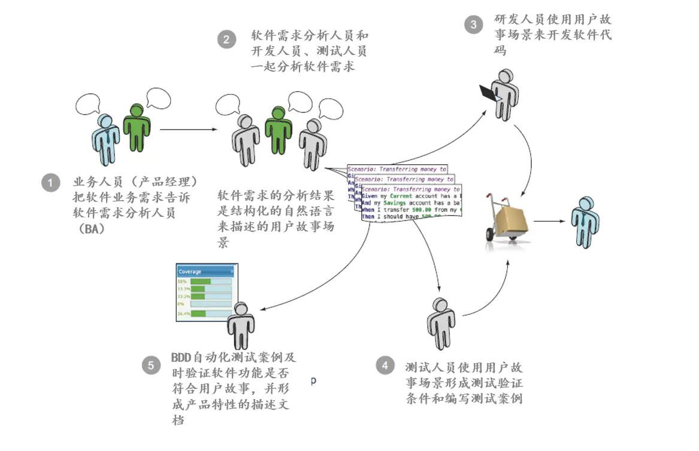

## TDD(Test-Driven Development)--测试驱动开发
### 为什么使用TDD
1. TDD根据客户需求编写测试用例，对功能的过程和接口都进行了设计，而且这种从使用者角度对代码进行的设计通常更符合后期开发的需求。因为关注用户反馈，可以及时响应需求变更，同事因为从使用者角度触发的简单设计，也可以更快的适应变化。
2. 出于易测试和测试独立性的要求，将促使我们实现耦合的设计，并更多的依赖于接口而非具体的类，提高系统的可扩展性和扛变性。而且TDD明显地缩短了设计决策的反馈循环，使我们几秒或几分钟之内就能获得反馈。
3. 将测试工作提到编码之前，并频繁的运行运行所有测试，可以尽量避免和尽早的发现错误，极大的降低了后续测试及修复的成本，提高了代码的质量。在测试的保护下，不断重构代码，以消除重复设计，优化设计结构，提高了代码的重用性，从而提高软件产品的质量。
4. TDD提供了持续的回归测试，使我们拥有重构的勇气,因为代码的改动导致系统其他部分产生任何异常，测试都会立刻通知我们
5. TDD所产生的单元测试代码是最完美的开发者文档，它们展示了所有API该如何使用以及如何运作的，而且它们与工作代码保持公布，永远是最新的
6. TDD可以减轻压力、降低忧虑、提高我们对代码的信心、使我们拥有重构的勇气，这些都是快乐工作的重要前提
7. 快速的提高了开发效率

### 怎么使用TDD
测试驱动开发的基本思想就是在开发功能代码之前，先编写测试代码，然后只编写使测试通过的功能代码，从而以测试来驱动整个开发过程的进行。这有助于编写简洁可用和高质量的代码，有很高的灵活性和健壮性，能快速响应变化，并加速开发过程。测试驱动开发的基本过程如下：

1. 快速新增一个测试
2. 运行所有的测试(有时候值需要运行一个或一部分),发现新增的测试不能通过
3. 做一些小小的改动，尽快的让测试程序可运行，为此可以在程序中使用一些不合情理的方法
4. 运行所有的测试，并且全部通过
5. 重构代码，以消除重复设计，优化设计结构

简单来说，就是不可运行/可运行/重构-- 这正是测试驱动开发的口号

## BDD(Behavior-Driven Development)--行为驱动开发
### 为什么使用BDD
引入BDD的软件研发团队通过充分的交流沟通和待实现的产品功能的使用场景举例，来帮助研发团队理解产品特性对业务的价值。BDD采用更容易测试的软件需求描述方式鼓励需求分析人员、软件开发人员、测试人员密切协同开展软件产品研发工作。同时BDD工具可以帮助把用BDD风格描述的业务需求转换自动化测试脚本，让软件开发人员同步验证自己编写的代码是否满足业务需求的产品特性，并在验证软件产品特性的同事形式软件产品特性文档。从而实现了产品研发文档与软件产品编写的同步更新。

BDD并不是一种软件研发方法，也不是用来替代Scrum、XP、看板等现有的敏捷理论和方法，而是把现有的工作方法融合起来，让软件研发团队更加高效的工作，从而减轻因软件产品计划延误或功能缺失带来的压力。

### 怎么使用BDD
1. 产品经理(业务人员)通过具体的用户故事使用场景来告诉软件需求分析人员他(她)想要什么样的软件产品。使用软件产品的使用场景来描述软件需求可以尽可能的避免相关人员错误理解软件需求或增加自己的主观想象的需求
2. 软件需求分析人员(BA)和研发团队(研发人员、测试人员)一起对产品经理(业务人员)的用户故事进行分析，并梳理处具体的软件产品使用场景举例，这些场景举例使用结构化的关键字自然语言进行描述，例如中文、英文等。
3. 研发团队使用BDD工具把用户故事场景文件转化为可执行的自动化测试代码，研发人员运行自动化测试用例来验证开发出来的软件是否符合用户产经的验收要去
4. 测试人员可以根据自动化测试结果开展手工测试和探索性测试。
5. 产品经理（业务人员）可以实时查看软件研发团队的自动化测试结果和BDD工具生成的测试报告，确保软件实现符合产品经理（业务人员）的软件期望。

### BDD工具
cucumber

## 资料
[TDD和BDD](https://www.jianshu.com/p/e0d8a9898aee)