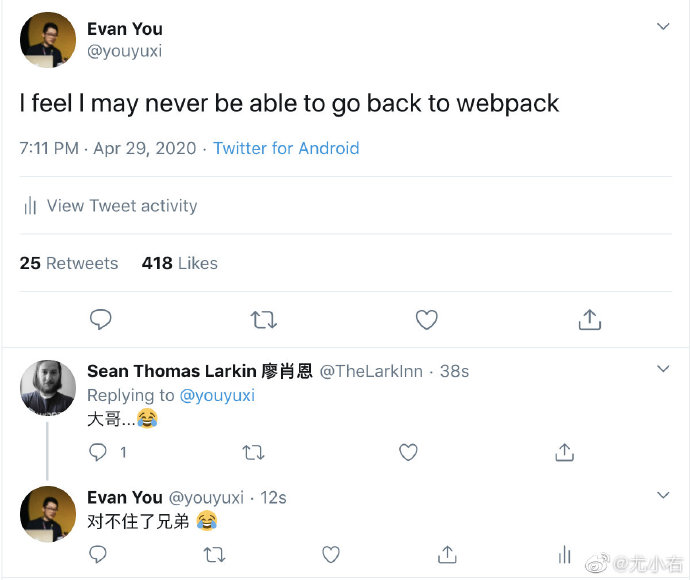
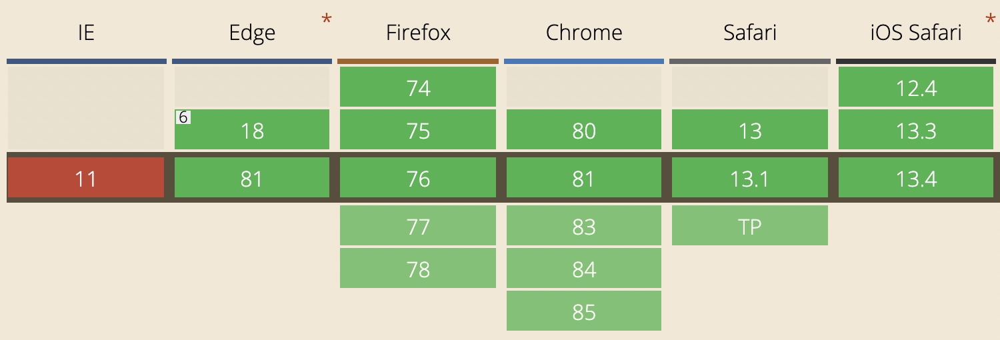

## Vite是什么
vite---一个由vue作者[尤雨溪](https://github.com/yyx990803?spm=taofed.bloginfo.blog.2.b27a5ac8qUj1Iz)开发的web开发工具，它具有以下特点
1. 快速的冷启动
2. 即使的模块热更新
3. 真正的按需编译

从作者在微博上的发言：
:::tip
Vite, 一个基于浏览器原生 ES imports的开发服务器。利用浏览器去解析imports，在服务器端按需编译返回，完全跳过了打包这个概念，服务器随起随用。同时不仅有Vue文件支持，还搞定了热更新，而且热更新的速度不会随着模块增多而变慢。针对生产环境则可以把同一份代码用rollup打包。虽然现在还比较粗糙，但这个方向我觉得是有潜力的，做的好可以彻底解决该一行diamante等半天热更新的问题

从中可以看出vite主要特点是基于浏览器native的ES module来开发，省略打包这个步骤，因为需要什么资源直接在浏览器里引入既可
:::
基于浏览器ES module来开发web应用也不是什么新鲜事，snowpack也基于此，不过目前此项目社区中并没有流行起来，vite的出现也会会让这种开发方式在火一阵子

有趣的是 vite 算是革了 webpack 的命了（生产环境用 rollup），所以 webpack 的开发者直接喊大哥了...



> 作者注:文本完成于vite早起时，vite部分功能和原理有更新

## vite的使用方式
同常见的开发工具一样,vite提供了用npm或者yarn一键生产项目结构的方法，使用yarn在终端执行
```shell
$ yarn create vite-app <project-name>
$ cd <project-name>
$ yarn
$ yarn dev
```
既可初始化一个vite项目(默认应用模板为vue3.x)，生产的项目结构十分简洁
```
|____node_modules
|____App.vue // 应用入口
|____index.html // 页面入口
|____vite.config.js // 配置文件
|____package.json
```
执行 yarn dev 既可启动应用

## vite启动链路
### 命令解析
这部分代码在src/node/cli.ts里，主要是借助minimist-- 一个轻量级的命令解析工具解析 npm scripts，解析的函数是resolveOptions，精简后的代码片段如下
```js
function resolveOptions() {
    // command 可以是 dev/build/optimize
    if(argv._[0]) {
        argv.command = argv._[0];
    }
    return argv;
}
```
拿到options后，会根据options.command 的值判断是执行在开发环境需要的runServe命令或生产环境需要的runBuild命令
```js
if(!options.command || options.command === 'serve') {
    runServer(options);
} else if(options.command === 'build') {
    runBuild(options);
} else if(options.command === 'optimize') {
    runOptimize(options)
}
```
在runServe方法中,执行server模块创建开发服务器方法，同样在runBuild中执行build模块的构建方法。

最新版本中还增加了optimize命令的支持，关于optimize做了什么 我们下文再说

### server
这部分代码在src/node/server/index.ts里，主要暴露一个 createServer方法。

vite使用koa作为web server，使用clmloader创建了一个监听文件改动的watcher，同时实现了一个插件机制，将koa-app和watcher以及其他必要工具组合成一个context对象注入到每个plugin中。

context组成如下


plugin依次从context里获取上面这些组成部分，有的plugin在koaa实例添加了几个middleware，有的借助watcher实现对文件的改动监听，这种插件机制带来的好处是整个应用结构清晰，同时每个插件处理不同的事情，职责更分明

### plugin
上文我们说到plugin,有哪些plugin呢？他们分别是：
- 用户注入的plugins--自定义plugins
- hmrPlugin--处理hmr
- htmlRewritePlugin--重写html内的scrip内容
- moduleResolvePlugin ——获取模块内容
- vuePlugin —— 处理 vue 单文件组件
- esbuildPlugin —— 使用 esbuild 处理资源
- assetPathPlugin —— 处理静态资源
- serveStaticPlugin —— 托管静态资源
- cssPlugin —— 处理 css/less/sass 等引用
- ...

我们来看plugin的实现方式，开发一个用来拦截json文件plugin可以这么实现
```js
interface ServerPluginContext {
    root: string
    app: Koa
    server: Server
    watcher: HMRWatcher
    resolver: InternalResolver
    config: ServerConfig
}

type ServerPlugin = (ctx: ServerPluginContext) => void

const JsonInterceptPlugin:ServerPlugin = ({app})=>{
  	app.use(async (ctx, next) => {
      await next()
      if (ctx.path.endsWith('.json') && ctx.body) {
        ctx.type = 'js'
        ctx.body = `export default json`
      }
  })
}
```
vite 背后的原理都在 plugin 里，这里不再一一解释每个 plugin 的作用，会放在下文背后的原理中一并讨论。
### build
这部分代码在node/build/index.ts中，build目录的机构虽然与server相似，同样导出了一个build方法，同样也有许多plugin，不过这些pulugin与server中的用途不一样，因为build使用了rollup，虽然这些plugin也是为了rollup打包的plugin,本文不在多提

## viet运行原理
### ES module
要了解vite的运行原理，首先要知道什么是ES module，目前主流浏览器对其的支持如下



<span style="color: red">主流的浏览器(IE11除外)均已经支持， 其最大的特点是在浏览器端使用export import的方式导入和导出模块，在script标签里设置type="module"，然后使用模块内容</span>
```html
<script type="module">
    import { bar } from './bar.js'
</script>
```
当html里嵌入上面的script标签的时候，浏览器会发起http请求，请求http server托管的bar.js，在bar.js里，我们用named export导出bar变量，在上面的script中能获取到bar的定义

```js
// bar.js
export const bar = 'bar';
```
### ES module 在vite中的作用
打开运行中的vite项目，访问vite-source可以发现html里有段这样的代码
```html
<script type="module">
    import { createApp } from '/@modules/vue';
    import App from '/App.vue';
    createApp(App).mount('#app')
</script>
```
从这段代码中，我们能get到以下几点信息
1. 从 http://localhost:3000/@modules/vue 中获取 createApp 这个方法
2. 从 http://localhost:3000/App.vue 中获取应用入口
3. 使用 createApp 创建应用并挂载节点

createApp 是vue3.x的api,只需知道这是创建了vue应用既可，vite利用 ES Module,把 “构建vue应用” 这个本来需要webpack打包后才能执行的代码直接放在浏览器里执行了，这么做是为了
1. 去掉打包步骤
2. 实现按需加载

- 去掉打包步骤

    打包的概念是开发者利用打包工具将应用各个模块集合在一起形式 bundle,但打包的过程是静态的---不管某个模块的代码是否执行到，这个模块都要打包到bundle，这样的坏处就是随着项目越来越大打包后的bundle也就越来越大

- 实现按需打包

    前面说到，webpack 之类的打包工具会将各模块提前打包进 bundle 里，但打包的过程是静态的——不管某个模块的代码是否执行到，这个模块都要打包到 bundle 里，这样的坏处就是随着项目越来越大打包后的 bundle 也越来越大。

    开发者为了减少 bundle 大小，会使用动态引入 import() 的方式异步的加载模块（ 被引入模块依然需要提前打包)，又或者使用 tree shaking 等方式尽力的去掉未引用的模块，然而这些方式都不如 vite 的优雅，vite 可以只在需要某个模块的时候动态（借助 import() ）的引入它，而不需要提前打包，虽然只能用在开发环境，不过这就够了
### Vite如何处理ESM
既然vite使用ESM在浏览器里使用模块，那么这一步究竟是周末做的？

<span style="color: red">上文提到过，在浏览器里使用ES module是使用http请求拿到模块，所以vite必须提供一个web server去代理这些模块，上文中提到的koa就是负责这个事情，vite通过对请求路径的劫持获取资源的内容返回给浏览器，不过vite对于模块导入做了特殊处理。</span>

- @modules 是什么？

    通过工程下的index.html和开发环境下的html源文件对比，发现script标签里的内容发生了变化，由
    ```html
    <script type="module">
        import { createApp } from 'vue';
        import App from '/App.vue';
        createApp(App).mount('#app')
    </script>
    ```
    变成了
    ```html
    <script type="module">
        import { createApp } from '/@modules/vue';
        import App from '/App.vue';
        createApp(App).mount('#app')
    </script>
    ```
    vite对import 都做了一层处理，其过程如下
    1. <span style="color: blue">在koa中间件里获取请求body</span>
    2. <span style="color: blue">通过es-module-lexer解析资源ast拿到import的内容</span>
    3. <span style="color: blue">判断import的资源是否是绝对路径，绝对视为npm模块</span>
    4. <span style="color: blue">返回处理后的资源路径:"vue" -> "/@modules/vue"</span>
    这部分代码在serverPluginModuleRewrite这个plugin中

- 为什么需要@module

    如果我们在模块里写下以下代码的时候，浏览器的esm是不可能获取到导入的模块内容的
    ```js
    import vue from 'vue';
    ```
    因为vue这个模块安装在node_modules里，**以往使用webpack,webpack遇到上面的代码**，会帮我做以下几件事
    - <span style="color: blue">获取这段代码的内容</span>
    - <span style="color: blue">解析成AST</span>
    - <span style="color: blue">遍历AST拿到 import 语句中的包的名称</span>
    - <span style="color: blue">使用enhanced-resolve拿到包的实际地址进行打包</span>

    <span style="color: red">但是浏览器中ESM无法直接访问项目下的node_modules，所以vite对所有import都做了处理，用带有 @modules 的前缀重写它们。</span>

    从另外一个绝对看这是非常巧妙的做法，把文件路径的rewrite都写在同一个plugin里，这样后续如果加入更多逻辑，改动起来不会影响其他plugin,其他plugin拿到资源路径都是 @modules，比如说后续可能加入 alias 的配置，就像webpack alias一样：可以将项目里的本地文件配置成绝对路径的引用

- 怎么返回模块内容

    在下一个koa middleware中

### vite如何编译模块


### vite热更新的实现


## 总结


## 文档
[vite —— 一种新的、更快地 web 开发工具](https://fed.taobao.org/blog/taofed/do71ct/ok00nb/)

[解密Vite的原理](https://juejin.cn/post/6844904202364420109)

[Vite 原理浅析](https://juejin.cn/post/6844904146915573773)