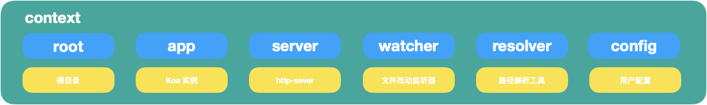
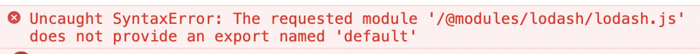
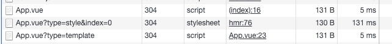

## Vite是什么
vite---一个由vue作者[尤雨溪](https://github.com/yyx990803?spm=taofed.bloginfo.blog.2.b27a5ac8qUj1Iz)开发的web开发工具，它具有以下特点
1. 快速的冷启动
2. 即使的模块热更新
3. 真正的按需编译

从作者在微博上的发言：
:::tip
Vite, 一个基于浏览器原生 ES imports的开发服务器。利用浏览器去解析imports，在服务器端按需编译返回，完全跳过了打包这个概念，服务器随起随用。同时不仅有Vue文件支持，还搞定了热更新，而且热更新的速度不会随着模块增多而变慢。针对生产环境则可以把同一份代码用rollup打包。虽然现在还比较粗糙，但这个方向我觉得是有潜力的，做的好可以彻底解决该一行diamante等半天热更新的问题

从中可以看出vite主要特点是基于浏览器native的ES module来开发，省略打包这个步骤，因为需要什么资源直接在浏览器里引入既可
:::
基于浏览器ES module来开发web应用也不是什么新鲜事，snowpack也基于此，不过目前此项目社区中并没有流行起来，vite的出现也会会让这种开发方式在火一阵子

有趣的是 vite 算是革了 webpack 的命了（生产环境用 rollup），所以 webpack 的开发者直接喊大哥了...


> 作者注:文本完成于vite早起时，vite部分功能和原理有更新

## vite的使用方式
同常见的开发工具一样,vite提供了用npm或者yarn一键生产项目结构的方法，使用yarn在终端执行
```shell
$ yarn create vite-app <project-name>
$ cd <project-name>
$ yarn
$ yarn dev
```
既可初始化一个vite项目(默认应用模板为vue3.x)，生产的项目结构十分简洁
```
|____node_modules
|____App.vue // 应用入口
|____index.html // 页面入口
|____vite.config.js // 配置文件
|____package.json
```
执行 yarn dev 既可启动应用

## vite启动链路
### 命令解析
这部分代码在src/node/cli.ts里，主要是借助minimist-- 一个轻量级的命令解析工具解析 npm scripts，解析的函数是resolveOptions，精简后的代码片段如下
```js
function resolveOptions() {
    // command 可以是 dev/build/optimize
    if(argv._[0]) {
        argv.command = argv._[0];
    }
    return argv;
}
```
拿到options后，会根据options.command 的值判断是执行在开发环境需要的runServe命令或生产环境需要的runBuild命令
```js
if(!options.command || options.command === 'serve') {
    runServer(options);
} else if(options.command === 'build') {
    runBuild(options);
} else if(options.command === 'optimize') {
    runOptimize(options)
}
```
在runServe方法中,执行server模块创建开发服务器方法，同样在runBuild中执行build模块的构建方法。

最新版本中还增加了optimize命令的支持，关于optimize做了什么 我们下文再说

### server
这部分代码在src/node/server/index.ts里，主要暴露一个 createServer方法。

vite使用koa作为web server，使用clmloader创建了一个监听文件改动的watcher，同时实现了一个插件机制，将koa-app和watcher以及其他必要工具组合成一个context对象注入到每个plugin中。

context组成如下



plugin依次从context里获取上面这些组成部分，有的plugin在koaa实例添加了几个middleware，有的借助watcher实现对文件的改动监听，这种插件机制带来的好处是整个应用结构清晰，同时每个插件处理不同的事情，职责更分明

### plugin
上文我们说到plugin,有哪些plugin呢？他们分别是：
- 用户注入的plugins--自定义plugins
- hmrPlugin--处理hmr
- htmlRewritePlugin--重写html内的scrip内容
- moduleResolvePlugin ——获取模块内容
- vuePlugin —— 处理 vue 单文件组件
- esbuildPlugin —— 使用 esbuild 处理资源
- assetPathPlugin —— 处理静态资源
- serveStaticPlugin —— 托管静态资源
- cssPlugin —— 处理 css/less/sass 等引用
- ...

我们来看plugin的实现方式，开发一个用来拦截json文件plugin可以这么实现
```js
interface ServerPluginContext {
    root: string
    app: Koa
    server: Server
    watcher: HMRWatcher
    resolver: InternalResolver
    config: ServerConfig
}

type ServerPlugin = (ctx: ServerPluginContext) => void

const JsonInterceptPlugin:ServerPlugin = ({app})=>{
  	app.use(async (ctx, next) => {
      await next()
      if (ctx.path.endsWith('.json') && ctx.body) {
        ctx.type = 'js'
        ctx.body = `export default json`
      }
  })
}
```
vite 背后的原理都在 plugin 里，这里不再一一解释每个 plugin 的作用，会放在下文背后的原理中一并讨论。
### build
这部分代码在node/build/index.ts中，build目录的机构虽然与server相似，同样导出了一个build方法，同样也有许多plugin，不过这些pulugin与server中的用途不一样，因为build使用了rollup，虽然这些plugin也是为了rollup打包的plugin,本文不在多提

## viet运行原理
### ES module
要了解vite的运行原理，首先要知道什么是ES module，目前主流浏览器对其的支持如下


<span style="color: red">主流的浏览器(IE11除外)均已经支持， 其最大的特点是在浏览器端使用export import的方式导入和导出模块，在script标签里设置type="module"，然后使用模块内容</span>
```html
<script type="module">
    import { bar } from './bar.js'
</script>
```
当html里嵌入上面的script标签的时候，浏览器会发起http请求，请求http server托管的bar.js，在bar.js里，我们用named export导出bar变量，在上面的script中能获取到bar的定义

```js
// bar.js
export const bar = 'bar';
```
### ES module 在vite中的作用
打开运行中的vite项目，访问vite-source可以发现html里有段这样的代码
```html
<script type="module">
    import { createApp } from '/@modules/vue';
    import App from '/App.vue';
    createApp(App).mount('#app')
</script>
```
从这段代码中，我们能get到以下几点信息
1. 从 http://localhost:3000/@modules/vue 中获取 createApp 这个方法
2. 从 http://localhost:3000/App.vue 中获取应用入口
3. 使用 createApp 创建应用并挂载节点

createApp 是vue3.x的api,只需知道这是创建了vue应用既可，vite利用 ES Module,把 “构建vue应用” 这个本来需要webpack打包后才能执行的代码直接放在浏览器里执行了，这么做是为了
1. 去掉打包步骤
2. 实现按需加载

- 去掉打包步骤

    打包的概念是开发者利用打包工具将应用各个模块集合在一起形式 bundle,但打包的过程是静态的---不管某个模块的代码是否执行到，这个模块都要打包到bundle，这样的坏处就是随着项目越来越大打包后的bundle也就越来越大

- 实现按需打包

    前面说到，webpack 之类的打包工具会将各模块提前打包进 bundle 里，但打包的过程是静态的——不管某个模块的代码是否执行到，这个模块都要打包到 bundle 里，这样的坏处就是随着项目越来越大打包后的 bundle 也越来越大。

    开发者为了减少 bundle 大小，会使用动态引入 import() 的方式异步的加载模块（ 被引入模块依然需要提前打包)，又或者使用 tree shaking 等方式尽力的去掉未引用的模块，然而这些方式都不如 vite 的优雅，vite 可以只在需要某个模块的时候动态（借助 import() ）的引入它，而不需要提前打包，虽然只能用在开发环境，不过这就够了
### Vite如何处理ESM
既然vite使用ESM在浏览器里使用模块，那么这一步究竟是周末做的？

<span style="color: red">上文提到过，在浏览器里使用ES module是使用http请求拿到模块，所以vite必须提供一个web server去代理这些模块，上文中提到的koa就是负责这个事情，vite通过对请求路径的劫持获取资源的内容返回给浏览器，不过vite对于模块导入做了特殊处理。</span>

- @modules 是什么？

    通过工程下的index.html和开发环境下的html源文件对比，发现script标签里的内容发生了变化，由
    ```html
    <script type="module">
        import { createApp } from 'vue';
        import App from '/App.vue';
        createApp(App).mount('#app')
    </script>
    ```
    变成了
    ```html
    <script type="module">
        import { createApp } from '/@modules/vue';
        import App from '/App.vue';
        createApp(App).mount('#app')
    </script>
    ```
    vite对import 都做了一层处理，其过程如下
    1. <span style="color: blue">在koa中间件里获取请求body</span>
    2. <span style="color: blue">通过es-module-lexer解析资源ast拿到import的内容</span>
    3. <span style="color: blue">判断import的资源是否是绝对路径，绝对视为npm模块</span>
    4. <span style="color: blue">返回处理后的资源路径:"vue" -> "/@modules/vue"</span>
    这部分代码在serverPluginModuleRewrite这个plugin中

- 为什么需要@module

    如果我们在模块里写下以下代码的时候，浏览器的esm是不可能获取到导入的模块内容的
    ```js
    import vue from 'vue';
    ```
    因为vue这个模块安装在node_modules里，**以往使用webpack,webpack遇到上面的代码**，会帮我做以下几件事
    - <span style="color: blue">获取这段代码的内容</span>
    - <span style="color: blue">解析成AST</span>
    - <span style="color: blue">遍历AST拿到 import 语句中的包的名称</span>
    - <span style="color: blue">使用enhanced-resolve拿到包的实际地址进行打包</span>

    <span style="color: red">但是浏览器中ESM无法直接访问项目下的node_modules，所以vite对所有import都做了处理，用带有 @modules 的前缀重写它们。</span>

    从另外一个绝对看这是非常巧妙的做法，把文件路径的rewrite都写在同一个plugin里，这样后续如果加入更多逻辑，改动起来不会影响其他plugin,其他plugin拿到资源路径都是 @modules，比如说后续可能加入 alias 的配置，就像webpack alias一样：可以将项目里的本地文件配置成绝对路径的引用

- 怎么返回模块内容

    在下一个koa middleware中,用正则匹配到路径上带有@modules的资源，在通过require('xxxx')拿到包的导出返回给浏览器。

    以往使用webpack之类的打包工具，它们除了将模块组装到一起形成bundle，还可以让使用了不同模块规范的包互相引用，比如
    :::tip
    - ES module(esm)导入cjs
    - CommonJS(cjs)导入esm
    - dynamic import 导入esm
    - dynamic import 导入cjs
    :::

    关于es module的坑可以看[这篇文章](https://zhuanlan.zhihu.com/p/40733281?spm=taofed.bloginfo.blog.33.b27a5ac8zlLZms)
    
    起初在vite还只是为了vue3.x设计的时候，对vue esm包是经过特殊处理的，比如：需要@vue/runtime-dom这个包的内容，不能直接通过
    ```
    require('@vue/runtime-dom')
    ```
    得到，而需要通过
    ```
    require('@vue/runtime-dom/dist/runtime-dom.esm-bundler.js')
    ```
    的方式，这样可以使得vite拿到符合esm模块标准的vue包。

    目前社区中大部分模块都没有设置默认导出esm，而是导出了cjs的包，既然vue3.0需要额外处理才能拿到esm的包内容，那么其他日常使用的npm是不是也同样需要支持？答案是肯定的，目前在vite项目里直接使用lodash还是会报错的

    

    不过vite在最近的更新中，加入了optimize命令，这个命令专门为解决模块引用的坑而开发，例如我们要在vite中使用lodash,只需要在vite.config.js（vite配置文件）,配置 optimizeDeps 对象，在include 数组中添加lodash
    ```js
    // vite.config.js
    module.exports = {
        optimizeDeps: [
            include: ['lodash']
        ]
    }
    ```
    <span style="color: red">这样vite在执行 runOptimize 的时候中会使用rollup对lodash包重新编译，将编译撑符合esm模块规范的新的包放入node_module下的.vite_opt_cache,然后配合resolver对lodash的导入进行处理：使用编译后的包内容代替原来lodash的包内容，这样就解决了vite中不能使用cjs包的问题，这部分代码在 depOptimizer.ts 里。</span>

    不过这里还有个问题，由于 depOptimizer.ts 中，vite只会处理在项目下package.json里的 dependencies 里声明好的包进行处理，所以无法在项目里使用
    ```js
    import pick from 'lodash/pick';
    ```
    的方式使用pick方法 ，而要使用
    ```js
    import lodash from 'lodash';
    lodash.pick();
    ```
    的方式，这可能在生产环境下使用某些包的时候对bundle的体积有影响

    返回模块的内容的代码在： serverPluginModuleResolve.ts 这个plugin中
### vite如何编译模块
最初 vite 为 vue3.x 开发，所以这里的编译指的是编译 vue 单文件组件，其他 es 模块可以直接导入内容。

- SFC

    vue单文件组件(简称SFC)是vue的一个亮点，前端界对SFC褒贬不一，个人看来，SFC是利大于弊，虽然SFC带来了额外的开发工作量，比如为了解析template要写模板解析器，还要在SFC中解析出逻辑和样式，在vscode里要写vscode插件，在webpack里要写vue-loader，单独UI与适用方来说可以在一个文件里同时写template、js、style，省去了个文件互相跳转。

    与vue-loader相似，vite在解析vue文件的时候也要分别处理多次,我们打开浏览器的network，可以看到

    

    1个请求的query中山门都没有，另2个请求分别通过query里指定了type为style 和template。

    先来看看如何将一个SFC变成多个请求，我们从第一次请求开始分析，简化后的代码如下
    ```js
    function vuePlugin({app}) {
        app.use(async (ctx, next) => {
            if(!ctx.path.endsWith('.vue') && !ctx.vue) {
                return next();
            }

            const query = ctx.query;
            // 获取文件名称
            let filetname = resolver.erquestToFile(publicPath);

            // 解析器解析SFC
            const descriptor = await parseSFC(root, filename, ctx.body);
            if(!descriptor) {
                ctx.status = 404;
                return;
            }
            // 第一次请求.vue
            if(!query.type) {
                if (descriptor.script && descriptor.script.src) {
                    filename = await resolveSrcImport(descriptor.script, ctx, resolver)
                }
                ctx.type = 'js'
                // body 返回解析后的代码
                ctx.body = await compileSFCMain(descriptor, filename, publicPath)
            }
            // ...
        })
    }
    ```
    在 compileSFCMain 中是一段长长的 generate 代码：
    ```js
    function compileSFCMain(descriptor, filePath: string, publicPath: string) {
        let code = ''
        if (descriptor.script) {
            let content = descriptor.script.content
            code += content.replace(`export default`, 'const __script =')
        } else {
            code += `const __script = {}`
        }

        if (descriptor.styles) {
            code += `\nimport { updateStyle } from "${hmrClientId}"\n`
            descriptor.styles.forEach((s, i) => {
            const styleRequest = publicPath + `?type=style&index=${i}`
            code += `\nupdateStyle("${id}-${i}", ${JSON.stringify(styleRequest)})`
            })
            if (hasScoped) {
            code += `\n__script.__scopeId = "data-v-${id}"`
            }
        }

        if (descriptor.template) {
            code += `\nimport { render as __render } from ${JSON.stringify(
            publicPath + `?type=template`
            )}`
            code += `\n__script.render = __render`
        }
        code += `\n__script.__hmrId = ${JSON.stringify(publicPath)}`
        code += `\n__script.__file = ${JSON.stringify(filePath)}`
        code += `\nexport default __script`
        return code
    }
    ```
    直接看 generate 后的代码：
    ```js
    import { updateStyle } from "/vite/hmr"
    updateStyle("c44b8200-0", "/App.vue?type=style&index=0")
    __script.__scopeId = "data-v-c44b8200"
    import { render as __render } from "/App.vue?type=template"
    __script.render = __render
    __script.__hmrId = "/App.vue"
    __script.__file = "/Users/muou/work/playground/vite-app/App.vue"
    export default __script
    ```
    出现了 vite/hmr 的导入，vite/hmr 具体内容我们下文再分析，从这段代码中可以看到，对于 style vite 使用 updateStyle 这个方法处理，updateStyle 内容非常简单，这里就不贴代码了，就做了 1 件事：通过创建 style 元素，设置了它的 innerHtml 为 css 内容。

    这两种方式都会使得浏览器发起 http 请求，这样就能被 koa 中间件捕获到了，所以就形成了上文我们看到的：对一个 .vue 文件处理三次的情景。

    这部分代码在：serverPluginVue 这个 plugin 里。
- css

    如果在 vite 项目里引入一个 sass 文件会怎么样？

    最初 vite 只是为 vue 项目开发，所以并没有对 css 预编译的支持，不过随着后续的几次大更新，在 vite 项目里使用 sass/less 等也可以跟使用 webpack 的时候一样优雅了，只需要安装对应的 css 预处理器即可。

    在 cssPlugin 中，通过正则：/(.+).(less|sass|scss|styl|stylus)$/ 判断路径是否需要 css 预编译，如果命中正则，就借助 cssUtils 里的方法借助 postcss 对要导入的 css 文件编译。

### vite热更新的实现
上文中出现了 vite/hmr ，这就是 vite 处理热更新的关键，在 serverPluginHmr plugin 中，对于 path 等于  vite/hmr 做了一次判断：
```js
app.use(async (ctx, next) => {
    if(ctx.path === '/vite/hmr') {
        ctx.type = 'js';
        ctx.status = 200;
        ctx.body = hmrClient;
    }
})
```
hmrClient是vite热更新的客户端代码，需要在浏览器里执行，这里先来说说通用的热更新实现，热更新一般需要四个部分：
1. <span style="color: red">首先需要web框架支持的rerender/reload</span>
2. <span style="color: red">通过watcher监听文件改动</span>
3. <span style="color: red">通过server端编译资源，并推送新模块内容给client</span>
4. <span style="color: red">client收到新的模块内容，执行rerender/loader</span>

vite 也不例外同样有这四个部分，其中客户端代码在：client.ts 里，服务端代码在 serverPluginHmr 里，对于 vue 组件的更新，通过 vue3.x 中的 HMRRuntime 处理的。


- client 端

    在 client 端， WebSocket 监听了一些更新的类型，然后分别处理，它们是：

    - vue-reload —— vue 组件更新：通过 import 导入新的 vue 组件，然后执行 HMRRuntime.reload
    - vue-rerender —— vue template 更新：通过 import 导入新的 template ，然后执行 HMRRuntime.rerender
    - vue-style-update —— vue style 更新：直接插入新的 stylesheet
    - style-update —— css 更新：document 插入新的 stylesheet
    - style-remove —— css 移除：document 删除 stylesheet
    - js-update  —— js 更新：直接执行
    - full-reload —— 页面 roload：使用 window.reload 刷新页面
- server 端
     
     在 server 端，通过 watcher 监听页面改动，根据文件类型判断是 js Reload 还是 Vue Reload：
     ```js
      watcher.on('change', async (file) => {
    const timestamp = Date.now()
        if (file.endsWith('.vue')) {
        handleVueReload(file, timestamp)
        } else if (
        file.endsWith('.module.css') ||
        !(file.endsWith('.css') || cssTransforms.some((t) => t.test(file, {})))
        ) {
        // everything except plain .css are considered HMR dependencies.
        // plain css has its own HMR logic in ./serverPluginCss.ts.
        handleJSReload(file, timestamp)
        }
    })
     ```
     在 handleVueReload 方法里，会使用解析器拿到当前文件的 template/script/style ，并且与缓存里的上一次解析的结果进行比较，如果 template 发生改变就执行 vue-rerender，如果 style 发生改变就执行 vue-style-update，简化后的逻辑如下：
     ```js
      async function handleVueReload(
		file
        timestamp,
        content
    ) {
        // 获取缓存
        const cacheEntry = vueCache.get(file）

        // 解析 vue 文件                                 
        const descriptor = await parseSFC(root, file, content)
        if (!descriptor) {
        // read failed
        return
        }
            // 拿到上一次解析结果
        const prevDescriptor = cacheEntry && cacheEntry.descriptor
        
        // 设置刷新变量
        let needReload = false // script 改变标记
        let needCssModuleReload = false // css 改变标记
        let needRerender = false // template 改变标记

        // 判断 script 是否相同
        if (!isEqual(descriptor.script, prevDescriptor.script)) {
        needReload = true
        }

        // 判断 template 是否相同
        if (!isEqual(descriptor.template, prevDescriptor.template)) {
        needRerender = true
        }
        
        // 通过 send 发送 socket
        if (needRerender){
            send({
            type: 'vue-rerender',
            path: publicPath,
            timestamp
        })	
        }
    }
     ```
     handleJSReload 方法则是根据文件路径引用，判断被哪个 vue 组件所依赖，如果未找到 vue 组件依赖，则判断页面需要刷新，否则走组件更新逻辑，这里就不贴代码了。

    整体代码在 client.ts 和 serverPluginHmr.ts 里。

## 总结


## 文档
[vite —— 一种新的、更快地 web 开发工具](https://fed.taobao.org/blog/taofed/do71ct/ok00nb/)

[解密Vite的原理](https://juejin.cn/post/6844904202364420109)

[Vite 原理浅析](https://juejin.cn/post/6844904146915573773)