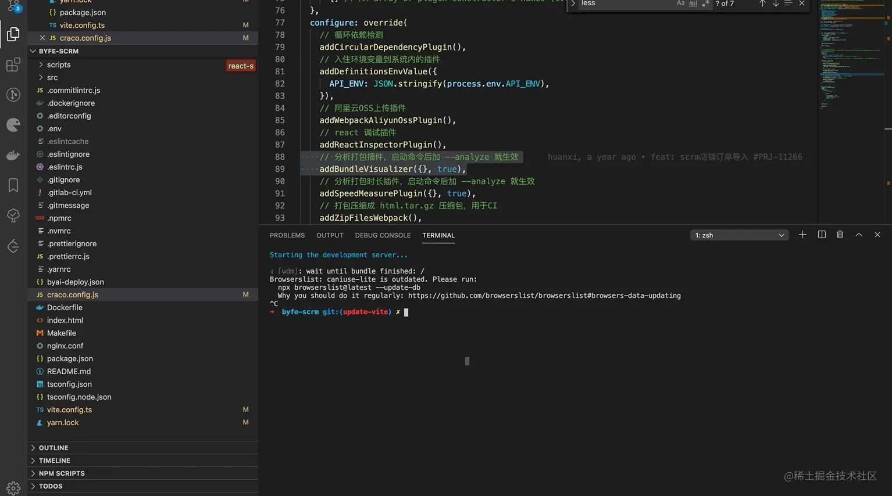
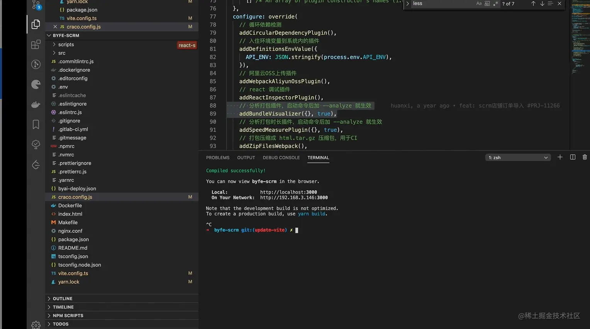
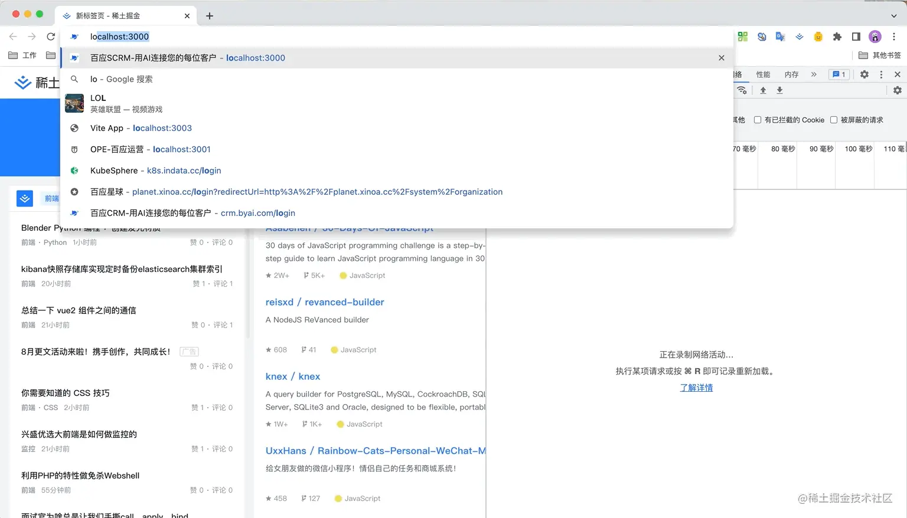
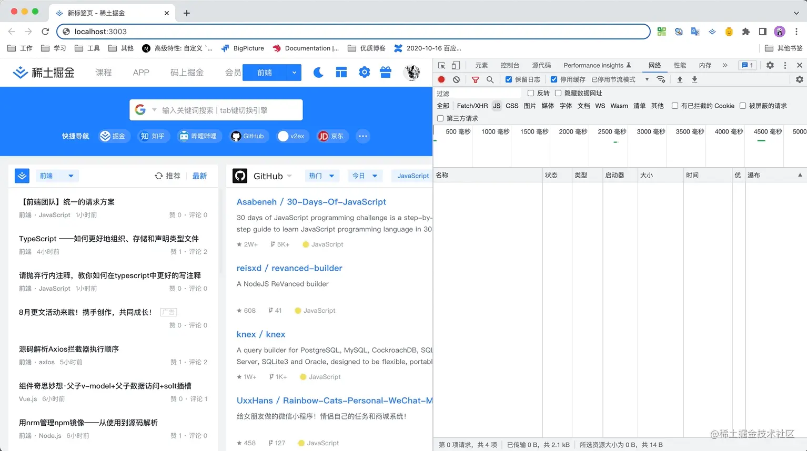
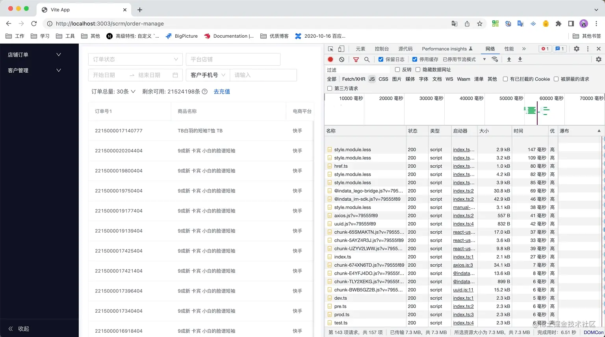

## 前言
Vite，给人的第一印象就是dev server启动速度快。同样规模的项目，相比webpack动辄几十秒甚至几十秒秒的启动速度，Vite快到没有朋友，往往数秒之内即可完成启动；

正好小编最近在做一些关于开发体验的性能优化，就想着把手上一些项目的开发模式更新为 Vite。经过一番操作，终于改造成功，而效果也不负众望，项目启动速度由原来的 25 s 如坐 🚀一般跃升为 2 s，简直夸张。虽然也出现了一些诸如首屏、懒加载性能下降等负面效果，但整体来说依然利大于弊，开发幸福感提升非常明显。

## Vite的快
Vite的快，主要体现在两个方面：**快速的冷启动和快速的热更新**。而Vite之所以能有如此优秀的表现，完全归于Vite借助了浏览器对ESM规范的支持，采取了与Webpack完全不同的unbundle机制

### 快速的冷启动

- webpack

    首先是通过webpack启动dev server 过程如下
    
    
    一个规模不是很大的项目，dev server启动完成，居然花了25s左右时间。如果项目持续迭代变得在大一点，那每次启动dev server就是一种折磨了。

    这个问题，**主要是由webpack内部的核心机制--bundle模式引发的**

    <mark>webpack能大行其道，归功于它划时代的采用了bundle机制。通过这种bundle机制，webpack可以将项目中各种类型的文件转化为浏览器识别的js、css、img等文件，建立源文件之间的依赖关系，并将数量庞大的源文件合并为少量的几个输出文件</mark>

    bundle工作机制的核心部分分为两块：**构建模块依赖图--module graph和将module graph分解为最终浏览器使用的几个输出文件**

    构建module graph的过程简单归纳为
    1. 获取配置文件中的entry对应的url(这个url一般为相对路径)
    2. resolve - 将 url 解析为绝对路径，找到源文件在本地磁盘的位置，并构建一个 module 对象；
    3. load - 读取源文件的内容;
    4. transform - 使用对应的 loader 将源文件内容转化为浏览器可识别的类型；
    4. parse - 将转化后的源文件内容解析为 AST 对象，分析 AST 对象，找到源文件中的静态依赖(import xxx from 'xxx') 和动态依赖(import('xx'))对应的 url, 并收集到 module 对象中；
    5. 遍历第 5 步收集到的静态依赖、动态依赖对应的 url，重复 2 - 6 步骤，直到项目中所有的源文件都遍历完成。

    分解moudle graph的过程也可以简单归纳为
    1. 预处理 module graph，对 module graph 做 tree shaking；
    2. 遍历 module graph，根据静态、动态依赖关系，将 module graph 分解为 initial chunk、async chunks；
    3. 优化 initial chunk、 async chunks 中重复的 module；
    4. 根据 optimization.splitChunks 进行优化，分离第三方依赖、被多个 chunk 共享的 module 到 common chunks 中；
    5. 根据 chunk 类型，获取对应的 template；
    6. 遍历每个 chunk 中收集的 module，结合 template，为每个 chunk 构建最后的输出内容；
    7. 将最后的构建内容输出到 output 指定位置；

    webpack的这种bundle机制，奠定了现代惊天打包器(如Rollup、Parcel、esBuild)的标准工作模式

    然而成也萧何败萧何，强大的 bundle 机制，也引发了构建速度缓慢的问题，而且项目规模越大，构建速度越是缓慢。其主要原因是构建 module graph 的过程中，涉及到大量的文件 IO、文件 transfrom、文件 parse 操作；以及分解 module graph 的过程中，需要遍历 module graph、文件 transform、文件 IO 等。这些操作，往往需要消耗大量的时间，导致构建速度变得缓慢。

    开发模式下，dev server 需要 Webpack 完成整个工作链路才可以启动成功，这就导致构建过程耗时越久，dev server 启动越久。

    为了加快构建速度，webpack做了大量优化，如loader的缓存功能、webpack5的持久化缓存等，但这些都是治标不治本，只要webpack的核心工作机制不变，那dev server启动优化，依旧是一个任重道远的过程(基本上永远打不到vite这样的效果)

- Vite

    同样的项目，这次换Vite启动
    

    通过 gif 动图，我们可以看到 dev server 的启动速度仅仅需要 2s 左右，相比 Webpack 如 🐢 爬行一样的速度，就如同坐 🚀一般，开发幸福感顿时拉满。

    Vite 之所以在 dev server 启动方面，如此给力，是因为它采取了与 Webpack 截然不同的 unbundle 机制。

    **unbundle机制，顾名思义，不需要做bundle操作，即不需要构建、分解module graph，源文件之间的依赖关系通过浏览器对ESM规范的支持来解析**。这使得dev server在启动过程中只需做一些初始化工作，剩下的完全由浏览器支持。这和webpack的bundle机制一比，简直就是降为大几，都有点欺负人了

    那有的同学就会问，源文件的 resolve、load、transform、parse 什么时候做呢 ？

    答案是浏览器发起请求以后，dev server 端会通过 middlewares 对请求做拦截，然后对源文件做
    resolve、load、transform、parse 操作，然后再将转换以后的内容发送给浏览器。

    这样，通过 unbundle 机制， Vite 便可以在 dev server 启动方面获取远超于 Webpack 的优秀体验。

    最后再总结一下， unbundle 机制的核心:
    - 模块之前的依赖关系的解析由浏览器实现
    - 文件的转换由dev server的middlewares实现并做缓存
    - 不对源文件做合并捆绑操作

### 快速的热更新
除了dev server启动外，Vite在热更新方面也有非常优秀的表现

我们还是通过同一个项目，对比webpack和Vite的热更新做一下比较

- webpack

    

    观察 gif 动图，修改源文件以后，Webpack 发生耗时大概 5 s 的重新编译打包过程。
    
    dev server 启动以后，会 watch 源文件的变化。当源文件发生变化后，Webpack 会重新编译打包。这个时候，由于我们只修改了一个文件，因此只需要对这个源文件做 resolve、 load、 transfrom、parse 操作，依赖的文件直接使用缓存，因此 dev server 的响应速度比冷启动要好很多。
    
    dev server 重新编译打包以后，会通过 ws 连接通知浏览器去获取新的打包文件，然后对页面做局部更新。

- Vite

    

    观察 gif 动图，可以发现 Vite 在热更新方面也是碾压 Webpack。
    
    由于 Vite 采用 unbundle 机制，所以 dev server 在监听到文件发生变化以后，只需要通过 ws 连接通知浏览器去重新加载变化的文件，剩下的工作就交给浏览器去做了。(忍不住要给 Vite 点个 👍🏻 了。)

综上，Vite在dev server冷启动和热更新方面，对webpack的优势实在太明显了

## Vite的慢
和 bundle 机制有利有弊一样，unbundle 机制给 Vite 在 dev server 方面获得巨大性能提升的同时，也带来一些负面影响，那就是**首屏和懒加载性能的下降**。

### 首屏性能
- webpack

    

    浏览器向dev server发起请求，dev server接收到请求，然后将已经打包构建好的首屏内容发送到给浏览器。这个过程非常普遍，没什么可说的，不存在性能问题

- vite

    相比 Webpack， Vite 在首屏方面的表现就有些差了。
    

    通过gif动图，我们可以很明显的看到首屏需要较长的时间才能完全显示

    由于unbundle机制，首屏期间需要额外做以下工作
    - 不对源文件做合并捆绑操作，导致大量的http请求；
    - dev server运行期间对源文件做resolve、load、transform、parse操作
    - 与构建、二次构建也会阻塞首屏请求，知道与构建完成位置

    和webpack对比，Vite把需要在dev server启动过程中完成的工作，转移到dev server响应浏览器请求的过程中，不可避免的导致首屏性能下降

    不过首屏性能差值发生在dev server启动以后第一次加载页面时发生。之后在reload页面时，首屏性能会好很多。**原因是dev server会将之前已经完成转换的内容缓存起来。**

### 懒加载性能
- webpack

    在懒加载方面，webpack表现正常，没什么好说的

- vite

    同样的， Vite 在懒加载方面的性能也比 Webpack 差。

    

    和首屏一样，由于 unbundle 机制，动态加载的文件，需要做 resolve、load、transform、parse 操作，并且还有大量的 http 请求，导致懒加载性能也受到影响。

    此外，如果懒加载过程中，发生了二次预构建，页面会 reload，对开发体验也有一定程度的影响。

## 结束语
尽管在首屏、懒加载性能方面存在一些不足，但瑕不掩瑜，作为目前最 🔥 的构建工具，Vite 可以说是实至名归。而且这些问题并非不可解决，比如我们可以通过 prefetch、持久化缓存等手段做优化，相信 Vite 未来也会做出对应的改进。

总的来说， Vite 还是未来可期的，还没有开始使用的小伙伴，可以去尝试一下噢，😄

## 资料
[为什么有人说 vite 快，有人却说 vite 慢](https://juejin.cn/post/7129041114174062628)

[webpack bundle 函数详解](https://zhuanlan.zhihu.com/p/387722743)