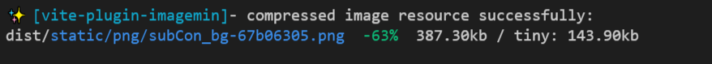
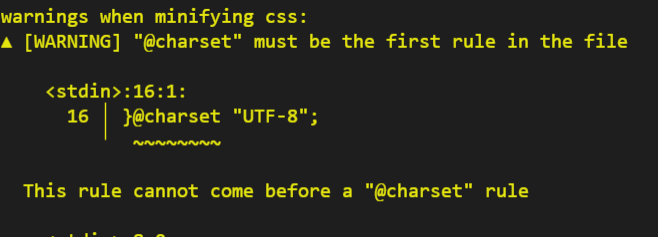
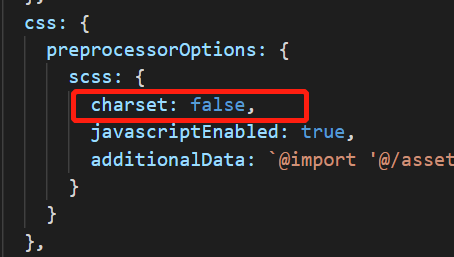
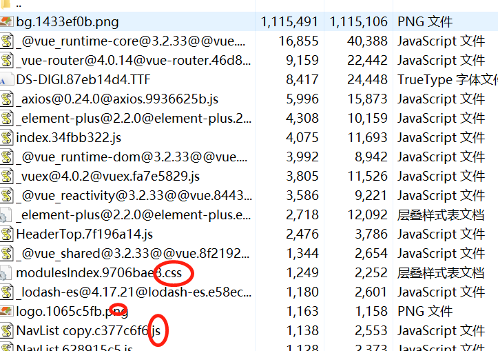
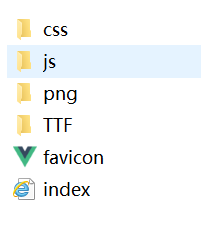
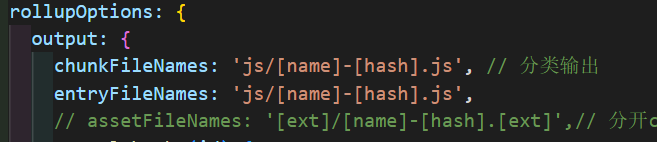
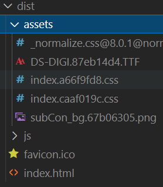

## Vite配置图片压缩打包
```shell
cnpm i vite-plugin-imagemin -D
```
添加配置到plugins里面
```js
import viteImagemin from 'vite-plugin-imagemin' // 引入

export default defineConfig({
  plugins: [vue(),
  viteImagemin({
    gifsicle: {
      optimizationLevel: 7,
      interlaced: false,
    },
    optipng: {
      optimizationLevel: 7,
    },
    mozjpeg: {
      quality: 20,
    },
    pngquant: {
      quality: [0.8, 0.9],
      speed: 4,
    },
    svgo: {
      plugins: [
        {
          name: 'removeViewBox',
        },
        {
          name: 'removeEmptyAttrs',
          active: false,
        },
      ],
    },
  })]
}）
```
插件官网[https://github.com/vbenjs/vite-plugin-imagemin](https://github.com/vbenjs/vite-plugin-imagemin)


图片变小了63%

## warning:『@charset』must be the first rule in the file(警告问题)



<span style="color: red">原因: css编译，@charset规则放在第一位，具体的原因与font-family有关</span>



如果无效可参考https://www.zhihu.com/question/498190531

我本地测试有效😀

## ts找不到@模块(报错问题)
在vue文件中@使用正常

纳闷

两种解决方式

1. 不用@ ，用相对路径
    
    显然这种处理优点装鸵鸟了

2. 配置tsconfig.json

    你都用@了别告诉我没在vite配置，这里不说@配置
    ```js
　　"baseUrl": ".",
    "paths": {
        "@/*": ["src/*"]
    }
    ```

## vite打包分类文件输出配置以及静态资源拆分
直接打包后所有累心文件都存在一个文件内



### 文件分类输出，干净整洁舒心
配置一下config.ts文件分类输出
```js
build: {
    outDir: 'dist',
    chunkSizeWarningLimit: 1000, // chunks 大小限制
    rollupOptions: {
        output: {
        chunkFileNames: 'js/[name]-[hash].js', // 分类输出
        entryFileNames: 'js/[name]-[hash].js',
        assetFileNames: '[ext]/[name]-[hash].[ext]', 
        manualChunks(id) {
            if (id.includes('node_modules')) { // 超大静态资源拆分
            return id.toString().split('node_modules/')[1].split('/')[0].toString()
            }
        }
        }
    }
}
```


>注意很多文案配置是
```js
output: {
    chunkFileNames: 'static/js/[name]-[hash].js',
    entryFileNames: 'static/js/[name]-[hash].js',
    assetFileNames: 'static/[ext]/[name]-[hash].[ext]',
}
```
这样配置目前发现的bug：
1. bug1： assetFileNames配置的图片打包会报错，测试发现与配置的imagemin图片压缩插件路径读取是有冲突的
2. bug2：项目测试中发现js放到static里面会与iframe嵌入页面读取静态文件读取冲突导致加载页面404
3. bug3：build打包文件生成的dist自动删除文件不干净，static太深层级导致需要手动删除再build或者build2次才成功

### 超静态资源过大，默认500kb会报警
配置
```js
chunkSizeWarningLimit: 1000
// 不能一味放大限制。我们可以利用 manualChunks 拆分超大资源
```
测试发现bug，css设置背景图片后找不到，图片路径指向css中了

配置了绝对路径也一样

于是只要注释调其他文件分类的输出，只保留js





## 打包删除console配置以及报错
功能说明：打包后删除文件中console、debugger等调试用的多余代码

看了很多配置如下

```js
build: {
    // 清除console等多余代码
    terserOptions: {
      compress: {
        drop_console: true,
        drop_debugger: true
      }
    },
}
```
结果报错

原来是build配置项minify没有配置，默认是esbuild，需要配置为terser

```js
minnify?: boolean | 'terser' | 'esbuild'

// 添加minify配置
minify: 'terser',
terserOptions: {
    compress: {
        drop_console: true,
        drop_debugger: true
    }
}
```