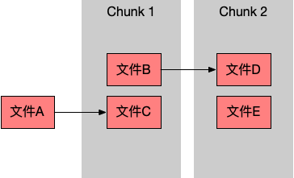
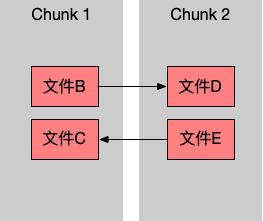
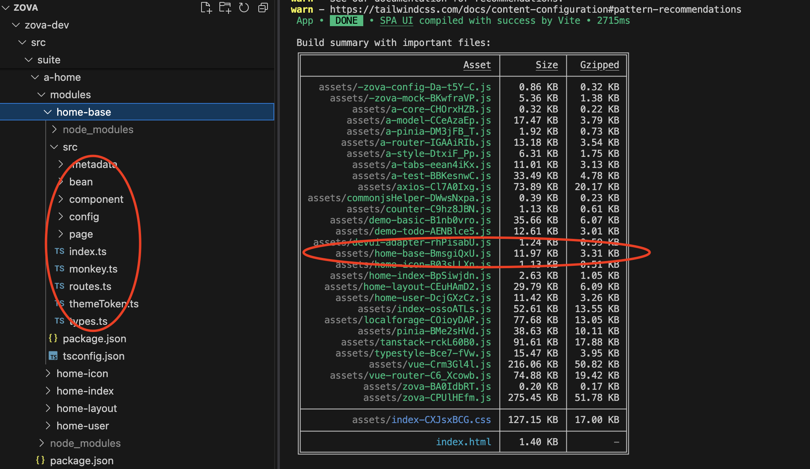
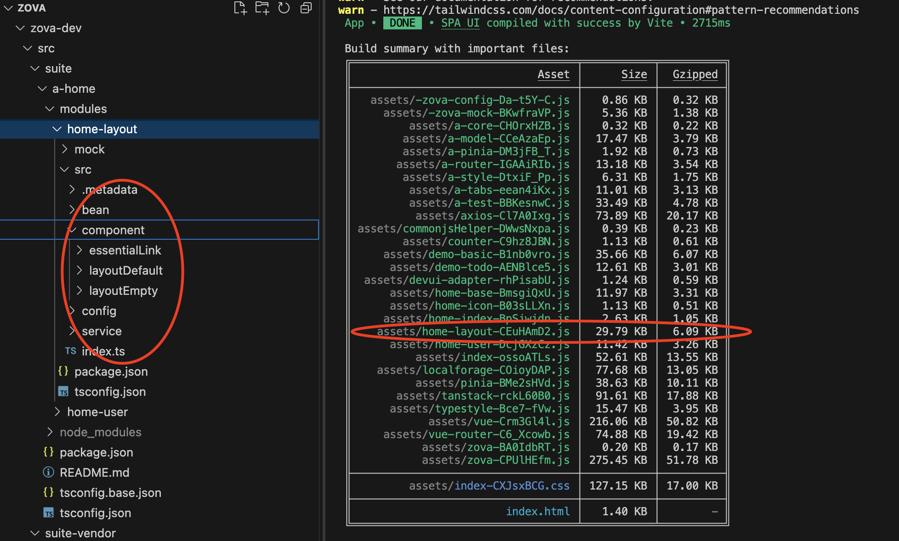
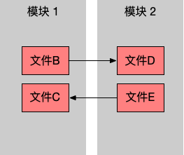

[原文](https://www.v2ex.com/t/1080210#reply3)

## 背景
我们在使用vite进行打包时，经常会遇到这个问题：随着业务的展开，版本迭代，页面越来越多，第三方依赖也越来越多，打出来的包也越来越大。如果把页面都进行动态导入，那么烦死几个页面公用的文件都会进行独立拆包，从而导致大量chunk碎片的产生。许多chunk碎片体积都很小，比如1K,2K,3K,从而显著增加了浏览器的资源请求。

虽然可以通过rollupOptions.output.manualChunks定制分包策略，但是文件之间的依赖关系错综复杂，分包配置稍有不慎，要么导致初始包体积过大，要么导致出现循环依赖错误，因此心智负担很重。那么有没有自动化的分包机制来彻底解决打包碎片化的问题呢？

## 拆包合并的两种隐患
前面提到使用rollupOptions.output.manualChunks定制分包策略，虽然可以解决打包碎片化的问题，但是存在两种隐患：
1. 导致初始包体积过大

    

    如图所示，文件A本来只依赖文件C，但是按照图中所示分包配置，导致在使用文件A之前必须先下载 Chunk1和Chunk2。在稍微大一点的项目中，由于文件之间依赖关系非常复杂，这种依赖关系会随着大量小文件的合并而快速蔓延，导致初始包体积过大

2. 导致出现循环依赖错误 

    

    如图所示，由于文件之间的相互依赖，导致打包后的chunk1和chunk2出现循环依赖的错误。那么在复杂的项目中，业务之间相互依赖的情况就更加常见

## 解决之道：模块化体系
由于分包配置导致以上两个隐患，所以往往步履维艰，很难有一个可以遵循的的简便易用的配置规则。因为分包配置与业务的当前状态密切相关。一旦业务有所变更，分包配置也需要做相应的改变。

**为了解决这个难题，我在项目中引入了模块化体系**。<span style="color:blue">也就是将项目的代码根据业务特点进行拆分，形成若干模块的组合。每一个模块都可以包含页面、组件、配置、语言、工具等资源。然后一个模块就是一个天然的拆包边界，在build构建时，自动打包成一个独立的异步chunk，告别vite配置的烦恼，同时可以有效避免构建产物的碎片化。特别是在大型业务系统中，这种优势尤其明显。当然，采用模块化体系也有利用代码解耦，便于分工协作。</span>

由于一个模块就是拆包边界，我们可以通过控制模块的内容和数量来控制产物chunk的大小和数量。而模块划分的依据是业务特点，具有现实的业务意义，相较于rollupOptions.output.manualChunks定制，显然心智负担很低

## 文件结构
随着项目不断迭代演进，创建的业务模块也会随之膨胀。对于某些业务场景，往往需要多个模块的配合实现。因此，我还在项目中引入了套件的概念，一个套件就是一组业务模块的组合。这样，一个项目就是由若干套件和若干模块组合而成的。下面是一个项目的文件结构：

```js
project
├── src
│  ├── module
│  ├── module-vendor
│  ├── suite
│  │  ├── a-demo
│  │  └── a-home
│  │    ├── modules
│  │    │  ├── home-base
│  │    │  ├── home-icon
│  │    │  ├── home-index
│  │    │  └── home-layout
│  └── suite-vendor
```
名称|说明
---|---
src/module | 独立模块(不属于套件)
src/module-vendor | 独立模块(来自第三方)
src/suite|套件
src/suite-vendor | 套件(来自第三方)
a-demo| 测试套件：将测试代码放入一个套件中，从而方便随时禁用
a-home| 业务套件：包含4个业务模块

## 打包效果
下面就来看一下实际的打包效果

以模块 home-base 为例，图左现实的就是该模块的代码，图右显示的就是该模块打包后的文件体积12K，压缩后是3k。要达到这种分包效果，不需要做任何配置



再比如，我们还可以把布局组件集中放入模块home-layout进行管理。该模块打包成独立的 Chunk ，体积为 29K ，压缩后是 6K 。



## 源码分析
1. 动态导入模块

    由于项目的模块目录结构都是有规律的，我们可以在项目启动之前提取所有的模块清单，然后生成一个js文件，集中实现模块的动态导入

    ```js
    const modules = {};
    ...
    modules['home-base'] = { resource: () => import('home-base')};
    modules['home-layout'] = { resource: () => import('home-layout')};
    ...
    export const modulesMeta = {modules};
    ```
    由于所有模块都是通过import方法动态导入的，那么在进行Vite打包时候就会自动拆分为独立的chunk.
- 拆包配置

    我们还需要通过rollupOptions.output.manualChunks定制拆包配置，从而确保模块内部的代码统一打包到一起，避免出现碎片化文件。
    ```js
    const __ModuleLibs = [
        /src\/module\/([^\/]*?)\//,
        /src\/module-vendor\/([^\/]*?)\//,
        /src\/suite\/.*\/modules\/([^\/]*?)\//,
        /src\/suite-vendor\/.*\/modules\/([^\/]*?)\//,
    ];

    const build = {
        rollupOptions: {
            output: {
            manualChunks: id => {
                return customManualChunk(id);
            },
            },
        },
    };

    function customManualChunk(id: string) {
        for (const moduleLib of __ModuleLibs) {
            const matched = id.match(moduleLib);
            if (matched) return matched[1];
        }
        return null;
    }
    ```
    通过正则表达式匹配每一个文件路径，如果匹配成功就使用相应的模块名称作为 chunk name 。

## 两种隐患的解决之道
如果模块之间相互依赖，那么也可能存在前面所说的两种隐患，如图所示



为了防止两种隐患情况的发生，我们可以实现一种更精细的动态加载和资源定位的机制。简而言之，当我们在模块 1中访问模块 2的资源时，首先要动态加载模块 2 ，然后找到模块 2 的资源，返回给使用方。

比如，在模块 2 中有一个 Vue 组件Card，模块 1 中有一个页面组件FirstPage，我们需要在页面组件FirstPage中使用Card组件。那么，我们需要这样来做：
```js
// 动态加载模块
export async function loadModule(moduleName: string) {
  const moduleRepo = modulesMeta.modules[moduleName];
  return await moduleRepo.resource();
};

// 生成异步组件
export function createDynamicComponent(moduleName: string, name: string) {
  return defineAsyncComponent(() => {
    return new Promise(resolve => {
      // 动态加载模块
      loadModule(moduleName).then(moduleResource => {
        // 返回模块中的组件
        resolve(moduleResource.components[name]);
      });
    });
  });
}
```

```js
const ZCard = createDynamicComponent('模块 2', 'Card');

export class RenderFirstPage {
  render() {
    return (
      <div>
        <ZCard/>
      </div>
    );
  }
}
```
## 高级导入机制
虽然使用createDynamicComponent可以达到预期的目的，但是，代码不够简洁，无法充分利用 Typescript 提供的自动导入机制。我们希望仍然像常规的方式一样使用组件：
```js
import { ZCard } from '模块 2';

export class RenderFirstPage {
  render() {
    return (
      <div>
        <ZCard/>
      </div>
    );
  }
}
```
这样的代码，就是静态导入的形式，就会导致模块 1和模块 2强相互依赖。那么，有没有两全其美的方式呢？有的。我们可以开发一个 Babel 插件，对 AST 语法树进行解析，自动将 ZCard 的导入改为动态导入形式。这样的话，我们的代码不仅简洁直观，而且还可以实现动态导入，规避分包时两种隐患的发生。为了避免主题分散，Babel 插件如何开发不在这里展开，如果感兴趣，可以直接参考源代码：[babel-plugin-zova-component](https://github.com/cabloy/zova/blob/a6088acf4f520a65fa206b6864329b1712ae0921/zova-dev/packages-utils/babel-plugin-zova-component/src/index.ts)

## 结语
本文对 Vite 打包碎片化的成因进行了分析，并且提出了模块化体系，从而简化分包配置，同时又采用动态加载机制，完美规避了分包时两种隐患的发生。

当然，实现一个完整的模块化系统，需要考虑的细节还有很多，如果想体验开箱即用的效果，可以访问我开源的 Zova.js 框架：https://github.com/cabloy/zova。可添加我的微信，入群交流：yangjian2025

