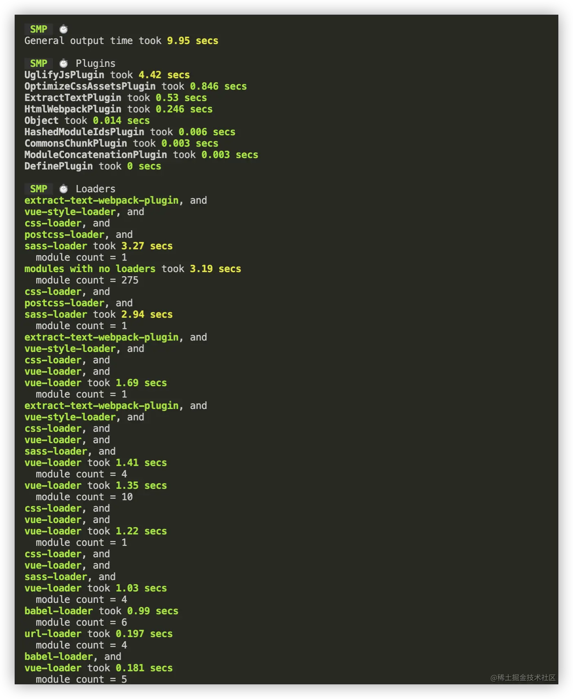
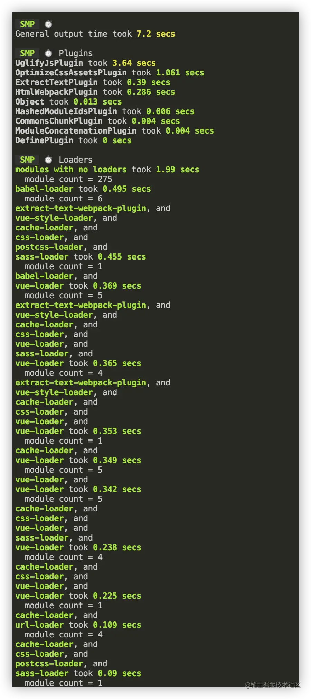
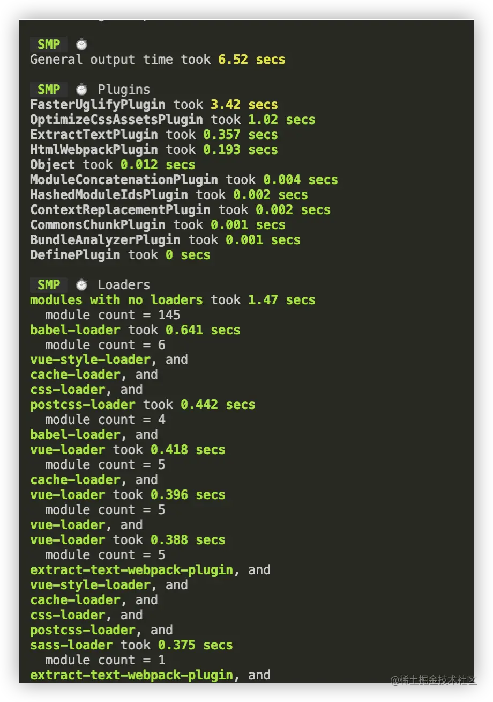
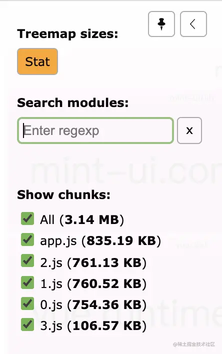
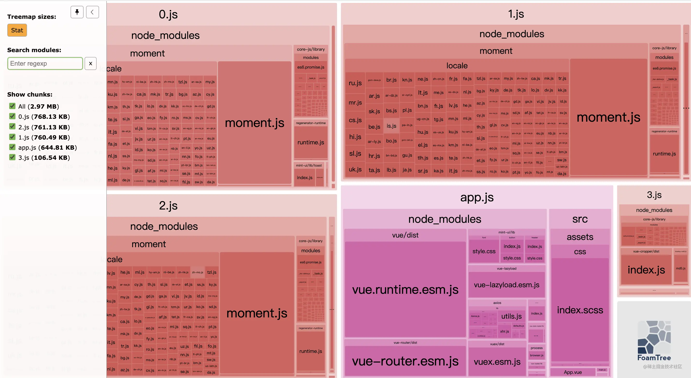
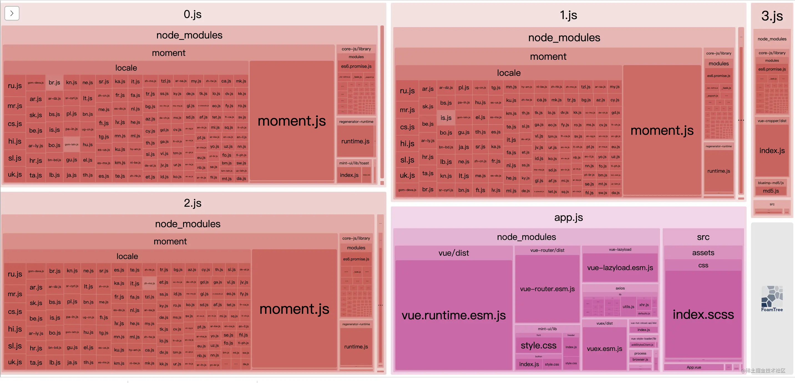
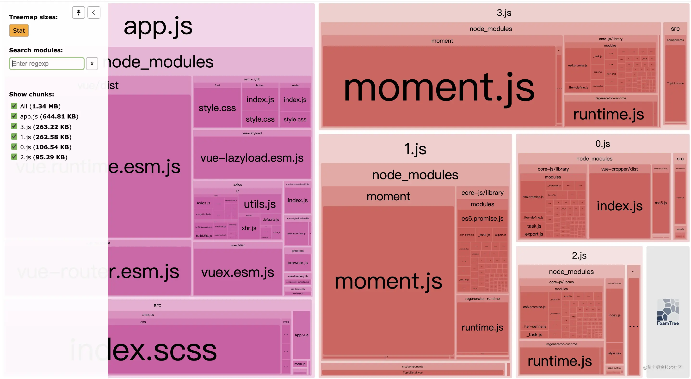
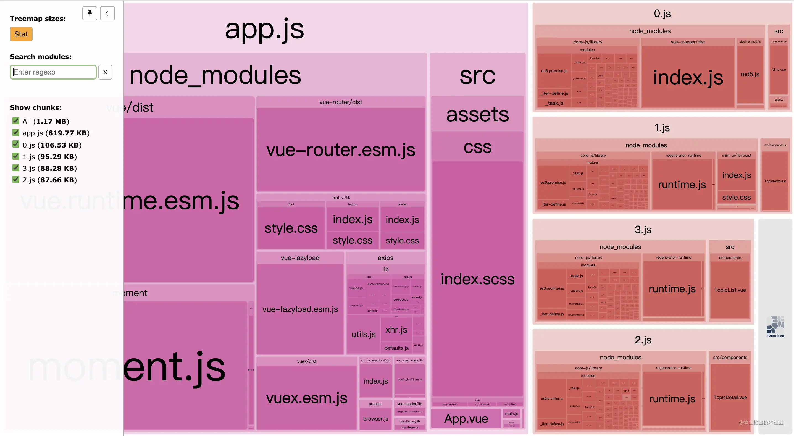
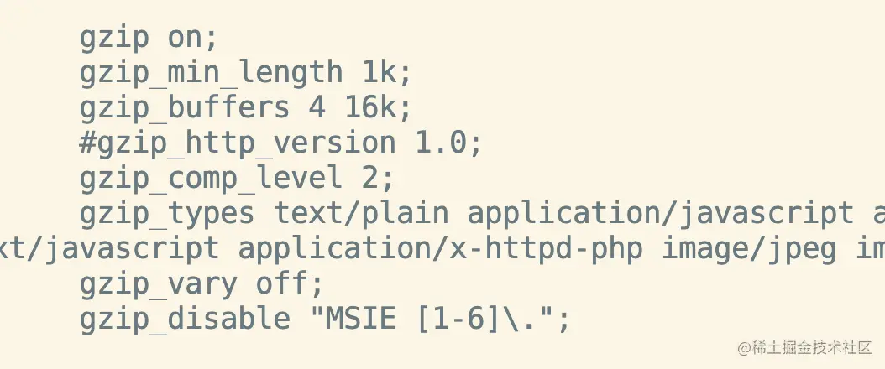

## 目录
```md
- 打包阶段
    - 第一步:安装speed-measure-webpack-plugin
    - 第二步:安装cache-loader
    - 第三步:安装happypack
    - 第四步:安装webpack-parallel-uglify-plugin
    - 打包总结
- 上线优化阶段
    - 第一步:基础优化
    - 第二步:路由懒加载和按需引入
    - 第三步:优化代码和合并相同的包
    - 第四步:在服务器上的优化
    - 上线优化总结
- 最后优化总结
```
## 打包阶段
这是一个基于webpack@3.6.0的项目,所以在安装功能包的时候要注意起版本，所以下面安装包我都贴心的把对应的版本加上了
### 第一步:安装speed-measure-webpack-plugin
```
安装包版本: "speed-measure-webpack-pulgin":"^1.5.0"
```
<span style="color: red">该安装包的作用:**在打包的过程中,能够精确的帮你分析出每一个步骤耗费的时间，然后我们可以针对时间比较长的部分专门做优化**</span>

一下是配置
```js
const SpeedMeasurePlugin = require('speed-measure-webpack-plugin');
const smp = new SpeedMeasurePlugin();
const webpackConfig = smp.wrap(merge(baseWebpack, {
        // ...
    })
)
```
执行npm run build之后，我们可以看到结果


### 第二步:安装cache-loader
```md
安装包版本:"cache-loader": "^4.1.0"
```
<span style="color: red">对sass-loader、postcss-loader、vue-loader做打包缓存，缩短打包的时间</span>

以下是对vue-loader和url-loader做缓存的代码
```js
const cacheLoader = {
    loader: 'cache-loader'
}
rules: [
    {
        test: /\.vue$/,
        use: [
            cacheLoader,
            {
                loader: 'vue-loader',
                options: vueLoaderConfig
            }
        ]
    }
    // ...
    {
        test: /\.(png|jpe?g|gif|svg)(\?.*)?$/,
        use: [
            cacheLoader,
            {
                loader: 'url-loader',
                options: {
                    limit: 10000,
                    name: utils.assetsPath('img/[name].[hash:7].[ext]')
                }
            }
        ]
    }
]
```
以下是对cssLoader、postcssLoader做缓存的代码
```js
const loaders = options.usePostCSS ? [cacheLoader, cssLoader, postcssLoader] : [cacheLoader, cssLoader]
```
执行npm run build之后，我们可以看到如下结果


对比之后的成果:plugin打包时间缩短了0.8秒钟，loader时间缩短了2.94秒,打包一共缩短了2.7秒钟。

由于这个项目包比较小，缩短的时间并不是特别明显

### 第三步:安装happpypack(当前项目太小，没有起到效果，当时后端管理项目有优化效果)
```md
安装包版本:"happypack":"^5.0.1"
```
可以在打包的时候开启多线程打包。[使用连接](https://www.npmjs.com/package/happypack)

因为上面主要是sass-loader包最占用时间，并且已经开启了缓存，时间上优化到很小的一个水平。当然，我重新开启了happypack进行多线程打包，可能由于项目太小，发现时间不仅没有变短，还多了0.2秒。划不来了。就不画蛇添足了

稍大一些的项目可以开启这个多线程打包模式，根据具体的项目而定。


### 第四步:安装webpack-parallel-uglify-plugin
```md
安装包版本:"webpack-parallel-uglify-plugin":"1.1.0"
```
用上图中可以看到UglifyJsPlugin这个包打包时间过长，我想到可以使用webpack-parallel-uglify-plugin这个包，开启多核同步压缩增加压缩的效率

开始配置
```js
const ParallelUglifyPlugin = require('webpack-parallel-uglify-plugin');
new ParalleUglifyPlugin({
    uglifyJS: {
        output: {
            beautify: false, // 是否保留空格和制表符，设置不保留
            comments: false, // 是否保留代码中的注释，设置不保留
        },
        compress: {
            drop_console: true, // 是否删除代码中的console语句，设置为删除
            collapse_vars: false,// 是否内嵌虽然已经定义了，但是只用到一次的变量，设置不适用
            reduce_var: false // 是否提取出现了多次但是没有定义成变量去引用的静态值，设置不转换
        },
        warnings: false // 是否在删除没有用到的代码时输出警告信息，设置为不警告
    }
})
```
将UglifyJsPlugin之前设置的地方用ParalleUglifyPlugin的配置覆盖，在执行npm run build，对比前后的打包速度



打包速度减少了0.9秒，plugin的压缩速度好像没有变化(可能是我的电脑性能不太好，去年那个管理端的项目优化是能看到几秒的优化效果的)

### 总结
从这个小项目触发来看，整个打包过程从9.95秒减少到了6.25秒，打包效率提高了35%。去年我做的后台项目的打包效率提升大概是43%左右，总体来说差距不是很大。

## 上线优化阶段
首先安装一个打包分析工具，用来查看生成包的大小

### 安装webpack-bundle-analyzer
- 打开分析有2中方式
    - <span style="color: blue">方式1:在plugins中默认配置new BundleAnalyzerPlugin()，然后执行npm run dev的时候，会弹出一个页面，然后再页面中查看每个包的大小</span>
    - <span style="color: blue">方式2:在plugins中进行配置，会生成一个stats.json方法，执行webpack --profile --json > stats.json命令生成分析文件，执行webpack-bundle-analyzer --port 8888 ./dist/stats.json展示各个包的体积页面。</span>

方式1在做开发的时候会觉得奇怪，每次启动开发的时候都会自动打开分析文件，一脸的黑脸问好，所以选择更加人性化，在想要分析的时候直接分析并生成页面即可

```js
// webpack.config.js
const BundleAnalyzerPlugin = require('webpack-bundle-analyzer').BundleAnalyzerPlugin;
plugins: [
    new BundleAnalyzerPlugin({
        analyzerMode: 'disabled', // 不启动展示打包报告的http服务器
        generateStatsFile: true, // 是否生成stats.json
    })
]

// package.json
"generateAnalyzFile": "webpack --config build/webpack.dev.conf.js --profile --json > stats.json", // 生成分析文件
"analyz": "webpack-bundle-analyzer --port 8888 ./stats.json" // 启动展示打包报告的http服务器
```



查看每个包的占用情况

下面开始做优化

### 第一步:基础优化
根据雅虎35条军规的规则，先看自己的项目有没有要优化的。
1. 尽量减少HTTP请求数
2. 减少DNS查找
3. 避免重定向
4. 让Ajax可缓存
- ...
35. 添上Expires或Cache-Control HTTP头

### 第二步:路由懒加载和按需引入
1. 路由懒加载

    ```js
    {
        path: '/',
        name: 'TopicList',
        component: import('@/components/TopicList')
    }
    ```
2. 组件的按需引入

    因为使用的公用组件比较少,采用按需引入的方式，而不是将整个包放到cdn中
    ```js
    import {
        Header,
        Button
    } from 'mint-ui'
    Vue.use(Header);
    Vue.use(Button)
    ```

优化效果


优化效果：减少了0.17MB，效果不是很明显

### 第三步:优化代码和合并相同的包
此时的包展示情况是这样的


1. 对这些包进行分析并优化

    首先看到这里的0.js,1.js和2.js中的moment.js都有用到，能不能只对他们做一个合并。而且moment.js占用的包太大了，能不能只对其中使用到的部分进行打包。

    首先是对moment.js只引用中文包的优化，配置如下：
    ```js
    //解决moment打包的时候把所有的语言都打包进去的问题
    new webpack.ContextReplacementPlugin(/moment[\\\/]locale$/, /^\.\/(zh-cn)$/)
    ```
    同时有一些组价引用了这个组件，但是没有使用，这种情况也会打包进去，所以无用的代码也要删除
    ```js
    // 这部分引入了，但是没使用，要删除
    import moment from 'moment'
    ```
    删除无用的代码之后成了这样。
    
    只有1.js和3.js对整个包有做引用(这是异步加载的组件)。

    此时整个项目包的大小在1.34Mb
2. 然后是对moment.js包配置，让其只打包一次

    将moment.js项目单独提取出来,通过全局引入的方式，就不会在每个项目中都重复引入了。可以进入如下配置
    ```js
    // main.js
    import moment from 'moment';
    Vue.prototype.$moment = moment;

    // TopicList.vue
    const date1 = this.$moment(date).formNow(true)
    ```
    此时优化后的结果如下：
    

我想了一下，整个moment.js在组件间的引入方式是异步引入的，首屏加载的时候不会引入其他文件的moment.js。这个步骤可以根据大家的实际加载速度来处理。

后续如果加入到app.js中的公共包太多了，可以把公共部分的包提取出来，将其传入到cdn加速服务中，减小app.js的包大小

此时包的大小在1.17MB

### 第四步:在服务器上的优化
1. 图片和其他文件进行无损压缩，并上传到CDN上

    图片通过tinyjpg.com 该网站进行无损压缩之后，上传到腾讯云对象存储中。 css和js等代码文件进行压缩，然后再上传熬cdn上。

2. Nginx配置开通gzip，从线上拉取的代码能压缩2/3

    

上线之后，最终的包大小在123.3KB

### 上线优化总结
从分析工具上来看：最初包的体积是3.14MB，减少到1.17MB，一共优化了1.97MB的体积，优化效率在62.7%

通过上面的4步操作之后，整个包最终体积是123.KB，打开速度很快，挺好的。

## 总结
经过上面的操作，我们可以看到。

- 在打包阶段，打包时间整个打包过程从9.95秒，减少到6.52秒，打包优化效率提高了35%。
- 在上线前的优化阶段，从最初的体积是3.14MB，减少到1.17MB，优化效率在62.7%，挺不错的结果。

[如何通过性能优化，将包的体积压缩了62.7%](https://juejin.cn/post/7136453274948861983)