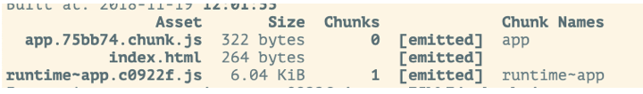
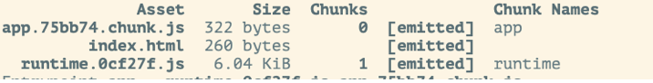
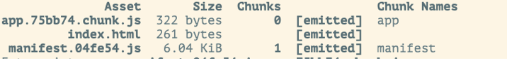
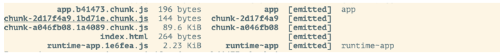
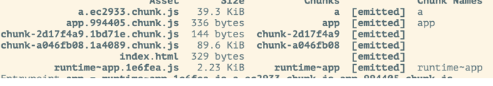

这个选项是webpack4新增的，主要是用来自定义一些优化打包策略11

## minimizer

minimize默认是true,效果就是压缩js代码。在production模式，该配置会默认认为我们压缩混淆代码，但这显然满足不了我们对于优化代码的诉求

```
var UglifyJsPlugin = require('uglifyjs-webpack-plugin');
var OptimizeCssAssetsPlugin = require('optimize-css-assets-webpack-plugin');

module.exports = {
    optimization:  {
        minimizer: [
            // 自定义js优化配置，将会覆盖默认配置
             new UglifyJsPlugin({
                exclude: /\.min\.js$/, // 过滤掉以".min.js"结尾的文件，我们认为这个后缀本身就是已经压缩好的代码，没必要进行二次压缩
                cache: true,
                parallel: true, // 开启并行压缩，充分利用cpu
                sourceMap: false,
                extractComments: false, // 移除注释
                uglifyOptions: {
                compress: {
                    unused: true,
                    warnings: false,
                    drop_debugger: true
                },
                output: {
                    comments: false
                }
                }
            }),
            // 用于优化css文件
            new OptimizeCssAssetsPlugin({
                assetNameRegExp: /\.css$/g,
                cssProcessorOptions: {
                safe: true,
                autoprefixer: { disable: true }, 
                mergeLonghand: false,
                discardComments: {
                    removeAll: true // 移除注释
                }
                },
                canPrint: true
            })
        ]
    }
}
```
UglifyJsPlugin经常用到过滤掉本身已经是压缩的js文件，exclude: /\.min\.js$/能够提升我们的编译效率以及避免二次混淆压缩而造成的未知bug。

ptimizeCssAssetsPlugin这款插件主要用来优化css文件的输出，默认使用cssnano，其优化策略主要包括：摒弃重复的样式定义、砍掉样式规则中多余的参数、移除不需要的浏览器前缀等。这段配置autoprefixer: {disable: true},禁用掉cssnano对于浏览器前缀的处理

## runtimeChunk
默认为false, runtime相关的代码(各个模块之间的引用和加载的逻辑)内嵌入每个entry。

- true: 对于每个entry会生成runtime-${entrypoint.name}的文件

    

- 'single':会生成一个唯一单独的runtimer.js,就是manifest.

    

- multiple: 和true一致
- name{}: 自定义runtime文件的name

    ```
    runtimeChunck: {
        name: () => "manifest"
    }
    ```
    

我们可以配合InlineManifestWepackPlugin插件将运行代码直接插入html文件中，因为这段代码非常少，这样做可以避免一次请求的开销，但是新版插件的配置和之前的有些不太一样，下面详细讲解一下如何配置
```
var HtmlWepackPlugin = require('html-webpack-plugin');
var InlineManifestWebpackPlugin = require('inline-manifest-webpack-plugin');

module.export = {
    entry: {
        app: 'src/index.js'
    },
    optimization:  {
        runtimeChunk: 'single'
        // 等价于
        // runtimeChunk:  {
            // name: 'runtime'
        // }
    }，
    plugins: [
        new HtmlWepackPlugin({
            title: 'fle-cli',
            filename: 'index.html',
            template: 'xxx',
            inject: true,
            chunks: ['runtime', 'app'], // 将runtime插入html中
            chunksSortMode: 'dependency',
            minify: {/* */}
        }),
        new InlineManifestWebpackPlugin('runtime')
    ]
}
```
这里有一点要注意，InlineManifestWebpackPlugin插件的顺序一定要在HtmlWebpackPlugin之后，否则导致编译失败

## noEmitOnErrors
默认为true,编译错误的时候是否不生产资源

## splitChunks
主要就是根据不同的策略来分割打包出来的bundle.

默认配置
```
splitChunks: {
    chunks: "async",
    minSize: 30000,
    minChunks: 1,
    maxAsyncRequests: 5,
    maxInitialRequests: 3,
    automaticNameDelimiter: '~',
    name: true,
    cacheGroups: {
        vendors: {
            test: /[\\/]node_modules[\\/]/,
            priority: -10
        },
        default: {
            minChunks: 2,
            priority: -20,
            reuseExistingChunk: true
        }
    }
}
```
### <a href="chunks">chunks</a>
```
// 入口文件引入
import './a.js' // 同步加载
import ('./b.js') // 异步加载
// b.js引入
import 'vue'
```
- 默认'async'
    ```
    splitChunks: {
      chunks: 'async' // 分割异步打包的代码
    }
    ```
    打包出b和vue两个chunk
    

- all

    ```
    splitChunks: {
        chunks: 'all', // 同时分割同步和异步代码，推荐
        cacheGroup: { // 默认的规则不会打包，需要单独定义
            a:  {
                test: /a\.js/,
                chunks: 'all',
                name: 'a', 
                enforce: true
            }
        }
    }
    ```
    
- initial
    ```
    splitChunks: {
        chunks: 'initial', // 也会同事打包同步和异步，但是异步内如的引入不再考虑，直接打包在一起，会将vue和b的内容打包成chunk，
        cacheGroup: { // 默认的规则不会打包，需要单独定义
            test: /a\.js/,
            chunks: "all",
            name: "a",
            enforce: true
        }
    }
    ```

### <a href="name">name</a>
分割的js名称，默认为true,返回${cacheGroup的key} ${automaticNameDelimiter} ${moduleName},可以自定义

### <a href="minchunks">minChunks</a>
最小公共模块的次数，默认为1

### <a href="maxsize">minSize,maxSize,maxAsyncRequests（按需加载时候最大的并行请求数）,maxInitialRequests（一个入口最大的并行请求数）</a>
都为字面意思，一般不建议改

### <a href="cachegroups">cacheGroups</a>
缓存策略，默认设置了分割node_modules和公用模块。内部的参数可以覆盖外部的参数

test 正则匹配文件

priority 优先级

reuseExistingChunk是否复用存在的chunk
```
cacheGroup: {
    a: {
        test: /a\.js/, // 匹配规则
        minChunk: 2, // 重写公用chunks的次数
        chunks： 'all',
        name: 'a', // 重写文件名称
        enforce: true // 强制生成
    }
}
```
比较优雅的分离打包配置
```
splitChunks: {
    cacheGroups: {
        vendors: {
            test: /[\\/]node_modules[\\/]/,
            name: 'vendors',
            minSize: 30000,
            minChunks: 1,
            chunks: 'intial',
            priority: 1, // 该配置项是设置处理的优先级，数值越大越优先处理
        }，
        commons: {
            test: /[\\/]src[\\/]common[\\/]/,
            name: 'commons',
            minSize: 30000,
            minChunks: 3,
            chunks: 'initial',
            priority: -1,
            reuseExistingChunk: true // 这个配置允许我们使用已经存在的代码块
        }
    }
}
```
首先是将node_modules的模块分离出来，这点就不在累述了。异步加载的模块将会继承默认配置，这里我们就不需要二次配置了。

第二点是分离出共享模块，笔者认为一个优雅的项目结构，其公共代码(或成为可复用的代码)应该是放置于同一个根目录下的，基于这点我们可以将src/common中的公用代码提取出来

## 资料
[optimization参考](https://segmentfault.com/a/1190000017066322)

[webpack的optimization配置](https://blog.csdn.net/weixin_43678786/article/details/85788759)

